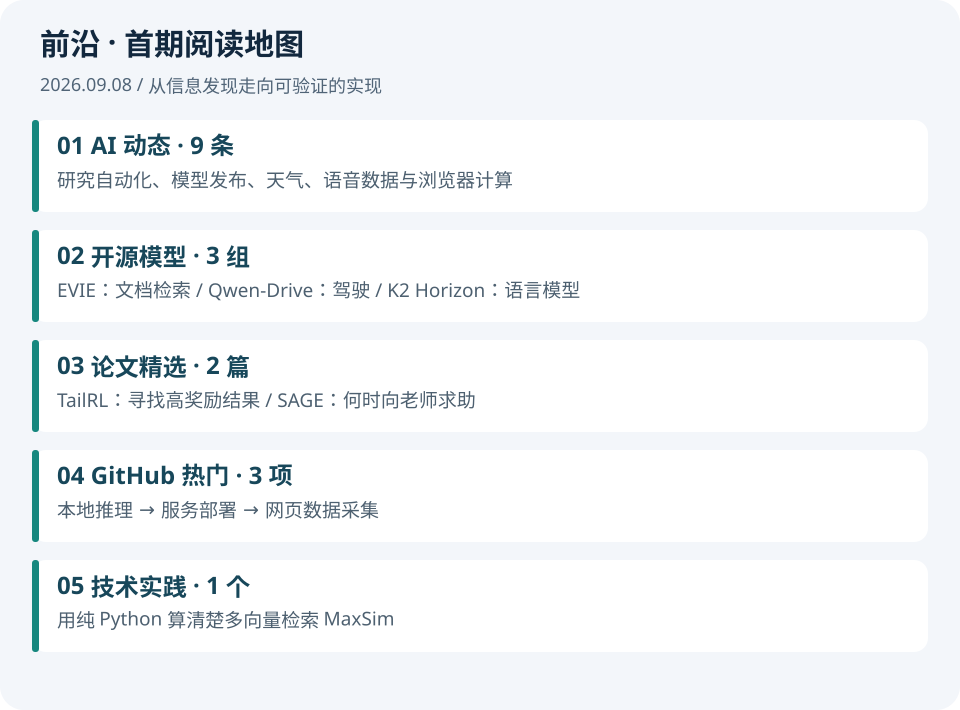

# 前沿｜2026-09-08

**第 001 期 · 近一周精选 · 大模型科研与工程实践**

首期在 9 月 8 日上午人工触发生成，信息检索截止北京时间 **10:50**；不是当天 8 点已发布的历史记录。新闻主要覆盖 9 月 1—6 日已发布内容，模型与项目按 9 月 8 日查验快照整理。

## 从这里开始

| 板块 | 本期内容 | 建议时间 |
| --- | --- | --- |
| [01 · AI 动态](01-AI动态.md) | 9 条：研究自动化、前沿模型、科学应用与数据生态 | 12 分钟 |
| [02 · 开源模型](02-开源模型.md) | EVIE、Qwen-Drive、K2 Horizon；任务与开放条件 | 10 分钟 |
| [03 · 论文精选](03-论文精选.md) | TailRL 与 SAGE，附归档原文及阅读卡 | 15 分钟 |
| [04 · GitHub 热门](04-GitHub热门.md) | Ollama、vLLM、Firecrawl 的工程用途 | 8 分钟 |
| [05 · 技术实践](05-技术实践.md) | 纯 Python 跑通 MaxSim 多向量检索 | 晚间 20–30 分钟 |

## 今天最值得带走的三个问题

1. **怎样评价“科研被加速”？** 代码写得更快只是一个环节；实验质量和研究判断也要有度量。
2. **什么时候让代理向老师求助？** 不确定性可以触发指导，但老师可能答错，指导并非越多越好。
3. **为什么一篇文档可以保留多个向量？** 不同局部信息不必挤到一个向量里，代价是更多存储与计算。

上午先读新闻、模型和论文摘要；下午选一篇进入原文；晚上在家跑实践。时间是阅读安排建议，不是实际计时结果。

## 如何理解本期证据

配图包含编辑绘制的结构图、基于论文表格重绘的结果图。图注区分实验数据和教学示意。模型与论文的性能来自作者报告，本站没有重新训练这些模型；本期实际运行的是 MaxSim 教学代码。

两篇论文按 arXiv 版本归档，正文可直接跳转“论文”模块。所有新闻附来源；GitHub Star 是累计快照，不是单日增长。公众号、X、Reddit 的完整热榜本期未覆盖。

---

[下一篇 →](01-AI动态.md) · [今日导读](00-今日导读.md)

