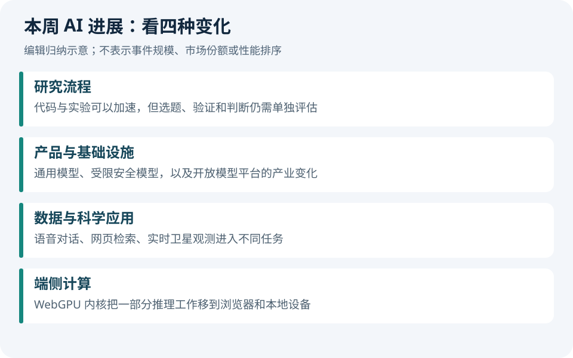

# AI 动态｜近一周 9 条

首期补齐 9 月 1—8 日值得关注的进展；下列日期为来源发布日期，均为 2026 年。编辑判断与发布方陈述分开书写。

## 01 · OpenAI 披露内部研究加速进展

**09-06 发布。** OpenAI 介绍 AI 参与内部研究工作的方式，并讨论自动化研究助手的进展。它是一份机构自身的观察，不能据此认定通用自主科研已经实现。

**与科研的关系：**科研可关注：除了代码产量，也记录实验复现率、错误发现时间和端到端课题周期。

来源：[OpenAI 原文](https://openai.com/index/research-acceleration-view-inside-openai/)。

## 02 · GPT-6 Astra：关注完整工作流评测

**09-03 发布。** 新发布强调计算机操作、编程和专业任务。官方展示的部分提升来自模型与 Codex 执行框架共同变化，不能全部归因于模型参数或训练方法。

**与科研的关系：**比较研究助手时应固定工具、提示、重试次数和任务集。

来源：[OpenAI 发布说明](https://openai.com/index/gpt-6-astra/)。

## 03 · Claude Fable 与 Mythos 5.1 的访问范围不同

**09-01 发布。** Anthropic 介绍基于同一基础模型、采用不同部署与防护安排的两个版本。Fable 面向一般使用，Mythos 的访问面向受信任的特定场景，不能理解成两个都公开可用。

**与科研的关系：**做可复现实验要记录具体版本及访问条件，避免仅写“Claude”。

来源：[Anthropic 原文](https://www.anthropic.com/claude-fable-and-mythos-5-1)。

## 04 · Gemini 3.8 Flash 与 Flash Cyber 发布

**09-02 发布。** Google 将长流程编程与代理任务作为 Flash 的重点；Cyber 版本通过 Fairwind 计划向受信任防御者提供。官方也说明复杂任务可能消耗更多推理步骤与 token。

**与科研的关系：**单次调用价格不能代替完成一次任务的总成本；应同时测成功率和总消耗。

来源：[Google 发布说明](https://blog.google/innovation-and-ai/models-and-research/gemini-models/3-8-flash-and-3-8-flash-cyber/)。

## 05 · WeatherNext 3：实时观测进入天气预测

**09-03 发布。** Google 的更新加入实时卫星数据与每小时刷新，并提高空间细节。它体现的是 AI for Science 的专用预测方向，不属于通用语言模型能力测试。

**与科研的关系：**科学应用要关注观测时效、地域分布和极端事件误差，不能仅比较平均精度。

来源：[Google WeatherNext 3](https://blog.google/innovation-and-ai/models-and-research/google-deepmind/introducing-weathernext-3/)。

## 06 · NVIDIA 宣布达成收购 Hugging Face 的协议

**09-03 发布。** NVIDIA 公告称已达成收购协议，并表示将继续维持平台开放和多种硬件支持。本期记录的是协议公告，不把它写成交易已经交割，也不把未来承诺当成已验证结果。

**与科研的关系：**后续值得跟踪平台条款、模型托管成本与多硬件支持是否发生实际变化。

来源：[NVIDIA 官方公告](https://blogs.nvidia.com/blog/nvidia-to-acquire-hugging-face/)。

## 07 · Qdrant 发布 FineWeb 10B 检索资源

**09-01 发布。** Qdrant 介绍面向大规模检索的 FineWeb 10B 向量数据资源，涉及稠密、稀疏及多向量检索。发布方的性能展示有特定实验条件，不等于不同系统在相同硬件上的独立排名。

**与科研的关系：**先做小样本检索正确性与成本测试，再考虑十亿量级系统。

来源：[Qdrant 在 Hugging Face 的原文](https://huggingface.co/blog/Qdrant/fineweb-10b-release)。

## 08 · OpenYap 1K：语音数据的开放边界要看清

**09-03 发布。** 发布介绍约 1,000 小时双通道英语对话；目前公开样本约 8.9 小时、16 段对话，采用 CC BY 4.0。完整语料需要申请并遵循数据使用协议，不是直接公开下载全部数据。

**与科研的关系：**全双工对话研究可以先分析重叠说话、轮次切换与延迟；实验应注明使用样本还是完整集。

来源：[数据发布原文](https://huggingface.co/blog/TheAgenticDataCompany/open-yap-1k)。

## 09 · Hugging Face 发布 WebGPU 内核与加载器

**09-01 发布。** 首批集合包含 207 个 WebGPU 内核，并提供 JavaScript 加载器及正确性、性能验证资料。它是浏览器计算的底层组件，不是一个下载后自动适配所有模型的完整推理产品。

**与科研的关系：**端侧研究应同时报告浏览器版本、设备和精度；不同 GPU 的速度不能直接类推。

来源：[Hugging Face WebGPU kernels](https://huggingface.co/blog/webgpu-kernels)。

## 本期覆盖范围

已核验官方博客、模型卡、arXiv 和 GitHub。公众号、X 与 Reddit 未形成可核验的完整热榜，因此本期不声称覆盖这些平台的全部热门。后续优先用它们发现线索，再回到原始资料核对。

---

[← 上一篇](00-今日导读.md) · [下一篇 →](02-开源模型.md) · [今日导读](00-今日导读.md)

