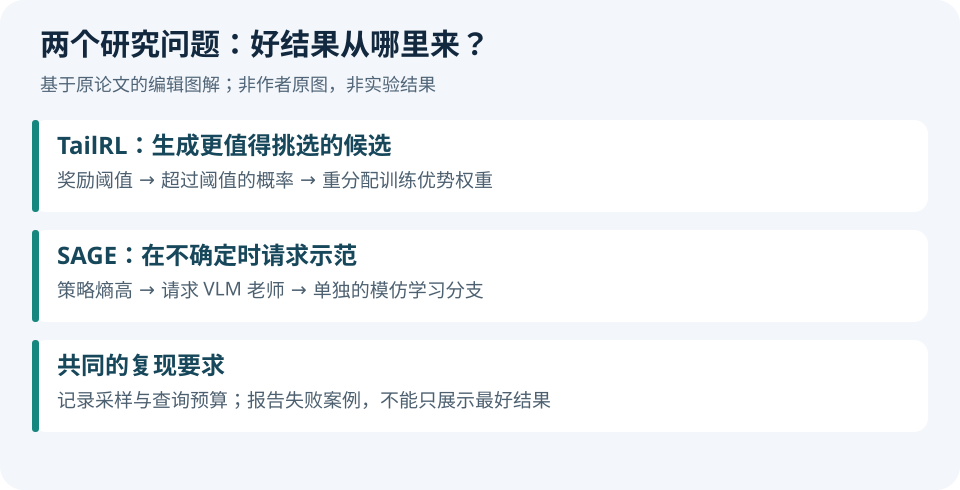
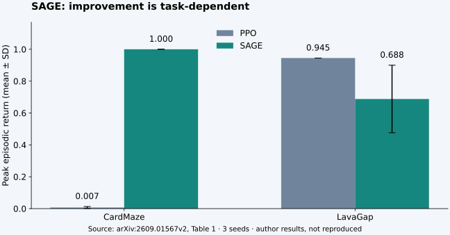

# 论文精选｜训练目标与指导时机

两篇均为 arXiv 预印本；本期未核验到同行评审接收信息。原文已按固定版本归档，许可均为 CC BY 4.0。阅读卡是中文编辑解读，不是作者摘要的逐句翻译。

## 01 · Tail-Likelihood Reinforcement Learning

**时间：**2026-09-02，v1。**作者：**Shrinivas Ramasubramanian 等。

通常的强化学习优化平均奖励。但如果推理时允许多试几次，再挑最好的一次，我们真正关心的还包括：是否有机会生成极好的候选。TailRL 从“超过某个奖励阈值的概率”出发，调整训练优势权重，让稀少的高奖励结果受到不同的关注。

它的价值在于把训练目标与多次采样后的选择联系起来。局限也来自这里：需要可信的奖励与候选选择过程；推理预算、奖励误差都可能改变结论。

[阅读中文研究卡](../../../../papers/frontiers/tailrl/00-阅读卡.md) · [站内原文 PDF](../../../../papers/frontiers/tailrl/2609.02987v1.pdf) · [arXiv 版本记录](https://arxiv.org/abs/2609.02987v1)

## 02 · SAGE：不确定时向不完美的 VLM 老师求助

**时间：**2026-09-01 首发，09-02 更新 v2。**作者：**Giovanni Bonetta、Matteo Merler 等。

代理不知道怎么行动时，能否请求一个视觉语言模型老师示范？SAGE 用策略熵衡量动作选择的不确定性，超过阈值才请求指导。老师提供的动作走模仿学习分支，代理自身采样的动作走 PPO 分支；评估时不再调用老师。

结果不是“有老师必然更好”。下图选取原文表 1 中一项改善和一项退步；均为作者报告的 **3 个种子下峰值回报的均值与标准差**，不是最终检查点结果，也不是本站复现。

| 环境 | PPO | SAGE | 读法 |
| --- | --- | --- | --- |
| CardMaze | 0.007 ± 0.006 | 1.000 ± 0.000 | 本项指导很有效 |
| LavaGap | 0.945 ± 0.000 | 0.688 ± 0.212 | 本项反而退步，波动也较大 |

这提醒我们：熵高意味着策略不确定，不自动意味着老师更可靠。对科研而言，失败情形与节省的查询成本同样值得读。

[阅读中文研究卡](../../../../papers/frontiers/sage/00-阅读卡.md) · [站内原文 PDF](../../../../papers/frontiers/sage/2609.01567v2.pdf) · [arXiv 版本记录](https://arxiv.org/abs/2609.01567v2)

---

[← 上一篇](02-开源模型.md) · [下一篇 →](04-GitHub热门.md) · [今日导读](00-今日导读.md)

