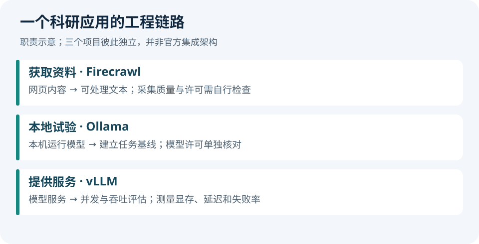

# GitHub 热门｜三个工程项目

**2026-09-08 查询快照。**本期是近期活跃的高关注项目精选，不是 GitHub Trending 日榜。Star 为累计数量，不代表当天增长，也不代表质量评测；最后推送可能包括文档或自动化更新。

| 项目 | 累计 Star | API 返回的最后推送（UTC） | 仓库许可 |
| --- | ---: | --- | --- |
| [Ollama](https://github.com/ollama/ollama) | 180,426 | 09-07 19:23 | MIT |
| [vLLM](https://github.com/vllm-project/vllm) | 91,198 | 09-08 02:34 | Apache 2.0 |
| [Firecrawl](https://github.com/firecrawl/firecrawl) | 177,684 | 09-08 02:35 | AGPL 3.0 |

## 01 · Ollama：在本机建立模型基线

适合先把模型运行和调用流程接起来，再研究提示、检索与评测。对晚间在家实践而言，可以先从一个本机放得下的模型开始，记录版本、量化方式、首 token 延迟与输出速度。

**上手入口：**按[仓库安装与使用说明](https://github.com/ollama/ollama#readme)选择系统版本，再选具体模型。软件的 MIT 许可不覆盖每个下载模型的许可。不要根据项目 Star 推断某个模型在你的设备上能达到什么速度。

**本期验证：**核对仓库元数据与维护时间，没有在本机下载权重或运行推理。

## 02 · vLLM：从单次推理走向并发服务

适合有 GPU 服务环境、需要批量评测或多用户调用的阶段。它解决模型服务的吞吐与内存效率问题；真正部署前仍需按具体模型和硬件测试。

**上手入口：**[官方仓库](https://github.com/vllm-project/vllm#readme)。先跑最小服务，然后固定输入长度、输出长度和并发数测量，不把官方特定配置的吞吐直接套到自己的机器。

**本期验证：**仓库元数据已查验，服务没有实际启动。对你的学习路线，先理解推理与显存组成，再进入部署更合适。

## 03 · Firecrawl：把网页整理成可处理内容

适合资料采集、RAG 输入准备和网页到结构化信息的工作。采集系统解决的是内容获取，不自动保证事实正确、来源权威或页面访问完整。

**上手入口：**[官方仓库说明](https://github.com/firecrawl/firecrawl#readme)。先用少量可访问页面检查正文、链接、表格和时间字段是否保留，再接入批量流程。自托管与托管产品的能力、服务条件分别核对；仓库标注 AGPL 3.0。

**本期验证：**仓库元数据已查验，没有部署服务或执行采集。后续日报的来源核验不能仅依赖一次网页抽取结果。

## 一个值得坚持的工程习惯

固定一份小任务集。每次替换模型、检索器或采集组件，只改一个变量，记录质量、延迟、成本与失败样例。这样积累的比较才可以用于研究判断。

---

[← 上一篇](03-论文精选.md) · [下一篇 →](05-技术实践.md) · [今日导读](00-今日导读.md)

