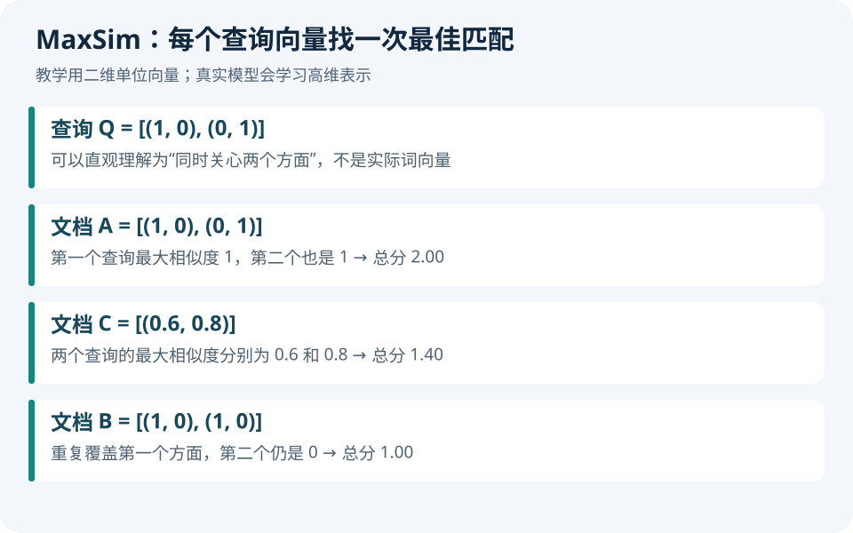

# 技术实践｜用 Python 算清楚 MaxSim

**本期目标：**理解 EVIE 一类多向量检索的评分步骤。只需要 Python 3 和向量点积，不下载模型；以下向量是人工构造的教学数据，不是 EVIE 编码器的输出。



## 1 · 为什么不用一个向量代表整篇文档

一页论文可能同时包含正文、图和公式。把所有信息压进一个向量很方便，但可能丢失局部对应关系。多向量检索保留多个局部表示，让问题的每个向量分别在文档中寻找匹配，再累加分数。

本例给查询两个二维向量 `(1, 0)` 和 `(0, 1)`。仅为帮助理解，可以把它们想成两个不同的信息需求。真实向量维度没有这么直接的人类含义。

## 2 · 从点积到 MaxSim

两个单位向量的点积可以作为余弦相似度。对于每个查询向量，计算它与所有文档向量的点积，只取最大值；最后把各个查询的最大值加起来：

```text
score(Q, D) = sum(max(dot(q, d) for d in D) for q in Q)
```

这个分数不是概率，也不一定在 0—1 之间。它通常不对称：查询和文档交换位置，结果可能改变。真实实现还涉及 token 掩码、归一化、维度与索引优化。

## 3 · 下载并运行

[下载完整 Python 示例](code/maxsim_demo.py)。保存后在所在目录运行：

```bash
python3 maxsim_demo.py
```

代码仅使用标准库，包含单位化、输入检查和三个文档的排序。核心循环如下：

```python
scores = [max(sum(a*b for a, b in zip(q, d)) for d in document)
          for q in query]
return sum(scores)
```

实际输出保存在[本期运行结果](code/results.txt)：

```text
A: 2.00
C: 1.40
B: 1.00
checks: passed
```

A 同时覆盖两个方向；B 重复第一个方向，不能补上第二个方向；C 对两个方向都有部分相似。注意：这里先计算局部匹配，再累加，没有先平均文档向量。

## 4 · 自己改两个地方

把 B 的一个向量换成 `(0, 1)`，重新运行并解释排序变化。再把查询改为只有 `(1, 0)`，观察原来的“两个方面都要覆盖”如何变成“只关心一个方面”。

这里有一个值得研究的偏差：文档保留更多向量，就可能有更多机会出现高相似度。实际评测应控制页面切分与 token 预算，而不是让不同方法随意使用不同信息量。

## 5 · 怎样接到真实论文检索

下一步才是将查询和页面送入真实编码器，缓存每页的多个向量，按相同评分逻辑取 Top-k，再用人工标注的相关页测 Recall@k。规模扩大后，需要索引、压缩与候选重排，不能一直用 Python 三重循环穷举。

**验证边界：**本站运行了本例排序及重复向量、零向量、空输入和维度不匹配检查。没有安装 EVIE、没有复现 ViDoRe 分数，也没有测真实模型速度。

方法背景：[EVIE 官方模型卡](https://huggingface.co/tencent/EVIE-8B)。[回到模型介绍](02-开源模型.md)。

---

[← 上一篇](04-GitHub热门.md) · [今日导读](00-今日导读.md)

