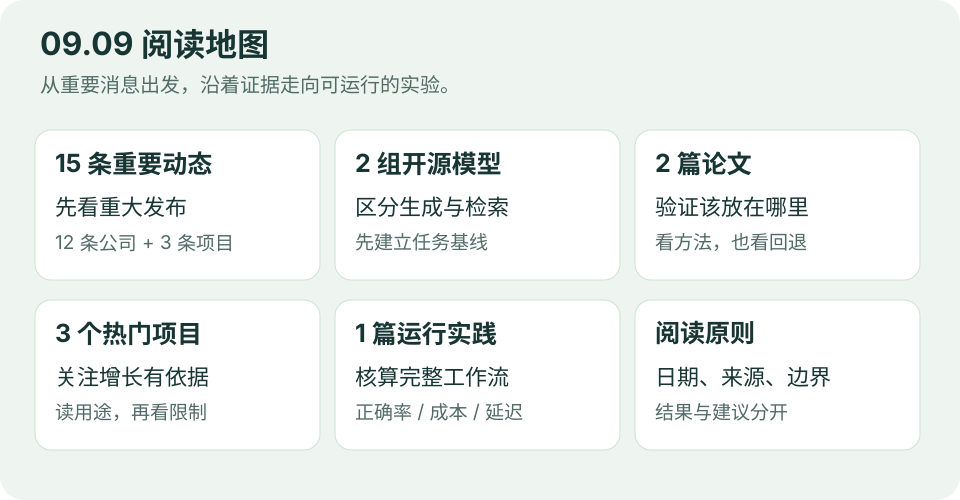

# 前沿｜2026-09-09

**第 002 期 · 重要发布、热门项目与可验证的效果**

本期按新规则重新生成：**15 条 AI 动态、2 组开源模型、2 篇论文、3 个 GitHub 项目、1 篇可运行实践**。信息复核截至北京时间 **09:40**；本次为上午追加重编，不回填为 08:30 已上线。以后每天 07:30 启动，目标 08:30 前可阅读。

图：编辑原创阅读地图。新闻按事件去重，项目在新闻中简报、在专栏深入介绍。

## 先读这五件事

1. **Images 2.5**：更快出图，更强调参考图与多轮编辑。
2. **Navier–Stokes**：OpenAI 公布数学证明和 Lean 材料，独立确认情况需继续核验。
3. **Meta Muse**：个人代理进入独立应用，执行环境与权限成为产品能力。
4. **AlphaGenome Atlas**：AI 预测被整理成可查询的科研资源。
5. **微软 MDASH**：多模型代码安全扫描进入政府云预览。

详细来源、可用范围与边界见 [AI 动态](01-AI动态.md)。其余消息包括千问 Work 多人工作台、Hy4 优化、HydraFusion、微软图像与语音更新、NVIDIA PAIR、Grok Bot，以及有当日热度证据的项目。

## 按你的时间阅读

| 时间 | 入口 | 可以带走什么 |
| --- | --- | --- |
| 5 分钟 | [AI 动态前五条](01-AI动态.md) | 最值得知道的发布与开放范围 |
| 再用 8 分钟 | [开源模型](02-开源模型.md) | MiniCPM5-2B 适合生成，NeoMME 适合检索；怎样安排对照 |
| 再用 10 分钟 | [论文精选](03-论文精选.md) | 教师可靠性门控、拒答边界：验证信号该放在哪里 |
| 找一个工具 | [GitHub 热门](04-GitHub热门.md) | HyperFrames、MarkItDown、ECC 的实际用途与限制 |
| 动手 15 分钟 | [技术实践](05-技术实践.md) | 从完整工作流日志计算正确率、成本与尾部延迟 |

## 本版有哪些变化

首版 07:07 截止时缺少完整厂商覆盖，Images 2.5 于 09:10 补入。发布前复查将 Navier–Stokes 研究公告补入前五，替换较早的 Qwen 快照。本次进一步移出普通教程和低优先级材料，建立候选取舍记录并逐项检查主要公司；较早的重要消息均注明实际日期。

模型栏保留两项值得做对照实验的资源并重新组织；论文新增 **Verify Before You Distill**，与 **Safety for Whom?** 一起讨论验证问题。均提供中文阅读卡和固定版本原文，未复制不明确允许本站再分发的 PDF。此前 Puffin-World 阅读卡继续保留在论文库。

## 阅读时记住

**“更强、更快”需要明确分母。** 是单次调用，还是整项任务？本期实践把重试、审阅和升级调用一起计入成本，演示数据与真实模型评测明确区分。

**热度需要当期证据。** 三个项目均查到 GitHub 当日 Trending 增量，不以累计 Star 或最后推送时间推断“今天爆火”。

核验采用官方公告、模型卡、论文和 GitHub。X、Reddit 专用后端未配置；字节官网返回空正文，智谱部分页面超时，MiniMax 列表提取有限，已结合官方域名索引补查，保留这些缺口。腾讯优化消息采用媒体转录并在条目中说明。

---

[昨日第 001 期](../2026-09-08/00-今日导读.md) · [开始阅读 AI 动态 →](01-AI动态.md)
