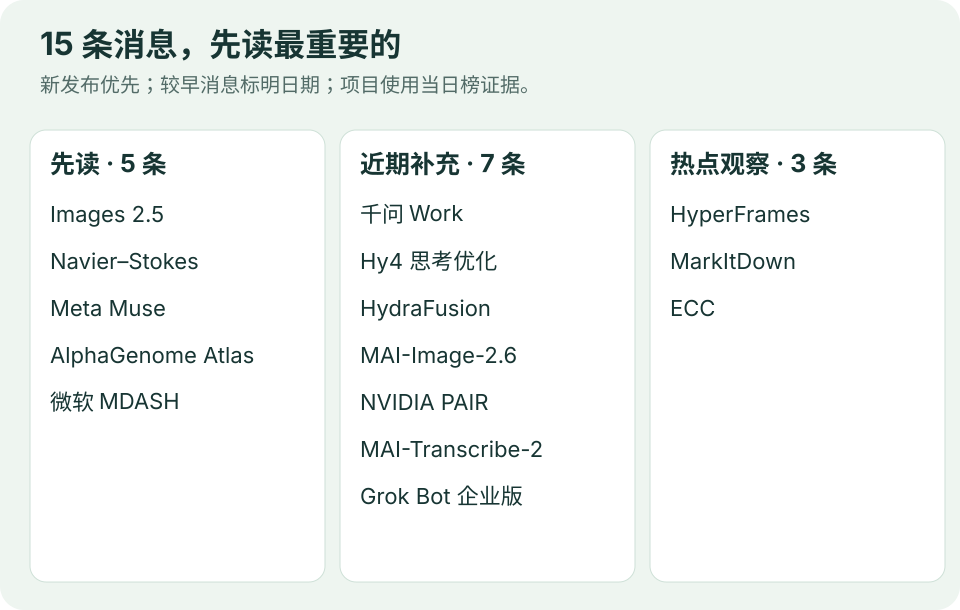

# AI 动态｜15 条重要消息

**9 月 9 日重编版 · 5 条重点详解 + 10 条速读。** 选题信息复核截至北京时间 09:40，前五条于 09:51 补充核验并展开介绍。12 条公司重要动态、3 条项目热度观察；重点篇说明具体变化、工作方式、使用场景与开放范围。日期保留来源精度；较早消息标为“近期补充”。性能数据均为发布方结果，本站未做模型性能实测。

图：编辑根据下列来源绘制。排序考虑新颖性、影响范围与实际可用性，不是模型能力排名。

## 01 · OpenAI 发布 Images 2.5，图像编辑与生成提速

**官方日期：2026-09-08；最新发布。** Images 2.5 的重点是提高连续创作时的可控性：以参考图为基础生成，保留主体，再按反馈逐步修改。OpenAI 称生成延迟相较 Images 2.0 最多降低 50%，同时改善光照、材质和局部编辑表现。[官方公告](https://openai.com/index/introducing-chatgpt-images-2-5/)

**具体升级在哪里**：产品加入草图参考、模板、图上评论编辑和提示词分享。草图用来表达构图，评论帮助指出要修改的区域，模板便于沿用版式。系统卡还将信息图准确性、布局和编辑一致性列为改进方向：切换背景、风格或构图时，尽量保留原图中其他细节。这些能力直接影响“第一张图之后还要改几次”。[系统卡](https://deploymentsafety.openai.com/chatgpt-images-2-5)

**谁能用、怎样选**：官方宣布向 ChatGPT、ChatGPT Work 和 Codex 各订阅层级逐步推出，覆盖网页、桌面和移动端；实际出现时间取决于账号的上线进度。API 提供两种取向：

| 版本 | 官方定位 | 适合优先尝试的任务 |
| --- | --- | --- |
| Flare | 兼顾速度与质量，面向低延迟、高频生成 | 批量素材、快速试稿、交互式编辑 |
| Sunburst | 更强调精细生成和编辑，耗时更长 | 产品主视觉、细节要求高的成稿 |

**对实际工作有什么用**：以一张产品海报为例，可以先固定产品和版式，再尝试换背景、调整标题、修改局部配色。这个例子说明了值得检查的能力：每轮改动是否只影响目标区域，文字和产品特征是否保留，完成整轮改稿用了多久。若能减少反复重画，对设计协作的帮助就可能大于单次出图提速。

**读数据时注意**：“最多降低 50%”是官方给出的延迟改善上限，不能直接推成每个任务都快一倍；版本、输出要求和重试次数都会影响体验。本期未做同提示词对照，也未核验真实项目的成稿率。此次公告没有宣布开放权重。

## 02 · OpenAI 公布 Navier–Stokes 问题证明与 Lean 形式化材料

**官方日期：2026-09-08；最新研究公告。** OpenAI 公布 Navier–Stokes 问题的证明稿和 Lean 形式化材料，称内部研究系统找到了有限时间出现奇点的构造。这个方程描述有黏性流体的运动；核心疑问是，从平滑状态开始的三维流动，是否可能在有限时间内失去平滑性。这里讨论数学方程的性质，不能据此说现实中的水会达到无限速度。[研究公告](https://openai.com/index/navier-stokes-solution/)

**这次主张的范围**：结果允许施加光滑外力，对应 Clay 官方题目中的 C、D 两种表述，分别涉及整个三维空间和周期空间。仓库声称，对任意正黏性，都能构造满足条件的初始状态与外力，使全局光滑解无法按要求存在。理解时要保留“带外力”这个条件；它与无外力版本的命题条件有区别。[Clay 原题](https://www.claymath.org/wp-content/uploads/2022/06/navierstokes.pdf) · [官方仓库](https://github.com/openai/NavierStokesAndEuler)

**AI 怎样参与**：公告描述的是大规模协作研究过程。产出结果的组约有一万个并发代理，各组探索不同方向，再汇总中间发现。官方给出的时间是约 88 小时得到结果，之后由 GPT-6 Astra 再用约 17 小时完成形式化与验证。用于探索的内部模型仍在训练，尚未作为公众可用产品发布；这些数字也不能用于估算普通账号解决数学题的速度。

**Lean 材料为什么值得看**：自然语言证明便于数学家理解思路，形式化证明把定义、假设和推导写成可由程序检查的对象。公开仓库提供构建入口及独立检查说明，使外部研究者能进一步核对材料。评估仍应同时看两个层面：形式化推导是否通过检查，以及写入程序的命题是否准确对应原始问题。

**为什么列入重点**：对 AI 科研读者，这是一项关于“模型探索、多代理协作、可检查成果”能走多远的重要主张。接下来值得跟踪证明细节、独立复核和协作过程的可复现性。本站本次读取了公告、仓库说明与原题，未运行 Lean 或独立审查证明；OpenAI 也表示不打算申领千禧年大奖。

## 03 · Meta 发布 Muse，把个人 AI 代理带到独立应用

**官方日期：2026-09-08；最新发布。** Muse 是 Meta 围绕长期目标推出的个人 AI 代理，使用 Muse Spark，可在关闭应用后继续处理任务，并通过独立应用或 WhatsApp 等入口与用户交互。官方展示的用途包括整理餐单、处理账单和安排日常事务：用户提出目标后，代理需要记住相关偏好，调用工具，并跟进任务状态。[官方公告](https://about.fb.com/news/2026/09/introducing-muse-personal-ai-agent/)

**它怎样持续工作**：每位用户拥有专属云端虚拟机，里面有浏览器、文件存储和运行工具的环境；接入服务的数据与凭据也按用户隔离。技术说明显示，该环境可执行代码、运行子代理和定时任务，因此“离开聊天窗口后继续做事”有持续运行的执行环境支撑。客户端直接连接这台虚拟机，用户可查看已做和计划中的操作。[技术说明](https://research.meta.ai/blog/security-and-safety-for-ai-agents-our-approach-with-muse)

**权限如何落到具体动作上**：独立的 Sentinel 负责检查外联请求，遇到需要用户决定的动作时发起审批；模型本身看不到 API 密钥。连接器可以区分读取和写入权限，例如允许读取日历以发现冲突，再单独决定是否允许创建日程。授权还可以限定为一次、一个任务或一段时间；相关控制在代理运行环境之外执行，减少代理误操作时的影响。

**对个人使用意味着什么**：以一周餐单为例，记住饮食偏好、整理菜谱、列出购物清单，是可以连续推进的几个步骤；真正下单则涉及另一个权限决定。这是基于官方功能的场景解读，本期没有实际下单测试。判断这类产品是否省事，可以看它能否正确接续目标、清楚报告进度，以及是否频繁需要人来纠正或收尾。

**目前开放到哪里**：先在美国通过 iOS、Android 和 muse.ai 推出，多数使用免费，另有付费方案。Confidential VM 属于后续计划，不能把未来的保密计算能力算进当前版本。对开发者而言，值得研究的是持续执行、任务状态和逐项授权如何组合成完整产品；这些设计的实际可靠性仍需真实使用验证。

## 04 · Google DeepMind 发布 AlphaGenome Atlas，预计算 90 亿种 DNA 变异影响

**官方日期：2026-09-08；最新发布。** AlphaGenome Atlas 把人类基因组中约 90 亿种可能的单碱基变化预先计算成可查询的预测资源。研究者可以查看把某个 DNA“字母”换掉后，哪些分子过程可能受到影响。相比逐个请求模型推理，预计算让全基因组范围的查找、排序和比较更方便。[官方公告](https://deepmind.google/blog/alphagenome-atlas-a-predictive-map-of-every-possible-dna-letter-change-in-the-human-genome/)

**输出具体包含什么**：可以按三个层次理解。先看分子影响预测，例如基因表达、RNA 剪接和染色质相关变化；再看 AVI 综合分数，它结合 AlphaGenome 的调控预测与 AlphaMissense 的蛋白影响预测，帮助排列候选变异；最后看特征归因，了解分数主要由哪类预测信号推动。这样，读者可以从“优先研究哪个位置”继续追问“可能通过什么过程产生影响”。

**一个研究场景**：假设实验团队手里有很多候选变异，逐个验证代价很高，可以先用 AVI 缩小范围，再检查相关组织、细胞类型和分子过程的预测，选择后续实验。这是研究流程示意，不代表分数高就已经证实致病。官方称外部合作团队已用该资源发现并实验验证部分关键变异；这类具体案例仍需按各项研究的证据判断。

**怎样访问**：官方提供面向学术研究的免费网页入口，也可经 AlphaGenome API 和 Antigravity skill 使用。API 仓库含客户端代码、示例和可视化工具，支持程序化查询 Atlas；文档说明非商业使用免费且受条款约束，预计算结果通常允许更高查询速率。需要自行做预测时，原模型还能处理最长约一百万碱基对的序列，适合进一步查看选定区域。[API 与示例](https://github.com/google-deepmind/alphagenome)

**为什么重要**：它将模型能力整理为可复用的科研资源，使候选筛选和结果解释更容易进入日常研究。90 亿指预测覆盖量，不代表已经做过同等数量的实验；官方明确将预测用于理论建模与研究，不能用于临床决策。是否节省实验、是否找对机制，最终要看下游研究的验证结果。

## 05 · 微软 MDASH 进入 Azure Government，向部分政府客户开放预览

**官方日期：2026-09-08；最新发布。** 微软将代码安全系统 MDASH 部署到 Azure Government，向选定美国政府客户及授权合作伙伴提供预览。此次新闻的新增事实是政府云部署和客户开放范围；MDASH 此前已经存在，微软称它曾用于内部代码扫描。对目标客户而言，这一步关系到能否在获准的云环境中接入代码审计流程。[政府云公告](https://www.microsoft.com/en-us/microsoft-cloud/blog/us-government/2026/09/08/codename-mdash-brings-agentic-ai-security-scanning-to-us-government/)

**扫描怎样进行**：官方产品文档把流程分成四步。首先按调用关系和代码复杂度给文件排优先级；随后让一百多个专长不同的代理检查不同类别的问题；再结合代码中的数据流、类型信息和多模型讨论验证结果；最后合并重复发现。这样可以把“发现可疑代码”和“判断是否构成可处理的漏洞”分开，给安全团队提供更集中、带置信度的结果。[产品工作流程](https://learn.microsoft.com/en-us/security-exposure-management/ai-code-security-overview)

**为什么还需要验证环节**：安全人员面对大量告警时，需要知道输入能否真的到达危险操作，中间是否已有校验，以及多个报告是否指向同一问题。上述问题说明了验证、去重和排序的实际价值。多代理发现的问题越多，后续筛选质量就越重要；仅以“生成了多少条漏洞报告”衡量效果，很容易忽略人工复核成本。

**怎样进入开发流程**：现有 MDASH 文档列出 GitHub、Azure DevOps、命令行和 CI/CD 接入方式，也提供从扫描结果生成修复、在 Defender 中集中跟踪的能力。这些是整体产品能力说明，政府云预览具体开放哪些功能应以客户获准范围为准。团队可以围绕一次代码变更提交扫描、检查发现、评审修复，再将结果留在现有工程流程里。

**值得观察什么**：这条新闻体现了多模型系统从实验评测走向组织工作流的进展。对使用者更有参考价值的指标是确认有效的问题比例、漏检情况、人工处理时间，以及修复后是否引入回归。官方评测成绩不能直接保证每个真实仓库的结果；本期核验了公告和流程文档，没有运行扫描，也未将预览写成面向所有开发者全面开放。

## 06 · 千问 Work 上线多人工作台，生成应用走向团队协作

**发布：2026-09-07；近期补充。** 阿里云产品说明称，千问 Work 可用自然语言搭建带云数据库、角色权限和管理后台的业务应用，支持最多 100 人并发使用。

**为什么重要**：从个人演示页面进入多人共同使用的业务系统，权限和数据持久化成为关键能力。并发上限是官方产品口径，不能替代真实负载测试；生成应用仍需按业务检查权限与数据规则。

[阿里云发布稿（新浪承载，注明来源阿里云）](https://finance.sina.com.cn/roll/2026-09-07/doc-iniqyrkc0457412.shtml) · [每日经济新闻报道](https://m.nbd.com.cn/articles/2026-09-07/4574589.html)。

## 07 · 腾讯回应 Hy4 preview“思考过长”，优化 WorkBuddy 中的任务执行

**公告报道：2026-09-07 17:26；近期补充。** IT 之家转录腾讯混元与 WorkBuddy 团队说明：针对重复思考、自我验证过多等问题进行了优化，以减少任务轮次和输入输出 token。

**为什么重要**：Agent 成本来自整个任务的总消耗。团队宣称保持任务质量，但可访问材料没有统一量化幅度。本条依据媒体转录及公告配图，未取得此次优化的独立官方正文。Hy4 首次发布于 8 月 28 日，本条报道后续优化。

[IT 之家公告报道](https://m.ithome.com/html/999369.htm) · [腾讯原始模型发布](https://www.tencent.com/zh-cn/tencent-releases-and-open-sources-tencent-hy4-preview/)。

## 08 · GitHub 公布 HydraFusion，用多模型协作选择编码工作流

**官方技术公告：2026-09-04；近期补充。** HydraFusion 按任务选择单模型、失败后升级或跨模型审阅再修改，已在 Copilot CLI 提供研究预览。社区预览帖更早出现于 9 月 1 日，不把 9 月 4 日误写成唯一首发日期。

**为什么重要**：调度从“选哪个模型”扩展为“怎样组织任务”。GitHub 的收益来自特定离线评测，不能外推到所有仓库。计费按各模型 token 累加；其他客户端的支持计划不等于当前可用。

[GitHub 技术公告](https://github.blog/ai-and-ml/github-copilot/project-hydrafusion-frontier-quality-via-multi-model-orchestration/) · [官方预览说明](https://github.com/orgs/community/discussions/206492) · [本期工作流评测实践](05-技术实践.md)。

## 09 · 微软扩展 MAI-Image-2.6，新增 Flash 并进入 Foundry 公共预览

**官方日期：2026-09-04；近期补充。** 微软将 MAI-Image-2.6 带入 Foundry，并新增面向低延迟、高吞吐任务的 Flash 版本。两款支持多参考图编辑、网页信息辅助生成和动态宽高比。

**为什么重要**：厂商明确区分精细创作与批量生产需求。可在 MAI Playground 体验、通过 Foundry 公共预览接入。官方速度对比以 GPT-Image-2-Medium 为基线，不是与刚发布的 Images 2.5 对比。

[Microsoft AI 官方公告](https://microsoft.ai/news/pushing-the-quality-cost-frontier-with-mai-image-2-6/)。

## 10 · NVIDIA 发布 PAIR，让局域网中的多台电脑分担本地 AI 推理

**官方日期：2026-09-03；近期补充。** NVIDIA 在 IFA 介绍 Personal AI Router：发现局域网兼容电脑，把相互独立的推理请求分配到有余量的设备，支持 Ollama 与 LM Studio。

**为什么重要**：多代理任务可以利用闲置设备分流；这不等于将任意一个大模型自动切分到多台机器。同期 RTX Spark 的到货时间为 10 月，需与当前已提供的软件能力分开看。

[NVIDIA 官方公告](https://blogs.nvidia.com/blog/local-ai-ifa-next-gen-agents-nv-pair-rtx-spark/)。

## 11 · 微软发布 MAI-Transcribe-2，补齐说话人区分与词级时间戳

**官方日期：2026-09-03；近期补充。** 新语音识别模型支持说话人区分、词级时间戳、关键词偏置，以及保留或清理口头语两种转写风格；微软公布了覆盖 60 种语言的评测。

**为什么重要**：会议、字幕和音频检索需要结构化转写。公告中的每小时音频 0.10 美元为截至年底的限时价格，使用前应核对实际计费。可经 Foundry、Playground 等入口体验；本期未自行验证噪声或方言表现。

[Microsoft AI 官方公告](https://microsoft.ai/news/mai-transcribe-2-is-the-fastest-most-accurate-and-cheapest-speech-recognition-model-in-the-world/)。

## 12 · Grok Bot 扩展到企业，让团队部署持续工作的代理

**官方日期：2026-09-03；近期补充。** Grok Bot for Enterprise 覆盖销售线索整理、招聘、采购和工程任务。官方称每名用户使用隔离环境，默认没有外部账户权限，需按接入账户工作。

**为什么重要**：企业 Agent 需要与现有工具和访问边界结合。公告提供企业管理员入口，对 Grok、Cursor Enterprise 客户推出两周试用安排；这不等于永久免费或所有个人账户都可用。

[Grok 官方公告](https://x.ai/news/grok-bot-for-enterprise)。

## 13 · HyperFrames 登上当日 Trending，HTML 视频工作流受到关注

**热度观察：2026-09-09；不是今日首发。** GitHub 当日榜快照显示 `heygen-com/hyperframes` 新增 **2,628 Star**。项目把 HTML、CSS、媒体和可定位时间的动画渲染成 MP4，提供面向编程 Agent 的创作入口。

**为什么重要**：代码有利于版本比较、模板复用和自动生成。热度不证明作品质量，画面与音频仍需实际检查。[项目深读与上手](04-GitHub热门.md)。

[官方仓库](https://github.com/heygen-com/hyperframes) · [GitHub 当日榜](https://github.com/trending?since=daily)。

## 14 · MarkItDown 当日新增超过两千 Star，文档转 Markdown 仍是热门入口

**热度观察：2026-09-09；不是新版本发布。** 当日榜快照显示 `microsoft/markitdown` 新增 **2,045 Star**。它把 PDF、Office 等文档转换成保留标题、列表、表格等结构的 Markdown，面向 LLM 与文本分析流程。

**为什么重要**：内容进入 RAG 或 Agent 前需要可靠结构。转换不等于完整理解复杂版面，也不自动完成检索评测。[项目深读与限制](04-GitHub热门.md)。

[微软官方仓库](https://github.com/microsoft/markitdown) · [GitHub 当日榜](https://github.com/trending?since=daily)。

## 15 · ECC 持续升温，Agent 的规则、记忆与执行框架成为关注点

**热度观察：2026-09-09；不是今日新发布。** 当日榜快照显示 `affaan-m/ECC` 新增 **1,426 Star**。项目组织 skills、hooks、规则、记忆和评审组件，帮助配置编码 Agent 的工作过程。

**为什么重要**：任务上下文与执行约束也影响交付效果。各工具适配能力不同，不能由热度推断安装后必然提高准确率。[项目深读与平台差异](04-GitHub热门.md)。

[官方仓库](https://github.com/affaan-m/ECC) · [GitHub 当日榜](https://github.com/trending?since=daily)。

---

项目热度是本次榜单快照，不表示精确自然日增长；累计 Star 与采集口径见 GitHub 热门。消息已与昨日按事件去重。X、Reddit 专用渠道未配置，部分国内官网正文提取受限，不能保证完整覆盖；具体缺口保留在编辑复核记录中。

[今日导读](00-今日导读.md) · [开源模型 →](02-开源模型.md)
