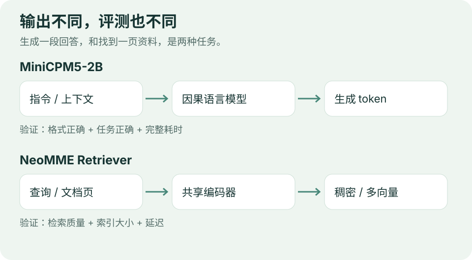

# 开源模型｜选对任务，再比较能力

**9 月 9 日重编并复核模型卡。** 保留两组适合研究对照的近期资源，不把仓库创建、文件更新或本次收录时间当成模型首发。本期未下载权重、未运行推理。

图：编辑依据官方模型卡绘制。两种输出服务不同任务，不放进同一能力排名。

## 01 · MiniCPM5-2B：研究训练阶段如何改变小模型行为

OpenBMB 提供 Base、Midtrain、SFT 与最终 RL + OPD 阶段资源，以及 GGUF、MLX 入口。模型卡标注 Apache 2.0；数据集许可须各自核对。API 返回总参数 **2,516,756,480**，名称中的 2B 不能直接当完整参数量。

BF16 仅权重约 **4.69 GiB**，这是参数量乘 2 字节的编辑估算，未计 KV 缓存、激活和框架开销。官方 MLX 量化入口提供 Apple Silicon 尝试路径，可用上下文和吞吐仍取决于设备。

[官方模型卡](https://huggingface.co/openbmb/MiniCPM5-2B) · [官方 MLX 入口](https://huggingface.co/openbmb/MiniCPM5-2B-MLX)。API 显示仓库创建于 09-06 11:12 UTC、最近修改于 09-08 09:08 UTC；不据此宣称精确首发时刻。

**编辑建议**：准备相同的中文结构化输出和工具选择任务，比较 SFT 与最终版本。固定采样、上下文与模板，分别记录格式正确率、任务正确率、时间和 token，不仅看发布方综合雷达图。

## 02 · NeoMME Retriever：同一次编码，比较稠密与多向量检索

H company 于 9 月 3 日介绍 NeoMME 系列。做文档检索应选择 **Retriever 检查点**，基础骨干不是训练好的检索器。260M Retriever 实际约 263M 参数，Apache 2.0；共享双向 Transformer 编码查询和文本、页面图像。

默认版本一次前向同时输出稠密向量与多向量表示。模型卡的 ViDoRe v3 nDCG@10 为 **0.3907 / 0.5226**（稠密 / 多向量），是作者指定协议下的结果。约 **0.49 GiB** 的 BF16 权重估算同样不代表实际运行内存。

[团队介绍](https://huggingface.co/blog/Hcompany/neomme) · [Retriever 模型卡](https://huggingface.co/Hcompany/NeoMME-260M-Retriever)。卡片给出 Transformers 示例，MeanMaxSim 需要 `sentence-transformers>=6.0.0`，应按固定版本核对依赖。

**编辑建议**：挑选 30 个有人工相关性标签的查询，保持文档切分一致，只切换表示与评分方式；比较检索质量、索引大小和延迟。多向量是否值得，取决于额外成本换来了多少可用召回。

## 从哪里开始

| 你要做的事 | 起点 | 首先验证 |
| --- | --- | --- |
| 本地生成、结构化输出 | MiniCPM5-2B | 输出是否完成任务，而不只是 JSON 合法 |
| 查找相关论文页面 | NeoMME Retriever | 相关页面有没有排到前面，成本是否可接受 |

可以进一步组合“检索后生成”，但本期没有验证组合效果。先分别建立基线，再判断整体改进来自哪一环。

---

[今日导读](00-今日导读.md) · [← AI 动态](01-AI动态.md) · [论文精选 →](03-论文精选.md)
