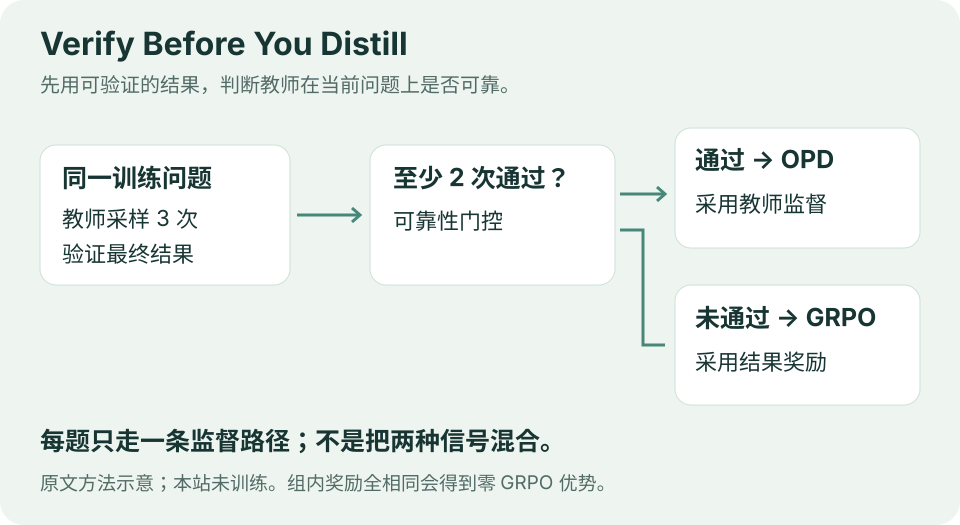
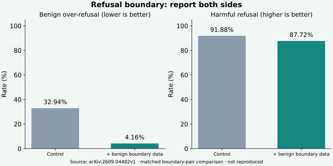

# 论文精选｜把验证放到关键决策之前

**9 月 9 日重编。** 两篇均为 arXiv v1 预印本，未核实同行评审录用。读取方法和实验，归档原创中文阅读卡；仅公开阅读不等于允许本站复制 PDF，本期保留原站链接。

## 01 · Verify Before You Distill：先确认教师会做这道题

**arXiv:2609.02998v1 · 2026-09-02。** 普通 on-policy distillation 用教师指导学生自己的输出，但教师也可能自信地答错。TGOPD 先对同一题采样教师答案，用可验证结果决定是否接受教师监督；不可靠时转向基于结果奖励的学习。

图：依据原文第 3 节原创绘制，不是本站运行的训练过程。门关闭时，学生组内奖励完全相同会产生零优势。

读原文时重点看第 4 节：**跨设置平均改善，不等于每个数据集、每个规模都最佳**。可验证的代码和数学任务，是方法成立的重要条件。

[站内中文阅读卡](../../../../papers/frontiers/verify-before-you-distill/00-阅读卡.md) · [固定版本原文](https://arxiv.org/html/2609.02998v1)。

## 02 · Safety for Whom?：边界两侧都要测

**arXiv:2609.04482v1 · 2026-09-03；9 月 8 日有作者解读。** 研究将应拒绝与相邻可回答的请求配对，减少“一整个主题都拒绝”的粗糙行为。

图：按原文边界配对实验重绘，作者结果，本站未复现。

| 指标 | 对照 | 加入良性边界样本 | 怎么看 |
| --- | ---: | ---: | --- |
| 可答侧误拒率 ↓ | 32.94% | 4.16% | 误拒明显减少 |
| 应拒侧拒答率 ↑ | 91.88% | 87.72% | 同时付出该拒侧召回代价 |

把误拒与漏拒分开，不能只报一个拒答比例。证据局限于特定主题、模型和训练设置，不能视为所有应用的一般规律。

[站内中文阅读卡](../../../../papers/frontiers/safety-for-whom/00-阅读卡.md) · [固定版本原文](https://arxiv.org/html/2609.04482v1)。

## 怎样和今天的新闻连起来

HydraFusion 在执行阶段选择是否升级或审阅，TGOPD 在训练阶段选择监督信号；阶段、目标和算法不同。共同值得学习的是：**“要不要多调用一次模型”应由可检验的任务证据决定。** 接下来用教学日志练习核算完整工作流。

---

[今日导读](00-今日导读.md) · [← 开源模型](02-开源模型.md) · [GitHub 热门 →](04-GitHub热门.md)
