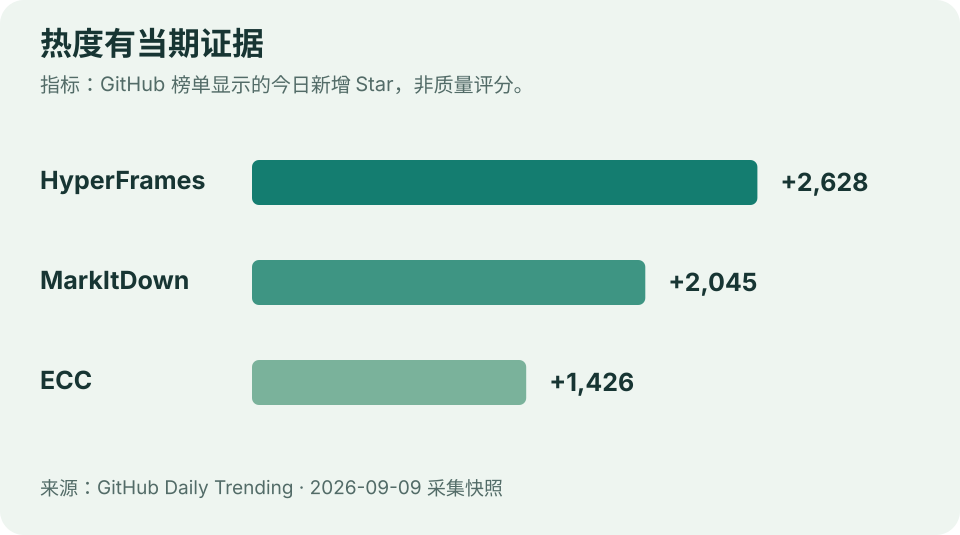

# GitHub 热门｜有当期增量，也要知道能做什么

**采集日：2026-09-09，北京时间 09:29 前。** 热度取 [GitHub Daily Trending](https://github.com/trending?since=daily) 快照，累计 Star 另取官方仓库 API。页面刷新时间不同；“今日增量”是 GitHub 榜单字段，不是本站对北京时间零点的计数。



图：编辑根据本次 GitHub 当日榜重绘；体现关注增长，不代表质量或市场占有率。

| 项目 | 当日榜增量 | API 累计 Star | 许可 |
| --- | ---: | ---: | --- |
| [HyperFrames](https://github.com/heygen-com/hyperframes) | +2,628 | 47,777 | Apache-2.0 |
| [MarkItDown](https://github.com/microsoft/markitdown) | +2,045 | 181,699 | MIT |
| [ECC](https://github.com/affaan-m/ECC) | +1,426 | 254,323 | MIT |

## 01 · HyperFrames：将可维护的网页代码变成视频

接收 HTML、CSS、媒体与可定位时间的动画，输出确定性 MP4，提供 CLI 和 Agent 创作入口。对于熟悉网页的人，模板修改、数据替换与版本审查比较方便。

**适合谁**：需要重复制作演示、数据解说或短视频的开发者。**尝试路径**：按官方 Quickstart 建立最小项目，先做一个 10 秒场景，逐帧检查再渲染；README 要求 Node.js 22+。

**边界**：能渲染不等于叙事、字幕节奏和声音已经合格。外部素材和生成服务的许可、价格不由 Apache-2.0 自动覆盖。本次读取 README，未运行视频渲染。[官方 Quickstart](https://hyperframes.heygen.com/quickstart)。

## 02 · MarkItDown：给模型准备可读的文档结构

将 Office、PDF 等文件转成 Markdown，尽量保留标题、表格、列表和链接。可以先解决“内容怎样进入后续分析”的问题。

**适合谁**：搭建资料入库、RAG 或文档 Agent 的开发者。README 要求 Python 3.10+。官方命令形如：

```bash
markitdown path-to-file.pdf -o document.md
```

先用熟悉的文档检查标题层级、表格与缺页，再扩大批量。扫描件、复杂排版和可选识别功能需要评估依赖与质量；它面向文本分析，不是保真排版转换器。本次未安装或运行转换。[官方说明](https://github.com/microsoft/markitdown#usage)。

## 03 · ECC：把 Agent 工作约束变成可复用组件

ECC 集合 skills、hooks、记忆、规则与审阅组件，为编码 Agent 的任务组织、上下文和检查流程提供起点。

**适合谁**：已有稳定开发任务，想比较执行规则效果的人。先读平台支持矩阵，选一两个组件在独立测试项目中比较，记录成功率、耗时、上下文量与改动范围。

**边界**：各平台能力不完全一致。组件更多可能增加上下文负担，Star 增长也不是效果对照实验。本次只核验仓库和文档，没有安装全局配置或执行 hooks。[官方平台说明](https://github.com/affaan-m/ECC#platform-support)。

## 这三项为何同时值得关注

分别覆盖 **产出内容、整理输入、组织执行**。这是编辑对用途的归纳，不是对走红原因的因果证明。选择时从已有任务出发，再用 [本期实践](05-技术实践.md) 记录完整成本。

---

[今日导读](00-今日导读.md) · [← 论文精选](03-论文精选.md) · [技术实践 →](05-技术实践.md)
