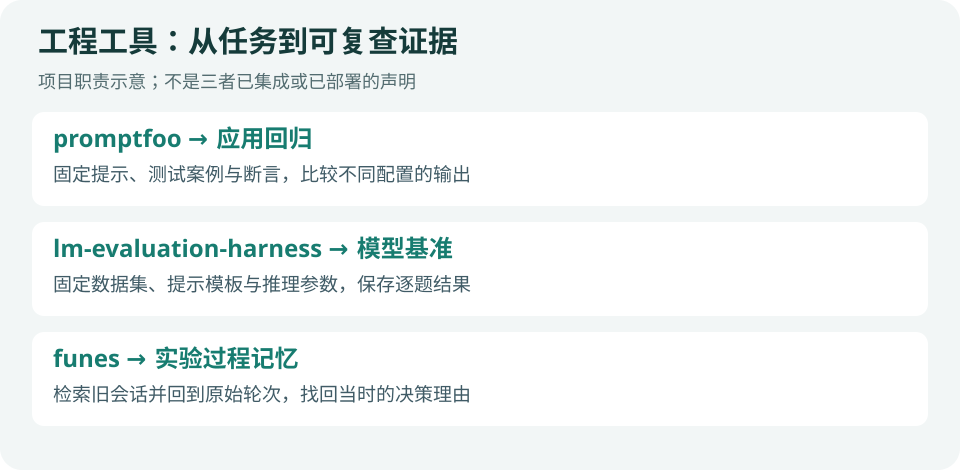

# GitHub 热门｜评测工具与可检索记忆

**快照：2026-09-09 07:07（北京时间）。** 前两项为高关注评测项目；funes 为近期发布的工程观察项。不是 Trending 日榜，Star 为累计值，不能由单次快照推断日增量。

图：依据官方 README 绘制的职责示意，本站未部署这些项目。

| 项目 | 累计 Star | 最后推送（UTC） | 仓库许可 |
| --- | ---: | --- | --- |
| [promptfoo](https://github.com/promptfoo/promptfoo) | 24,936 | 09-08 22:54 | MIT |
| [lm-evaluation-harness](https://github.com/EleutherAI/lm-evaluation-harness) | 13,934 | 09-01 13:51 | MIT |
| [funes](https://github.com/huggingface/funes) | 321 | 09-08 15:25 | Apache 2.0 |

## 01 · promptfoo：把应用输出变成回归测试

适合比较提示、模型和 RAG 配置，通过测试集及断言检查输出。科研应用可以先把“必须包含来源”“字段类型正确”“拒答边界正确”等要求拆成独立检查，再比较每项失败样例。

**入口：**[官方入门](https://www.promptfoo.dev/docs/getting-started/)。仓库提供 CLI 与 CI 集成。模型 API 调用可能另有成本；本期没有调用付费服务，也未运行框架。先固定测试集再改配置，避免每轮换题造成不可比。

## 02 · lm-evaluation-harness：保留基准任务的完整配置

适合标准化语言模型基准。README 的 2026/09 更新介绍插件入口，可以从自己的包注册模型后端、过滤器、指标与聚合，而不必长期维护一个分叉。

**入口：**[官方 README](https://github.com/EleutherAI/lm-evaluation-harness#readme)与[插件指南](https://github.com/EleutherAI/lm-evaluation-harness/blob/main/docs/plugins.md)。本期读取主分支文档，没有核验该变化已包含在哪个正式发行版本；使用时应固定提交或版本。

**科研注意：**同一个任务名并不能确定提示模板、few-shot 数、输出截断与后处理完全相同。发布结果时保存这些参数及逐题输出，比只贴总分更有复现价值。

## 03 · funes：从旧会话找回原始依据

9 月 3 日发布文章介绍本地代理会话记忆：解析与索引历史记录，检索结果可追溯到具体轮次，并支持可选的数据集同步。作者提供的局部成本比较不能代表所有规模的历史记录。

**入口：**[官方仓库](https://github.com/huggingface/funes)和[发布介绍](https://huggingface.co/blog/funes)。本期只读资料，没有安装会话钩子、索引私人记录或上传内容。建议先在独立样本日志上测“找对原始决策”的命中率，确认时间衰减是否影响较久之前的研究笔记。

**为什么收录低 Star 项目：**它解决科研过程可追溯的具体问题，且有近期维护；321 Star 只是项目规模信号，不足以把它写成全网爆款。

---

[今日导读](00-今日导读.md) · [← 上一篇](03-论文精选.md) · [下一篇 →](05-技术实践.md)
