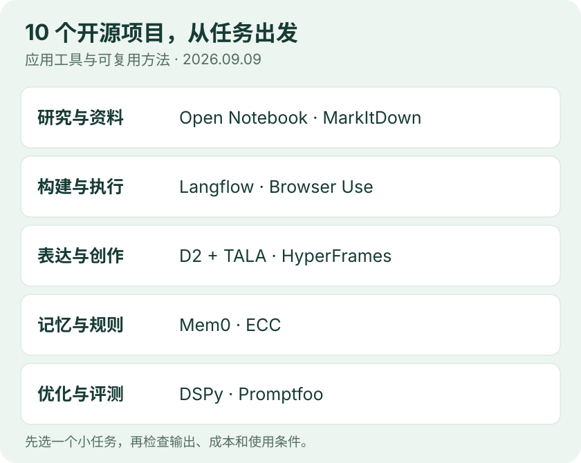

# 开源项目｜每天 10 个工具与方法

**2026-09-09 改版 · 核验截至北京时间 10:18。** 本栏从「GitHub 热门」调整为「开源项目」，按实际用途挑选 10 项，兼顾近期变化与值得上手的成熟工具。线索来自项目官网、发布记录、Hacker News、开源社区与搜索；功能和许可回查官方资料。以下上手路径基于文档整理，本次未安装、运行这 10 个项目。



图：编辑依据下列官方资料绘制的用途地图；配对表示解决的问题相近，不表示必须组合安装。

| 你想做什么 | 先看哪个项目 | 本期值得看的点 |
| --- | --- | --- |
| 把资料变成可追问的研究笔记 | Open Notebook | 多来源资料、笔记、问答和音频整理 |
| 可视化搭一个 AI 应用 | Langflow | 工作流画布，可继续接到 API 或 MCP |
| 给架构图和流程图自动排版 | D2 + TALA | TALA 刚开源，可固定部分节点位置 |
| 用代码制作演示视频 | HyperFrames | HTML 到 MP4，近期改进渲染稳定性 |
| 把文件转换成模型可读文本 | MarkItDown | 多格式转 Markdown，保留基础结构 |
| 让 Agent 操作网页 | Browser Use | 浏览器任务、表单和信息整理 |
| 让应用跨会话记住信息 | Mem0 | 提取、检索与管理有用记忆 |
| 用反馈优化提示词 | DSPy | 用任务样本和指标驱动优化 |
| 比较模型或提示词改动 | Promptfoo | 固定用例、自动判定、查看回归 |
| 整理编码 Agent 的执行规则 | ECC | 可复用 skills、hooks 和平台适配 |

## 01 · Open Notebook：把散落资料组织成可追问的研究笔记

**成熟工具推荐** · [MIT](https://github.com/lfnovo/open-notebook/blob/main/LICENSE)。 它把 PDF、网页、音视频与笔记组织在研究主题下，提供基于资料的问答、内容转换和播客生成；支持选择不同模型提供方，也提供本地模型接入路径。对于正在积累论文和技术文章的人，价值在于把“收集、提问、整理结论”放进同一个工作空间。[项目官网](https://www.open-notebook.ai) · [源码与许可](https://github.com/lfnovo/open-notebook)

**怎么开始**：按官方 Docker 指引建立一个笔记本，先放入两篇熟悉的文章，再要求它比较结论并返回出处。接着把自己的疑问写成笔记，检查问答是否正确使用这些材料。这个小任务能帮助判断资料组织和引用是否适合自己的阅读习惯；音频功能可以留到文字流程确认后再尝试。

**选用条件**：Docker 路径减少环境搭建工作；选择远程模型时，相关内容仍会发送给提供方，本地部署应用不自动意味着推理也在本地。模型、嵌入、语音服务可能分别需要配置和费用。当前读取到的最近正式 Release 是 2026-07-21 的 v1.14.0，本条是成熟应用推荐。[安装说明](https://github.com/lfnovo/open-notebook#-quick-start-2-minutes) · [版本记录](https://github.com/lfnovo/open-notebook/releases/tag/v1.14.0)

## 02 · Langflow：用画布搭建可以继续交付的 AI 工作流

**近期维护更新** · [MIT](https://github.com/langflow-ai/langflow/blob/main/LICENSE)。 Langflow 用节点和连线组织模型、检索、工具及 Agent。可以在 Playground 里逐步查看结果，必要时用 Python 改写组件；完成的流程可通过 API 调用，也能作为 MCP 工具提供给其他客户端。它适合先把流程做出来，再逐段检查输入输出的人。[官方仓库](https://github.com/langflow-ai/langflow)

**可以做什么**：例如先搭“输入问题 → 检索资料 → 生成带出处的回答”，再加入一个查询外部信息的工具。相比直接堆很多节点，更值得观察的是：检索结果是否进入了正确的提示词，失败发生在哪一步，以及每次修改改变了什么。

**怎么开始**：官方提供桌面应用、Docker 和 Python 包；Python 包要求 Python 3.10–3.14。桌面版可降低依赖管理负担，但部分功能与其他部署方式有差异。最新 v1.12.1 于北京时间 2026-09-09 07:25 发布，主要是组件注册、接入和界面等修复，不能把这次维护版写成整个产品今日首发。[安装文档](https://docs.langflow.org/get-started-installation) · [本次 Release](https://github.com/langflow-ai/langflow/releases/tag/v1.12.1)

## 03 · D2 + TALA：让文字描述的架构图更容易排得清楚

**新开源进展** · [MPL-2.0](https://github.com/d2lang/d2/blob/master/LICENSE.txt)。 TALA 是面向软件架构图的自动布局算法，作者于 2026-09-07 宣布开源，并将其内置到 D2 v0.9.0。它考虑节点分组、对称性、距离和连线等因素，还允许固定部分节点的位置与大小，让布局引擎处理剩余部分。[作者公告](https://d2lang.com/blog/tala-is-open-source/) · [官方源码](https://github.com/d2lang/d2)

**为什么适合应用层**：写系统说明、RAG 流程或 Agent 工具调用图时，可以用文本维护节点关系，让图与代码一起比较版本。若让 AI 生成初稿，人工可固定关键节点的位置，再交给 TALA 排其他节点、处理走线。这里的收益是让图可修改、可复用，而非自动判断架构设计是否合理。

**怎么开始**：先用官方浏览器 Playground 比较同一张图在 TALA、Dagre、ELK 下的效果；本地 D2 v0.9.0 可用布局选项选择 TALA，无需单独安装旧插件或输入许可密钥。作者也说明，增加一个节点可能让整体布局变化，长链条图不一定适合它，大图运行时间还需实际比较。[浏览器体验](https://play.d2lang.com) · [v0.9.0 发布说明](https://github.com/d2lang/d2/releases/tag/v0.9.0)

## 04 · HyperFrames：把网页技术变成可重复制作的视频流程

**近期维护更新** · [Apache-2.0](https://github.com/heygen-com/hyperframes/blob/main/LICENSE)。 HyperFrames 将 HTML、CSS、媒体和可定位时间的动画渲染成 MP4，可以用 CLI 或编码 Agent 创作。适合反复制作产品演示、数据解说和课程片段：保留模板，再替换文字、数据与素材，比每次重建工程更容易管理。[官方仓库](https://github.com/heygen-com/hyperframes)

**怎么开始**：官方要求 Node.js 22+。先做一个 10 秒场景，只放标题、一个图表和一段音频，经历预览、检查、渲染，再考虑批量生成。重点看任意时间点跳转后画面是否正确，以及字幕、镜头和声音是否同步。[Quickstart](https://hyperframes.heygen.com/quickstart)

**本期变化**：v0.8.32 的 Release 记录时间为北京时间 2026-09-09 07:44，说明正文标注 9 月 8 日；更新集中在渲染恢复、动画检查和 skills 可靠性。本次沿用上午已选项目并补读版本记录。代码许可不覆盖所有外部素材或生成服务，成片的表达质量仍需要人检查。[版本详情](https://github.com/heygen-com/hyperframes/releases/tag/v0.8.32)

## 05 · MarkItDown：为知识库准备结构清楚的文档输入

**实用工具推荐** · [MIT](https://github.com/microsoft/markitdown/blob/main/LICENSE)。 微软的轻量 Python 工具把 PDF、Office、HTML 等内容转换成 Markdown，尽量保留标题、列表、表格和链接。适合做资料入库的第一步，也适合将一批文件交给后续搜索、摘要或分析流程。[官方源码与用法](https://github.com/microsoft/markitdown)

**怎么开始**：要求 Python 3.10+，按文件格式安装相应可选依赖。先用一份熟悉的文件，执行下面的转换，再检查表格、链接、公式和缺页情况。把原文与转换结果对应保存，后续才能回查来源。

```bash
markitdown path-to-file.pdf -o document.md
```

**版本与边界**：9 月 4 日的 v0.1.8b1 是预发布，发布说明以修复为主；本次查询的正式版本仍是 v0.1.7。转换结果面向文本处理，复杂版面和扫描件需要额外检查；可选 OCR 或云端服务也有自己的依赖与费用。它不会自动完成切块、检索评测和答案核验。[预发布说明](https://github.com/microsoft/markitdown/releases/tag/v0.1.8b1) · [正式版本](https://github.com/microsoft/markitdown/releases/tag/v0.1.7)

## 06 · Browser Use：把网页任务交给能操作浏览器的 Agent

**近期维护更新** · [MIT](https://github.com/browser-use/browser-use/blob/main/LICENSE)。 Browser Use 提供 Python 库，让 Agent 打开网页、点击、输入和整理页面信息。适用场景包括把多个公开页面的字段汇总成表格，或在测试系统里跑一段表单流程。它提供本地框架和云端服务，接入时需要分清所使用的路线。[官方仓库](https://github.com/browser-use/browser-use)

**怎么开始**：先按本地库文档配置 Python 环境、浏览器与模型，从“查找三条公开信息并附链接”的小任务开始。记录页面是否到达、字段是否取对、任务是否真正完成，再逐步增加步骤。需要使用登录态或提交表单时，应在自己有权限的环境里明确操作范围。

**本期关注点**：2026-09-04 的 0.13.10 调整依赖、更新 Browser Harness 和 MCP 接入，并让未知 MCP 工具调用返回错误。它提醒应用开发者检查整条执行链的错误处理。网页结构变化、动态内容和模型判断都会影响成功率；开源库免费不等于模型调用或托管浏览器免费。[Release](https://github.com/browser-use/browser-use/releases/tag/0.13.10) · [本地库文档](https://docs.browser-use.com/open-source/introduction)

## 07 · Mem0：让 AI 应用按需记住跨会话的信息

**应用方法推荐** · [Apache-2.0](https://github.com/mem0ai/mem0/blob/main/LICENSE)。 Mem0 为助手增加记忆层，将有用的信息保存下来，并在后续任务中检索。适合处理重复出现的用户偏好、项目背景和会话上下文。例如，研究助手可以保存用户希望解释公式时先讲直觉的偏好，下次回答时再取用。[官方仓库](https://github.com/mem0ai/mem0)

**怎样试这个方法**：先用虚构资料做一个“写入 → 查询 → 更新或删除”的小实验，确认不同用户、任务之间的记忆范围。再比较加入记忆前后的回答是否更贴合需求，以及检索出的信息是否仍然有效。这里给的是评估路径，本期未验证其效果。

**开源与服务范围**：项目同时提供库、自托管服务和托管平台。README 明确说明，部分高分基准来自包含专有优化的托管平台，不能直接当成开源 SDK 的成绩。9 月 2 日的 Python v2.0.20 是维护版本；选择时应先看自己需要哪种部署和功能，而非只看宣传分数。[开源部署说明](https://docs.mem0.ai/open-source/overview) · [Python 版本记录](https://github.com/mem0ai/mem0/releases/tag/v2.0.20)

## 08 · DSPy：把提示词优化变成有样本、有反馈的过程

**可复用方法** · [MIT](https://github.com/stanfordnlp/dspy/blob/main/LICENSE)。 DSPy 用 Python 组织模型调用，先定义任务的输入输出，再用样本和指标改进程序。它适合分类、信息抽取、RAG 等有明确判断标准的任务，让修改过程可以与固定基线比较。[官方仓库](https://github.com/stanfordnlp/dspy) · [项目文档](https://dspy.ai/)

**具体怎么改进**：官方 GEPA 教程展示了反馈驱动的循环：执行任务、评估输出，把错误原因交给反思模型，再生成并比较新的指令。比如抽取文章中的项目名与许可，可以将“漏掉许可”和“把公司名当项目名”作为可解释的反馈。这个例子是应用设想，不是本站实验。

**怎么开始与判断**：先固定一个小任务和评分办法，保留未经优化的结果；用训练样本形成改写建议，用验证集选择候选，再用独立测试集判断是否真的改善。优化会消耗模型调用，指标设计也可能把系统带偏。当前查询到的 3.3.1 发布于 2026-08-21，本条推荐成熟方法，并非今日新发布。[GEPA 教程](https://dspy.ai/getting-started/gepa-optimization/) · [版本记录](https://github.com/stanfordnlp/dspy/releases/tag/3.3.1)

## 09 · Promptfoo：每次换模型或改提示词，都跑同一组用例

**应用评测工具** · [MIT](https://github.com/promptfoo/promptfoo/blob/main/LICENSE)。 Promptfoo 是评估 LLM 应用的 CLI 和库，可以配置多套提示词、模型提供方与测试用例，再用规则或评分器比较输出，并在界面中查看结果。它适合回答一个具体问题：这次改动让哪些任务变好，又让哪些任务退步。[官方介绍](https://www.promptfoo.dev/docs/intro/) · [源码](https://github.com/promptfoo/promptfoo)

**怎么开始**：从十几个有代表性的输入开始，加入正常情况、缺失信息和容易混淆的例子。先检查输出格式、必需字段和明确事实，再考虑用模型评分较难自动判断的部分。把这组用例留在项目中，后续每次更新都复用；对你正在做的知识库，引用是否存在、答案是否覆盖问题就是可检查的起点。

**使用条件**：当前 README 的 npm 路径要求 Node.js 22.22.0 或以上，推荐 Node.js 24 LTS。评测可在本地运行，调用远程模型时仍会向对应服务发送输入，并产生调用费用。模型评分也可能出错，关键样例要人工抽查。本次读取到的 CLI 0.122.2 发布于 2026-08-28，按成熟工具推荐。[版本记录](https://github.com/promptfoo/promptfoo/releases/tag/0.122.2)

## 10 · ECC：把编码 Agent 的工作规则整理成可复用组件

**近期维护更新** · [MIT](https://github.com/affaan-m/ECC/blob/main/LICENSE)。 ECC 将 skills、hooks、规则、记忆与审阅流程组织在一起，适合已经使用编码 Agent、想把反复出现的工作要求固定下来的人。可以从一种具体需求出发，例如每次修改后检查相关命令是否通过，或统一某类任务的评审步骤。[官方仓库](https://github.com/affaan-m/ECC)

**怎么开始**：先看平台支持矩阵，选择少量组件，在一个独立项目里比较加入规则前后的完成率、耗时和改动范围。当前资料说明 Claude Code 支持最完整，Codex 有相应接入路径，其他适配能力不同；不要仅凭“支持某平台”推断所有功能一致。[平台说明](https://github.com/affaan-m/ECC#platform-support)

**本期变化**：v2.2.1 的 Release 记录于北京时间 2026-09-09 01:52 发布，重点涉及安装器保留用户文件、hooks 和命令检查等修复。对这类组件，配置能否正确升级和退出也是重要能力。规则更多可能增加上下文和维护负担，宜从已经反复遇到的问题开始；本次没有安装或执行它的 hooks。[版本记录](https://github.com/affaan-m/ECC/releases/tag/v2.2.1)

## 怎样挑一个先试

想直接改善阅读，先看 **Open Notebook**；想为当前网站准备内容，先看 **MarkItDown、D2 或 HyperFrames**；想做应用原型，先看 **Langflow**。已经有稳定任务和一些真实样本时，再用 **DSPy、Promptfoo** 比较改进是否有效。一天选一个小任务做对照，比同时引入全部工具更容易判断价值。

本次保留上午的 HyperFrames、MarkItDown、ECC 并展开用途，另补 7 项，组成 10 项。新闻栏这三个项目的热度仍采用上午 09:29 前快照；本栏排序按任务用途。Hacker News 主要用于发现 TALA 等线索，Hugging Face Cookbook 用于筛选方法类候选，最终以作者公告、源码、许可与文档核验。X、Reddit 专用渠道仍不可用。

---

[今日导读](00-今日导读.md) · [← 论文精选](03-论文精选.md) · [技术实践 →](05-技术实践.md)
