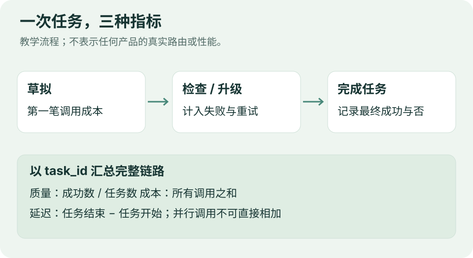

# 技术实践｜比较完整任务，而不是单次调用

**已运行验证：Python 3.14.3，零第三方依赖，无需 GPU 或 API。** 本例处理 24 行手工构造的教学日志：8 个任务、3 种工作流。没有调用真实模型、没有训练，也没有复现 HydraFusion。升级选择是手工指定的演示数据，不是实现好的智能路由器。



图：编辑原创。成本将所有调用相加，端到端延迟则取任务计时，不能把并行调用耗时简单相加。

## 为什么要按任务汇总

一次便宜回答可能失败，后面又发生审阅、重试或升级。只看最后一个成功调用，会漏掉前面的消耗；只看平均延迟，也可能掩盖少数很慢的任务。

本例比较 `cheap`、`routed`、`strong` 三组，要求它们覆盖相同任务集。每条日志保存最终成功与否、整个任务耗时，以及所有调用成本。失败任务的成本照样计入。

- 正确率 = 成功任务数 / 全部任务数。
- 每个成功任务的成本 = 全部任务消耗 / 成功数；全失败时记为 NA。
- P95 延迟使用 nearest-rank：排序后取第 `ceil(0.95 × N)` 项。仅 8 个样本时，它就是最大值，不能据此判断稳定的生产尾延迟。

## 运行

把下列两个文件保存到同一目录。脚本默认从自身所在目录读取数据，使用 Python 3.10+ 即可：

[完整 Python 脚本](code/evaluate_workflows.py) · [教学日志 JSONL](code/synthetic-runs.jsonl) · [实际运行输出 CSV](code/workflow-report.csv)

```bash
python3 evaluate_workflows.py
```

核心汇总逻辑如下；完整脚本还拒绝重复任务、不同任务集和非法数值：

```python
count = len(values)
passed = sum(row[1] for row in values)
total_cost = sum(row[3] for row in values)
latencies = sorted(row[2] for row in values)
p95 = latencies[math.ceil(0.95 * count) - 1]
```

## 本次实际输出（教学数据）

```text
workflow,tasks,passed,accuracy,total_cost_usd,cost_per_correct_usd,p95_latency_ms
cheap,8,5,0.625,0.080,0.0160,1700
routed,8,7,0.875,0.230,0.0329,6700
strong,8,7,0.875,0.400,0.0571,5700
```

| 工作流 | 正确率 | 总成本（教学美元值） | P95 |
| --- | ---: | ---: | ---: |
| cheap | 62.5% | 0.080 | 1.7 秒 |
| routed | 87.5% | 0.230 | 6.7 秒 |
| strong | 87.5% | 0.400 | 5.7 秒 |

在这组构造数据中，routed 与 strong 成功数相同，总成本低 42.5%，但 P95 更慢 1 秒。这个例子说明为什么需要同时看质量、总成本和延迟；**它不是任何真实产品的性能结论**。

## 换成真实实验时

先确定任务成功的判定标准，再采集调用日志。保留固定版本、采样参数、任务集和完整重试记录；并行任务使用统一的开始、结束时间。重复运行并报告不确定性，检查不同任务类型是否被平均数掩盖。

[HydraFusion 官方技术说明](https://github.blog/ai-and-ml/github-copilot/project-hydrafusion-frontier-quality-via-multi-model-orchestration/) 是本例选题来源。这里实现的是独立的日志汇总，不是该项目的调度算法。与 [论文精选](03-论文精选.md) 的联系在于：先确定可靠的验证信号，再谈是否值得增加计算。

---

[今日导读](00-今日导读.md) · [← GitHub 热门](04-GitHub热门.md)
