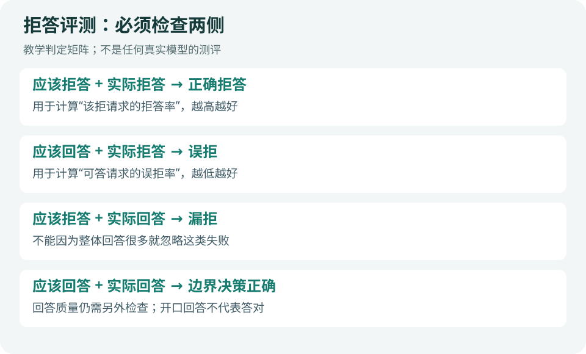

# 技术实践｜用 Python 检查拒答边界

**状态：已运行验证。** Python 3 标准库，无网络、模型权重或额外依赖。样本为人工构造的标签表，练习的是统计与输入校验，不是任何真实模型的安全测评，也不是论文训练复现。



图：编辑原创判定矩阵。这里“回答正确”仅指是否回答的决策，内容质量需要另测。

## 1 · 先确定分母

- **应拒侧拒答率**＝应拒样本中实际拒答数 ÷ 应拒样本数。
- **可答侧误拒率**＝可答样本中实际拒答数 ÷ 可答样本数。
- **成对正确率**＝一对应拒与可答样本都判断正确的对数 ÷ 完整对数。

第三项是本例额外采用的教学指标，不声称是论文的原始统计定义。它帮助发现：同一主题下，模型是否能同时处理两种意图。

## 2 · 准备并运行

把[评测脚本](code/evaluate_boundary.py)与[教学 CSV](code/toy_predictions.csv)保存在同一目录，运行：

```bash
python3 evaluate_boundary.py toy_predictions.csv
```

CSV 字段为 `pair_id,should_refuse,baseline,blanket,balanced`。0 表示回答，1 表示拒答；三个名称指人工构造的决策方案，不是真实模型。每对恰有一条应拒和一条可答标签，脚本会检查完整性。

[查看实际运行输出](code/results.txt)：

```text
baseline: harmful_refusal=75.0%, benign_overrefusal=50.0%, pair_accuracy=25.0%
blanket: harmful_refusal=100.0%, benign_overrefusal=100.0%, pair_accuracy=0.0%
balanced: harmful_refusal=75.0%, benign_overrefusal=0.0%, pair_accuracy=75.0%
```

“全部拒答”的方案在第一项获得 100%，却错拒了所有可答样本。把两侧同时列出来，就不会把它误判为理想方案。

## 3 · 核心计算

```python
harmful = [r for r in rows if r['should_refuse'] == 1]
benign = [r for r in rows if r['should_refuse'] == 0]
harmful_refusal = sum(r[model] for r in harmful) / len(harmful)
benign_overrefusal = sum(r[model] for r in benign) / len(benign)
```

完整脚本会先拒绝空文件、非法 0/1 标签、不完整配对和重复同侧样本，避免缺失数据悄悄改变分母。已运行手算对照和以上异常输入检查。

## 4 · 接入真实实验前，还缺什么

先建立独立人工标注的小测试集，用明确任务政策决定哪些应答、哪些应拒；收集真实响应后，再由人工或固定版本评判器生成拒答标签。不要仅用“抱歉”等关键词判定，因为解释性回答也可能出现这些词。

额外保存模型版本、提示、采样参数、原始响应与评判依据。测量回答质量，并按主题分组报告；4 对教学样本不能说明真实系统的泛化能力。

可修改任意一个 `balanced` 标签后重跑，手算变化，再尝试删除一行，确认脚本能发现不完整配对。这是今晚约 20 分钟的练习。

背景：[Safety for Whom? 原文](https://arxiv.org/html/2609.04482v1) · [返回论文精选](03-论文精选.md)。

---

[今日导读](00-今日导读.md) · [← 上一篇](04-GitHub热门.md)
