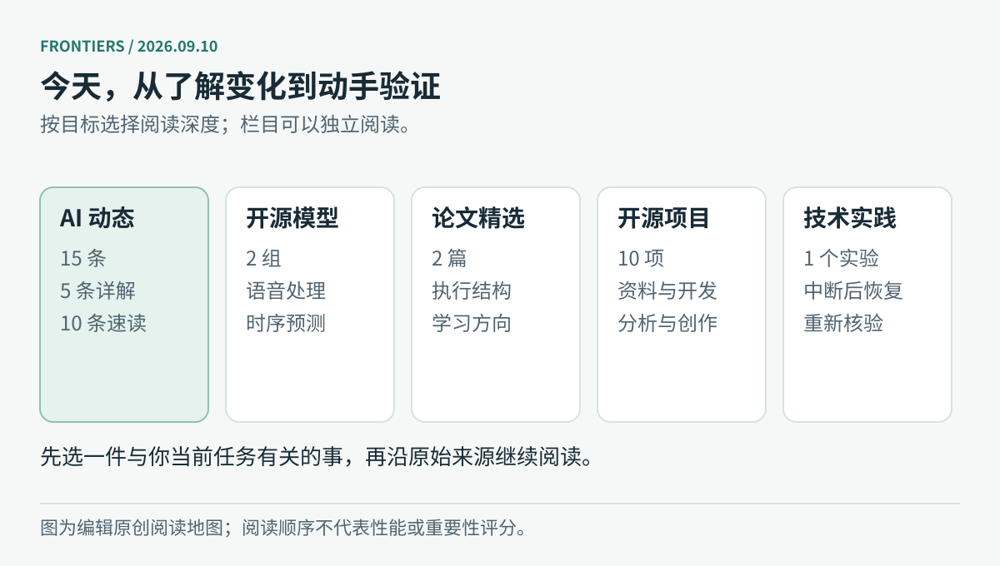

# 前沿｜2026-09-10

**第 003 期 · 从模型能力走向能完成的工作**

本期包含 **15 条 AI 动态、2 组开源模型、2 篇论文、10 个开源项目、1 篇可运行实践**。主要信息核验截至北京时间 **09:34**；项目日榜重新采集于 **09:37**。这是今晨任务中断后的补跑版本，未回填为 08:30 已上线。

图：编辑原创阅读地图。先了解新增能力，再按自己的任务挑选模型、论文或工具。

## 先看五件事

1. **Astra 企业工作能力**：新增权限控制与插件，区别于此前的模型首发。
2. **Google ADK Kotlin 1.0**：把工具、确认流程和持久状态接入应用。
3. **腾讯 AuK**：语音生成与编辑的代码、基础和 Flash 权重开放。
4. **IBM Granite 时序模型**：联合关注预测数值、区间与缺失值，排名要带上筛选条件。
5. **Microsoft Discovery / CLIO**：让科研推理随证据调整，并记录失败路线。

[阅读 5 条重点详解和 10 条速读 →](01-AI动态.md)

其余消息包括 NVIDIA 媒体组件、Mistral 融资、Copilot 企业权限与批量修复、学校数据约定、GPN-Star、百度 OCR 云服务，以及三个有日榜快照的项目。新闻事件覆盖 9 月 7–10 日；较早事件已标注“近期补充”，没有把所有内容写成今天首次发布。

## 按时间选择入口

| 你有多少时间 | 建议入口 | 读完可以做什么 |
| --- | --- | --- |
| 约 3 分钟 | 本页 + [新闻标题](01-AI动态.md) | 选出值得继续跟踪的更新 |
| 约 15 分钟 | [前五条详解](01-AI动态.md) | 理解工作方式、用途和开放范围 |
| 约 8 分钟 | [两组开源模型](02-开源模型.md) | 分清资源、依赖与评估任务 |
| 约 10 分钟 | [论文精选与阅读卡](03-论文精选.md) | 理解过程结构和弱到强蒸馏 |
| 约 12 分钟 | [10 个开源项目](04-开源项目.md) | 挑一个适合当前工作的工具 |
| 约 15 分钟动手 | [Python 恢复实验](05-技术实践.md) | 验证中断、重跑与结果检查 |

## 本期可以带走的一件事

“执行过”与“交付完成”需要不同的证据。今天几类更新都与此有关：企业 Agent 需要明确权限，移动应用需要在退出后恢复状态，科研系统需要记录为什么换路线，而日常脚本需要检查目标日期的产物。

这也是本期实践的重点：用 Python 标准库保存进度，在中断后继续，并让已完成的结果接受再次核验。示例只使用固定本地材料，三个行为测试已实际运行通过；没有调用付费模型或对外发布内容。

## 来源与阅读边界

已逐项记录 15 家主要厂商的检查情况，并从 30 个新闻候选中选择 15 项；10 个应用项目来自 17 个已核验仓库候选。腾讯企业新闻列表抓取失败，阿里和智谱仅覆盖到部分官方渠道；X、Reddit 与公众号不列为已覆盖。候选取舍、日期冲突和许可证结果保存在[来源审计](https://github.com/wuwudeqi/github-learning-site/blob/main/docs/frontiers-source-audits/2026-09-10.md)。

厂商性能数字均标明其来源与范围。除本地 Python 实验外，本期未独立运行所介绍的模型和项目。两篇论文为预印本，阅读卡已归档到“论文”分类，保留原文及版本链接。

---

[AI 动态](01-AI动态.md) · [开源模型](02-开源模型.md) · [论文精选](03-论文精选.md) · [开源项目](04-开源项目.md) · [技术实践](05-技术实践.md)
