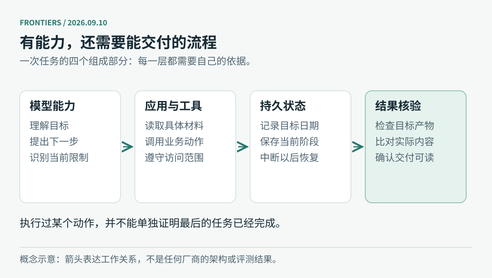

# AI 动态｜2026-09-10

先看五条展开介绍，再用十条短讯补齐其余动态。新闻沿用今晨核验的事件，主要信息截止 09:34，项目日榜快照为 09:37；这次按新要求重写表达并清理跨栏重复，没有把局部补查写成重新扫描了全部厂商。前五条约需 12–15 分钟，其余约 5 分钟。

日期按原站记录，较早事件标为“近期补充”。下文的场景用于解释用途，厂商成绩保留测试条件；本站未运行这些商业产品或模型。

图：编辑原创概念图。模型能力、应用工具、执行状态与结果核验分别解决不同问题；箭头表示工作关系，不是厂商性能排名。

## 01 · Astra 补齐企业工作能力：权限、插件与执行边界

**日期：2026-09-09｜企业能力更新。**

Astra 这次更新要解决一个落地问题：模型接进业务系统以后，企业怎样规定它可以打开什么、修改什么。Astra 的模型首发已在[9 月 8 日刊](../2026-09-08/01-AI动态.md)介绍；本条跟进的是新公布的企业控制与插件，不能理解为第二次发布同一模型。

公告列出网站、应用、上传下载和浏览历史等控制范围，也介绍 Oracle Analytics、Power BI、Navan、Avalara 等企业插件。模型会规划下一步，仍需要工具把动作做出来，也需要权限限制它能接触的资源。企业管理员需要先开放相应能力；公告说明企业访问默认关闭，不能把个人账号能用等同于全公司已经部署。[官方工作场景公告](https://openai.com/index/gpt-6-astra-next-generation-work/)

拿差旅分析来说，助手可以读取已批准的费用资料，在报表工具中整理异常项，再把结果交给人复核。这个流程能否成立，取决于几个系统分别开放了什么权限；装好插件只是其中一步。对采用者而言，试点应该同时记录任务完成率、人工接管位置和错误的实际影响，单看生成速度不足以判断是否适用。

同日更新的系统卡补充了对齐评测的构造方式，以及部分评测与训练之间的关系，并明确说明没有观察到失败不等于在所有环境下都可靠。尤其是长流程任务，正确使用某个工具和最终交付正确结果是两层要求；即使模型表现提高，任务状态、输入来源和完成证据仍要由产品流程保存。[系统卡与 9 月 9 日变更说明](https://deploymentsafety.openai.com/gpt-6-astra)

试点可以从一条容易核对的流程开始：输入是什么、哪些系统允许访问、最终应该留下什么文件，都先说清楚。再看模型会在哪些地方停下来、需要多少人工接手。这样得到的记录，才有助于决定要不要扩大使用范围；公告里的案例只能作为选题线索。

## 02 · Google ADK Kotlin 1.0：把 Agent 接入应用生命周期

**日期：2026-09-09｜正式可用公告；仓库 v1.0.0 发行时间为 9 月 7 日。**

Google 宣布 ADK Kotlin 1.0 正式可用。这个开发套件把模型、工具和执行流程接起来，本次对齐 ADK 1.0 Core，并补上 Android 端侧集成。它也支持服务端 Kotlin 与 Java 应用，因此用途不限于给手机应用加一个聊天窗口。[Google Developers 公告](https://developers.googleblog.com/en/announcing-adk-for-kotlin-10-building-production-ready-ai-agents-in-kotlin-android-and-beyond/)

应用退出后再打开，Agent 应该从哪里继续？这次更新把这类问题纳入应用生命周期：需要用户确认时可以暂停并继续，长任务和多轮对话可以保存状态，上下文过长时可以压缩历史。Room 用于会话持久化，AppSearch 用于可检索记忆；它们承担不同职责，保存了聊天记录并不自动等于业务任务已经完成。开发者仍需定义哪些字段是恢复所必需，以及哪一步才允许写入成功状态。

工具接入使用 Kotlin 注解与 KSP，也就是在编译阶段读取代码结构，生成给模型看的函数描述。这样可以提前发现一部分类型和参数问题，减少运行时反射。对已有 Kotlin 服务的团队，这让“开放哪个业务动作给 Agent”更接近普通接口开发，而不必手写两套容易不同步的描述。[官方仓库与使用文档](https://github.com/google/adk-kotlin)

端侧部分提供 LiteRT-LM、仍标为 beta 的 ML Kit 集成，以及通过 Firebase AI Logic 连接云模型的路径。例如故障排查助手先读取本地设备状态，遇到复杂问题再请求云模型，修改配置前停下来让用户检查。是否离线可用，取决于实际选择的模型、工具和数据来源，不能由“Kotlin 1.0”这个版本号推出。

接入后可以专门测四种情况：应用退出、网络断开、用户拒绝，以及进程重启。观察状态有没有保存、旧操作会不会重复、界面是否告诉用户发生了什么。1.0 提供构件，完整体验仍要靠应用把这些情况处理好。

## 03 · 腾讯 AuK 开源：用同一套指令生成和编辑语音

**日期：2026-09-09｜代码与权重开放；论文 v1 提交于 9 月 8 日。**

腾讯 AuK 的官方仓库和当前模型卡均宣布代码与模型权重开放，包含基础版本及用于更快推理的 AuK-Flash。它把文本转语音、语音内容修改、声音风格调整、增强和分离放到一个自然语言指令接口中。处理同一段录音时，使用者可以连续提出不同要求，少一些在多个专用模型之间切换的步骤。[官方仓库](https://github.com/Tencent-Hunyuan/AuK) · [基础模型卡](https://huggingface.co/tencent/AuK)

可以把其内部工作理解为三部分：语义模型解释文字与音频条件，音频 VAE 把波形压成便于计算的表示，生成网络据此逐步恢复目标音频。仓库把生成模型标为 1.5B 参数，但整套推理还依赖其他组件；不能拿这个数字直接推算全部显存需求。Flash 用更少的生成步骤换取速度，是否保持所需音质仍需要按任务比较。

例如课程录音里把时间说错了，可以先改那一句，再处理背景噪声或语气。评估时应把“目标词是否改对”“其余内容是否保留”和“音色是否稳定”分开听，不能只比较输出是否流畅。原录音要保留，改动范围也要明确；一句话被改对，不代表旁边的声音都没有受到影响。

技术报告给出 Flash 在匹配条件下相对完整模型的加速结果，同时指出复杂编辑指令的原生理解仍不完善，系统仍会借助任务路由和提示增强。因此，界面上能输入一句自由描述，不等于模型已经能可靠组合任意编辑操作；要求越复杂，越需要保留原音频和逐项检查输出。[AuK 技术报告](https://arxiv.org/html/2609.08936v1)

代码与腾讯公开的参数、权重采用 MIT，依赖组件另有各自条件。搜索引擎曾保留较早日期的模型卡快照，本期以现场读取的仓库及模型卡公告日期为准。基础版与 Flash 合在这一条介绍，模型栏另选六个不同项目。安装时还需准备配套编码器与音频组件，不能只下载生成网络权重。

## 04 · IBM 详解新版时序模型：预测区间与缺失值一起处理

**日期：2026-09-09｜技术发布详解；不将这一天断言为权重首次出现。**

IBM 介绍 Granite Time Series PatchTST-FM-r2，面向随时间变化的数值序列，例如设备读数、负载或需求记录。它关注的是“接下来数值可能如何变化”，并非聊天模型。官方提供权重、推理实现及评测复现代码，支持零样本预测与缺失值处理；零样本在这里指使用预训练模型预测新序列，不要求先对每个任务单独训练。[IBM 技术公告](https://huggingface.co/blog/ibm-research/ibm-releases-sota-granite-time-series)

它同时处理长短两种时间变化：注意力层关联较远的时间片段，随后加入卷积捕捉局部形态。r2 使用 Conformer 模块、重叠的时间片段和约 3.85 亿参数，训练上下文长度为 8192。它还输出多个分位数，使读者能看到预测的不确定范围，而不是只得到一条看似精确的曲线。[模型卡中的结构与用法](https://huggingface.co/ibm-granite/granite-timeseries-patchtst-fm-r2)

例如，用电量预测除了关心明天的中间估计，还需要知道高负载情形可能到哪里。可以把真实值叠在预测区间上，看看高峰是否经常落在区间外，再与“重复上一周期”这样的简单基线比较。区间越宽并不天然越好；必须同时看覆盖率与可用性，才能判断结果能否帮助安排容量。

官方博客按 9 月 8 日的 GIFT-Eval 快照介绍成绩，在可复现、零样本的筛选范围内列第二，并强调在该范围的宽松许可模型中表现靠前。模型卡仍保留 8 月 31 日的图表及提交状态说明。本期把它视为带日期和筛选条件的官方报告，没有实时重跑榜单，也不据此宣称它在所有时序任务上第一。

模型提供 Apache 2.0 与 OpenMDW 1.0 双许可选择。试用时仍需检查采样间隔、缺失数据处理和预测长度，尤其避免把未来信息漏进输入。实际数据上是否值得使用，要留出一段模型没看过的时间来测试。缺失值多、周期突然改变或预测跨度变长时，都可能出现与公开榜单不同的结果。

## 05 · Microsoft Discovery 引入 CLIO，让科研推理随证据调整

**日期：2026-09-09｜科研 Agent 执行框架更新。**

微软介绍 Discovery 中的 CLIO，即在执行过程中优化认知循环的方法。它试图解决科研任务里常见的情况：最初的假设不成立，需要比较其他解释，查找新证据，并重新安排计算。系统允许探索不同路径、分析失败原因并修改后续策略，让工具与模型的选择跟随当前证据变化。[Azure 官方公告](https://azure.microsoft.com/en-us/blog/beyond-the-benchmark-how-an-adaptive-approach-drives-scientific-discovery/)

这里的“自适应”发生在解题过程中：依据新证据调整路线，不涉及每次失败后都重新训练基础模型。科研任务通常没有一开始就确定的步骤表；一个有用的执行框架需要记住什么已经验证、什么仍是假设，以及为何放弃某条路线。CLIO 把失败轨迹也作为后续判断的输入，避免只有成功答案留下来、探索过程全部丢失。

微软报告 Discovery Engine 在 Agent’s Last Exam 的三个科学领域取得以下结果。数字描述的是官方所测模型与工具组合，不是单个语言模型的通用能力排名：

| 评测领域 | Discovery Engine 开启 CLIO 的得分 |
| --- | ---: |
| 健康与医学 | 61.6% |
| 物理科学 | 75.2% |
| 生命科学 | 64.6% |

技术说明写明，这次测试以 GPT-5.6 Sol 为默认模型，同时可动态使用其他模型。CLIO 已进入 Discovery 应用的引擎版本，企业平台集成仍写为即将到来，不能混成所有部署形态均已开放。[微软技术详解](https://techcommunity.microsoft.com/blog/microsoft-discovery-blog/adaptive-by-design-how-microsoft-discovery-explores-science/4552705)

以材料筛选为例，研究者需要知道候选为什么留下，也需要知道其他方案被哪个条件淘汰。文献、计算与待验证假设应分别记录，接手的人才能判断下一步做什么。本期没有运行 Discovery，也没有把电池研究案例拆成另一条新闻。评测中的医学题得分不能转换为临床诊断有效性；科研建议仍需领域证据来确认。

## 06 · NVIDIA 更新媒体 AI 组件，覆盖视频处理与生成内容检测

**日期：2026-09-09｜会前技术公告。**

NVIDIA 在 IBC 前介绍媒体 AI 组件更新，涉及视频超分、补帧、语音处理与生成内容检测。对媒体软件开发者，意义在于把不同环节做成可接入的模块，再按素材和延迟要求组合。合成视频检测的官方测试数字仅适用于相应测试集，不能作为任意视频真实性的证明；发布文章也同时涉及不同成熟度的能力，不能把路线图统一当成已正式可用。IBC 举行时间为 9 月 11–14 日，本条日期是公告日。[NVIDIA 原文](https://blogs.nvidia.com/blog/ibc-news-2026/)

## 07 · Mistral 融资 30 亿欧元，继续扩建开放权重与算力体系

**日期：2026-09-08｜近期补充。**

Mistral 宣布完成 30 亿欧元 D 轮融资，投后估值超过 210 亿欧元，由三星电子领投。资金用途包括前沿研究、训练算力、基础设施与商业拓展。对使用者而言，这是供应商持续投入和部署选择的背景信息，并不代表某个新模型已随融资开放。官网正文未清楚展示日期，本期用投资方 Bpifrance 的 9 月 8 日公告交叉确认，不把搜索抓取日期当发布日期。[Mistral 公告](https://mistral.ai/news/mistral-makes-sovereign-open-weight-ai-to-frontier/) · [投资方公告](https://presse.bpifrance.fr/mistral-leve-3-mdeur-pour-placer-lia-souveraine-et-ouverte-a-la-pointe-de-la-technologie/?lang=fra)

## 08 · Copilot 企业管理员可以集中规定 Agent 操作权限

**日期：2026-09-09｜正式可用。**

GitHub Copilot Business 和 Enterprise 管理员现在可以集中规定哪些 Agent 操作被阻止、需要人工批准或可直接执行，覆盖 shell 命令、文件读写和网络域名，也可按团队配置。企业限制不能被用户设置、自动批准或旧的授权记录削弱。公告列出的可用客户端为 Copilot 应用、CLI，以及使用 Agent Host 的 VS Code 会话。它使不同项目中的操作规则更一致；是否允许具体动作，仍取决于组织下发的策略。[GitHub 发布说明](https://github.blog/changelog/2026-09-09-enterprise-managed-permissions-for-github-copilot-agent-operations/)

## 09 · GitHub Code Quality 支持一次交给 Copilot 修复 25 项问题

**日期：2026-09-09｜批量修复开放。**

开启 GitHub Code Quality 的 Team 与 Enterprise Cloud 仓库，可在一页选择最多 25 个标准问题交给 Copilot。Agent 在分支上修改并验证，再创建拉取请求供人审阅和合并；单条与批量使用同一入口。该功能沿用既有 Code Quality 企业策略，会消耗 AI credits。这能省下逐条分派的问题，但维护者仍需审查改动和验证结果，尤其注意多项修复是否互相影响。[GitHub 发布说明](https://github.blog/changelog/2026-09-09-remediate-code-quality-findings-with-agentic-autofix/)

## 10 · 微软与教师组织提出学校 AI 数据保护合同标准

**日期：2026-09-09｜学校采购与数据约定。**

AFT、UFT 与微软公布面向学校的 AI 安全和隐私标准，重点涉及学生与教育工作者数据的训练使用、出售限制，以及学校对保存和删除的控制，并提出透明度和人工监督要求。它为学校采购合同提供可采用的条款框架，不是已经全国生效的法律，也不表示所有教育 AI 产品已自动符合。判断具体服务时，应继续看其实际合同、功能范围和学校配置。[联合公告](https://news.microsoft.com/source/2026/09/09/aft-uft-and-microsoft-announce-national-ai-safety-privacy-standard-for-schools-to-protect-students-families-and-educators/)

## 11 · GPN-Star 用进化对齐信息筛选值得研究的基因变异

**日期：2026-09-09｜科研成果。**

UC Berkeley 介绍 GPN-Star，研究同日发表于 Nature。它使用跨物种全基因组对齐信息训练，让模型利用进化中保留或改变的位置，而非只从大量未对齐序列中自行发现结构。团队同时提供全基因组预测，帮助研究者优先挑选后续实验对象。不同进化时间尺度适合的变异任务并不相同，因此“更高效”不能替代具体任务验证；这些预测服务于研究筛选，不是个体疾病诊断。[Berkeley 介绍](https://news.berkeley.edu/2026/09/09/new-ai-model-for-dna-learns-from-evolution-to-unlock-secrets-of-the-human-genome/) · [Nature 原文](https://www.nature.com/articles/s41586-026-11005-5)

## 12 · 百度 PP-OCRv6 云服务扩展到 50 种语言与复杂版面

**日期：2026-09-07｜近期补充。**

百度 AI 官方介绍 PP-OCRv6 云服务，覆盖 50 种语言，并列举工业图纸、电路板、弯曲文本等复杂识别场景。接口返回识别文本、置信度和位置框，便于把结果放回原图检查。对资料处理项目，这是一条通过云 API 接入的路径；本条报道云服务能力，不把它等同于当天首次开源模型。官方场景表现仍需用自己的扫描质量和版式抽样验证，大额套餐的折算单价也不能当作所有调用的统一价格。[百度公告](https://ai.baidu.com/support/news?action=detail&id=3283)

## 13 · TeamAI 进入热榜：把团队技能和规则同步到多种 Agent

**日期：2026-09-10｜项目热度观察。**

TeamAI 把技能、规则、工具配置等放在共享 Git 仓库，再同步到 Codex、Claude Code、Cursor 等客户端，让团队经验可以像代码一样审阅和更新。当前知识与改进相关能力仍带 beta 标记。GitHub 日榜本次快照显示 556 stars today，这是页面当日增量，不能理解为每日稳定增长。项目采用 MIT，9 月 9 日发行 v0.24.0-beta.3。可以在试验项目安装 `teamai-cli` 并初始化团队仓库；先看同步范围，避免把个人凭据放进共享配置。[仓库](https://github.com/Tencent/teamai-cli) · [热度来源](https://github.com/trending?since=daily)

## 14 · Diagram Design 获关注：把结构说明变成可编辑图解

**日期：2026-09-10｜项目热度观察。**

Diagram Design 提供可由 Agent 使用的图解技能与模板，输出独立 HTML 和 SVG，支持静态图及可选的解释动画。适合把组件关系、状态变化或依赖结构转换成可以继续修改的图，而不只得到一张无法编辑的图片。当前 README 列出 39 类图解，日榜快照显示 2,249 stars today。可以先打开仓库内的模板 HTML，再决定是否接入 Agent；生成后仍要核对节点和箭头表达的关系。本期配图为编辑自行绘制，未安装或运行该项目。[仓库](https://github.com/cathrynlavery/diagram-design) · [热度来源](https://github.com/trending?since=daily)

## 15 · PI-Desktop 获关注：本地项目中的多模型桌面工作台

**日期：2026-09-10｜项目热度观察；近期候选版更新。**

PI-Desktop 提供面向本地项目的 Agent 桌面工作台，可以接入自己选择的模型服务。日榜快照显示 417 stars today；核验到的最新发行条目是 9 月 9 日的 v0.14.6-rc.4，属于预发布候选版，不能写成稳定版上线。项目采用 LGPL-3.0。可以从发行页选择适合系统的安装包。工作区在本地组织，选择远程模型时请求仍会发往相应服务；是否适合日常使用，还要结合模型成本、操作权限和版本稳定性。[仓库](https://github.com/vastsa/PI-Desktop) · [发行记录](https://github.com/vastsa/PI-Desktop/releases) · [热度来源](https://github.com/trending?since=daily)

---

项目日榜观察时间以[本期来源审计](https://github.com/wuwudeqi/github-learning-site/blob/main/docs/frontiers-source-audits/2026-09-10.json)中的 observedAt 为准，页面会滚动变化。已逐项检查 15 家厂商来源；腾讯企业新闻列表、部分智谱与阿里渠道仍有覆盖缺口。X、Reddit 和公众号不计入已覆盖渠道。

[今日导读](00-今日导读.md) · [开源模型 →](02-开源模型.md)
