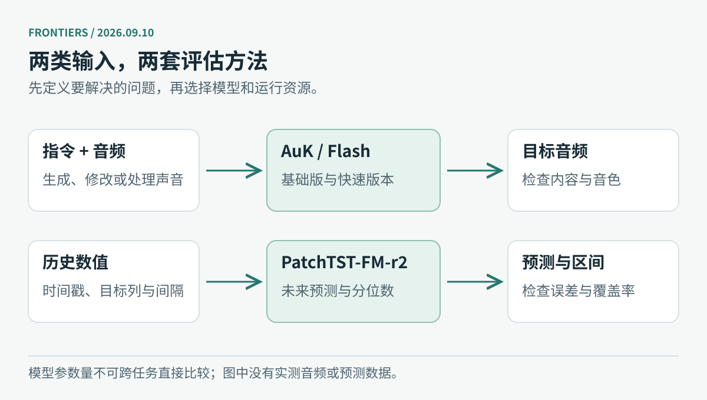

# 开源模型｜这次多看六个不同的选择

想做语音助手、电脑操作，还是在本地跑一个会调用工具的小模型？本期按这些需求选了六个模型。AuK 和 Granite 已在新闻中介绍，这里把篇幅留给其他选择。

下列条目均核对了官方模型卡、权重目录和许可说明，未下载大权重或进行推理测速。日期分清首次公开与文件更新；“Flash”“mini”只是型号，不能据此判断显存需求。

图：本站根据官方模型卡绘制。箭头表示用途，不表示能力排名。

| 想做什么 | 可以先看 | 当前公开许可 | 日期说明 |
| --- | --- | --- | --- |
| 边听边回应的语音助手 | Gander | Apache 2.0 | 权重库 9 月 7 日建立，报告 9 月 8 日 |
| 让 Agent 操作电脑和浏览器 | Nex-N2.5-mini | Apache 2.0 | 权重库 9 月 8 日建立 |
| 小模型工具调用与端侧尝试 | Spark-X2.5-4B | Apache 2.0 | 8 月 24 日建立，近期补充 |
| 连续音频转写与说话人标记 | VibeVoice-ASR-Streaming-7B | MIT | 9 月 2 日建立 |
| 需要看图的复杂任务 | DeepSeek-V4-Flash-Vision-Exp | MIT | 8 月 31 日建立，近期补充 |
| 服务端推理与工具调用 | GLM-5.3-Flash | MIT | 8 月 25 日建立，近期补充 |

## 01 · Gander：让语音助手不用每次等一句话结束

普通语音助手常按“录完一句、识别、思考、合成”排队执行。Gander 面向持续的音视频交互，把理解和说话拆给 Thinker 与 Talker，让它们按流式节奏配合。官方说明采用约一秒的因果处理单元，音频输入为 16 kHz、输出为 24 kHz。这里的一秒是处理结构，不能直接当作端到端延迟承诺。

模型以 MiniCPM-o-4.5 为基础。权重目录已经有六个 safetensors 分片，配套运行代码也已公开；训练数据部分仍标着 Coming Soon，不能写成数据、训练流程都已完整开放。[模型卡与权重](https://huggingface.co/Gander-Omni/Gander)、[运行代码](https://github.com/Omni-Interaction-Gander/Omni-Interaction-Agent)

试用时先检查声音能否持续接入、被打断后是否继续说旧内容，以及画面变化能否及时影响回答。官方示例把 Talker 放到另一张 GPU，使用 BF16；没有足够信息给出通用最低显存。代码跑通之后，仍要用自己的麦克风、网络和并发条件测延迟。许可为 Apache 2.0，依赖组件各自的条件也要保留。[技术报告 v1](https://arxiv.org/abs/2609.08977v1)

## 02 · Nex-N2.5-mini：电脑操作模型，先看实际完成了什么

Nex-N2.5 把电脑、浏览器和终端任务放在同一个系列中讨论。本期选的是已能在权重目录中看到 16 个分片的 mini。共享模型卡还介绍了 Pro 和 Max；这些版本的参数量、成绩和开放计划不能移到 mini 身上，尤其不能把 Max 的 1.6T 标成 mini 的规模。

官方报告 mini 在 Terminal-Bench 2.1 为 73.4，在 SWE-bench Pro 为 43.8。这些是给定执行环境和测试流程下的厂商成绩，适合用来寻找值得试的任务，不能直接换算成你电脑上的成功率。[mini 模型卡](https://huggingface.co/nex-agi/Nex-N2.5-mini)、[系列代码与说明](https://github.com/nex-agi/Nex-N2.5)

比较实用的第一轮测试是：在隔离环境中，给它一个可核验的浏览器整理任务和一个小型代码修复任务，留下操作轨迹与最终文件，再检查它是否真正完成目标。先限制可访问目录和凭据。mini 权重标注 Apache 2.0；当前材料不足以确认最低硬件配置。模型卡中系列发布计划的措辞，也不代表其他型号已一并开放。

## 03 · Spark-X2.5-4B：适合研究小模型怎样调用工具

Spark-X2.5-4B 值得看的地方，是较小规模下的工具调用与部署选择。模型把滑动窗口注意力和全注意力结合使用：前者限制部分层的历史读取范围，后者保留较长距离的信息连接。官方在思考模式下报告 BFCL V4 得分 65.1；这是特定工具调用评测，不能据此判断开放问答或代码能力。[模型卡](https://huggingface.co/XHToken/Spark-X2.5-4B)

先准备两三个真实工具，例如查日程、检索文档、返回订单状态，测试参数是否齐全、工具失败时是否重试，以及缺信息时会不会追问，比只看聊天示例更有价值。

官方提供 SGLang、vLLM 的适配路线，也有 [Apple Silicon 运行项目](https://github.com/XHToken/Spark-MLX-LLM)。部分 Ollama、LM Studio 路线依赖定制构建，不能理解成安装任意正式版就能加载。权重采用 [Apache 2.0](https://huggingface.co/XHToken/Spark-X2.5-4B/blob/main/LICENSE)。本条是近一个月内的补充推荐，模型库 8 月 24 日建立、9 月 3 日更新，未把文件更新时间写成今天发布。

## 04 · VibeVoice-ASR-Streaming-7B：把一段连续录音变成可用的文字

这个版本专注流式语音识别。除转写外，它还支持说话人标记和热词，官方列出十种语言。它输出文字及相关信息，适合会议字幕、连续录音整理等场景；名字中带 Voice，并不意味着这一权重负责语音合成。[模型卡](https://huggingface.co/microsoft/VibeVoice-ASR-Streaming-7B)

测试时最好选一段有插话、专有名词和短暂停顿的授权录音。分别检查文字漏掉多少、两人的话有没有混到一起、热词是否导致相近词被误改，再观察字幕何时稳定下来。离线全文转写正确，不代表流式界面里的每次增量输出都稳定。

权重库 9 月 2 日建立、9 月 3 日更新，许可为 MIT。运行入口和音频准备步骤见 [VibeVoice 仓库](https://github.com/microsoft/VibeVoice)，方法说明见[报告](https://arxiv.org/abs/2609.02812v1)。本期没有独立测字错率、延迟或显存；应按目标语言和设备重新测，不能沿用其他 VibeVoice 型号的数据。

## 05 · DeepSeek-V4-Flash-Vision-Exp：视觉扩展仍处在实验阶段

这个实验版本给 DeepSeek-V4-Flash 加入视觉输入。它适合研究“看到图像后能否完成原先做不了的步骤”，例如解释带图表的材料，或处理需要读取界面信息的任务。官方保留 Exp 标记，部署时应按实验模型对待。[模型卡与权重](https://huggingface.co/deepseek-ai/DeepSeek-V4-Flash-Vision-Exp)

模型卡给出 ApexBench 36.5，并列出纯文本 Flash-0731 的 26.2；但后者带有忽略视觉部分的注释，两列输入条件并不完全相同。选型时要先读这个注释，再讨论提升。更有说服力的本地比较，是让模型对同一批题在有图和缺图时各跑一次，核对它有没有利用正确的视觉证据。

官方 vLLM 示例使用四张 GB300，SGLang 示例也采用四路并行。这个示例不等于唯一硬件方案，却足以提醒读者：Flash 不能自动理解为适合普通笔记本。权重许可为 [MIT](https://huggingface.co/deepseek-ai/DeepSeek-V4-Flash-Vision-Exp/blob/main/LICENSE)，部署需按[官方适配配方](https://recipes.vllm.ai/deepseek-ai/DeepSeek-V4-Flash-Vision-Exp)核对版本。本条是 8 月 31 日公开后的补充收录。

## 06 · GLM-5.3-Flash：活跃参数少，不代表只需存下这些参数

GLM-5.3-Flash 是总参数约 320B、每次计算活跃约 18B 的混合专家模型。18B 描述一次前向计算涉及的规模；权重存储、专家分布和跨卡通信仍取决于完整结构，不能按 18B 稠密模型估算机器。[官方模型卡](https://huggingface.co/zai-org/GLM-5.3-Flash)

当前模型卡支持 `reasoning_effort` 的 low、high、max 三档，默认或未识别值按 max 处理。接入时要显式传入并验证服务端是否识别：否则以为在测低推理开销，实际上可能一直跑最高档。可以用同一组工具调用和多步问题比较完成率、输出长度、延迟，先找出哪些任务确实需要更多思考。

模型库 8 月 25 日建立，9 月 7 日仍有文件更新；这不是 9 月 7 日首次发布的证据。权重标注 MIT，服务端可参考 [SGLang 配方](https://cookbook.sglang.io/autoregressive/GLM/GLM-5.3-Flash)。本期未做速度或成本对比，也不把厂商的“Flash”命名当成实测结论。

---

[今日导读](00-今日导读.md) · [← AI 动态](01-AI动态.md) · [论文精选 →](03-论文精选.md)
