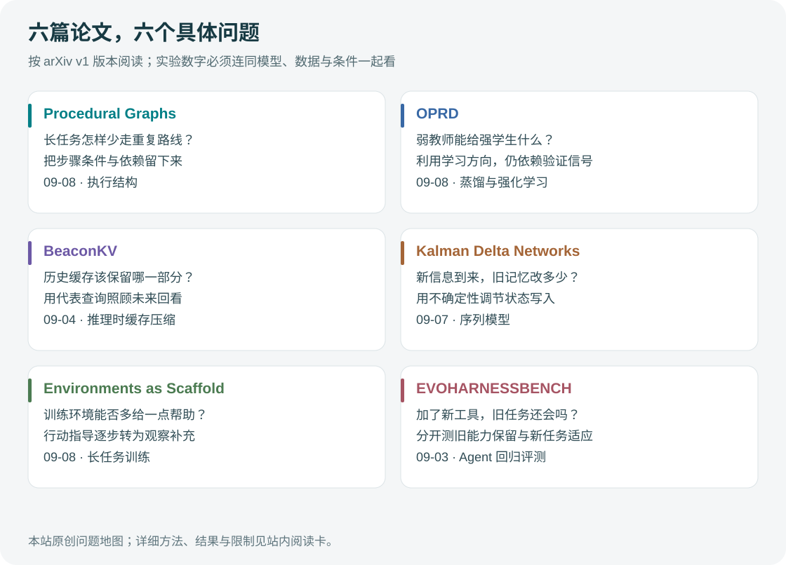

# 论文精选｜流程结构与学习方向

本期两篇均为 **2026-09-08 提交的 arXiv v1 预印本**，从 9 月 9 日论文列表发现，按实际提交日期记录。已阅读方法与结果部分，未运行作者实验；中文阅读卡已归档到“论文”分类。

图：编辑原创方法示意，表达设计直觉；不表示两篇方法可以不加修改地组合。

## 01 · Procedural Graphs：把下一步依据写进过程图

**完整标题：** Procedural Graphs: Self-Evolving Execution Structures for LLM Agents\
**作者：** Yuxing Lu、Yicheng Chen、Shanchan Wu、Sercan Ö. Arık。

文章研究长任务中目标漂移、工具顺序出错和重复尝试的问题，用图保存步骤之间的条件与关系，并结合当前轨迹产生执行指导。更完整的方法、一个结果及证据边界放在[中文阅读卡](../../../../papers/frontiers/procedural-graphs/00-阅读卡.md)，避免在两个位置重复堆叠摘要。

**编辑阅读问题：** 如果删掉历史对话，只留下当前节点和附近几条关系，系统能否知道哪个条件尚未满足？这能帮助理解过程知识与简单保存聊天记录的区别。论文提供研究方案，本期的工程实践只演示持久状态和完成检查，不声称复现过程图算法。

[原文 HTML](https://arxiv.org/html/2609.09153v1) · [原文 PDF](https://arxiv.org/pdf/2609.09153v1) · [版本与作者页](https://arxiv.org/abs/2609.09153v1)

## 02 · OPRD：弱教师提示方向，验证信号决定如何学

**完整标题：** Eliciting Weak-to-Strong Generalization with On-Policy Reverse Distillation\
**作者：** Youngrok Park 等，来自 KAIST、Microsoft、University of Toronto、Mila 等机构。

通常的蒸馏把教师当作模仿目标；这篇论文尝试利用弱教师训练前后的变化，改善更强学生的学习过程。它仍依赖可验证奖励，不是只靠一个弱模型就能保证提升。具体操作和实验中的限制，见[中文阅读卡](../../../../papers/frontiers/on-policy-reverse-distillation/00-阅读卡.md)。

**编辑阅读问题：** “向教师靠拢”和“利用教师曾经学到的方向”有什么差别？阅读时先画出教师、参考策略、学生与验证器四个角色，再看梯度公式，比直接追逐最终分数更容易理解设计动机。

[原文 HTML](https://arxiv.org/html/2609.08798v1) · [原文 PDF](https://arxiv.org/pdf/2609.08798v1) · [版本与作者页](https://arxiv.org/abs/2609.08798v1)

---

归档均保留稳定站内编号与原文链接。论文许可和代码许可分开记录，本期不镜像 PDF；第一篇仅授予 arXiv 分发许可，第二篇标为 CC BY 4.0。尚未核验到这两篇的独立官方代码仓库，因此不把它们列入“10 个开源项目”。

[今日导读](00-今日导读.md) · [← 开源模型](02-开源模型.md) · [开源项目 →](04-开源项目.md)
