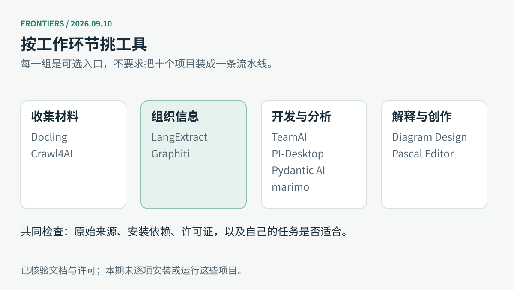

# 开源项目｜从你的工作里挑一个问题来试

这十个项目分别处理数据、服务、评测、文档和创作。TeamAI、Diagram Design、PI-Desktop 已在新闻栏展开，本栏换成 DVC、BentoML 和 Ragas。也与前两期期刊按仓库地址核对过，没有把已推荐的项目再列一次。

以下核对了官方仓库、README 和许可，未逐一安装运行。成熟工具会标明身份；开源代码的许可也不包含模型 API、数据库或云托管费用。

图：本站绘制的任务速查图。按眼前的问题选择即可。

| 你卡在哪一步 | 可以先看 |
| --- | --- |
| 数据换了，实验结果对不上 | DVC |
| 模型脚本需要变成服务 | BentoML |
| RAG 回答好不好，全靠感觉 | Ragas |
| PDF、网页难以整理 | Docling、Crawl4AI |
| 抽出的字段找不到依据 | LangExtract |
| 模型输出需要进入应用接口 | Pydantic AI |
| 人物与项目关系一直在变 | Graphiti |
| 笔记能运行，却很难重现 | marimo |
| 想让 Agent 修改三维空间 | Pascal Editor |

## 01 · DVC：代码回到旧版本，数据也得跟得上

成熟工具推荐。Git 能告诉你脚本改了什么，却不适合直接保存每批大数据。DVC 把数据与流水线的版本信息放进仓库，实际文件可以留在本地缓存或远端存储。排查“昨天能复现、今天不行”时，代码、数据和运行依赖才有机会一起对齐。

可以从一个小数据集开始：安装 DVC，在试验仓库运行 `dvc init`，再用 `dvc add` 跟踪数据；需要自动化流水线时再引入 `dvc.yaml` 和 `dvc.lock`。远端存储类型可能要求额外依赖与凭据。DVC 能记录版本和依赖，不能替你保证随机过程、外部 API 或数据质量稳定。当前规范仓库已在 treeverse 组织下，旧地址可能跳转；核验发行 3.67.1 为 3 月 31 日，不算今天的新版本。

[项目](https://github.com/treeverse/dvc) · [Apache-2.0](https://github.com/treeverse/dvc/blob/main/LICENSE)

## 02 · BentoML：把推理脚本做成有边界的服务

成熟工具推荐，核验发行 v1.4.39 为 5 月 7 日。BentoML 面向模型服务：用服务代码描述输入输出与依赖，再组织运行和打包。适合已经有推理脚本、接下来要让其他应用调用的团队，尤其需要区分模型加载与请求处理的场景。

官方快速开始使用 Python 3.9 以上，安装 `bentoml` 后编写 `service.py`，通过 `bentoml serve` 启动。先让一个小模型或已有推理函数接受固定输入，观察失败响应、并发和超时，再考虑容器化。框架不会自动决定 GPU 容量，也不会替模型做业务校验。BentoCloud 是单独的托管选择，不是使用开源框架的前提；生产环境仍需自己确定身份认证、资源预算和版本回滚方式。

[项目](https://github.com/bentoml/BentoML) · [Apache-2.0](https://github.com/bentoml/BentoML/blob/main/LICENSE)

## 03 · Ragas：把“感觉回答不错”变成可比较的实验

成熟工具推荐，核验发行 v0.4.3 为 1 月 13 日。Ragas 提供评测和实验工具，常用于 RAG 应用。它可以帮助分别看检索材料、回答与问题之间的关系，适合比较两种切分方式、检索配置或提示词改动，避免只挑几个看起来顺眼的回答。

安装 `ragas` 后，先按文档准备少量有来源和人工判断的样本，再选择符合任务的指标。部分评测依赖模型担任评委，会产生调用费用，也可能受评委偏好影响。分数变高时要回看具体样本：回答是否真的有依据，还是更符合评委的表达习惯。固定数据集、评委版本和配置，比一次跑很多指标更有用。仓库当前已迁至 vibrantlabsai，使用新地址便于核对维护与文档。

[项目](https://github.com/vibrantlabsai/ragas) · [文档](https://docs.ragas.io/) · [Apache-2.0](https://github.com/vibrantlabsai/ragas/blob/main/LICENSE)

## 04 · Docling：先把 PDF 的阅读顺序弄对

成熟工具，核验发行 v2.126.0 为 9 月 4 日。Docling 解析 PDF 等文档，保留版面、表格等结构。若资料库里的双栏论文、扫描件或复杂表格总被转成一团文字，可以先试它的转换结果。

在 Python 3.10 以上环境安装 `docling`，用 CLI 转换一份自己的小文档。不要立即批量处理：先对照原页检查标题、双栏顺序和表格，再选管线。视觉模型路径会增加下载、硬件和模型许可要求；MIT 是代码许可，不能代替所用模型的条件。记录转换版本与参数也很有用，否则同一个文件重新处理后变了样，很难知道是输入变化还是解析器变化。

[项目](https://github.com/docling-project/docling) · [MIT](https://github.com/docling-project/docling/blob/main/LICENSE)

## 05 · Crawl4AI：网页抓到了，还要看看正文有没有丢

成熟工具，核验发行 v0.9.3 为 8 月 31 日。Crawl4AI 用浏览器异步访问网页，将内容整理为文本或结构化结果。适合公开资料收集，但请求返回成功只是第一步；菜单、正文与动态加载内容能否分清，才决定材料是否可用。

安装 `crawl4ai` 后运行 `crawl4ai-setup` 准备浏览器，再按官方异步示例处理一个允许访问的页面。若使用模型抽取，还需配置相应后端。建议保存 URL、采集时间和原始内容，遇到登录或异常页面明确记录失败。抽查页面首尾和关键表格，尤其别把反爬提示当正文存进资料库。它解决采集与转换，来源是否可靠仍要另行判断。

[项目](https://github.com/unclecode/crawl4ai) · [Apache-2.0](https://github.com/unclecode/crawl4ai/blob/main/LICENSE)

## 06 · LangExtract：每个字段都能回到原句核对

成熟工具，核验发行 v1.6.0 为 7 月 2 日，9 月仍有仓库维护。LangExtract 从非结构化文本抽取字段，同时保留原文位置。整理公告中的人物、日期、事件关系时，最实用的是点回原句，看模型究竟依据了什么。

安装 `langextract`，给出抽取任务和一个质量好的示例，再从短文本开始。云模型需要 API，本地或其他后端要按当前支持方式配置。原文位置能让错误更容易被发现，却不能保证解释正确。重点检查同名实体、跨句关系和漏项；长文切段时也要看是否拆散了因果或否定关系。先保留一组人工答案，后续换模型或改提示才有比较依据。

[项目](https://github.com/google/langextract) · [Apache-2.0](https://github.com/google/langextract/blob/main/LICENSE)

## 07 · Pydantic AI：让模型结果先通过接口检查

近期更新，v2.42.0 发布于 9 月 9 日，加入 GitHub Copilot Provider，并收紧延迟工具批准结果的无效值处理。它给 Python 应用提供模型、工具、依赖和结构化输出接口，适合把模型输出交给已有业务代码。

从官方基础 Agent 示例开始，安装 `pydantic-ai` 并配置一个模型。先只定义几个必需字段，主动测试缺字段、错类型和工具失败时的行为，比一开始接很多能力更容易发现边界。类型验证能确认数据形状，却识别不了所有内容错误：一个合法的金额字段仍可能装着错误金额。核心代码、商业观测平台与模型服务分别选择。

[项目](https://github.com/pydantic/pydantic-ai) · [文档](https://pydantic.dev/docs/ai/) · [MIT](https://github.com/pydantic/pydantic-ai/blob/main/LICENSE)

## 08 · Graphiti：关系变了，旧记录也要能解释

近期维护，v0.30.2 发布于 9 月 8 日 UTC。Graphiti 把持续进入的事件整理成带时间的实体关系。查“某人在什么时候负责哪个项目”时，只保留当前关系不够；把旧关系混进现在的答案也会出错。

安装 `graphiti-core` 后，准备支持的图数据库，再运行添加事件与查询的 quickstart。当前要求 Python 3.10 以上，可选 Neo4j、FalkorDB 等；Kuzu 路径已标记弃用。抽取和嵌入通常还需要模型服务。使用时保留事件来源、时间和纠错入口，抽取错误不会因为进了图就消失。Graphiti 开源库与 Zep 托管服务分开，先用少量时间冲突样本检查行为再扩大数据量。

[项目](https://github.com/getzep/graphiti) · [Apache-2.0](https://github.com/getzep/graphiti/blob/main/LICENSE)

## 09 · marimo：改一个参数，相关计算跟着更新

成熟工具，核验发行 0.24.0 为 8 月 17 日。marimo 是响应式 Python notebook，按单元之间的依赖决定哪些计算需要重跑。笔记保存为 Python 文件，也可作为脚本或应用运行，适合数据探索和可以调整参数的评估演示。

安装 `marimo` 后先运行 `marimo tutorial intro`，再用 `marimo edit` 写一份小分析。刻意修改上游数据或参数，看下游是否按预期更新。响应式执行能减少部分隐藏状态，但外部 API、随机种子、数据版本仍要自己管理。分享前从头运行一次，记录依赖；能拖动滑块和看到图变化，不等于分析口径已经正确。

[项目](https://github.com/marimo-team/marimo) · [Apache-2.0](https://github.com/marimo-team/marimo/blob/main/LICENSE)

## 10 · Pascal Editor：让 Agent 的空间修改看得见

近期维护。Pascal Editor 用 React Three Fiber 与 WebGPU 构建三维建筑编辑器，提供浏览器界面、CLI 和 MCP 接入。相比只得到一张生成图片，它可以让你检查场景中的对象及其变化，适合探索空间草图与 Agent 操作。

可以先打开在线编辑器；本地开发按 README 在仓库运行 `bun install`、`bun dev`，访问 3002 端口。浏览器需支持相关图形能力，模型连接与工具权限另行配置。当前新标签涉及 `pascal-agent-skills`，不能当成编辑器本体的稳定版本号。试用时先做一个可撤销的小修改，核对对象位置和属性；这类工具不替代建筑专业的结构与施工检查。

[项目](https://github.com/pascalorg/editor) · [在线编辑器](https://editor.pascal.app/) · [MIT](https://github.com/pascalorg/editor/blob/main/LICENSE)

---

[今日导读](00-今日导读.md) · [← 论文精选](03-论文精选.md) · [技术实践 →](05-技术实践.md)
