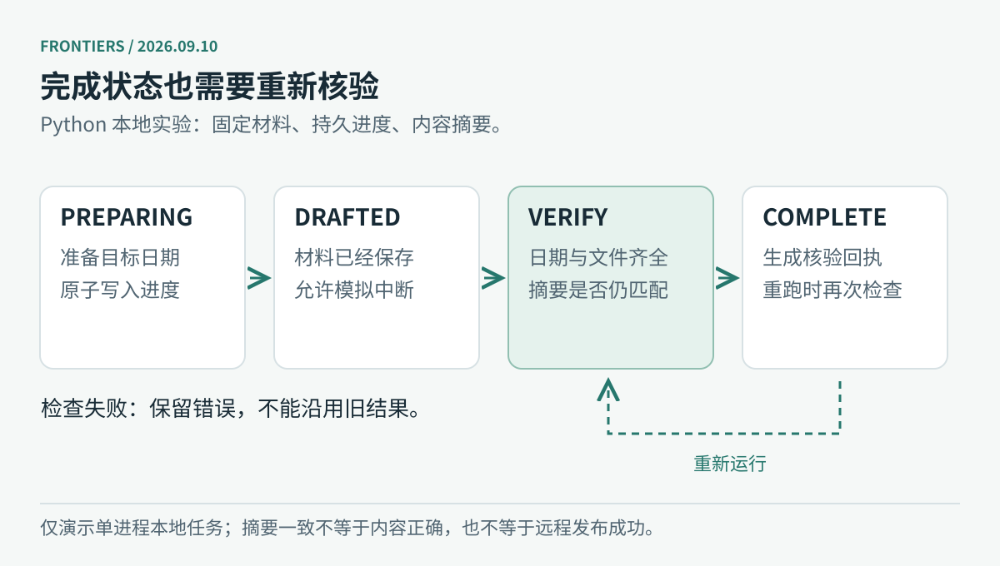

# 技术实践｜中断以后，程序怎么知道今天还没做完

长任务最容易混淆的三件事是：被调度过、生成了内容、结果已经核验。保存一句“上次做过了”不够；需要保存**哪个日期、进行到哪步、有哪些产物、什么证据支持完成**。本期用一个不调用模型和网络的 Python 小实验说明这个差别。



图：编辑原创状态图。完成标记也必须接受再次核验；任一步失败都会保留实际问题。

## 实验解决什么

假设程序先生成两份演示材料，再进行本地检查。我们主动在生成后退出，然后重新启动，观察它是否继续检查，以及是否错误地沿用昨天的成功状态。

这不是新闻生成器，也没有部署步骤；固定样例不包含真实新闻。示例仅支持一个执行进程，原子写入不能代替多个并发任务之间的锁。真实系统还需另外设计任务互斥、内容审核与发布核验。

[下载完整脚本](code/resume_job.py) · [下载行为验证脚本](code/test_resume_job.py)

## 准备与运行

需要 **Python 3.10 或更高版本**，只用标准库。把两个文件保存到同一个目录，在终端进入该目录：

```bash
# 第一次：完成演示材料后主动中断；退出码 75 是预期结果
python3 resume_job.py --date 2026-09-10 --stop-after-draft

# 第二次：读取同一日期的进度，继续核验
python3 resume_job.py --date 2026-09-10

# 第三次：再次核对产物，跳过重复生成
python3 resume_job.py --date 2026-09-10
```

预期依次显示：

```text
已保存 drafted；模拟中断，退出码 75
已恢复并完成本地核验
已核验，跳过生成
```

文件写在当前目录的 `checkpoint-demo/2026-09-10/`。其中 `state.json` 保存阶段，`draft.md` 与 `sources.txt` 是固定演示材料，`receipt.json` 保存核验时间和内容摘要。更换日期会使用独立子目录，昨天的回执不能满足今天的任务。

## 为什么要有这几层检查

| 检查 | 能发现什么 | 不能证明什么 |
| --- | --- | --- |
| 进度中的日期 | 恢复了错误日期 | 正文事实正确 |
| 必需文件存在 | 整份材料缺失 | 文件内容足够好 |
| 正文日期与摘要 | 日期不匹配、内容被改动 | 来源真实或审核通过 |
| 独立核验回执 | 本次实际执行过检查 | 内容已部署到远程网站 |

代码先写临时文件，再用替换操作保存状态，避免进度 JSON 只写了一半。生成完成时记录文件的 SHA-256 摘要；重新运行时再次计算并比对。如果内容被修改，会明确失败，不能把旧回执继续当作当前材料的证明。

**摘要只证明内容一致，不证明内容正确。**真实 AI 工作流应把来源核验、结构检查、构建与远程可读性分别设计成检查条件。更换成真实生成器时，只有最后一项检查通过，才能在进度里记录发布完成。

## 实际验证

运行：

```bash
python3 test_resume_job.py
```

本期运行了三个行为测试：中断后恢复且不重写已有材料；已完成材料被修改后拒绝沿用旧结果；昨天的成功不能让今天跳过工作，错误日期的进度也会被拒绝。三个测试均通过。测试使用临时目录，不会覆盖前面的手动演示文件。

这是一种简单的工程防护，与[本期过程图论文](03-论文精选.md)讨论的“把执行依据保存下来”相关，但没有实现其图检索、自演化或模型指导算法。先把状态与完成条件做对，才能有依据判断更复杂的执行框架带来了什么改进。

---

[今日导读](00-今日导读.md) · [← 开源项目](04-开源项目.md)
