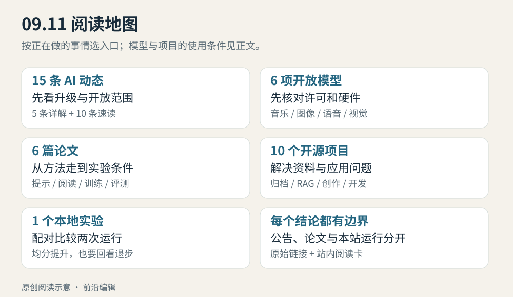

# 前沿｜2026 年 9 月 11 日

今天先看两类变化：模型的能力与实际调用版本在变，完成任务的接口与验证方式也在变。DeepSeek 的旧 API 别名已经转向新模型，Cognition 把代码任务的成本纳入训练；Agents API 与实时语音接口则把长任务、前台交互和后台执行拆成可配置的流程。

本期有 **15 条 AI 动态，5 条重点详解 + 10 条速读**，以及 6 个模型、6 篇论文、10 个开源应用工具和 1 个 Python 实验。主要新闻来自 9 月 10 日，少量 9 月 9 日的重要产品更新标为“近期补充”；模型栏保留近 30 天首次收录内容的原日期。

本期按“原图 → imagegen → HTML/JS”的顺序重新选图：14 幅来自对应官方材料、论文或真实页面截图，2 幅是标明性质的 AI 概念示意，7 幅用 HTML/JS 精确表达时序、组件关系和合成实验结果。配图紧邻相关段落，附中文读图说明；点击可查看原尺寸。六篇论文阅读卡同步采用原文图。

图｜HTML/JS 示意。本站原创阅读地图。从发布事实进入模型条件、论文方法、应用工具和可运行实验，不表示模型排名。 [查看可复现源码](code/visuals/README.txt)。

## 按时间选择阅读

| 你有多少时间 | 建议读什么 | 读完能带走什么 |
| --- | --- | --- |
| 约 5 分钟 | 本导读与新闻标题 | 哪些变化影响现有工作与产品使用 |
| 约 20—25 分钟 | [AI 动态](01-AI动态.md) | DeepSeek、Agents API、GPT-Live-1、SWE-2、Suno 的完整介绍，以及其余十条速读 |
| 约 15 分钟 | [开源模型](02-开源模型.md) | 音乐、世界模型、翻译、图像、语音和视觉模型的许可及硬件条件 |
| 约 20 分钟起 | [论文精选](03-论文精选.md) | 多 Agent 改进、长上下文、评测可信度、基础设施任务与训练方法；可继续进入六篇阅读卡 |
| 约 12—15 分钟 | [开源项目](04-开源项目.md) | 从资料整理到 RAG、界面、创作与评测的十种工具选择 |
| 约 15—20 分钟，含操作 | [技术实践](05-技术实践.md) | 用标准库对齐两次评测，找出被总分掩盖的回退样本 |

新闻与其余正文通读约 60—80 分钟；阅读论文原文和实际操作另计。

## 今天值得追问的三个问题

**模型名一样，实验条件就一样吗？** DeepSeek 的别名迁移提供了一个具体例子。保存调用日期和实际模型版本之后，还要逐题检查升级前后变化。今天的实践用 6 条合成记录说明：总通过率变高，仍可能有原本通过的任务退步。

**代码榜单的一个数字，能说明多少？** SWE-2 的不同终端测试差距很大；论文栏的 SWE-Bench Pro Verified 则检查环境文件是否泄露信息。前者是模型发布，后者是独立评测研究，不能把两者当成对同一模型的互相验证。

**拿到权重，是否已经具备运行和使用条件？** 本期六模型中，部分只能非商业使用，有些需要额外组件或多张高显存 GPU。先看许可与依赖，再决定是否试用；“Small”或“激活参数少”都不等于普通电脑能直接运行。

## 本期核验范围

信息截止 **2026-09-11 08:12（北京时间）**。十五家主要厂商入口完成初查，07:53 做入口复查；之后补读媒体与社区线索及高德、京东、苹果、OpenAI 帮助页和 Cognition 原始公告，据此调整最终十五条。08:11 再次访问同组厂商入口，未发现需替换的新 AI 公告。截止时间指本期实际核验，不保证所有网站在同一秒被抓取；发布完成时间由线上核验另行记录。

本次同日图文改版在北京时间 **11:22** 完成同组 15 家官方入口的再次访问，并重读配图涉及的方法和节点文档；原先的选题信息截止仍保留为 08:12。可读入口未确认需替换的新候选，腾讯与 MiniMax 本轮正文渲染不足，不能据此断言没有新发布。此次没有重新扫描全部媒体与社交渠道。

本轮按用户新要求重新选图，补查对应公告、模型卡、论文图注及项目教程，保留原始图像、坐标和必要实验条件。重选配图不改变早报选题截止时间；原图、概念示意和本地运行结果在各自图注中说明。[逐图来源与制作记录](code/visuals/README.txt)可追溯采用原因与复现文件。

X、Reddit 专用后端尚未配置，公众号持续采集未验证。阿里/Qwen、腾讯、百度与智谱的部分入口缺正文或明确日期，本期没有声称这些渠道已完整覆盖。可查[逐来源、候选及排除记录](https://github.com/wuwudeqi/github-learning-site/blob/main/docs/frontiers-source-audits/2026-09-11.md)。

论文结论依据作者原文，模型成绩依据模型卡或官方实验，均未冒充本站复现。唯一标记“已运行验证”的内容是本期 Python 配对审计：它不调用模型服务、不执行训练，配有代码和三项行为检查。
