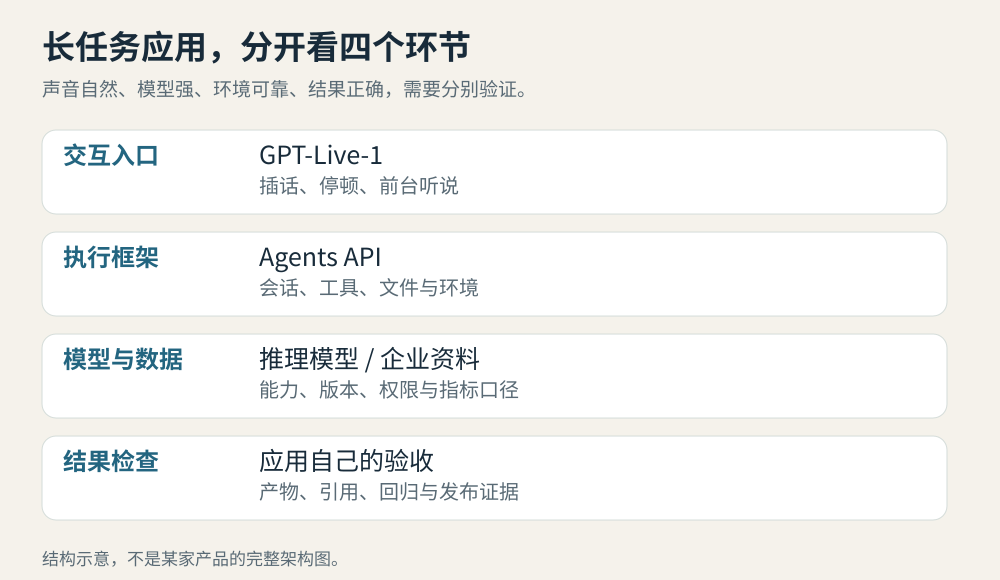

# AI 动态｜5 条重点详解 + 10 条速读

信息截止与来源覆盖见[今日导读](00-今日导读.md)。日期保留公告原日期；可核实的时区另行换算，早于昨日的条目标为“近期补充”。

图：本站原创概念图，用来区分模型升级、执行接口、应用能力与部署条件；不表示性能排名。

## 01 · DeepSeek V4.1 Flash：模型升级，也改变旧 API 的实际指向

2026-09-10 · 重点详解

DeepSeek 发布 V4.1 Flash，原生支持视觉理解。它采用总参数 552B 的混合专家模型，但输入与输出阶段分别激活约 8B、16B 参数。官方把这称为因果编码器—解码器架构：读取材料和生成答案使用不同的计算配置，希望在长输入、持续调用工具的任务中降低成本。这里的激活参数描述每一步计算量，不代表只需存放十几 B 权重。

变化也落在缓存上。官方称，相比上一代，KV 缓存占用的高带宽显存降至四分之一、SSD 存储降至八分之一。KV 缓存可以理解为模型为已读内容留下的计算中间结果；Agent 反复携带长历史时，这些数据的存储和读取会影响服务效率。上述比例来自厂商报告，不能直接换算成任何机器都快四倍。

对正在调用 API 的读者，最该先核对的是模型名称。推荐名称为 `deepseek-flash`；`deepseek-v4-flash` 与 `deepseek-v4-flash-vision-exp` 仍被接受，但旧模型已经退役，请求临时转到 V4.1 Flash。9 月 14 日北京时间 12:00 起，`deepseek-v4-pro` 也将转到新 Flash，直至后续 V4.1 Pro 发布。昨天模型栏中的旧视觉版本因此新增了一个部署层面的变化；本条跟进升级，不重新推荐旧权重。

价格页列出的高峰期输入缓存未命中、输出价格分别为每百万 token 0.30、1.20 美元，非高峰减半；缓存命中输入另有费率。峰谷时段与收费单位应一起记录，不能只截取最低价做比较。[当前价格与别名说明](https://api-docs.deepseek.com/quick_start/pricing)。

如果你在做论文复现或回归评测，应把调用日期、实际版本与采样配置写进结果，保留升级前的样本。相同 API 字符串继续返回结果，并不能证明实验条件保持不变。权重和技术报告已提供官方入口，大规模自部署仍要核对推理支持及硬件；本期没有下载权重或重跑榜单。[上期旧视觉模型记录](../2026-09-10/02-开源模型.md)。

[原始来源](https://api-docs.deepseek.com/news/news260910)

## 02 · Agents API 公测：把长任务的执行环境交给托管服务

2026-09-10 · 重点详解

OpenAI 将支撑 Codex 的 Agent 执行框架与基础设施开放为 Agents API，当前处于公开测试。开发者提交任务时指定模型、工具和环境，服务负责组织模型调用、上下文管理与任务执行。它面向需要读写文件、运行代码、保留中间结果的长任务，不能只按一次聊天接口理解。

一个容易混淆的点是“框架由谁维护”和“代码在哪里跑”。前者由 OpenAI 托管；后者可以选择 OpenAI 沙箱、自有基础设施或合作方环境。官方列出 Cloudflare、E2B、Modal、Daytona 等集成伙伴，计算、存储、网络和冷启动条件仍由所选环境决定。托管接口并不意味着所有项目都必须迁入同一种机器配置。

长任务最常见的困难，是历史越来越长、工具越来越多。API 会在接近上下文上限时压缩前文，并按需加载相关工具定义；程序化工具调用则允许在代码中组合调用与筛选结果，减少把大批原始数据塞回对话的次数。还可以让子 Agent 分头处理独立工作，各自保持上下文，由主 Agent 汇总。[接口与会话文档](https://developers.openai.com/api/docs/guides/agents-api/overview)。

例如，一个每周更新的资料研究助手，需要收集文件、提取证据、形成报告并保存成品。开发者可以从可检查的文件产物和工具返回值设计流程，再选择合适的环境。上面是应用场景示意；任务是否完成仍应由项目自己的验收条件判断，不能仅依据模型说“做完了”。

官方表示，Agents API 本身不另收接口附加费，实际按所用 token 和工具计费；这不等于底层计算与第三方服务全部免费。底层 Codex 框架代码可查看，托管服务本身仍是云端产品。公测阶段会快速迭代，做可复现实验时要记录模型、框架版本、环境和任务输入，而不是只保存提示词。

[原始来源](https://openai.com/index/introducing-the-agents-api/)

## 03 · GPT-Live-1 进入 API：语音交互与后台推理解耦

2026-09-10 · 重点详解

GPT-Live-1 此前已进入 ChatGPT，这次的新事实是向开发者开放 API，并提供语气、节奏和交互方式的定制。它可以同时听与说，在用户插话、停顿、改口时处理双向音频。对于电话客服、语言练习这类应用，何时接话和何时继续听，本身就是任务质量的一部分。

传统语音助手常把识别语音、文字推理、合成语音接成三段，每次交接都会引入等待与状态同步。GPT-Live-1 用一个模型处理前端听说，再把复杂推理和工具操作交给后端模型。前台可以维持对话，后台继续查资料或执行任务；开发者可以根据场景选择 OpenAI 或第三方后端，不必让每次简短确认都调用最重的推理配置。

新接口还提供转写与回复文本、关键词偏置以及回合检测。回合检测对已有系统尤其有用：即使声音是连续双向流，应用仍可能需要明确的片段边界来记录事件、触发工具、回放问题。系统提示可以调整说话风格，但功能是否执行成功仍要依赖后端返回的信息。[语音会话文档](https://developers.openai.com/api/docs/guides/live)。

官方称，Full Duplex Bench 相比 GPT-Realtime-2.1 提升 30 个百分点；搭配 Astra 的任务榜单结果同时包含后端能力。Speak 的早期评估中，打断学习者的次数较以往回合式系统减少近 80%。这些证据分别衡量交互行为和具体客户场景，不能合并解释为所有电话任务准确率提升 80%。

前端语音层定价为每分钟 0.05 美元，后台模型和工具的费用要另外考虑。普通 API 已开放，自定义声音仍需满足申请条件。开始试用时，可以固定同一组有停顿、插话和改口的录音，分别记录接话时机、工具参数和最终任务结果；本文未拨打电话、创建声音或运行收费评测。

[原始来源](https://openai.com/index/introducing-gpt-live-1-in-the-api/)

## 04 · SWE-2：把代码任务的成功率与执行成本一起训练

2026-09-10 · 重点详解

Cognition 发布编码模型 SWE-2，基于总参数 2.8T 的 Kimi K3 继续做强化学习。此次新增的不只是更高的推理档位：团队尝试在一次训练中同时改善不同档位，让简单任务少绕路，复杂任务仍能投入更多搜索与验证。模型已经进入 Devin Desktop 和 CLI，Devin Web 与 Fusion 正在逐步开放。

方法的直觉是，把“做对了”与“为此花了多少”放进同一个奖励。每次执行得到的成功奖励，会扣去与费用、耗时有关的成本项；不同推理档位使用不同权重。权重太大，模型可能只是少思考、少花钱，却没有变得更有效；团队按基础模型在各档位的成本与表现关系设置权重，希望推动整条曲线，而非把高档位压成低档位。

官方在 FrontierCode 1.1 Main 上报告 50.0%，基础模型 Kimi K3 为 44.2%，Fable 5.1 为 50.9%。这里是任务评分项的加权汇总，未通过关键条件的解答记零，不能简单理解为恰好修好了半数代码仓库。费用则按每次任务执行的平均美元支出计算，比较必须同时看模型档位、执行框架和任务集合。

变化并非在所有测试上同样明显。SWE-2 的 Terminal-Bench 2.1 结果是 92.8%，在更难的 Terminal-Bench 4 上则为 27.3%，低于表中的 Astra 与 Fable 5.1。对于准备更换代码助手的读者，这提醒我们先挑自己的典型任务：修小错误、跨文件重构与维护复杂终端环境，不应只由一个总榜名次决定工具选择。

在 100 个 FrontierCode 任务、每题三次运行的统计中，medium 档首次实质编辑的中位步骤从 SWE-1.7 的 48 降到 18。团队将其解释为更有针对性的代码探索；这属于厂商实验，本文未独立重跑。可借鉴的验证方式是保存工具调用、修改、测试与最终结果，逐题查看省下的步骤来自哪里。本次公告提供训练方法与产品入口，没有据此确认 SWE-2 权重已公开下载。

[原始来源](https://cognition.com/blog/swe-2)

## 05 · Suno v6 推出三种音乐模型，编辑可以落到局部段落

2026-09-09 · 重点详解 · 近期补充

Suno 推出 v6 系列，分成主模型、偏探索的 v6-wild 和较轻量的 v6-mini。主模型强调按明确想法完成作品，wild 提供更多变化，mini 面向快速尝试。前两者供 Pro、Premier 订阅者使用，mini 面向所有套餐。三者是同一次系列发布，本期合为一条。

功能重心是对已有作品继续修改。官方展示的操作包括用自然语言改一段副歌、替换一句歌词、从不同素材提取元素组成新曲，以及在保留其他部分的同时修改局部。创作者不必每次重做整首，再从多个结果里挑一个最接近原意的版本。不过“保留”程度仍要通过试听检查，公告里的演示不等于任意输入都能逐样本保持一致。

输入也不局限于文字。文字、音频、图像和视频都可以参与创作，模型尝试理解配器、情绪、结构和参考风格。例如给短片制作配乐时，可以先探索多个方向，选中一版后再调整节奏与段落；这是更适合反复打磨的用法，而不是把第一次生成当成最终交付。

帮助页说明，三种模型单次生成最长均可到 8 分钟，并为已有 Remix、Edit 等工具提供能力。时长上限与每个套餐拥有的编辑功能不能混为一谈，具体入口仍以账户开放范围为准。[版本功能与套餐差异](https://help.suno.com/en/articles/13924801)。

Suno 表示，本代模型与 Warner Music Group、BMG、Believe 等行业伙伴合作开发，并计划随着 v6 推出逐步退役旧模型。这能确认合作与迁移方向，却不能据此断言所有训练资料或任何生成结果都具备同一使用许可。商业使用和下载权益仍需按套餐条款判断。v6 没有在这份公告中开放权重；想研究本地音乐生成，可以接着看本期模型栏中的另一套实现 YuE2。

[原始来源](https://suno.com/blog/introducing-v6)

## 06 · ChatGPT Work 新增 Data agent：沿着企业指标定义做分析

2026-09-10 · 速读

OpenAI 在 ChatGPT Work 中推出 Data agent，将数据查询、分析与可共享仪表盘连成对话流程。它可利用 dbt、Databricks、Snowflake 等语义层中的指标定义，避免仅凭字段名猜“活跃用户”或“收入”的口径，也支持连接已有 BI 工具。插件目录中的入口名为 Data，安装并连接获准的数据源后，通过 `@Data` 发起任务；企业管理员可统一配置。查询沿用接入账户的表、行、列权限。分析结果仍需核对过滤条件和计算过程，自动发现某个分组异常并不等于证明了因果关系。

[原始来源](https://openai.com/index/put-data-to-work/)

## 07 · ChatGPT for Financial Services：把授权数据与交付模板接起来

2026-09-10 · 速读

这个面向金融机构的 ChatGPT Work 版本，内置 Daloopa、PitchBook、LSEG News、Crunchbase 等数据，并提供细到表格和段落的引用，方便检查数字来源。管理员可以发布 Excel、Word、PowerPoint 模板，把分析转成机构自己的交付格式。与摩根士丹利、Evercore 的设计合作首先聚焦投行及股票研究；其他数据商的统一登录集成仍在推进。它目前供符合条件的金融机构申请，不等于个人订阅自动获得全部数据，也不是投资收益承诺。

[原始来源](https://openai.com/index/introducing-chatgpt-financial-services/)

## 08 · 高德 ABot-Earth 0.7 接入飞行街景 2.0

2026-09-10 · 速读

高德在扫街榜周年更新中推出 ABot-Earth 0.7，以原生三维城市世界模型支持飞行街景 2.0。用户可在出发前查看剧院座位视角、商场内部或景区地形；重点是能探索的空间，而非只能沿固定镜头观看的视频。公司称模型利用地图与位置数据，可由卫星图或文字生成公里级城市场景，但所述单张消费级 GPU 十分钟生成的配置未完整公开，本文不将其视为通用性能保证。当前落地入口是高德相关产品，公告没有提供开放权重。本条依据高德署名发布的公司新闻稿。

[原始来源](https://www.prnewswire.com/news-releases/amap-street-stars-marks-the-first-anniversary-with-spatial-intelligence-upgrade-302874994.html)

## 09 · 京东发布物理 AI 新进展，JoyAI-Echo WM 与购物助手一同亮相

2026-09-09 · 速读 · 近期补充

JDDiscovery 2026 展示 JoyAI-Echo WM，将原生音视频生成与用户控制结合，面向可交互的虚拟环境。更直接的产品入口是 9 月 9 日发布的京东 App 16.0：购物助手“东东”支持语音、视频，用户可展示家中空间，提供选购家具或家电的上下文。两者属于同场物理 AI 发布，本期合并报道。京东同时公布数据采集、机器人产业基地和供应链计划，其中未来两年收集千万小时活动视频是目标，不是已经完成的数据集；演示能力也不能直接等同于全部场景已上线。

[原始来源](https://jdcorporateblog.com/from-ai-models-to-the-physical-world-highlights-from-jddiscovery-2026/)

## 10 · Apple Intelligence 将进入新版健康 App，年内先支持美式英语

2026-09-09 · 速读 · 近期补充

苹果公布新版健康 App，把长期健康指标、每日摘要及个性化内容放进同一界面；视觉 AI 还可结合 iPhone 摄像头与手表进行动作评估。官方明确这项动作评估在设备上处理，不录制、存储或分享视频。配套的新款手表增加传感与身体准备度功能，但新版 App 是今年稍后推出，先支持美式英语，并要求支持 Apple Intelligence 的 iPhone 或 iPad；部分能力另需手表。公告描述的是产品计划及功能条件，不能理解为现有用户今天已全部获得，也不能将健康分数当成医学诊断。

[原始来源](https://www.apple.com/newsroom/2026/09/apple-advances-health-and-fitness-capabilities-using-apple-intelligence/)

## 11 · ChatGPT 暂停 Pro 200 美元档的新购与升级，现有订阅继续

2026-09-10 · 速读

OpenAI 帮助中心确认，9 月 10 日起临时暂停 Pro 200 美元档（Pro 20X）的新订阅和升级，包括从 Free、Go、Plus 与 Pro 100 美元档转入。现有 Pro 200 美元订阅仍照常续费，Pro 100 美元档的新老订阅也不受这次暂停影响。若取消或安排降级，可在当前账期结束前撤销；一旦该订阅结束，就需等暂停解除后才能重新购买。本条只说明已确认的购买范围变化，官方页面没有给出恢复日期，也不能用它推断某个现有账户的实际额度或任务失败原因。

[原始来源](https://help.openai.com/en/articles/9793128-what-is-chatgpt-pro)

## 12 · Anthropic 公布新一期滥用调查：关注完整操作链

2026-09-10 · 速读

Anthropic 公布过去数月发现与处置的案例，覆盖网络行动、监控、影响行动、武器相关滥用及违规蒸馏。报告强调，模型被嵌入更长的自动化流程后，单条看似普通的请求可能属于一组有害操作；判断需要结合账户、工具调用和持续行为。报告中的归因与效果描述来自该公司的调查，不能当成独立司法认定，也不代表所有尝试都成功。对部署者有参考价值的是检测、停止滥用和复核执行记录的方法，本期不转述攻击细节。

[原始来源](https://www.anthropic.com/threat-intelligence-report-september-2026)

## 13 · vLLM 0.29 默认切换 Model Runner V2

2026-09-09 · 速读 · 近期补充

vLLM 0.29 将 Model Runner V2 设为多数模型的默认执行路径，同时改进缓存容量测算、采样内存和推测解码统计；少数 ROCm 模型及尚未支持的功能仍保留旧路径。版本还加入排队请求与 token 数的准入限制，并弃用旧的 OpenAI 服务模块入口，推荐 `vllm serve`。相比[此前的工具介绍](../2026-09-08/04-GitHub热门.md)，本条跟进的是执行后端及默认行为变化。升级前应固定一组模型与负载做回归，不能把某个内核的加速比例当成整台服务的吞吐提升。

[原始来源](https://github.com/vllm-project/vllm/releases/tag/v0.29.0)

## 14 · TRL 1.13 给出百万 token 训练示例，并移除旧 PPO 实现

2026-09-10 · 速读

TRL 1.13 增加长上下文训练指南及可运行示例。官方配置使用 8 张 H100，对 Qwen3-8B 训练 1,048,576 token 序列，报告每步 380 秒、每卡 56.2 GB；这些数字绑定 BF16、分块损失与检查点卸载等配置，不能推导为普通显卡也能直接运行。该版本同时移除已长期不维护的 PPOTrainer 等旧实现。对已有训练脚本，先核对导入与依赖版本，再决定迁移；本期只报道原始实验条件，没有执行重型训练。

[原始来源](https://github.com/huggingface/trl/releases/tag/v1.13.0)

## 15 · Perplexity API 的 MCP 服务支持 OAuth 登录

2026-09-10 · 速读

Perplexity 的官方 API 论坛宣布，远程 MCP 服务现在支持 OAuth。用户将官方 MCP 地址加入兼容客户端，登录 Perplexity、选择组织并授权后，即可让 Agent 接入搜索、深度研究和推理工具。它减少了在客户端手工分发 API key 的步骤，但没有说明调用因此免费，仍需核对组织与账户的使用权限。原帖时间为 9 月 9 日 23:15 UTC，换算北京时间是 9 月 10 日 07:15；本条按可核实的北京时间记录。

[原始来源](https://community.perplexity.ai/t/the-perplexity-api-mcp-server-now-supports-oauth/6053)
