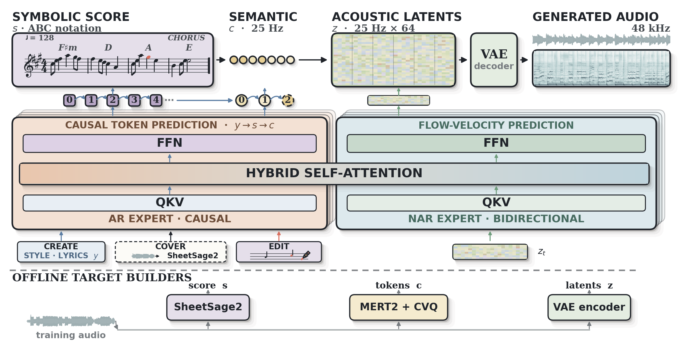
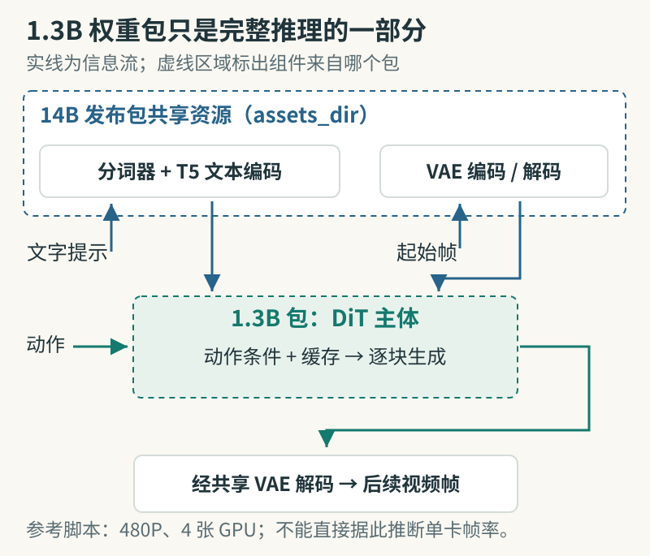
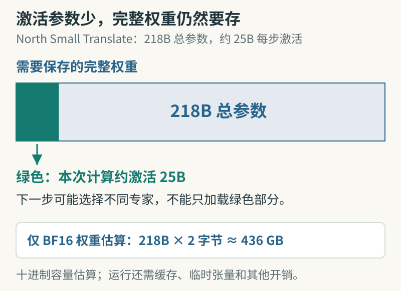

# 开源模型｜六项开放权重，先看许可和硬件

本栏同时收录宽松许可模型与研究用途开放权重，逐项标注差别。六项均核对官方模型卡及权重文件清单，未下载大权重或独立测速。日期不精确的条目只给可核实的仓库时间。

## 01 · YuE2-3B：先写可编辑乐谱，再生成歌曲

YuE2 将歌词与风格提示变成带人声、伴奏的歌曲，并把旋律、和弦的符号规划留作可编辑材料。你可以先修改乐谱，再让模型重新合成；这比只在音频末端剪辑更适合研究“意图如何影响音乐结构”。权重来自 m-a-p 官方仓库，本次核验到主模型文件及独立 VAE 仓库，没有把社区转换版当成原创发布。

图｜来源原图。YuE 团队模型卡的架构原图。沿最上方从左到右看：符号乐谱 → 语义 token → 声学潜表示 → VAE 解码 → 音频。中间橙色 AR 分支负责顺序预测，蓝绿色 NAR 分支负责流速度预测；左下 EDIT 箭头指出乐谱的修改入口。最下方是训练目标的离线构造，不是用户每次生成都要重新执行的步骤。 [原始来源](https://huggingface.co/m-a-p/YuE2-3B)。点击图片查看原尺寸。

模型卡给出的路径是 Linux、Python 3.10 以上、支持 BF16 的 24 GB NVIDIA 显卡；它提供单独的推理包和规划、合成接口。开始时先使用仓库自己的示例歌词，固定随机种子，保存乐谱和输出音频。运行第三方推理包前应阅读依赖和入口；本期没有安装或下载大权重。

官方 WildSongBench 结果中，best-of-8 版本的 SongBench 平均分为 6.9632，而普通配置为 6.7316。前者从八个候选中挑选，普通配置也有两候选筛选，并非单次输出；两套配置的部分评分权重还不同。模型卡分别解释了 VAE、候选筛选及指标条件。要比较质量，需同时记录生成次数和筛选成本。

主仓库创建于 2026-09-09 18:30 UTC（北京时间 9 月 10 日），权重许可为 CC BY-NC 4.0，仅限非商业使用。这不是可直接接入商业配乐业务的授权。

[官方模型卡与权重](https://huggingface.co/m-a-p/YuE2-3B)。

## 02 · LingBot-World 2.0：补齐小模型与预训练权重

团队在代码仓库的 2026-09-10 更新中，新增公开 14B 因果预训练、双向模型与 1.3B 因果快速模型。本期把它们视为同一系列，重点看较小的交互世界模型。原始 2.0 论文与 14B 快速版本在 7 月已发布，不能把整套技术都写成 9 月的新发明。

它根据起始画面和动作条件逐块生成后续视频，用缓存维持交互过程。小权重包目前只含 DiT，需要复用 14B 包里的 T5、VAE 和分词器；“下载了 1.3B”并不代表所有依赖已经齐全。代码仓库参考命令仍使用 4 张 GPU、480P 输出，并通过 `assets_dir` 指向共享资源。[完整权重清单与推理条件](https://github.com/robbyant/lingbot-world-v2)。

图｜HTML/JS 示意。先看虚线包边界，再沿实线看输入、逐块生成与解码。T5、VAE 和分词器来自共享资源，1.3B 包目前只有 DiT。本站依据[仓库的权重与推理说明](https://github.com/robbyant/lingbot-world-v2)绘制；箭头概括依赖和数据流，不是完整网络结构。 [查看可复现源码](code/visuals/README.txt)。

项目整体宣传的实时帧率、原论文中的单卡定位，与当前公开参考脚本不是同一个配置。本期未找到足以承诺某张消费显卡稳定达到指定帧率的实测，因此不把 720P、60 fps 直接套到 1.3B 本地运行上。研究复现应先记录分辨率、块长度、缓存设置和 GPU 数量。

许可为 CC BY-NC-SA 4.0，非商业且衍生作品需遵循相同条款。模型权重与推理代码可访问，团队明确未计划公开完整部署代码；从权重到在线多人体验仍有工程距离。

[官方模型卡与权重](https://huggingface.co/robbyant/lingbot-world-v2-1.3b-causal-fast)。

## 03 · North Small Translate：面向 50 种语言的翻译模型

Cohere 的 North Small Translate 专门做多语翻译：总参数 218B，每个 token 激活约 25B，覆盖 50 种语言，输入和输出分别支持 16K。它提供 BF16、FP8、四比特权重三个版本，合并为一个推荐。[官方发布文章](https://cohere.com/blog/north-small-translate)标记时间为 2026-09-10 23:10 UTC，即北京时间 9 月 11 日 07:10。仓库创建于 8 月 14 日，不能把提前建库的日期当成此次公开发布日。

“Small”是该产品的命名，不表示笔记本可以轻松运行。模型卡列出的最低示例配置：BF16 为 4 张 B200 或 8 张 H100，四比特版本仍为 1 张 B200 或 2 张 H100。加载时还需要给专家层融合等临时缓冲留出显存，不能把所有容量都分给权重。

图｜HTML/JS 示意。绿色宽度按 25/218 绘制，只表达单步激活规模占总规模的比例；每步可能使用不同专家。218B × 2 字节 ≈ 436 GB 是十进制 BF16 纯权重估算，并非实际显存测量，缓存、缓冲等还需另算。参数与配置来自[官方模型卡](https://huggingface.co/CohereLabs/North-Small-Translate-1.0)，图为本站原创。 [查看可复现源码](code/visuals/README.txt)。

翻译输出带有结构标记，官方建议切掉输入部分，再用 `cohere_melody` 解析；仅设置跳过特殊 token 不一定移除这些标记。适合先以术语表、数字保留、段落结构作为检查点，比较一次翻译与多轮修订，而不是只看一句话是否流畅。

官方 WMT26 汇总分为 83.60，多轮 Agent 翻译为 84.36，两者工作量不同。权重是研究发布，下载需同意 CC BY-NC 4.0 及使用政策；本期只读取公开模型卡和文件清单，没有代为接受下载协议。

[官方模型卡与权重](https://huggingface.co/CohereLabs/North-Small-Translate-1.0)。

## 04 · LLaDA-Image：生成与编辑共用一套图像模型

LLaDA-Image 在 2026-09-04 公开 Base、Turbo 权重和推理代码。它把文生图与参考图编辑放进统一流程，支持中英文文字渲染。Base 推荐 50 步采样，Turbo 是少步蒸馏版本，通常使用 4 步；两个版本合并介绍，避免把一套模型拆成多个名额。

从方法上看，项目先通过图像训练建立视觉先验，再引入语言监督和联合生成、编辑训练。对想研究推理速度与细节保留的读者，可以用固定种子、同一提示和参考图比较 Base、Turbo，分别记录修改区域、未修改区域以及字形的变化。减少采样步数不代表所有场景都无损。

图｜来源原图。LLaDA-Image 仓库的编辑示例原图，整幅保留，四组均从左到右比较。上排分别改变人物表情与动作、碗里的甜品；下排展示线稿上色，以及把海报中的 Stay 改为 Keep。读图时同时看目标区域和周围细节，判断编辑是否局部。它是维护者挑选的效果展示，没有提供这些样本的统一步数与耗时，不能用来证明 Turbo 的速度或成功率。 [原始来源](https://github.com/inclusionAI/LLaDA-Image)。点击图片查看原尺寸。

参考环境为 Python 3.11、PyTorch 2.8、Transformers 4.57.6、Diffusers 0.39.0，代码需要 CUDA。约 6B 的名称只说明主体规模，加载文本编码器、VAE 与高分辨率中间张量还会占用资源；本期未核实最低显存，不承诺消费显卡的具体运行配置。

官方在 Qwen-Image-Bench 报告英文 53.53、中文 53.38，属于指定基准的团队结果。许可标为 Apache-2.0；已公开权重和推理代码，训练代码在计划中。论文题名里的“开放训练配方”不能替代对训练源码是否已经发布的检查。

[官方模型卡与权重](https://huggingface.co/inclusionAI/LLaDA-Image)。

## 05 · Breeze TTS 2：自然语言控制语气与声音

Breeze TTS 2 于 2026-08-25 开放权重与 PyTorch 推理代码，本期作为近 30 天首次收录。它支持三种不同任务：用参考音频保持音色、仅凭文字描述设计声音、保留参考音色并调整语速或情绪。中英文也能在正文里标注笑声、叹气等声音事件，适合研究可控语音合成。

部署要求是 Linux、Python 3.10 以上与 NVIDIA GPU。模型卡给出 eager 推理约占 7.7 GiB，最低建议 12 GB 显卡；快速路径约占 14.4 GiB，建议 24 GB。所谓低于 40 毫秒首音频延迟，来自 H100 预热后的快速路径，不包括冷启动，也不能直接迁移到桌面显卡。

试用可以先做无参考音频的声音设计：同一句话只改变一项语速或情绪要求，保存文本、指令与音频。涉及具体人的参考声音时，需要取得相应使用授权；克隆音色与按文字设计声音不能混称为同一操作。

源代码采用 Apache-2.0，但模型、衍生权重及自托管输出受 BreezeBlue 研究与非商业许可约束。官方付费托管服务的输出权限另行约定，订阅并不会自动授予本地模型商业使用权。[权重许可全文](https://huggingface.co/BreezeBlue/Breeze-TTS-2/blob/main/LICENSE)。

[官方模型卡与权重](https://huggingface.co/BreezeBlue/Breeze-TTS-2)。

## 06 · Ling-3.0-flash-VL：把视觉接进推理与操作

Ling-3.0-flash-VL 在语言基座上加入原生图像和视频理解，总参数约 124B、每 token 激活约 5.5B，支持最长 256K 上下文。模型卡描述了视觉编码器、VideoRoPE 与混合注意力主干，目标是让模型结合画面完成理解、推理、操作和验证。仓库创建于 2026-09-04，最近更新于 9 月 10 日；本期按近期开放模型收录。

对读者而言，可以先选择带表格或界面的样本，分别检查“看见了什么”和“据此执行了什么”。识别出按钮位置不等于正确完成业务流程；图表问答、视觉推理与工具任务也应分开记录。模型卡给出 Artificial Analysis 指数为 42，并说明部分编程任务的框架、超时及采样条件，这些条件比单独引用总分更有复现价值。

官方 SGLang 参考配置为 4 张 141 GB 级别 GPU 或相应 Blackwell 节点；80 GB 卡建议扩到 8 张。256K 配置还涉及 YaRN 与缓存设置。激活 5.5B 节省的是每步计算，不会把完整权重的存储需求缩到 5.5B。

模型卡许可为 MIT，文件清单含可下载权重。它的示例依赖专门的 SGLang 镜像或模型适配分支，不能假设任意旧版推理库都兼容。本期未执行模型推理，实际采用前应固定镜像与代码版本。

[官方模型卡与权重](https://huggingface.co/inclusionAI/Ling-3.0-flash-VL)。
