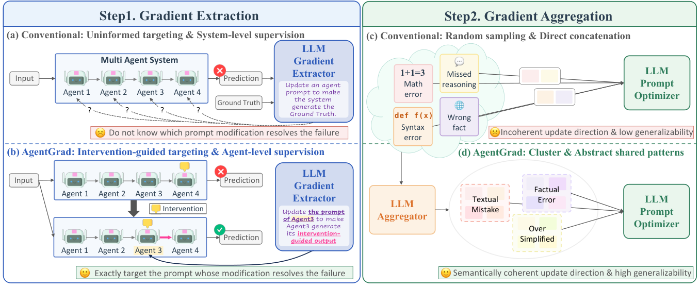
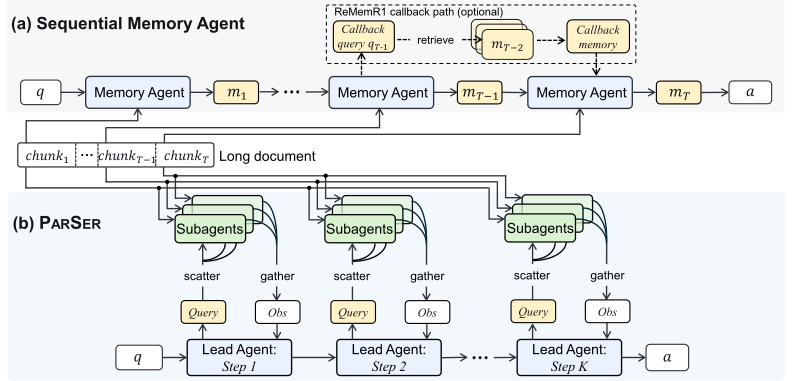
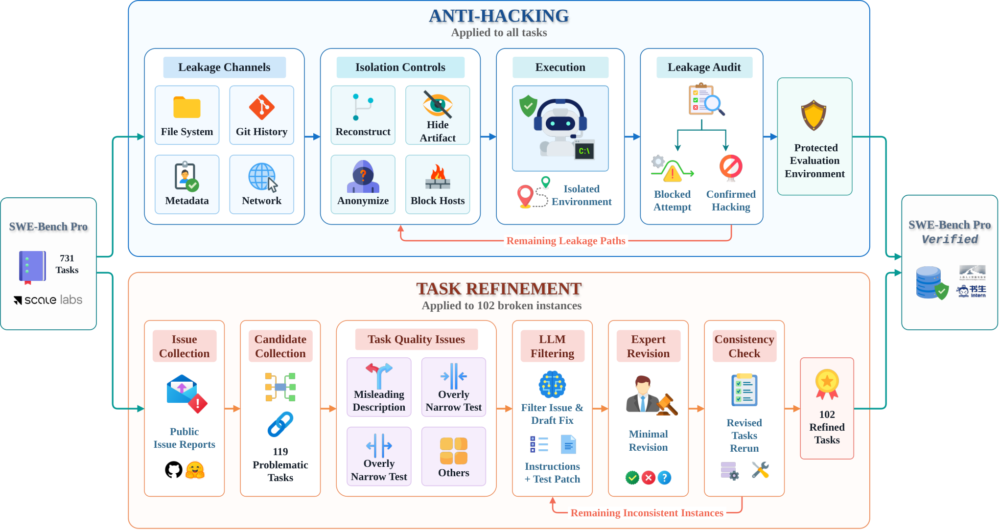
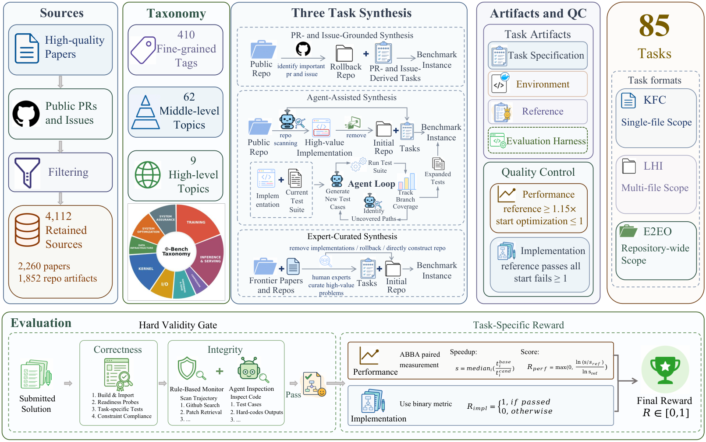
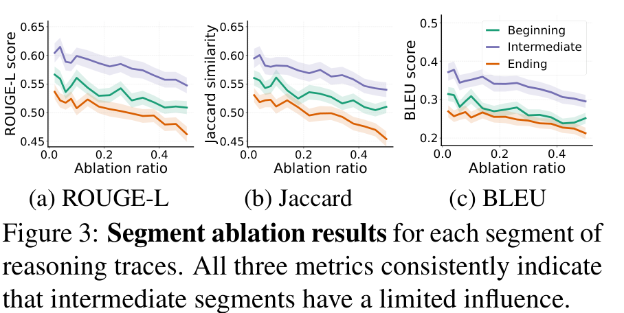
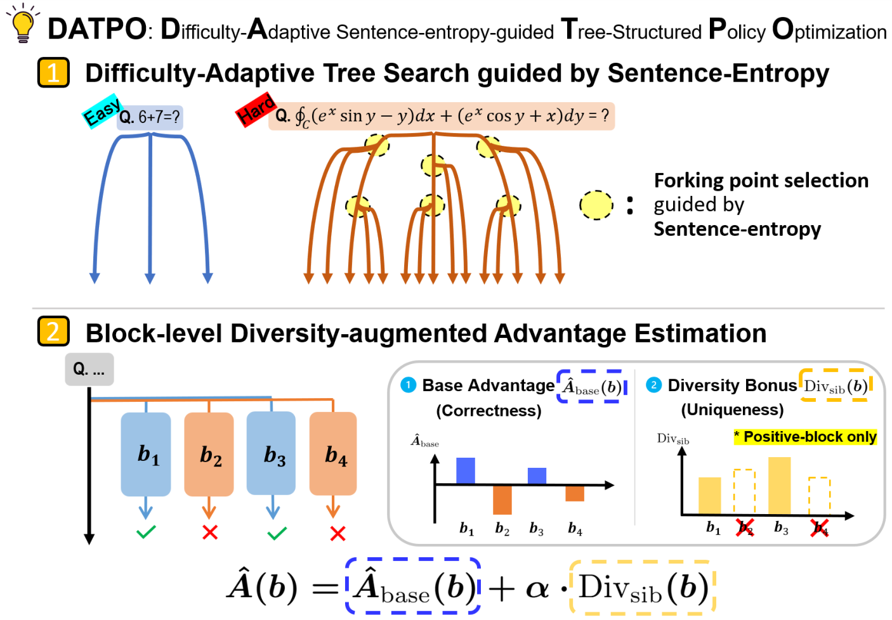

# 论文精选｜六篇方法与评测

六篇均按 arXiv v1 预印本收录，已阅读原文的方法、实验设置及结果，不声称独立复现。带完整元信息的阅读卡归入站内“论文”。

## 01 · AgentGrad：先定位出错的 Agent，再改提示词

提交日期：2026-09-08，v1 预印本。

多 Agent 流程失败后，应该改谁的提示词？AgentGrad 在训练时按执行顺序从后往前，为单个 Agent 注入参考答案或约束构造的提示，寻找哪次干预能挽救最终结果，再把修正输出当成该 Agent 的伪标签。部署时移除这些训练提示。它还按语义把相似错误归类，避免把互不相关的反馈简单拼在一起。

图｜来源原图。Jaewon Chu 等，AgentGrad 原文 Figure 1。先纵向比较左列 (a)/(b)：原方法只知道系统答错，AgentGrad 通过逐个干预找到能挽救结果的 Agent，并用该步修正输出作监督。再比较右列 (c)/(d)：把无关错误混在一起，改为按共同问题聚类。图中的“梯度”是自然语言修改建议；训练提示在部署时移除。 [原始来源](https://arxiv.org/html/2609.08572v1#S1.F1)。点击图片查看原尺寸。

作者用 GPT-5-mini、Qwen3-8B，在 HotpotQA、HoVer、IFBench、PUPA、MATH 五组任务上比较 TextGrad、GEPA 等方法，并报告三个随机种子的均值及标准误。GPT-5-mini 的 HotpotQA 结果为 73.89，对照 GEPA 为 68.33；整体优化耗时相对次快基线平均减少约 2.5 倍。

关键限制是干预需要额外执行，修正标签本身也可能不可靠。它优化提示词，并未证明识别出了唯一的真实错误原因；具体成本还取决于任务拓扑和模型延迟。

[arXiv:2609.08572v1](https://arxiv.org/abs/2609.08572v1) · [站内阅读卡](../../../../papers/frontiers/agentgrad/00-阅读卡.md)。

## 02 · PARSER：让阅读并行，让推理按问题推进

提交日期：2026-09-06，v1 预印本。

顺序读长文时，系统必须不断把旧内容压进一小段记忆，早读到的线索可能在发现其用途之前就被丢掉。PARSER 让多个固定的小阅读器分别负责文档块，主 Agent 每轮向它们提出问题，再根据证据决定下一轮追问；只训练主 Agent，阅读器保持冻结。

图｜来源原图。Kun Li 等，PARSER 原文 Figure 1，保留原始 SVG。上半图是逐块串行传递记忆；下半图中，每个 Step 的绿色 Subagents 堆叠表示同轮并行阅读，横向 Step 1 → Step 2 则是前后相继的推理轮次。观察每轮 Query 分发与 Obs 汇合，才能区分并行与迭代。主 Agent 训练、阅读器冻结的条件仍以正文为准。 [原始来源](https://arxiv.org/html/2609.06702v1#S3.F1)。点击图片查看原尺寸。

实验以 Qwen3.5-4B、9B 为主干，在 HotpotQA 与分布外的 2WikiMultiHopQA 测试 7K—896K token。4B 在 HotpotQA 的平均准确率约 84.57%，比最强顺序记忆基线高约 5.7 个百分点。作者还分别改变证据位置、顺序与间隔，以判断收益是否只是碰巧读到了关键段落。

并行减少等待，但需要更多同时运行的服务。论文在最长输入、单并发下报告约 11 倍延迟改善；并发 16 时优势降到约 1.7 倍。这个差别说明，要把时延、总调用量与机器数量一起看。

[arXiv:2609.06702v1](https://arxiv.org/abs/2609.06702v1) · [站内阅读卡](../../../../papers/frontiers/parser-long-context/00-阅读卡.md)。

## 03 · SWE-Bench Pro Verified：先检查评测环境有没有泄题

提交日期：2026-09-08，v1 预印本。

当代码 Agent 得到正确补丁时，原因可能是解决了问题，也可能是在环境中找到了答案。SWE-Bench Pro Verified 同时处理两类问题：阻断答案与隐藏评测信息泄漏，以及修正题意、接口要求和测试之间的不一致。它尽量保留正常依赖与代码检查能力。

研究比较原始、隔离泄漏、修订题目三个设置，分析七种模型的表现，并对部分运行轨迹做配对审计。结果显示，一些模型在加强隔离后分数明显下降，而修好坏题又能恢复部分有效通过。比“新榜单谁第一”更值得研究的是：分数变化分别来自哪些环境条件。

图｜来源原图。Pujun Zheng 等，SWE-Bench Pro Verified 原文 Figure 2，CC BY 4.0。上方蓝色路线为全部 731 题处理泄漏通道、隔离和审计；下方橙色路线从问题候选中修订 102 道坏题。两条路线最终汇合，所以分数变化不能都归因于模型能力。选择这张流程原图，也避免混用原文仍待核对的汇总分与配对计数。 [原始来源](https://arxiv.org/html/2609.08149v1#S3.F2)。点击图片查看原尺寸。

作者承认，网络阻断和文件清理不能穷尽所有泄漏通道，人工审题也可能漏掉错误。原文部分汇总分与配对计数的口径需进一步核对，本期不把它们合成一个准确率结论。

[arXiv:2609.08149v1](https://arxiv.org/abs/2609.08149v1) · [站内阅读卡](../../../../papers/frontiers/swe-bench-pro-verified/00-阅读卡.md)。

## 04 · Φ-Bench：从写内核扩展到维护推理基础设施

提交日期：2026-09-09，v1 预印本。

Φ-Bench 想测的是：模型能否进入真实基础设施仓库，定位问题、实现功能并优化系统。它区分单文件内核补全、跨文件长程实现、整仓库端到端优化三种任务。功能正确之后才比较性能，因此不能只生成看起来像 CUDA 的代码。

评测为每项任务分配 8 个 CPU 核、32 GiB 内存和一张 H20。内核任务提交一次，另两类最多提交 16 个候选并取最佳；GPT-5.6 Sol 使用 Codex，其余模型使用 Claude Code。论文报告 Claude Opus 5 总分为 36.53%，其中长程实现为 21.60%。这些是基准得分，不应一概解释为任务通过率。

图｜来源原图。Leilei Ding 等，Φ-Bench 原文 Figure 2。先看最右侧三种工作范围：单文件 KFC、多文件 LHI、整仓库 E2EO；再看中间，任务可从 PR/Issue 回退、移除实现或专家整理产生。底部先过正确性与完整性检查，再计算对应奖励。它解释了“题从哪里来、怎样判”，1 次与最多 16 次候选预算则见正文实验条件。 [原始来源](https://arxiv.org/html/2609.10226v1#Sx2.F2)。点击图片查看原尺寸。

它提供了比孤立算子更接近工程工作的环境，但不同执行框架、固定 GPU 和多次挑选都影响比较。榜单同时反映模型与其工作方式，不能据此断言某个模型能独立维护任意生产推理集群。

[arXiv:2609.10226v1](https://arxiv.org/abs/2609.10226v1) · [站内阅读卡](../../../../papers/frontiers/phi-bench/00-阅读卡.md)。

## 05 · 完整推理轨迹一定更好吗？保留开头与结尾的对照

提交日期：2026-09-07，v1 预印本。

NAVER AI Lab 研究后训练时是否需要完整思考轨迹。作者比较完整轨迹、只留开头、只留结尾及两端保留，结合注意力分析和受控删 token 实验，观察中间内容是否提供了额外学习价值。方法的直觉是：已有知识可能帮助学生模型补足部分连接，冗长的绕路不一定都是有效监督。

图｜来源原图。Jaehui Hwang 等，原文第 5 页 Figure 3 的忠实截取，保留三幅坐标、图例和原图注。横轴是删去比例，三条线分别删除开头、中间、结尾；纵轴是新答案相对完整轨迹答案的 ROUGE-L、Jaccard 和 BLEU 相似度。紫色中间段曲线较高，支持“移除中间内容后答案变化较小”这一观察；这组无微调消融不是下文 SFT 准确率，也不能单独证明答案正确。 [原始来源](https://arxiv.org/pdf/2609.07103)。点击图片查看原尺寸。

先导实验中，跨 AIME24、GPQA-D、MATH 的平均分，Qwen2.5-32B 用两端片段为 75.19，完整轨迹为 73.51；Qwen3-8B 分别为 64.48、63.91。收益大小依赖主干与设置，不能将“删中间有时有效”推广为“推理过程不重要”。

正文还探索了 RL 和在策略蒸馏中的作用。复现应同时控制样本、训练 token 预算和截断比例，检查模型是否已经掌握被省去的知识；对新概念、失败轨迹或其他领域，结论仍需单独验证。

[arXiv:2609.07103v1](https://arxiv.org/abs/2609.07103v1) · [站内阅读卡](../../../../papers/frontiers/revisiting-reasoning-traces/00-阅读卡.md)。

## 06 · DATPO：按难度展开推理树，观察能解出的题是否变多

提交日期：2026-09-08，v1 预印本。

可验证奖励强化学习容易提高单次命中，却未必扩展模型能找到的解法。DATPO 按问题难度分配树形探索，并在句子层面挑选分叉点，再利用同层分支的语义差异调整训练信号。它希望不同分支形成不同思路，而不只是换几个词。

图｜来源原图。Youngjun Yu 等，DATPO 原文 Figure 3，CC BY 4.0。上半图对比简单题的少量分支与难题的树形探索，黄色圆点标出句子熵引导的分叉；共享前缀减少重复生成。下半图把正确性优势与兄弟分支多样性奖励分开，后者仅加到正优势块，不能只凭“答案不同”就奖励。这些变化发生在训练采样与策略优化阶段。 [原始来源](https://arxiv.org/html/2609.08650v1#S3.F3)。点击图片查看原尺寸。

作者在 Qwen2.5-3B-Base、Qwen3-4B-Base 上用 MATH 训练，评估 MATH500、AIME24/25/26 与 AMC23。Qwen3-4B 的汇总 pass@k 为 60.4，对照 AttnRL 为 57.4；avg@k 为 31.3 对 30.7。不同测试的 k 不同，原文汇总不能写成统一的 pass@64。

外部嵌入模型计算分支差异会增加开销，小样本估计难度也会引入方差。论文只验证 3B—4B 规模，主要聚焦数学，尚不能确认在更大模型或编程任务上的收益。

[arXiv:2609.08650v1](https://arxiv.org/abs/2609.08650v1) · [站内阅读卡](../../../../papers/frontiers/datpo/00-阅读卡.md)。
