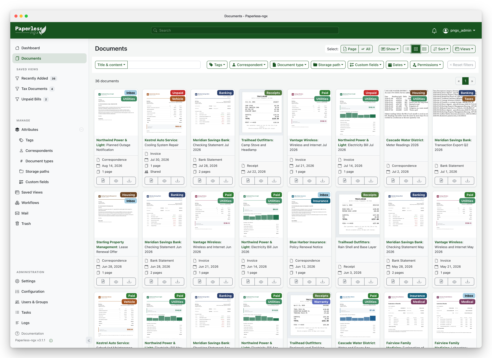
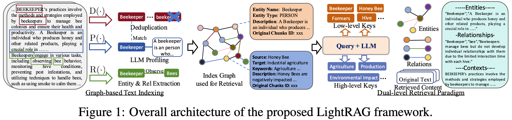
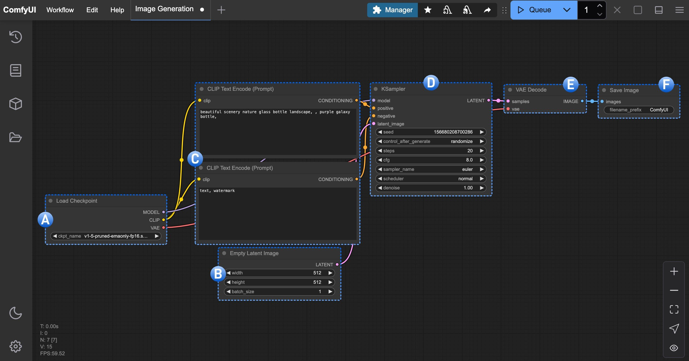
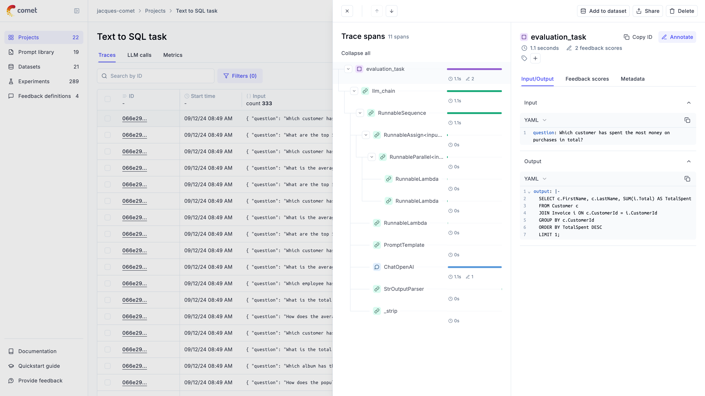

# 开源项目｜从手头任务挑十个工具

比较了应用框架、资料管理、创作与评测等候选，按规范仓库地址去重。以下是基于维护者资料的上手建议，未安装这些项目或运行示例；“近期版本”不等于今天首次发布。

| 任务 | 工具 | 本期定位 |
| --- | --- | --- |
| 扫描件归档 | Paperless-ngx | 成熟工具 / 可复用方法 |
| 论文结构提取 | GROBID | 成熟工具 / 可复用方法 |
| 可控 RAG 管线 | Haystack | 成熟工具 / 可复用方法 |
| 关系型知识问答 | LightRAG | 成熟工具 / 可复用方法 |
| 多供应商模型调用 | LiteLLM | 成熟工具 / 可复用方法 |
| 研究原型界面 | Chainlit | 成熟工具 / 可复用方法 |
| 可视化内容工作流 | ComfyUI | 成熟工具 / 可复用方法 |
| 代码修改与检查 | Cline | 成熟工具 / 可复用方法 |
| 多步骤工作自动化 | CrewAI | 成熟工具 / 可复用方法 |
| 调用追踪与评测 | Opik | 成熟工具 / 可复用方法 |

## 01 · Paperless-ngx：把零散扫描件变成可检索档案

如果资料仍散落在下载目录、邮件附件和扫描文件里，先建档通常比直接加聊天模型更有效。Paperless-ngx 将文档导入、OCR、标签和检索放在一个自托管应用里，适合整理票据、说明书或长期保留的研究材料。可先按仓库的 Docker Compose 路线，用少量可公开的 PDF 测试导入与搜索，再配置存储和备份。

它需要数据库、任务服务与 OCR 相关组件，不能当成单个 Python 函数；中文识别要配置对应语言数据。全文提取也不保证复杂表格或公式保持结构。当前稳定版本为 v3.1.3，本期作为成熟工具推荐，未部署服务；原始文件与导出备份仍应单独保留。

[源码](https://github.com/paperless-ngx/paperless-ngx) · [GPL-3.0](https://github.com/paperless-ngx/paperless-ngx/blob/dev/LICENSE) · [所核验版本](https://github.com/paperless-ngx/paperless-ngx/releases/tag/v3.1.3)（2026-09-04，来源 UTC 日期）。

图｜来源原图。Paperless-ngx 仓库提供的文档列表原图。先看顶部的标签、对应方、文档类型与日期筛选，再看卡片中的缩略图和字段：输出是可检索、可管理的档案。它与下文 GROBID 的 TEI XML 结构化输出用途不同。截图来自维护者示例，界面标识为 v3.1.1，并非本期核验的 v3.1.3 实测；未导入用户资料。 [原始来源](https://github.com/paperless-ngx/paperless-ngx)。点击图片查看原尺寸。

## 02 · GROBID：从论文 PDF 提取结构与参考文献

GROBID 面向学术文献，把标题、作者、章节、参考文献等转成结构化结果，常用输出是 TEI XML。它适合在做论文库前先把“哪篇论文引用了谁”提取出来，或为后续检索保留章节边界。仓库已从 kermitt2 跳转到 grobidOrg，本期按规范地址合并，避免把迁移算成新项目。

最小路径是使用维护者提供的 Docker 镜像与 API 示例，对一篇普通学术 PDF 请求全文解析，再检查标题和参考文献。自建服务需要 Java 与模型资源，复杂布局、扫描件、公式及低质量 PDF 都要抽查。最新正式版 0.9.1 发布于 8 月 4 日，本期是成熟工具首次推荐，不把它写成今日发布。

[源码](https://github.com/grobidOrg/grobid) · [Apache-2.0](https://github.com/grobidOrg/grobid/blob/master/LICENSE) · [所核验版本](https://github.com/grobidOrg/grobid/releases/tag/0.9.1)（2026-08-04，来源 UTC 日期）。

## 03 · Haystack：把检索与生成写成明确的数据管线

Haystack 适合已经会 Python、希望控制检索细节的读者。文档清洗、切分、向量检索、排序与生成可组成明确的组件管线；出错时能够定位是没找到材料，还是找到后回答错误。参考场景是为一组课程文档建立带引用的问答服务，先用十份文档检查检索结果，再连接生成模型。

可从 `pip install haystack-ai` 与官方最小 Pipeline 示例开始，向量存储和模型服务按需添加。当前正式版为 3.1.1；3.x 与旧教程的接口不能混用，应固定所读文档版本。它是编排框架，不会替你提供已清洗的知识库或免费的模型额度；本期没有启动应用。

[源码](https://github.com/deepset-ai/haystack) · [Apache-2.0](https://github.com/deepset-ai/haystack/blob/main/LICENSE) · [所核验版本](https://github.com/deepset-ai/haystack/releases/tag/v3.1.1)（2026-09-03，来源 UTC 日期）。

## 04 · LightRAG：同时保留实体关系与文本检索

LightRAG 在材料入库时抽取实体与关系，并结合文本检索回答问题。对于“某个方法依赖哪些组件、这些组件又解决什么问题”这类跨文档问题，关系结构可能比只找相似段落更有帮助；但图中出现一条边不代表事实已被独立确认，抽取错误也会进入查询结果。

图｜来源原图。LightRAG 仓库收录的框架原图 Figure 1。左侧从原文抽取实体与关系并去重；右侧把问题拆成低层实体词和高层主题词，再取回实体、关系与原文。重点看中间记录的 Original Chunks ID：图里的边仍应能追溯到材料，抽取出来的关系不自动成为已证实事实。本图没有比较 Haystack 的效果。 [原始来源](https://github.com/HKUDS/LightRAG)。点击图片查看原尺寸。

官方推荐通过 `uv tool install "lightrag-hku[api]"` 启动服务路线，再配置提取、查询、嵌入及存储。先导入小资料集，抽查实体合并和引用，再考虑批量处理；多模态解析可能另需 MinerU 或 Docling 服务。核验版本为 v1.5.7，本期作为可复用方法推荐。索引成本、更新与删除后的关系一致性都需要在自己的数据上测试。

[源码](https://github.com/HKUDS/LightRAG) · [MIT](https://github.com/HKUDS/LightRAG/blob/main/LICENSE) · [所核验版本](https://github.com/HKUDS/LightRAG/releases/tag/v1.5.7)（2026-09-02，来源 UTC 日期）。

## 05 · LiteLLM：用统一网关管理不同模型接口

同时接入多个模型时，接口格式、错误码、密钥和费用记录很容易散在业务代码里。LiteLLM 提供统一调用层及代理网关，适合把这些差异集中管理。可以先在独立虚拟环境中安装 SDK，使用一条测试请求验证格式，再配置代理路由、日志和访问权限；真实调用仍取决于你已有的供应商账户。

官方仓库说明包含成本追踪、负载分配和多种接口支持，但统一入口不能保证不同模型的工具调用语义完全一致。生产切换前应保留逐样本回归集。当前发布页包含 v1.100.1 与开发版本，本期只引用正式版。核心代码按 MIT 开放，`enterprise/` 目录采用另行许可，托管和企业功能不自动包含在核心授权里。

[源码](https://github.com/BerriAI/litellm) · [MIT](https://github.com/BerriAI/litellm/blob/litellm_internal_staging/LICENSE) · [所核验版本](https://github.com/BerriAI/litellm/releases/tag/v1.100.1)（2026-09-10，来源 UTC 日期）。

## 06 · Chainlit：给 Python 实验加一个可交互聊天页面

你已经有一个检索或 Agent 函数，只想让同事能上传文件、提问并查看过程，可以考虑 Chainlit。它用 Python 回调连接应用逻辑，省去先写完整前端的工作。最小路径是按仓库安装后运行官方示例，再把单个问答函数接入消息处理流程；先验证流式输出、异常和用户会话隔离。

页面只是交互层，模型、检索、存储以及登录方案仍需配置。研究原型接入真实资料后，还要决定上传文件保存多久、不同用户能看到哪些历史。本次核验版本为 2.12.0。项目已由社区维护，原团队退出日常开发的说明在 README 中可查；这不等于无人维护，也不能忽略支持方式已经变化。

[源码](https://github.com/Chainlit/chainlit) · [Apache-2.0](https://github.com/Chainlit/chainlit/blob/main/LICENSE) · [所核验版本](https://github.com/Chainlit/chainlit/releases/tag/2.12.0)（2026-08-25，来源 UTC 日期）。

## 07 · ComfyUI：把图像创作步骤保存成可复用工作流

ComfyUI 用节点图组织模型加载、条件输入、采样、解码和输出，适合需要反复调整同一创作流程的人。可以先使用官方桌面版或便携安装，加载一条最小工作流，再逐步加入自己的参考图和后处理。节点之间传递的内容可见，分享工作流时也更容易说明每一步用了什么。

图｜来源原图。Comfy Org 官方文生图教程的工作流原图，A—F 标记来自原图。A 加载模型；B 设置初始潜表示；C 的正负提示编码连到 D KSampler。最关键的一跳是 D → E：采样器输出仍为 LATENT，经 VAE Decode 才成为 IMAGE，最后由 F 保存。图中是教程的 SD 1.5 配置，不适用于所有模型；本期没有运行 ComfyUI。 [原始来源](https://docs.comfy.org/tutorials/basic/text-to-image)。点击图片查看原尺寸。

本期核验后端 v0.35.0，但桌面版、前端和后端不是同一个版本号。运行还需要对应模型及其推理资源，自定义节点会增加依赖；官方合作节点可能调用收费闭源服务。GPL-3.0 约束应用代码，不替代模型、素材与外部服务的许可。本文按工具文档介绍使用路径，未安装节点或生成图像。

[源码](https://github.com/Comfy-Org/ComfyUI) · [GPL-3.0](https://github.com/Comfy-Org/ComfyUI/blob/master/LICENSE) · [所核验版本](https://github.com/Comfy-Org/ComfyUI/releases/tag/v0.35.0)（2026-09-09，来源 UTC 日期）。

## 08 · Cline：在编辑器、终端与桌面使用代码 Agent

Cline 提供编辑器扩展、CLI、SDK 和桌面入口，让 Agent 读取项目、修改文件并运行命令。适合从范围明确的小任务开始，例如为一个函数补参数校验，然后检查补丁与测试结果。选定入口后，再连接已有模型服务；上下文、工具和权限会影响结果，不能只按模型名称判断表现。

本次核验桌面版 desktop-v0.0.25；这个版本号不适用于所有入口，安装扩展时要看自己的发行通道。首次试用建议使用可回退的项目副本，逐项查看文件改动与命令记录。模型 API、远程执行环境和插件可能另有费用或授权。Cline 的应用代码按 Apache-2.0 开放，本期没有让它修改本仓库。

[源码](https://github.com/cline/cline) · [Apache-2.0](https://github.com/cline/cline/blob/main/LICENSE) · [所核验版本](https://github.com/cline/cline/releases/tag/desktop-v0.0.25)（2026-09-10，来源 UTC 日期）。

## 09 · CrewAI：把自主协作与固定流程放在一起

CrewAI 同时提供角色化协作的 Crews 和事件驱动的 Flows。前者适合把问题交给不同职责的 Agent，后者适合明确“先读取、再校验、再输出”的固定步骤。比如资料研究流程可以用 Flow 固定输入和验收，再在其中调用一组研究角色；是否需要多个 Agent，应由实际任务决定。

上手可从官方 Python 示例与最小 Flow 开始，配置一个模型连接，记录状态和每步输出，再增加工具。当前版本为 1.15.21，本期作为成熟工作流框架推荐，不把零碎修复包装成新产品。多角色会带来额外调用与协调成本，角色名称也不会自动形成可靠分工；需用真实样本验证是否优于单流程。

[源码](https://github.com/crewAIInc/crewAI) · [MIT](https://github.com/crewAIInc/crewAI/blob/main/LICENSE) · [所核验版本](https://github.com/crewAIInc/crewAI/releases/tag/1.15.21)（2026-09-09，来源 UTC 日期）。

## 10 · Opik：把一次错误回答追到具体调用

Opik 记录模型与工具调用链，并提供数据集、实验评测及调试视图。若同一道题昨天能答、今天出错，它可以帮助比对提示词、检索内容、模型返回和中间步骤，而不只保存最后一句答案。可先安装 Python SDK，对一个函数增加追踪，再选择本地部署或官方托管端点。

图｜来源原图。Comet / Opik 官方追踪文档原图。中间 Trace spans 展开一次 SQL 任务的嵌套调用，右侧可查看当前步骤的输入与输出，右上角 Add to dataset 可把案例加入数据集。它解释了从最终结果回到中间步骤的具体入口。图中日志、时延和计数均为官方演示，不是本站记录，也不能作为当前版本性能数据。 [原始来源](https://www.comet.com/docs/opik/tracing/log_traces)。点击图片查看原尺寸。

核验版本为 2.2.58。自托管需要服务端和存储资源；自动评分如果调用外部模型，也会产生额外费用。记录完整输入前应决定哪些字段可保存，避免日志变成无法管理的资料副本。评分器本身同样需要校验：有分数并不意味着答案已被人工证实。本期只阅读开源代码、许可与官方文档，未将任何用户数据发送到追踪服务。

[源码](https://github.com/comet-ml/opik) · [Apache-2.0](https://github.com/comet-ml/opik/blob/main/LICENSE) · [所核验版本](https://github.com/comet-ml/opik/releases/tag/2.2.58)（2026-09-10，来源 UTC 日期）。
