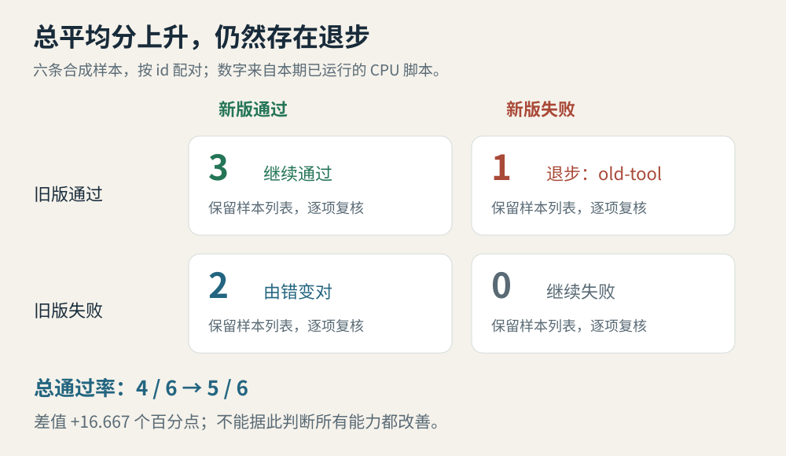
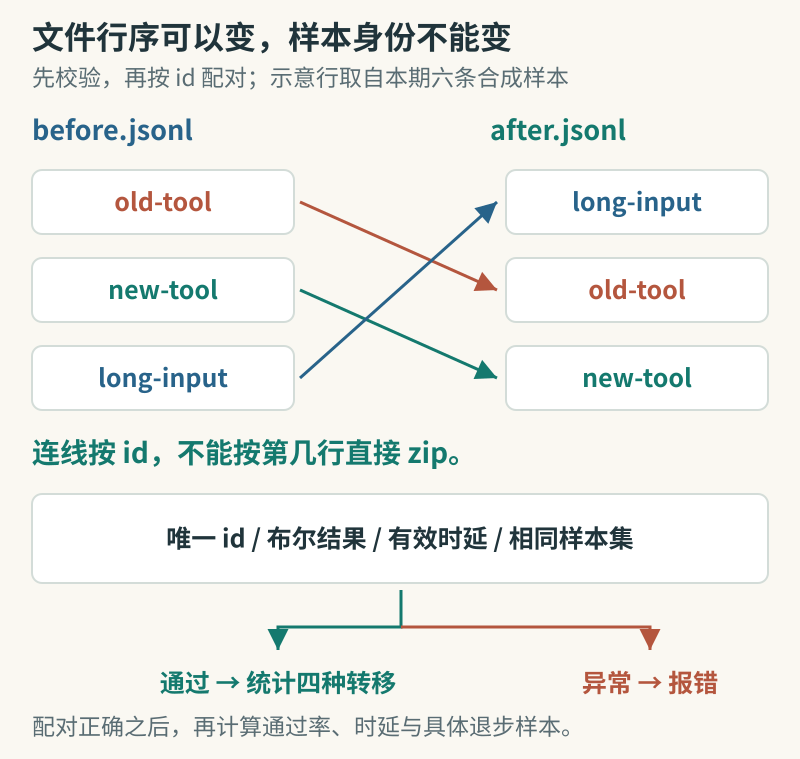

# 技术实践｜平均分涨了，哪些样本却退步了？

本地已运行验证。示例使用 Python 3.14.3 标准库、CPU 和六条人工构造的记录，不调用模型、网络或付费 API。它演示评测结果怎样配对，不代表任何真实模型的性能。

[](images/practice-paired.svg)

图：本站原创。把升级前后的结果按同一个样本对齐，才能看见被总平均分掩盖的退步。

## 原理：保留四种转移

假设旧版本六题答对四题，新版本答对五题。只看 66.7% → 83.3%，很容易以为新版本全面改善。配对后却能看到：三题始终正确，两题从错变对，还有一题从对变错。如果退步的恰好是每天都要用的旧工具，升级就值得暂缓检查。

脚本先检查每行的样本 id、布尔结果和时延，再要求两次运行的样本集合完全相同。它按 id 匹配，不依赖文件行顺序，也不会默默丢弃缺失记录。随后统计继续通过、退步、改善、继续失败四组，输出样本列表供人工回看。

[](images/practice-match-ids.svg)

图：三个 id 均取自本期合成样本，右侧特意换了顺序；颜色连线只负责匹配身份。本站依据[已运行脚本](code/compare_runs.py)绘制，流程底部区分正常统计与报错；六条完整样本的计算结果见本页四格图。

## 下载与运行

保存[compare_runs.py](code/compare_runs.py)和[test_compare_runs.py](code/test_compare_runs.py)到同一个目录：

```bash
python3 compare_runs.py
python3 -m unittest discover -s . -p 'test_compare_runs.py' -v
```

不传参数时运行内置的合成样本。实际验证输出如下，数字由本期脚本计算：

| 指标 | 结果 |
| --- | --- |
| 样本数 | 6 |
| 旧版通过率 | 0.666667 |
| 新版通过率 | 0.833333 |
| 差值 | +16.667 个百分点 |
| 继续通过 | 3 |
| 改善 | 2 |
| 退步 | 1，样本 old-tool |
| 是否需要回看退步 | true |

平均时延也从 1,250 毫秒降到 1,050 毫秒。这是人工数据的算术结果，不是速度测试，更不证明一次升级必然更快。

## 接自己的结果

两份 JSONL 文件每行各放一个对象，字段格式为：

```json
{"id": "case-001", "passed": true, "latency_ms": 1200}
```

再运行：

```bash
python3 compare_runs.py before.jsonl after.jsonl
```

生成记录时应在两次运行中使用同一输入、评分规则和样本 id，并另外保存模型版本、执行框架、采样参数及数据集版本。脚本只验证文件内部能否配对，不知道你是否换了题，也不能识别服务端模型别名的变化。遇到 passed 字段被写成字符串时会报错，避免 Python 把非空字符串误当成真值。

核心比较只需先做映射，再按样本遍历：

```python
before, after = index_rows(before_rows), index_rows(after_rows)
if before.keys() != after.keys():
    raise ValueError("Case sets differ")
for case_id in sorted(before):
    pair = before[case_id]["passed"], after[case_id]["passed"]
    groups[labels[pair]].append(case_id)
```

## 本次验证与边界

三个行为测试通过：提高总平均分仍能发现退步；打乱行序不影响配对，缺失和重复样本会被拒绝；字符串布尔值、负数或非有限时延不会被接受。脚本及测试都已实际运行。

这里只有确定性的布尔结果，没有统计显著性推断。真实模型输出有随机性，要重复运行并按任务类别检查；时延还受并发、预热和缓存影响。平均时延也不是尾部时延。这个小工具适合做升级前的第一轮检查，不能代替完整上线评估。

实现参考 Python 官方的 [json](https://docs.python.org/3/library/json.html)、[statistics](https://docs.python.org/3/library/statistics.html) 与 [unittest](https://docs.python.org/3/library/unittest.html) 模块；代码为本站原创。若要接入真实实验，先从你最在意的十个固定样本开始。
