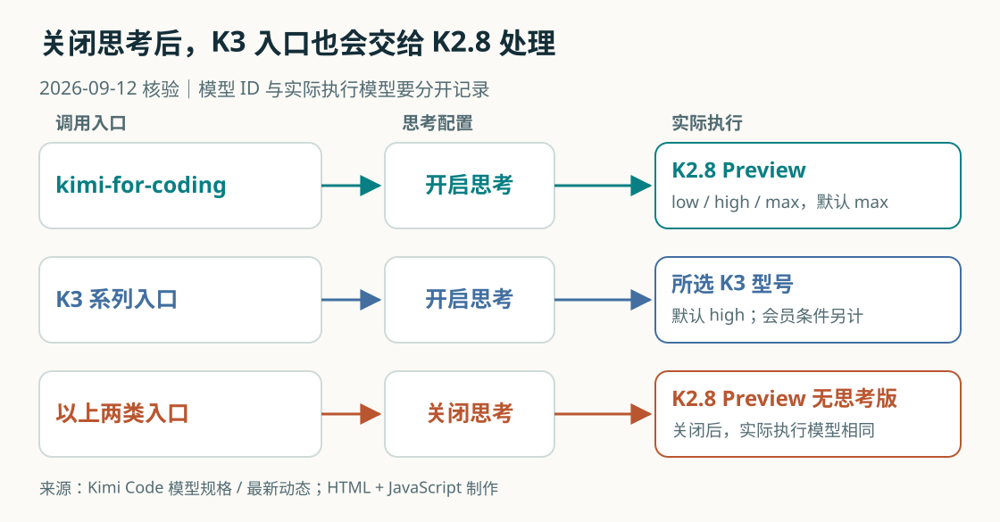
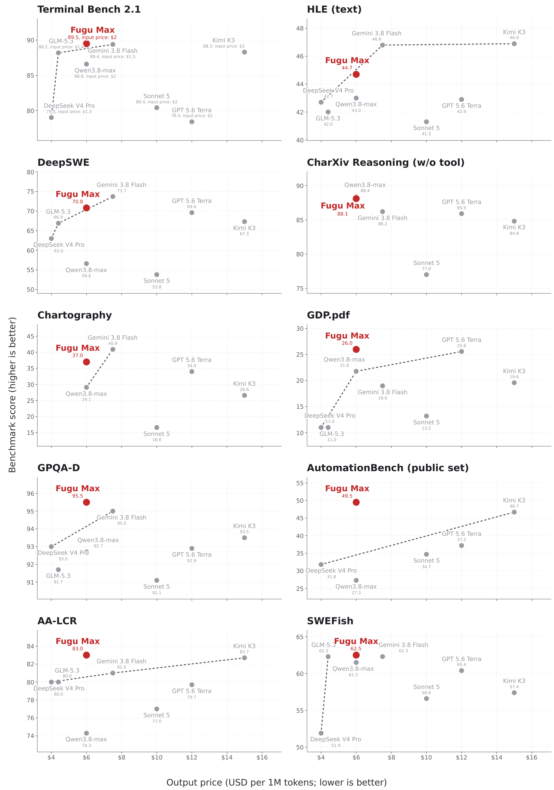
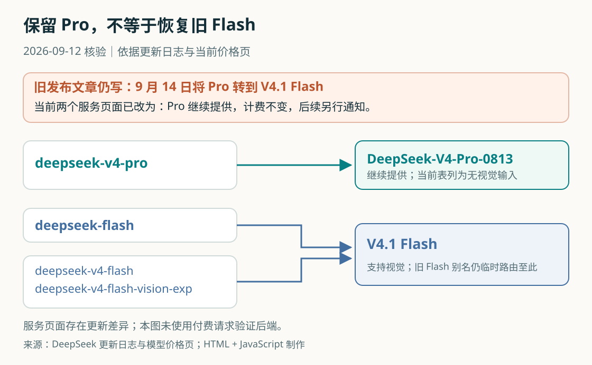
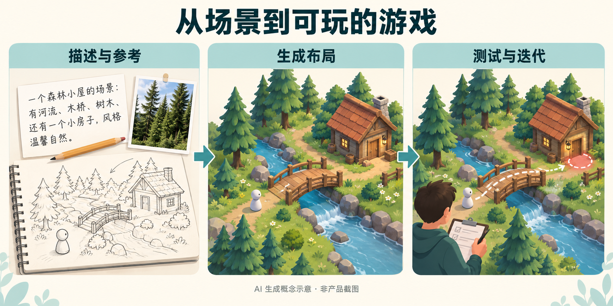
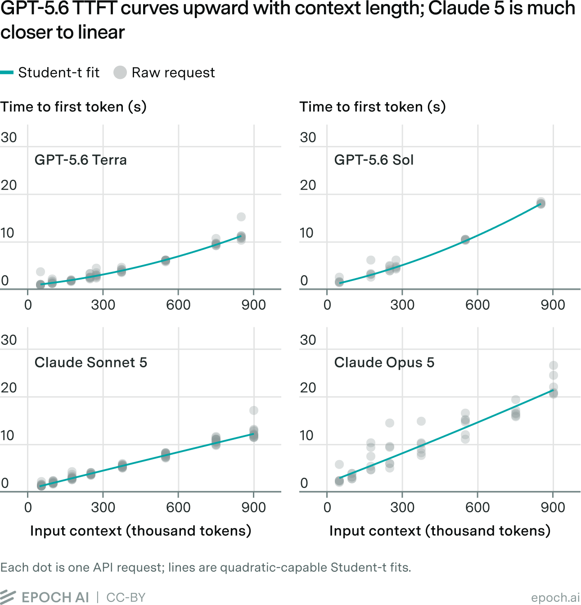

# AI 动态｜5 条重点详解 + 10 条速读

本期覆盖 2026-09-08—09-12 的事件与服务状态；每条保留来源日期。首轮厂商入口检查在北京时间 17:20—17:21，随后补读公告、文档与原图，18:15 左右再查官方入口。晚间补生成，不能当作今天早晨已上线的版本。

## 01 · Kimi K2.8 Preview 全量上线，旧模型 ID 直接升级

日期：2026-09-11

Kimi Code 的最新动态与模型配置页确认，K2.8 Preview 已向全部会员开放，支持最高 1M 上下文。原有 `kimi-for-coding` 直接指向新模型，客户端和第三方工具无需更改这个 ID。这里的日期采用官方文档更新时间；页面没有给出精确首发时刻。对已有工作流来说，配置文件没变，并不意味着实际调用的模型没变。

新版本增加 `low`、`high`、`max` 三档思考程度，默认是 `max`；旗舰 K3 的默认档则是 `high`。它还接受图片和视频输入。官方把 K2.8 定位为接近 K3、思考效率更高的常规开发选择，但本次文档没有提供足以独立比较这句话的完整评测条件，因此不把它写成已证实的性能等价。

图｜HTML/JS 制作。按横向读每一行：配置中的 ID 经过思考开关，才决定实际执行模型。最后一行说明关闭思考时，两类入口都会交给 K2.8 Preview 无思考版。图依据官方路由表制作，未进行付费 API 调用。 [原始来源](https://www.kimi.com/code/docs/kimi-code/whats-new.html)。点击图片查看原尺寸。 [复现源码与数据](code/README.txt)。

另一个容易忽略的行为是关闭思考后的路由：K3 系列和 K2.8 Preview 的请求，都会由 K2.8 Preview 无思考版处理。模型 ID、思考开关、最终执行模型是三个相关但不同的字段。复现实验时只记下 `k3` 这个字符串，会漏掉决定结果的实际配置。[模型规格与路由说明](https://www.kimi.com/code/docs/kimi-code/models.html)。

例如，给现有项目补一个表单校验，可以从新会话中比较 high 与 max：输入相同需求，记录测试是否通过、修改范围、总耗时和额度消耗。这是建议的比较方法，本期没有调用付费接口。1M 是可接收上下文的上限，不能据此推断每次塞入整仓库都更准确或更省。

切换模型可能让已经建立的上下文缓存失效，第一次请求需要重新处理历史，官方因此建议新开会话。K3、K3-256k 与高速版另有会员条件，不能把 K2.8 的全会员 1M 权限套到这些入口上。升级后值得先核对模型配置、思考档位和账户权限，再与旧实验结果比较。

[官方来源](https://www.kimi.com/code/docs/kimi-code/whats-new.html)。

## 02 · Fugu Max 与 Ultra v2：由编排层选择不同模型完成任务

日期：2026-09-11

Sakana AI 发布 Fugu Max 和 Fugu Ultra v2，两者通过同一套模型编排架构提供服务。Max 侧重成本与能力的平衡，Ultra v2 更看重复杂任务的最终质量。用户调用一个兼容 OpenAI 格式的 API，内部可以把工作分给模型池中的不同成员；这次是 Fugu 系列的新增版本，整个产品并非今天首次出现。

理解它可以从一项资料分析任务开始：识别文件、提取字段、核对图表和组织结论，对模型能力的要求不同。如果每一步都用最昂贵的模型，费用未必换来同等价值；编排层尝试根据工作内容分配计算。这个例子解释的是产品思路，不是本站对 Fugu 实际调度轨迹的观测。

图｜来源原图。先看横轴：每百万输出 token 的价格，越往左越低；同一个面板内越往上成绩越高。不同面板的纵轴范围不同，不可比较点的视觉高度或把所有成绩求一个平均。红点是 Fugu Max；图为团队基准，输入单价、输出长度与总调用次数还会影响实际账单。 [原始来源](https://sakana.ai/fugu-max-release/)。点击图片查看原尺寸。

公告给出 Max 每百万输入 token 2 美元、输出 6 美元的定价，并展示多项成本与能力对照。官方图中不同点代表不同模型或配置，向更低成本、更高成绩方向移动才有优势。token 单价仍不等于完成一项任务的总费用，还要考虑输出长度、调用次数、工具和失败重试。[API 模型列表](https://console.sakana.ai/models)。

Ultra v2 的公告成绩包括 Chartography 48.3、DeepSWE 74.3，均应作为团队报告阅读。团队还明确，它的模型池不含 Fable 5、Fable 5.1 和 GPT-6 Astra；这个排除清单不能扩大解释为完全不调用任何闭源模型。SWEFish 是团队自己的基准，也不能与独立评测混用。

两个版本现已通过 API 提供，Max 与 Ultra 当前采用固定的模型池；平台其他配置的模型选择能力不能直接套到它们身上。最值得复现的是按任务记录质量、耗时与总费用，再检查结果是否稳定。服务组合多个模型，不等于编排系统本身已经开放权重。[接入说明](https://console.sakana.ai/get-started)。

[官方来源](https://sakana.ai/fugu-max-release/)。

## 03 · DeepSeek 改为保留 V4 Pro，服务页与旧公告出现差异

日期：2026-09-12 · 服务状态核验日，非新模型首发

今天回查 DeepSeek 官网发现，更新日志和价格页已经明确：回应用户需求，9 月 14 日后继续提供 DeepSeek V4 Pro API，计费方式保持不变，后续变化另行通知。本条日期是 2026-09-12 的核验日期；原条目仍列在 9 月 10 日发布记录下，官网没有单独标出这段更正的准确发布时间。

这与昨天读取的发布文章不同。该文章目前仍写着，9 月 14 日 04:00 UTC，也就是北京时间 12:00，`deepseek-v4-pro` 将转到 V4.1 Flash。两处页面尚未完全同步。本期依据相互一致的更新日志与当前价格页说明服务状态，同时保留旧公告链接，让读者能核对差异。[旧发布文章](https://api-docs.deepseek.com/news/news260910)。

图｜HTML/JS 制作。上方标出旧公告与当前服务页的差异；下方箭头按当前服务表绘制。绿色 Pro 继续独立提供，蓝色旧 Flash 别名仍转向 V4.1 Flash。保留前者没有恢复后者。 [原始来源](https://api-docs.deepseek.com/updates/)。点击图片查看原尺寸。 [复现源码与数据](code/README.txt)。

当前价格表把 `deepseek-v4-pro` 对应到 DeepSeek-V4-Pro-0813；`deepseek-flash` 对应 V4.1 Flash。旧的 `deepseek-v4-flash`、`deepseek-v4-flash-vision-exp` 仍然临时转向 V4.1 Flash，这部分没有恢复成旧模型。保留 Pro 与恢复旧 Flash 是两回事，不能从其中一项推断另一项。

如果你在做长任务或视觉评测，先保存模型 ID、思考模式和调用日期。当前服务表中，Flash 支持视觉，Pro 不支持；从 Pro 换到 Flash 既可能改变结果，也可能改变输入条件。无需因为昨天的切换计划就立即把尚在使用的 Pro 实验全量迁走，但上线前应再次检查官方服务表。

[9 月 11 日的日报](../2026-09-11/01-AI动态.md)记录了当时的官方迁移计划，本期补充这次后续变化。我们没有通过真实付费请求验证路由，也不承诺页面之外的可用性。对重复实验而言，保存官方配置快照和服务返回信息，会比长期依赖一个可变别名更有帮助。[当前模型与计费说明](https://api-docs.deepseek.com/quick_start/pricing)。

[官方来源](https://api-docs.deepseek.com/updates/)。

## 04 · Roblox 扩大 Build 测试，场景生成将连接手机与 Studio

日期：2026-09-11

Roblox 在 RDC 2026 更新了 AI 创作路线：手机应用里的 Build 公共 alpha 扩展到塞尔维亚、新加坡，并向大会创作者提供访问权限。这一阶段增加资产库、桌面访问和迭代控制；Build 与 Studio 的衔接仍在推进。它属于地区和功能范围扩展，7 月已经宣布的 Build 本身不算再次首发。

官方截至 9 月 1 日的数据称，新西兰 alpha 阶段通过 Build 发布了约 9,000 个游戏，创建过游戏的用户中，71% 之前没有用过 Roblox Studio。这个数字描述参与者构成，并不是生成游戏的质量得分，也没有告诉我们多少作品能持续吸引玩家。

图｜AI 生成概念示意。从左到右看：描述和参考图提供场景线索，生成布局只是中间一步，最后还要检查过桥路线、触发区域等交互。森林、桥梁与测试路线均为解释概念而生成，不是 Roblox 产品截图或其实际生成效果。 [原始来源](https://about.roblox.com/newsroom/2026/09/rdc-2026-the-world-needs-more-play)。点击图片查看原尺寸。 [生成提示词与采用记录](code/imagegen-prompts.json.txt)。

本次更值得关注的能力是 Scene Generator：计划在今年晚些时候，让创作者以文字和参考图生成场景布局，并在 Studio 中继续精调。场景要能进入游戏工作流，除了外观，还涉及对象、空间关系和后续交互。公告展示的是产品方向，不能写成所有用户今天已经可以使用的功能。

可以把森林游戏拆开理解：生成树林、河流和桥梁，只完成了场景准备；玩家能否过桥、门口是否触发事件、摄像机是否遮挡，还需要测试。对科研读者，这提供了一个观察世界生成模型的角度：评估应覆盖可操作的结构和任务完成情况，不能只比较截图是否好看。

Build 适合移动端的快速迭代，Studio 承接更深入的开发。官方此前已说明两者共享后端、模型和聊天历史；此次继续推进跨端管理，并新增更细的控制。功能随年龄、地区变化，Scene Generator 的预定时间也应与现有 alpha 分开记录。[最初的 Build 说明与开放边界](https://about.roblox.com/newsroom/2026/07/build-without-limits-on-roblox)。

[官方来源](https://about.roblox.com/newsroom/2026/09/rdc-2026-the-world-needs-more-play)。

## 05 · ElevenMusic 默认切换到 Music v2.5，下载与使用条件同步更新

日期：2026-09-11

ElevenLabs 发布 Music v2.5，并将它设为 ElevenMusic 中提示词生成和参考生成的默认模型；旧版 v2 继续保留。新模型也进入 ElevenCreative 与 API。官方强调更自然的乐器、更丰富的层次，以及整首歌曲结构的一致性。这些是团队对版本变化的描述，本期没有生成音频作独立试听。

团队以相同提示词、两个版本各取一次结果做了 47,885 组盲测，称多数比较更偏好 v2.5，差距在以人声、原声乐器为主的类型中更明显。公告没有给出总体胜率、完整提示集和评审分布，所以只能写成多数偏好，不能自行画成某个百分比的胜率图。

在工作流中，音乐可以成为 Flows 的一个节点，也可以给 Studio 视频配乐，并单独重新生成这条音轨。一个实用场景是先固定视频时长和情绪，再比较配乐的开头、转折与结尾是否合拍。这是编辑建议，不代表模型能自动保证镜头与节拍逐点对齐。[Music 功能与接口文档](https://elevenlabs.io/docs/overview/capabilities/music)。

下载条件也发生了值得留意的变化：公告称 ElevenMusic 免费档每天提供 5 次无损下载，商业使用需署名 ElevenMusic；Pro 每月 400 次。基于其他艺人歌曲创建的曲目不能下载。这里说的是 ElevenMusic 公告列出的产品条款，不能顺势套到所有语音产品、API 服务或第三方素材上。

官方还说明，歌曲创建时适用的权限会保留，之后降档或取消订阅不改变已创建曲目的使用条件；与 UMG 的多年协议是另外一件事。读者真正要核对的是具体输入材料、创建平台和当时的条款。更好的音乐模型、无损文件和素材使用权限，分别解决质量、格式与使用范围三个问题。

[官方来源](https://elevenlabs.io/blog/music-v2-5-model)。

## 06 · 工信部发布“人工智能＋软件”行动方案，覆盖开发与智能体应用

日期：2026-09-11

工信部发布《“人工智能＋软件”专项行动实施方案》及解读，部署智能编程、传统软件智能化、智能体软件与开源生态。官方解读提出，将需求分析、代码生成、测试验证纳入研发流程，并推动生成代码安全审查；同时强调稳岗、扩岗和转岗。对开发团队，值得观察的是工具采购如何与实际研发检查连接，而不是只看是否部署了一个聊天入口。具体支持措施仍需结合后续地方实施安排，不能把政策方向当作已经到位的补贴。

[官方来源](https://wap.miit.gov.cn/jgsj/xxjsfzs/gzdt/art/2026/art_45df9463e105446c996568f299e07bca.html)。

## 07 · OpenAI 详解 Habitat：把存储客户端改成可统一升级的服务

日期：2026-09-11

OpenAI 公布 Habitat 存储平台的演进，称其支撑每周超过 10 亿用户，处理每秒超过 7,000 万请求。这些是存储操作量，不是模型推理请求量。文章重点解释为何把分散在各产品里的 Python 库收拢成服务：跨团队版本不一致会让路由修复与回滚相互干扰。它还讨论 asyncio 调度等待如何放大尾延迟；今天技术实践用一个可运行的小例子观察这个现象，不冒充对 Habitat 的性能复现。

[官方来源](https://openai.com/index/scaling-storage-one-billion-users-part-one/)。

## 08 · Runway 推出 Adobe 插件，在剪辑软件内生成与回填素材

日期：2026-09-08 · 近期补充

近期补充。Runway 的 Premiere Pro、After Effects 插件可在软件面板中调用图像与视频模型，用 Aleph 2 改造时间线上的片段，并将结果放回合成或序列。插件支持 macOS、Windows，下载免费，但生成使用已有付费计划和积分。新增价值在于减少素材导出、上传、下载和重新定位的步骤，不能把“插件免费”理解成生成免费。此前的模型授权计划已在 8 月公开，本期没有把 9 月推广当成新模型开放。

[官方来源](https://runway.com/changelog)。

## 09 · Kimi Work 3.2.7 加入长截图 OCR 与网站部署插件

日期：2026-09-11

Kimi Work 3.2.7 增加滚动长截图、截图内 OCR 和置顶小窗，支持把文件或文件夹直接拖入窗口，并加入网站部署插件。它把“从页面取材料—交给助手—保留参照”串得更完整；新会话也会携带会话设定。网站部署仍需安装相应插件，不能只从这条更新推断所有本地项目都已获得免费托管。官方同时列出提醒、表格与远程消息的调整。本条是桌面产品更新，与 Kimi Code 的 K2.8 模型升级分开计数。

[官方来源](https://www.kimi.com/help/kimi-work/release-notes)。

## 10 · d-Matrix 采用 NVLink Fusion，计划把专用推理芯片接入统一机架

日期：2026-09-10 · 近期补充

近期补充。d-Matrix 宣布采用 NVIDIA NVLink Fusion，将自研 XPU 接入高带宽互连域，并利用 MGX 机架、供电、散热与供应链体系。公告还列出计划集成的 Vera CPU、ConnectX-9、BlueField-4 与 Spectrum-X，并讨论和 GPU 系统共同承担分离式推理。这里的新增是集成路线和平台选择，多项内容仍是计划；文章没有给出足以推算用户任务成本的独立实测，不能直接承诺某个倍数的降本。

[官方来源](https://blogs.nvidia.com/blog/d-matrix-nvlink-fusion/)。

## 11 · Skild 披露机器人部署链路，视频提示之外还需要仿真与硬件验证

日期：2026-09-10 · 近期补充

近期补充。NVIDIA 与 Skild 介绍了从合成数据、训练、仿真到真实机器人部署的合作，以及双臂机械臂装配 Blackwell 系统的演示。S1 模型在此前一周已经推出，本条关注本次公开的部署材料。官方称它能从单段视频学习新任务而不做任务专用后训练；文中的约 66% 是测试中的逐步骤成功率，不能当成十分钟任务端到端完成率。展示中的恢复能力仍需在具体硬件和工作空间内验证。

[官方来源](https://blogs.nvidia.com/blog/skild-ai-s1-physical-ai/)。

## 12 · Copilot 代码审查增加执行检查，并自动关闭已解决意见

日期：2026-09-11

Copilot 代码审查在重新审查提交时，可以自动解决已经被修改处理的评论，并为应用修复建议生成提交信息。审查后台增加 shell 工具，可运行构建、测试及定向脚本；Lite 档使用多个 Agent 汇总意见。官方实验报告更多高严重度问题被处理，但这是其样本中的结果，不是你仓库的保证。使用时应同时看评论是否有证据、检查是否成功，以及修改后真实测试是否通过。

[官方来源](https://github.blog/changelog/2026-09-11-auto-resolution-and-analysis-updates-in-copilot-code-review)。

## 13 · GitHub AI Scan 开放管理 API，组织级开关仍优先

日期：2026-09-10 · 近期补充

近期补充。GitHub AI Scan 的拉取请求扫描设置可通过组织和仓库级 REST API 读取、更新，便于团队分批开放 AI 安全检测。组织关闭时，仓库开关不能覆盖组织设置。此次公共预览面向 github.com 的 GitHub Advanced Security 客户，不支持 GitHub Enterprise Server。它改变的是批量配置方式，不能理解为所有免费仓库都自动获得新扫描能力，也不能以“开关已开启”替代检查扫描是否实际运行。

[官方来源](https://github.blog/changelog/2026-09-10-ai-scan-for-pull-request-apis-in-public-preview)。

## 14 · Replit 与 Databricks 集成正式可用，增加 Lakebase 数据库支持

日期：2026-09-10 · 近期补充

近期补充。Replit 宣布与 Databricks 的集成结束公共预览，并加入原生 Lakebase 支持。应用既能访问受治理的仓库数据，也能保存通过应用新增和修改的数据；部署时由 Agent 配置 Lakebase 数据库。公告还介绍将预览环境与生产数据隔开的预览部署。对企业应用，查询既有指标与写入业务状态是两条不同路径，需分别核对权限和数据生命周期。本期依据官方说明整理，未部署企业账户或连接实际数据。

[官方来源](https://replit.com/blog/databricks2026)。

## 15 · Epoch AI 测量长上下文延迟，提醒把首 token 等待单独记录

日期：2026-09-08 · 近期补充

近期补充。Epoch AI 在关闭推理模式的设置中比较四款模型的长上下文延迟，报告 GPT-5.6 Terra、Sol 的首 token 时间随上下文长度呈近二次增长，而 Claude Sonnet 5、Opus 5 在其测量区间更接近线性。这是特定接口、请求与测量条件下的行为证据，不能据此确定闭源模型内部架构。选择长文档方案时，应把首 token 等待、输出速度、缓存命中和总任务时间分开；上下文上限更大，并不自动意味着交互体验更好。

图｜来源原图。灰点是实测请求，线是拟合，横轴以千 token 计，纵轴是首 token 等待秒数。观察曲线形状时也要看灰点波动，尤其是右下 Opus。测试关闭推理模式，结论限于文中的服务与请求条件；曲线不直接揭示闭源模型结构。 [原始来源](https://epoch.ai/publications/long-context-latency-scaling-gpt-vs-claude)。点击图片查看原尺寸。

[官方来源](https://epoch.ai/publications/long-context-latency-scaling-gpt-vs-claude)。

[返回今日导读](00-今日导读.md)
