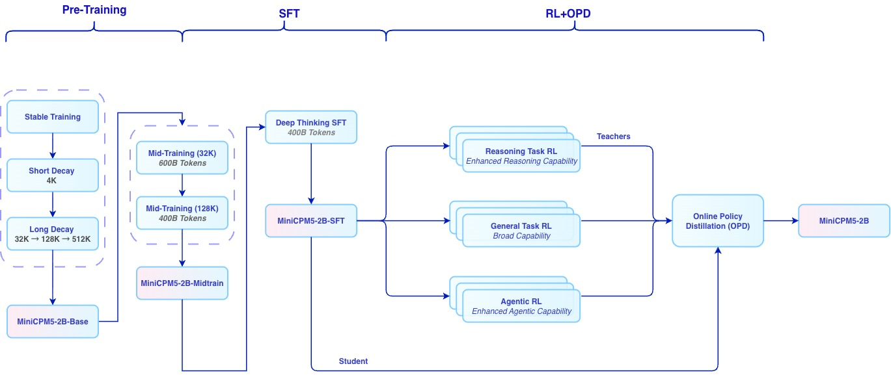
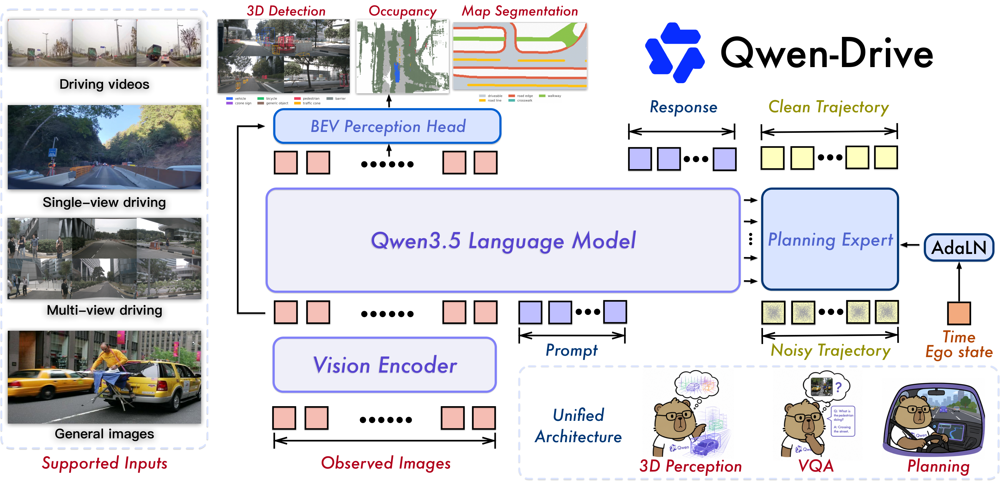
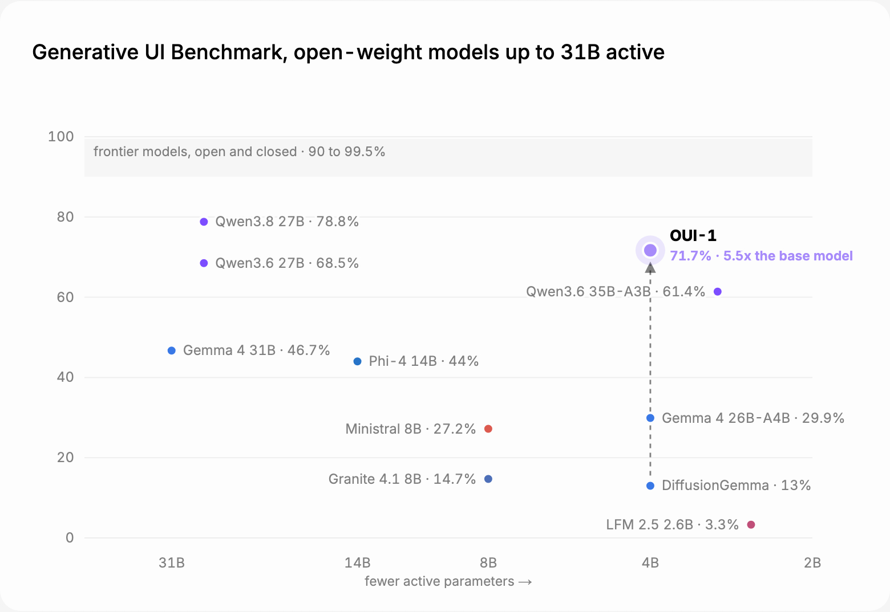

# 开源模型｜六项开放权重，分别核对许可与运行条件

本栏同时收录宽松许可模型与附条件开放权重，逐条标明差别。已检查官方模型卡和权重清单，未下载或运行大模型。仓库创建日期只代表可核实的建库时间；超过七天的条目作为近三十天首次收录补充。

## 01 · MiniCPM5-2B：把分阶段训练与专长蒸馏放进小模型

MiniCPM5-2B 是面向本地文本推理的小模型。官方同时列出 Base、Midtrain、SFT 与最终模型，以及 GGUF、MLX 等部署变体；它们属于同一系列，本期合并介绍。Hugging Face 主仓库创建于 2026-09-06，9 月 12 日仍有更新；这是可核实的仓库时间，不能精确等同于公开上线时刻。

这次值得学习的是训练路径。模型先做基础预训练，再逐步增加上下文；SFT 提供完整的思考示例，随后由不同任务的强化学习教师提供指导。在线策略蒸馏让学生在自己生成的回答上接受反馈，意图是把不同教师的专长转进一个较小模型，而不是要求用户部署整组教师。[官方训练与部署说明](https://github.com/OpenBMB/MiniCPM)。

图｜来源原图。沿左到右读：模型先学习一般文本，再经过长上下文和思考示例训练。右侧三组教师分别强化推理、通用任务与 Agent 能力，最后汇入在线策略蒸馏。底部 Student 箭头说明，被训练的学生来自 SFT 检查点；不是把三个教师的完整权重拼起来。图中的 token 数是对应训练阶段标记，不是本地推理内存。 [原始来源](https://huggingface.co/openbmb/MiniCPM5-2B)。点击图片查看原尺寸。

模型卡提供 Transformers 等推理入口，学习时可先使用最终模型跑一组中文问答、代码解释和长文提取，再按相同输入比较 SFT 检查点。官方收益图是团队评测；本期没有下载权重，因此不提供本站速度或准确率。2B 只描述参数规模，长上下文的 KV 缓存、量化格式和推理后端仍会影响内存。

主权重采用 Apache-2.0，文件清单确认可下载的 safetensors。模型卡链接的技术报告编号为 2506.07900，不能当成 2026 年 9 月新论文。不同量化版的支持范围应回到各自模型卡核对，不把某个后端的运行条件套到所有版本。

许可：Apache-2.0。[官方模型卡与权重](https://huggingface.co/openbmb/MiniCPM5-2B)。

## 02 · Edge0 35B-A3B Preview：用 SSD 换取较低的活跃内存

Edge0 的预览权重建立在 Qwen3.5-MoE 35B-A3B 上，仓库创建于 2026-09-08。它将四比特基础权重、Recover-LoRA 与 prerouter 适配器一起提供，采用 Apache-2.0。这里的 35B 是总参数量，A3B 是每步激活规模；整套模型文件并没有缩成宣传中的约 3 GiB。

降低内存靠三个配合：专家权重留在 SSD，需要时才读进内存；prerouter 提前预测下一步要用的专家，让读盘与当前计算重叠；Recover-LoRA 用全精度教师指导四比特模型，补偿量化损失。可把它理解为书放在仓库，桌面只摆当前要读的几本；提前取书能减少等待，但仓库容量和取书速度仍然重要。

团队在 Mac mini M4 Pro、24 GB 内存、短上下文条件下报告 2.9 GiB 活跃内存与 14.9–17.7 token/s。长上下文还会增加 KV 缓存，所以“手机级内存”不能直接改写成已在所有手机上跑通。当前后端针对 Apple Silicon 的 MLX，其他平台仍在路线图中。

上手需安装 [edge0 推理框架](https://github.com/Edge0-AI/edge0)，下载同一模型目录中的基础权重与两个适配器，再从短输入开始。模型卡明确预览版的工具使用、多步规划和长期自主任务较弱。适合研究存储换内存的取舍；本期未下载权重，未验证本机速度。

许可：Apache-2.0。[官方模型卡与权重](https://huggingface.co/Edge0/Edge0-35B-A3B-preview)。

## 03 · Qwen-Drive-1.0：共享视觉语言表示，分开回答、感知与规划

Qwen-Drive-1.0 将 Qwen3.5-4B 视觉语言模型与两个外部模块连接：BEV 感知头负责三维检测、空间占用和俯视地图分割，Planning Expert 负责未来自车轨迹。原有语言解码器保留，用于一般图像问答和驾驶问答。HF 仓库创建于 2026-08-27，本期作为近 30 天首次收录的研究模型补充，不包装成今日发布。

它要解决的是表示能否同时服务不同任务：一张道路图像既要能用语言描述，也要提供可定位的三维对象，还要支持规划。只会回答“前面有车”与输出几秒后的轨迹之间有很大距离。官方代码将这些输出放在同一框架中，便于分别检查哪一环出错。[代码、示例数据与架构说明](https://github.com/QwenLM/Qwen-Drive-1.0)。

图｜来源原图。先找共享的视觉语言模型，再看输出分支：语言解码器回答问题，BEV 感知头输出俯视空间结构，Planning Expert 生成未来轨迹。三者共用表示，却不是同一种输出。左侧列出单视角、多视角等输入；右侧规划专家将带噪轨迹变成预测轨迹，仍需在具体任务中验证。 [原始来源](https://github.com/QwenLM/Qwen-Drive-1.0)。点击图片查看原尺寸。

权重清单分开提供约 9.1 GB 的 VLM、约 0.5 GB 的感知头，以及各约 2.1 GB 的 SFT / RL 规划组件。文件体积不是运行显存。开始复现时，应按官方示例选择具体任务和检查点，确认相机、时序、轨迹格式，而不是把所有文件一次加载后期待自动驾驶。

权重与代码标注 Apache-2.0，模型卡给出感知和规划基准，属于团队报告。不同指标的方向、数据集和训练配置不同，不能将雷达式总览图读成一个统一的驾驶安全分数。本期未运行模型，研究结果也不构成真实道路可用性的承诺。

许可：Apache-2.0。[官方模型卡与权重](https://huggingface.co/Qwen/Qwen-Drive-1.0-4B)。

## 04 · OUI-1：生成可渲染的界面程序，而非界面截图

OUI-1 基于 DiffusionGemma，目标是把界面需求变成 openui-lang 程序，再交给对应渲染器显示。它不是直接生成 HTML，也不是把图像生成模型变成网页设计器。仓库创建于 2026-09-07，总参数约 26B、每步激活约 4B，提供开放权重并标注 Apache-2.0。

官方评测使用 46 个界面需求，每个需求取 4 个样本，共 184 个输出；OUI-1 有 132 个通过有效性检查，约 71.7%，基础 DiffusionGemma 为 24 个、约 13%。这说明模型更能遵守这套界面语言和组件要求，不能据此声称 71.7% 的用户满意，或在所有前端开发任务上领先。

图｜来源原图。先看 OUI-1 与底部 DiffusionGemma 的同任务对照：71.7% 与 13% 指满足检查条件的输出比例。横轴是激活参数，不是模型总存储规模；上方灰带是其他前沿模型的结果范围。图上更高不等于设计更好看，视觉审美和用户可用性并不由这项自动检查直接衡量。 [原始来源](https://huggingface.co/thesysdev/OUI-1)。点击图片查看原尺寸。

推理路径与常规逐 token 聊天模型不同：文档示例使用固定画布与多轮去噪。vLLM 路线要求较新版本，示例为 48 个去噪步骤、256 位置画布；FP8 权重约 25.8 GiB。模型卡在 A100 80 GB 上说明了权重格式与实际执行内核的差异，不能从 FP8 三个字推断所有显卡都有原生加速。

适合先固定组件库和一组页面需求，分别记录语法通过、成功渲染、需求覆盖与人工评价。Transformers 的 BF16 路径体积更大，部署前应按模型卡选择后端。本站未安装渲染器或运行权重，图中成绩来自团队提供的专门基准。

许可：Apache-2.0。[官方模型卡与权重](https://huggingface.co/thesysdev/OUI-1)。

## 05 · K2-Horizon-MoVA：区分总权重、激活规模与可复现训练材料

IFM 的 K2-Horizon-MoVA-36B-A4B 是稀疏语言模型，结合混合专家与 Mixture-of-Values 注意力，约 36B 总参数、每 token 激活约 4B，原生上下文标为 512K。它与月之暗面的 Kimi K2 系列不是同一个项目。仓库创建于 2026-09-01，9 月 12 日有更新，本期作为近期模型首次收录。

模型卡明确已经公开最终检查点；中间检查点、训练数据和训练代码则仍计划后续公开。因此当前可以研究推理行为，但不能写成已经能完整复现训练。文件清单确认 48 个 safetensors 权重分片，许可为 Apache-2.0；A4B 也不意味着只需加载或存储 4B 参数。

官方为 vLLM 和 SGLang 提供张量并行度为 2 的示例，并说明验证环境使用两张 H200；直接照抄命令不等于普通单卡满足条件。其他后端还列出 Transformers、PyTorch 等版本要求。研究时应先缩短上下文并确认框架支持 MoVA，再检查长输入的显存增长。

团队报告包括 GPQA、Terminal-Bench 和 HLE 等成绩，部分基准允许工具、部分不允许，来源和设置也不完全相同。本文不重绘一张混合排行榜。更适合复现的问题是，在相同推理预算和工具环境下，这个最终检查点能否稳定完成自己的长文或代码任务。本站未运行权重。

许可：Apache-2.0。[官方模型卡与权重](https://huggingface.co/IFM/K2-Horizon-MoVA-36B-A4B)。

## 06 · Viggle-Animate：用一张重绘帧替换视频角色

Viggle-Animate 以 MiniMax H3 为基础做角色替换：输入一段动作视频，再从其中挑一帧重绘角色外观，模型尝试保留动作、替换角色。参考帧不必是第一帧，但应尽量保留原来的姿势、道具、镜头与背景。仓库创建于 2026-08-31，9 月 9 日更新，本期为近期补充。

公开内容包括约 33.1B 的微调模型、蒸馏适配器和推理代码，还依赖基础模型中的 VAE、调度器等组件。默认四个噪声边界对应三次前向计算；更多步骤并不必然更好。模型卡说明该配置已受蒸馏训练，额外增加步数可能导致过度锐化。

图｜来源原图。动作来自原视频，角色外观来自从视频中选取并重绘的一帧；两种条件在生成阶段会合。重绘时若同时改变姿势、构图或背景，会与原视频的运动条件冲突。图是团队的流程原图，不是本站生成的视频效果。 [原始来源](https://huggingface.co/Viggle/Viggle-Animate)。点击图片查看原尺寸。

部署条件要读得很细：BF16 权重常驻约 62 GiB，在 480×832、124 帧设置下，峰值分配达 80.1 GiB，团队明确一张 80 GB 卡不够，建议至少 96 GB 或使用较慢的 CPU offload。文中另述 RTX 5090 32 GB 量化部署，但那条部署路径没有随本仓库开放，不能当作现成安装选项。

权重使用 [MiniMax H3 Community License](https://huggingface.co/Viggle/Viggle-Animate/blob/main/LICENSE)，有地区排除与额外商业条件；例如欧盟、英国、韩国、美国不在通常授权地域内，商业产品年收入超过 2,000 万美元还需另行书面授权。推理代码的 Apache-2.0 不能覆盖权重限制。它应称为附条件开放权重，而不是宽松许可模型。使用时还需获得表演者同意，本站未运行视频生成。

许可：MiniMax H3 Community License（权重）；Apache-2.0（推理代码）。[官方模型卡与权重](https://huggingface.co/Viggle/Viggle-Animate)。

[返回今日导读](00-今日导读.md)
