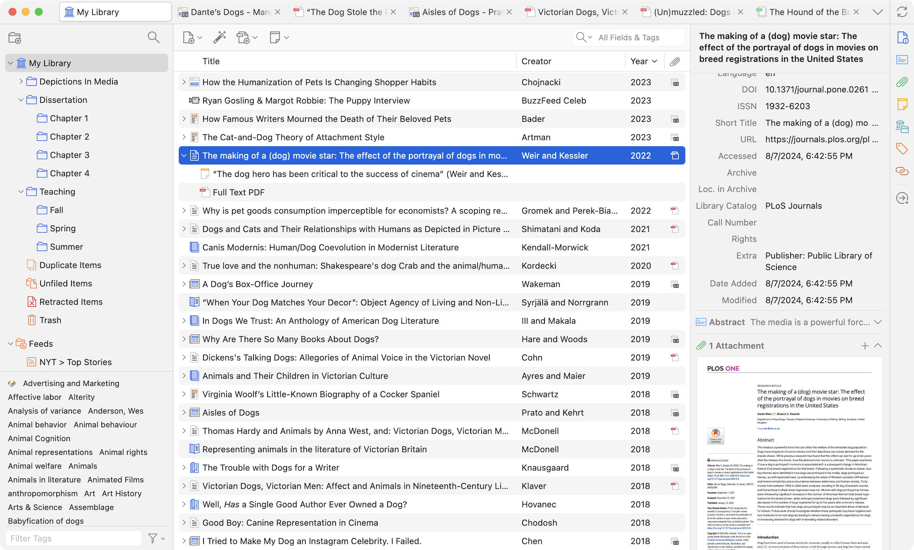
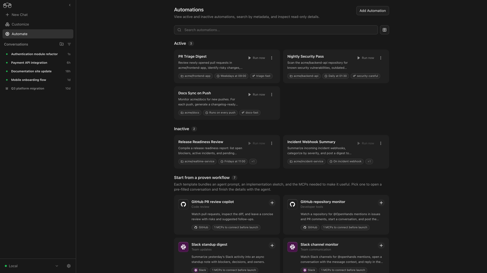
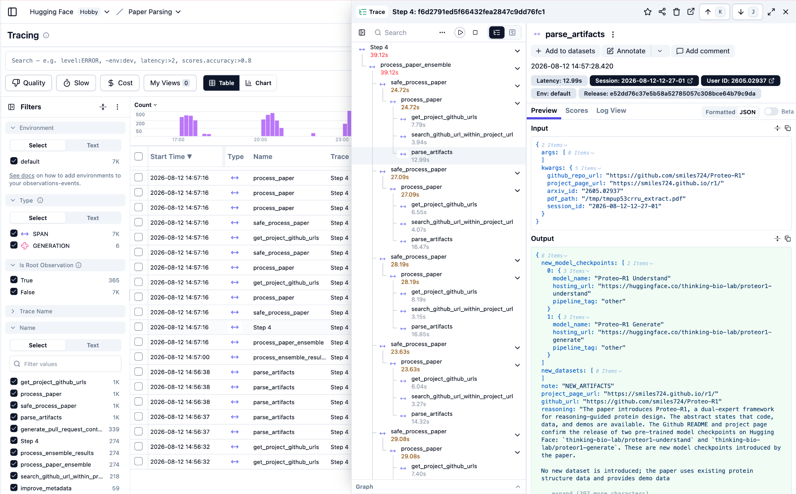

# 开源项目｜从资料管理到实验恢复的十个工具

本栏从应用任务出发，包含近期更新与成熟工具推荐；并非十个项目都在今天首发或登榜。已核对源码、许可、文档与版本状态，本期未安装这些应用、未连接账户。

| 任务 | 工具 | 先检查什么 |
| --- | --- | --- |
| 收集文献与管理引用 | Zotero | 成熟工具推荐；不将当前仓库活动称为新版本发布 |
| 检索笔记与个人资料 | Khoj | 成熟工具推荐；最新列出的版本名仍含 beta |
| 管理编码任务与触发规则 | OpenHands Agent Canvas | v1.18.0 于 2026-09-11 UTC 发布；Agent Canvas 产品仍标 beta |
| 搭建小型工具调用实验 | smolagents | 成熟框架推荐；已核对 v1.26.0 发布记录 |
| 为助手暴露受控工具 | FastMCP | 规范仓库为 PrefectHQ/fastmcp；v4.0.3 发布于 2026-09-05 UTC |
| 定位模型调用的延迟与质量问题 | Langfuse | 已核对 v4.35.0，2026-09-11 UTC 发布 |
| 整理人工标签与模型输出评价 | Label Studio | 成熟工具推荐；1.23.0 为已核对稳定版，nightly 属预发布 |
| 汇总 CSV 与 Parquet 评测结果 | DuckDB | 成熟工具推荐；稳定版 v1.5.5，主分支为后续开发线 |
| 编排数据准备与批量评测 | Prefect | 成熟框架推荐；最新两条 release 为 dev 预发布，不称稳定升级 |
| 检查回归、回答依据与工具行为 | Giskard v3 | v3.0.0 于 2026-08-26 UTC 发布；规范仓库 Giskard-AI/giskard-oss |

## 01 · Zotero：把论文文件、元数据与批注放在一起

成熟工具推荐；不将当前仓库活动称为新版本发布。

Zotero 适合解决下载了几十篇论文却找不到出处的问题。桌面端管理文献条目、PDF、笔记和引用，浏览器 Connector 帮助从来源页收集信息。它本身不是大模型问答工具，但能给后续阅读或知识库建立可追溯的资料底座。

最小上手路径是安装桌面端与 Connector，收集一篇论文，核对标题、作者、DOI，再附上 PDF 和自己的阅读笔记。用集合组织课题，用标签标记待读、已读或方法；集合中的同一条目无需复制成多份文件。

图｜来源原图。官方主页的 Zotero 7 界面示例。左侧按集合与标签组织资料，中间的文献条目展开后可见笔记和 PDF 附件，右侧显示作者、DOI 等元数据与文件预览。关键是让文件附属于同一来源条目，避免读完后丢掉引用信息；截图不是今天新增功能。 [原始来源](https://www.zotero.org/)。点击图片查看原尺寸。

本期按成熟工具推荐，没有宣称今日发布新版。源码采用 AGPLv3；官方同步存储、插件及收集到的论文有各自条件。公开论文链接也不自动授予再分发权。此次读取快速入门和许可证，未改动用户文献库。

[源码](https://github.com/zotero/zotero) · [官方文档](https://www.zotero.org/support/quick_start_guide) · [AGPL-3.0](https://github.com/zotero/zotero/blob/main/COPYING)。

## 02 · Khoj：围绕自己的资料构建可自托管助手

成熟工具推荐；最新列出的版本名仍含 beta。

Khoj 把个人资料检索、聊天与研究型任务放进一个可自托管应用。一个具体用法是导入课程笔记和论文摘录，先找出相关段落，再让模型围绕这些材料回答。回答质量取决于资料抽取、检索和所选模型，不能把接入文件等同于回答一定有依据。

官方自托管文档提供容器路径，并说明如何配置对话模型；可以选择本地模型或外部 API。开始时只导入一个小文件夹，提问几条答案已知的问题，核对引用是否真能支持回答，再扩大资料范围。服务、数据库与模型后端需要分别配置。

源码为 AGPL-3.0，托管产品另有套餐。本期推荐的是可复用的个人知识助手方案，不把版本名里的 beta 包装成刚发布的稳定版。文档中的模型配置截图属于管理步骤，与核心检索原理关系不大，因此本条保留文字。

[源码](https://github.com/khoj-ai/khoj) · [官方文档](https://docs.khoj.dev/get-started/setup/) · [AGPL-3.0](https://github.com/khoj-ai/khoj/blob/master/LICENSE)。

## 03 · OpenHands Agent Canvas：集中管理编码 Agent 与自动化

v1.18.0 于 2026-09-11 UTC 发布；Agent Canvas 产品仍标 beta。

当前 OpenHands 仓库首页已经围绕 Agent Canvas 组织：一个自托管控制台连接本地、远程或云端的 Agent Server，管理对话与自动化，也能使用支持 ACP 的其他编码 Agent。9 月 11 日 UTC 发布 v1.18.0，但首页仍标 beta，两种状态需要一起读。

例如，可以将仓库检查配置成定时任务，把代码评审配置成事件触发，并在同一控制台查看执行情况。官方提供 Node.js 22.12 以上、uv 的本地启动路径和 Docker 方案。先用独立的小项目验证任务输入、工作目录和结果，再连接实际仓库。

图｜来源原图。先看每张卡片的触发条件，再看 Active 与 Inactive 分组：有些按时间运行，有些由推送或 webhook 触发。模板下面标出的连接条件说明，添加自动化之前仍需配置对应服务。截图是项目演示，未在本站连接第三方账户。 [原始来源](https://docs.openhands.dev/openhands/usage/agent-canvas/backends)。点击图片查看原尺寸。

MIT 覆盖开源代码，模型接口与外部 Agent 的服务条件另算。直接本机启动的后端拥有宿主机文件访问能力，选择容器方案也需留意挂载目录。图中可用的模板并不意味着凭据和连接已经替用户配置完成。

[源码](https://github.com/OpenHands/OpenHands) · [官方文档](https://docs.openhands.dev/openhands/usage/agent-canvas/backends) · [MIT](https://github.com/OpenHands/OpenHands/blob/main/LICENSE)。

## 04 · smolagents：用少量 Python 看清 Agent 的工具循环

成熟框架推荐；已核对 v1.26.0 发布记录。

smolagents 适合已经会 Python、想理解 Agent 如何调用工具的读者。它提供 CodeAgent 等接口，让模型写出执行步骤，并通过工具取得信息。与只返回一段回答相比，重点在于保留计划、工具输入、结果和后续选择，便于定位失败发生在哪一步。

官方示例从安装 smolagents、选择模型后端、提供少量工具开始。可以先做一个只访问自己准备的几条文档的问答实验，限制工具范围，检查每次执行记录。框架支持不同模型连接方式；云推理凭据、额度和本地模型资源都不会随 Python 包自动提供。

代码为 Apache-2.0，本期是成熟方法推荐，未把 5 月发布的版本写成新消息。执行模型生成的代码需要合适的隔离方式。README 的排行榜不能解释这个小实验的执行边界，因此此处用文字与官方最小示例链接，不追加装饰图。

[源码](https://github.com/huggingface/smolagents) · [官方文档](https://huggingface.co/docs/smolagents/index) · [Apache-2.0](https://github.com/huggingface/smolagents/blob/main/LICENSE)。

## 05 · FastMCP：把 Python 函数包装成可调用的工具服务

规范仓库为 PrefectHQ/fastmcp；v4.0.3 发布于 2026-09-05 UTC。

FastMCP 面向这样的需求：你已经有一个查询论文目录的 Python 函数，希望多个支持 MCP 的助手都能调用它。框架帮助声明工具、资源和输入结构，并提供服务端与客户端能力。旧的 jlowin 仓库入口现已指向 PrefectHQ/fastmcp，本期按规范地址去重。

最小路径是在虚拟环境安装 fastmcp，创建服务对象，将一个只读函数注册为工具，再用配套客户端检查输入输出。先确认函数返回的是结构化记录，而非含糊的自然语言；接入远程服务时，再按官方文档设置传输和认证。

当前核对到 9 月 5 日的 v4.0.3，代码为 Apache-2.0。MCP 只规范工具交互，不会自动判断业务权限，也不保证每个客户端支持相同扩展。对简单的函数包装，直接看官方几行示例比一幅服务卡片图更有帮助。

[源码](https://github.com/PrefectHQ/fastmcp) · [官方文档](https://gofastmcp.com/getting-started/quickstart) · [Apache-2.0](https://github.com/PrefectHQ/fastmcp/blob/main/LICENSE)。

## 06 · Langfuse：把一次回答拆成可检查的调用轨迹

已核对 v4.35.0，2026-09-11 UTC 发布。

Langfuse 给 LLM 应用增加追踪、提示管理和评测记录。一条回答慢了，既可能是模型等待，也可能是多轮工具或后处理；嵌套轨迹能把这些时间分开。科研时还可以按模型版本、提示版本和样本关联结果，避免只留最终文字。

最小上手是按 SDK 文档记录一次模型调用与一个自定义步骤，再在界面查看输入、输出、耗时和错误。可以用托管服务，也能按官方部署文档自托管；两者都需要设置项目与访问凭据，自托管还要维护对应的数据服务。

图｜来源原图。从左侧挑一条请求，中间展开子步骤，右侧核对输入和输出。这样能区分检索慢、模型慢和解析慢，而不是只记录一个总耗时。图中的秒数和论文任务属于官方演示数据，不是本期实验结果。 [原始来源](https://langfuse.com/docs/observability/overview)。点击图片查看原尺寸。

仓库许可是 MIT 核心加单独许可的企业目录，并非所有目录都无条件采用 MIT。9 月 11 日发布的 v4.35.0 可核实，但本条聚焦已有可用能力，不将所有追踪功能都说成这个版本新增。本站没有上传用户请求或连接实际项目。

[源码](https://github.com/langfuse/langfuse) · [官方文档](https://langfuse.com/docs/observability/overview) · [MIT（核心）；企业目录另有许可](https://github.com/langfuse/langfuse/blob/main/LICENSE)。

## 07 · Label Studio：把人工评价变成可导出的标注任务

成熟工具推荐；1.23.0 为已核对稳定版，nightly 属预发布。

Label Studio 让文本、图像、音频或多模态数据进入统一标注界面。做模型比较时，可以把问题和候选回答整理成任务，请人工选择更符合要求的输出，再导出结果。它负责组织标注过程，评价标准和样本抽样仍要由研究者设计。

开始可在独立环境安装 label-studio，启动本地服务，创建一个小项目，选模板并导入十条已检查格式的数据。先自己完成几条，确认导出字段与分析脚本一致，再扩大任务。预标注与模型后端是可选连接，不能把预填答案当成人工确认。

核心采用 Apache-2.0，企业功能另有产品范围。仓库同时有 nightly 和稳定发布，本期不推荐把 nightly 当稳定生产版。已检查官方模板目录，但总览图只是长清单，不能解释标注规则；短场景和导出步骤更适合本条。

[源码](https://github.com/HumanSignal/label-studio) · [官方文档](https://labelstud.io/guide/) · [Apache-2.0](https://github.com/HumanSignal/label-studio/blob/develop/LICENSE)。

## 08 · DuckDB：直接查询本地评测文件，不必先搭数据库服务

成熟工具推荐；稳定版 v1.5.5，主分支为后续开发线。

DuckDB 是嵌入进程的分析数据库，适合把本地 CSV、Parquet 和 Python 数据放在一起查询。对模型评测，一个常见需求是按模型、数据集、错误类型分组，找出耗时异常或失败集中的样本；这不一定需要先部署独立数据库服务器。

最小路径是安装 duckdb 的 Python 包，先查询一个小结果文件，明确列类型，再写聚合 SQL。可以让每轮实验保留原始明细，查询时统一生成汇总表。注意文件扫描、连接和排序仍消耗内存与磁盘，不能把嵌入式理解成任何规模都无需规划资源。

代码为 MIT，当前核对稳定版为 1.5.5；仓库主分支指向后续开发线，推荐阅读 stable 文档。它不自带 LLM 评判能力，事实正确率仍来自你的标签或检查逻辑。本期只介绍用法，没有把它算作今天的新 AI 发布。

[源码](https://github.com/duckdb/duckdb) · [官方文档](https://duckdb.org/docs/stable/clients/python/overview) · [MIT](https://github.com/duckdb/duckdb/blob/v2.0-cyanoptera/LICENSE)。

## 09 · Prefect：让多步 Python 流程有状态、重试与恢复记录

成熟框架推荐；最新两条 release 为 dev 预发布，不称稳定升级。

Prefect 适合把下载数据、转换格式、运行评测和保存结果等步骤组织成可观察的 Python 流程。与只有一个定时入口相比，它还记录任务状态、依赖和失败，支持重试与事件触发。一个文件转换失败时，可以从具体步骤调查，不必只看整条脚本退出码。

官方快速入门要求 Python 3.10 以上，用 flow 和 task 装饰器包装函数，先在本地运行，再选择自托管服务或托管控制台。应先设计任务的输出与重跑行为：重复执行写文件、调用接口和入库的影响不同，设置重试之前要知道哪些动作可以重复。

代码采用 Apache-2.0。9 月 12 日看到的 3.8.6.dev5 属预发布，本文没有把它列为稳定版。定时执行还依赖实际运行进程与基础设施，装上 SDK 本身不会让关机的电脑继续运行任务。官网快速入门的装饰器示例比品牌图更适合本条。

[源码](https://github.com/PrefectHQ/prefect) · [官方文档](https://docs.prefect.io/v3/get-started/quickstart) · [Apache-2.0](https://github.com/PrefectHQ/prefect/blob/main/LICENSE)。

## 10 · Giskard v3：给黑盒 Agent 组织场景与检查项

v3.0.0 于 2026-08-26 UTC 发布；规范仓库 Giskard-AI/giskard-oss。

Giskard v3 将评测拆成轻量模块，面对的对象可以是一个同步或异步函数，也可以是多步 Agent。核心组织方式是 Target 接受输入，Scenario 定义交互，Check 检查结果，Suite 汇总多个场景。这样，模型和工具实现变了，回归场景仍能保留。

当前文档要求 Python 3.12 以上。可先用 giskard-checks 给自己的函数加一个确定性检查，再按需增加基于模型的 Groundedness 等判定；后者要安装相应提供方 SDK 并配置接口。默认安装与 scan 附加包范围不同，旧版 model.scan 教程不应直接套用。

开源代码采用 Apache-2.0，规范仓库已经是 Giskard-AI/giskard-oss。v3 于 8 月 26 日发布，本期为近期工具补充。模型判分会受提示和裁判模型影响，适合与人工样本及确定性规则共同检查；没有运行扫描就不能宣称系统通过安全测试。

[源码](https://github.com/Giskard-AI/giskard-oss) · [官方文档](https://docs.giskard.ai/oss/checks) · [Apache-2.0](https://github.com/Giskard-AI/giskard-oss/blob/main/LICENSE)。

[返回今日导读](00-今日导读.md)
