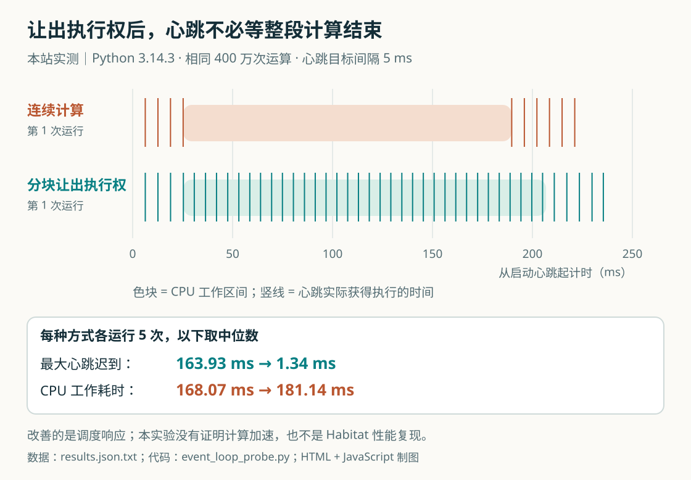

# 技术实践｜async 函数为什么仍会卡住其他任务

**已运行验证。** 本期在 macOS 26.5.1、Apple Silicon、Python 3.14.3 上执行，全部使用标准库，不需要模型、网络或额外进程。实验数据时间为 2026-09-12T09:42:49.644936+00:00。这里用小实验解释[今天 Habitat 新闻](01-AI动态.md)中的调度问题，不复现其存储架构或吞吐成绩。

## 要观察的现象

把函数声明为 `async def`，并不会自动让一段 CPU 计算交出执行权。同一个事件循环里，心跳、进度更新和其他请求仍可能等到这段计算结束。`await asyncio.sleep(0)` 会暂停当前任务，让事件循环有机会调度其他就绪任务。[Python 官方说明](https://docs.python.org/3/library/asyncio-task.html#sleeping)。

实验同时运行两件事：一个心跳任务尝试每隔 5 毫秒执行一次；另一个任务完成 400 万次相同的整数运算。连续版本在整个循环中不让出执行权；协作版本每处理 4,096 次运算就让出一次。两者计算内容与分块边界相同，只改变是否让出。

## 核心实现

```python
total = 0
for offset in range(0, iterations, chunk):
    for i in range(offset, min(offset + chunk, iterations)):
        total += (i * 17) % 101
    if cooperative:
        await asyncio.sleep(0)
```

测量心跳时，记录“本次计划唤醒时间”与“实际恢复执行时间”的差，不能把心跳间隔直接当成迟到值。完整脚本保留每次心跳时间点，先做短暂预热，工作结束后再采样一小段；每种模式各五次并交替顺序，减少固定先后顺序的影响。所有运行的计算校验值都是 **199999966**。

## 实际结果

| 指标：五次运行的中位数 | 连续计算 | 分块让出执行权 |
| --- | ---: | ---: |
| CPU 工作区间耗时 | 168.07 ms | 181.14 ms |
| 每轮最大心跳迟到 | 163.93 ms | 1.34 ms |


[](images/practice-event-loop.svg)

图｜HTML/JS 制作。上方时间轴保留各模式第一次运行的真实心跳时间点，背景色块是 CPU 工作区间；下方数字汇总五次运行的中位数。连续计算出现明显空档，分块版本的心跳可以穿插执行，但计算总耗时略增。 [原始来源](https://docs.python.org/3/library/asyncio-task.html#sleeping)。点击图片查看原尺寸。 [原始结果](code/results.json.txt) · [交互查看](code/figures.html) · [制图源码](code/render-figures.mjs)。

## 怎样复现与使用结果

下载[完整实验脚本](code/event_loop_probe.py)，在 Python 3.11 以上运行：

```bash
python3 event_loop_probe.py --output my-results.json.txt
```

预期观察到连续版本的心跳延迟集中在工作区间，而协作版本更及时；具体毫秒数随机器负载、解释器和分块大小变化。`--chunk` 太小会增加调度开销，太大则仍有长时间停顿。这里改善的是其他任务获得执行机会，并没有增加 CPU 并行度。

真实应用可以先检查耗时日志：若是可拆分的 Python 计算，合理设置协作点；若是较大的 CPU 任务，再考虑进程池或独立工作进程。`asyncio.to_thread` 通常适合阻塞 I/O，对受 GIL 限制的纯 Python CPU 计算，不能直接许诺多核加速。[线程运行边界](https://docs.python.org/3/library/asyncio-task.html#running-in-threads)。

这只是单机小样本调度演示，固定五次重复不等于完整性能基准。它没有测存储、网络、模型推理或生产流量。先记录最大迟到与业务响应，再决定是否值得付出额外调度或进程通信成本。

[复现材料说明](code/README.txt) · [返回今日导读](00-今日导读.md)
