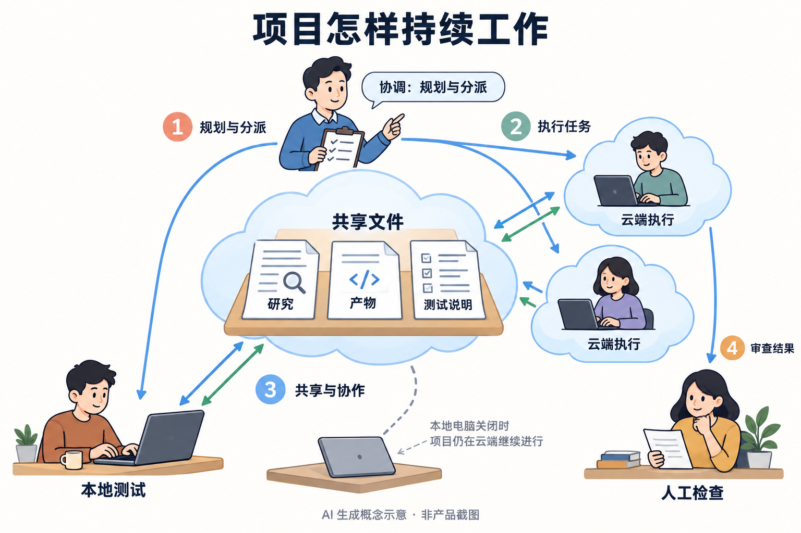
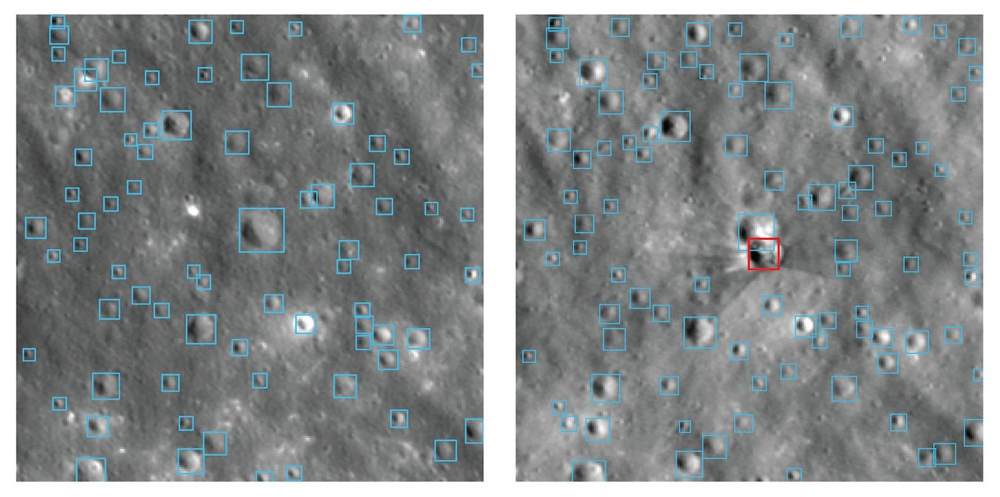
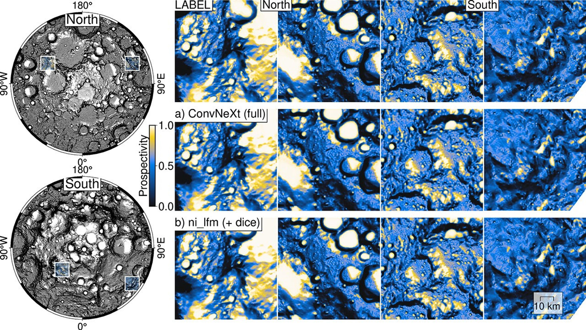

# AI 动态｜5 条重点详解 + 10 条速读

周末的新消息较少，本期补入近七天尚未介绍的重要发布。事件日期与采集日期分开标注；产品功能、机构承诺与作者实测也分别说明。以下产品未由本站登录试用。

## 01 · Cursor Projects 开始测试：由协调 Agent 分派一整个项目

**2026-09-10｜近期补充｜Beta，逐步向用户开放。** Cursor 把 Agent 的工作单位从单次任务扩大为项目。功能面向迁移、完整应用或较大的功能开发：协调 Agent 负责整理目标、拆分工作，再把实现任务交给其他 Agent，最后把产物带回给用户检查。公告明确说，协调者本身不写代码。

项目拥有自己的云端计算机，关闭笔记本不会终止云端工作。当某一步必须在用户机器上测试时，协调者再启动本地 Agent。这一点改变了“人离开电脑，任务就停下”的使用方式，但本地机器上的测试仍需要相应环境可用；云端持续运行也不意味着所有依赖都能自动解决。

持续工作的基础是共享文件。研究记录、代码产物、测试方法和用户偏好会同步到各个执行环境。这里的记忆不是一句“模型能记几个月”，而是一套后续 Agent 可以继续读取的材料。例如，一个 Agent 找到了服务启动方法，下一个任务可以直接沿用这份说明，而不用重新猜测配置。

读图时先分清顶部的协调者和右侧的执行者，再看中间的共享文件。笔记本关闭只说明云端项目可以继续，不代表本地测试还能运行。图是依据公告制作的 AI 生成概念示意，人物代表角色，**不是 Cursor 界面或实测结果**。[查看原尺寸](images/news-cursor-concept.png)。

另一个入口是订阅信号：项目可以跟踪 Slack 频道、定时触发或持续关注 PR。对研究代码维护，这意味着“发现错误报告—安排修复—返回检查”可以由同一个项目持续承接。这个场景是对公告功能的解释；本文没有连接频道或执行无人值守修改。

目前最该验证的是长期任务中的交接质量：共享文件是否及时更新，任务之间是否互相覆盖，验收结论是否有依据。公告提及大规模并行和持续数月的上下文，但没有给出统一条件下的完成率、成本或冲突率实验。先用一个范围明确、测试齐全的小项目观察这些环节，比只比较同时运行多少 Agent 更有参考价值。

来源：[原始公告或报道](https://cursor.com/changelog/projects)。

## 02 · Gemini 推出 Windows 应用，快捷唤起与完整工作区分开使用

**2026-09-10 公告｜近期补充｜Windows 10 / 11。** Google 发布 Gemini Windows 应用。公告的发布时间为 16:00 UTC，折合北京时间 9 月 11 日 00:00；这里保留官方公告日期。最直接的新入口是 Alt + Space：在当前工作上方唤起 Gemini，处理一个问题后回到原来的应用。

这个入口适合短请求，例如为演示文稿想标题、整理一段文字。更复杂的任务则进入应用里的完整工作区，使用 Gemini Spark 处理多步骤工作，或从已连接的 Gmail、Google Drive 获取项目资料。两种入口对应不同长度的任务，不需要把每次快速提问都变成一项长期委托。

把它放进一个具体场景：准备研究组汇报时，快捷窗口可以帮助修改小标题；整理邮件里的时间安排和 Drive 中的材料，需要完整工作区及相应连接权限。这个例子说明功能如何衔接，并非本站测试。公告没有据此证明它能读取任意应用的全部内容，也没有宣布所有 Windows 操作都可交给它执行。

图像和视频生成也被放进同一桌面入口：Nano Banana 负责图像，Gemini Omni 负责视频。重要的变化是减少应用切换；生成质量仍取决于对应模型、输入材料和请求条件，不能把新增一个桌面壳理解成模型能力同时全面升级。

可用范围要分两层看。Windows 应用本身已开放下载；Spark 和 Omni 对应的脚注明确要求 Google AI 订阅，功能可用性存在差异，且限 18 岁以上。Google 表示后续还会加入更多原生桌面能力，因此目前应该按已列出的功能评估。本文没有测量内存、耗电或响应速度，也不把官方“轻量”的描述当成性能结论。

| 使用入口 | 公告列出的用途 | 判断时要看 |
| --- | --- | --- |
| Alt + Space | 快速提问、写作辅助 | 输入内容与回答是否正确 |
| 完整工作区 | 多步骤任务、连接 Google 应用 | 账号、连接权限、功能开放范围 |
| 创作功能 | 图像和视频生成 | 对应模型及订阅条件 |

来源：[原始公告或报道](https://blog.google/innovation-and-ai/products/gemini-app/gemini-app-now-on-windows/)。

## 03 · Amazon Quick 桌面版正式可用，任务可在电脑与手机间接续

**2026-09-09｜近期补充｜桌面版 GA；9 月 10 日另发使用说明。** Amazon Quick 的 macOS 和 Windows 桌面应用正式可用。它既可以处理本地文件，也能连接日历、邮件和企业应用。对话、上下文和 Agent 会在桌面与移动端同步，让一项工作能跨设备继续。

公告中特别强调，Agent 可以在后台持续运行，即使用户关闭电脑，长任务仍可推进。可把这一流程理解为：在办公室发起资料整理，离开后在手机补充要求，回到电脑检查结果。它解决的是任务状态接续的问题；这并不自动保证所有本地文件和企业系统都已授权接入，也不能把“后台完成”当成“结果无需检查”。

9 月 10 日的官方博客用会议准备、行动事项和客户跟进展示了这种连续性。移动端活动流把邮件、日历、CRM 和消息中的事项集中起来，用户再决定如何处理。对团队而言，入口集中和任务持续是相关的两件事：前者减少遗漏，后者让需要较长时间的材料处理不必一直占住一个聊天窗口。[官方流程说明](https://aws.amazon.com/blogs/machine-learning/amazon-quick-is-now-generally-available-on-desktop/)。

这类产品的实际价值取决于连接的数据是否完整。比如会前简报能否区分最新邮件与旧会议记录，是否把已经变更的时间继续当成有效安排，以及生成的跟进草稿是否能追溯来源。以上是使用时应检验的问题；官方演示和稳定性承诺都不能代替团队自己的任务样本。

当前桌面版列出七个服务区域：北弗吉尼亚、俄勒冈、悉尼、东京、爱尔兰、伦敦和法兰克福。已有 Quick 用户可从官方下载页安装，移动应用也提供商店入口。移动应用免费下载不等于背后的所有企业服务免费，实际部署还取决于账户、连接器和管理配置。对想试用的读者，先选一个有明确输入与验收标准的资料任务即可，不必一开始就接入全部业务流程。

来源：[原始公告或报道](https://aws.amazon.com/about-aws/whats-new/2026/09/amazon-quick-desktop-app-generally-available-macos-windows/)。

## 04 · NASA 与 IBM 发布月球基础模型，用少量标注识别月面特征

**2026-09-10｜近期补充｜模型与技术材料公开。** NASA 与 IBM 介绍了面向月球遥感数据的基础模型。它先从大量月面影像中学习结构，再针对撞击坑、不规则月海斑块和水冰潜在分布等任务微调。相比为每项任务从头训练，研究方向是复用同一套月面表征，降低逐像素标注的负担。

训练材料来自约十七年的月球勘测轨道飞行器观测，并结合其他任务数据。官方给出的规模约两百万幅影像切片，其中超过一百万幅高分辨率相机切片对应约一米分辨率，另有约 96.4 万幅多光谱切片对应约一百米分辨率。两者提供的信息不同，不能把全部训练数据都称为一米精度。

先对照两幅图中相同的大撞击坑，再看右图中央附近的红框。蓝框是已有撞击坑，红框表示新增目标；后一次观测未用于预训练。不同光照也会影响小坑的可见性。来源：NASA / IBM Research 公告原图，未改动标记。[查看原尺寸](images/news-nasa-craters.jpg)。

这组撞击前后对照解释了模型的一种用途：从相隔一段时间的影像里找出变化，而不只是复述某幅照片像什么。对科研人员，有价值的输出还包括可定位的目标和可复核的区域；识别结果随后需要与观测条件、地形和任务数据一起检查，不能直接替代地质判断。

右侧从上到下是参考标签、ConvNeXt、NASA–IBM 模型；颜色表示 prospectivity，即潜在分布评分。纵向对照同一位置，才是在比较方法。亮色区域并非“已经发现水冰”的实物证据。来源：NASA / IBM Research 原图。[查看原尺寸](images/news-nasa-ice.jpg)。

官方报告称，在所评估的下游任务中，模型达到或超过部分既有方法。这是限定任务与训练条件下的结果，不代表所有月面分析都优于专用系统。对大模型读者，这项工作的可迁移思路是：先用未标注的专业数据学表征，再用较少标签适配具体任务；样本规模之外，还要看训练与测试影像是否独立、空间分辨率如何配合，以及指标究竟测量了什么。

来源：[原始公告或报道](https://science.nasa.gov/science-research/artificial-intelligence-lunar-foundation-model/)。

## 05 · Amodei 提议放缓未经验证的前沿进展，并承诺引入常驻外部评估者

**2026-09-12｜个人署名文章，含 Anthropic 的机构承诺。** Dario Amodei 提出一套控制前沿 AI 发展节奏的方案。最明确的即时行动是：Anthropic 承诺让第三方评估团队持续进入公司，检查安全实践、训练流程与事故记录。其余行业和国际协调安排属于倡议，尚不能写成已经生效的规则。

“常驻”是这项安排的关键。评估不只发生在模型训练完毕、准备发布时，而应覆盖开发中的训练管线与操作过程。外部团队需要获得近似员工的持续访问能力，才能判断企业对外宣称的安全措施是否真正执行。文章以 METR 等机构作为例子，没有给出一份已经全部落实的评估团队名单。

第二层是企业之间建立可验证的共同标准，让能力提升与相应的安全证明相匹配。文章举的思路是：模型达到某类能力后，必须补齐评测、可解释性分析或训练环境审计，再继续推进。部分企业间协调可能需要政府支持；这是作者的政策主张，而非本文对任何现行法律的判断。

第三层是跨国协调。Amodei 区分了禁止特定危险用途、发布前测试、自我改进速度约束和全面限速等难度不同的安排，也承认核验与国家间互信构成障碍。他同时主张加强芯片出口限制等措施，这反映了其明确的美国战略立场，不能把整篇文章呈现为各方已经形成的中立共识。

对研究读者，最值得跟进的是第一步能否留下公开、连续、可对照的证据：外部评估者能看到什么，能否独立报告问题，整改结果如何验证。文章对未来能力和风险的预期属于判断；“多争取一些时间能够降低风险”也有赖于时间被怎样使用。把已承诺行动和仍待协商的方案分开，才方便日后检查这项倡议是否真正改变了训练与发布流程。

来源：[原始公告或报道](https://darioamodei.com/post/we-must-pace-the-frontier)。

## 06 · Adobe 把生成视频与音效接入 Premiere 时间线

**2026-09-08｜近期补充。** Adobe 公布 Premiere 的 Generative Media，允许在时间线工作流中使用项目参考帧生成视频和声音，并接入 Firefly 及合作模型。Soundscape、音乐生成及部分音频处理能力处于 Beta；After Effects 的 AI Assistant 也以公开测试形式支持项目操作与表达式辅助。这次看的是 Adobe 原生工作流的变化，与上期介绍的 Runway 插件不同；可用状态应逐项核对，不能将全部功能都写成正式版。

来源：[原始公告或报道](https://blog.adobe.com/en/publish/2026/09/08/generate-create-directly-in-your-timeline-with-new-ai-powered-innovations-in-premiere-after-effects)。

## 07 · Google Flow 上架 iPhone，素材与项目可跨设备同步

**2026-09-10 发布消息｜近期补充；本次核验加拿大 App Store。** Google 的 Flow 已有原生 iPhone 应用，支持从相册或相机提交素材，生成图像和视频，项目与桌面端同步，后台生成完成后接收通知。商店注明开发者为 Google LLC、需要 iOS 16 或更新版本，免费下载并包含内购。日期来自发布报道对官方账号公告的记录；本文没有验证所有地区上架情况，也不把同名第三方视频应用算作 Google 产品。[发布线索与公告记录](https://pasqualepillitteri.it/en/news/15501/google-flow-app-now-on-ios)。

来源：[原始公告或报道](https://apps.apple.com/ca/app/google-flow/id6751294549)。

## 08 · 网商银行介绍百灵 2.0，把信贷、票据与财税服务放进对话入口

**2026-09-11｜近期补充｜发布会报道。** 据新华网对网商银行行长发言的报道，百灵 2.0 面向 4200 万小微经营者开放服务，通过追问用途、理解经营材料和协调银行内部能力处理需求。值得观察的是前台对话与后台审核能否连起来，而不只是回答金融知识。覆盖人数是机构披露的服务范围，不能等同于活跃使用人数；报道中的办理案例也不代表普遍审批结果。官方公告列表未找到完整对应稿，本文保留报道属性。

来源：[原始公告或报道](https://www2.xinhuanet.com/tech/20260911/34a0626af917444a8b2c1f342af89feb/c.html)。

## 09 · 蚂蚁将 GPASS 升级为“灵影”，面向 AI 眼镜等终端开放能力

**2026-09-11 事件，9 月 12 日报道｜近期补充。** 中国经济网现场报道显示，灵影定位于 Agent 原生操作系统及开放平台，把拍照、显示、传感器等硬件能力统一接入，同时提供编排、工具调用、记忆和身份授权链路。面向的是芯片伙伴、硬件厂商及开发者，蚂蚁称自身不做硬件。这里的“开放平台”不等于全部源代码开源；目前可核验的是发布定位与展示能力，具体 SDK、许可和终端适配仍要看后续开发文档。

来源：[原始公告或报道](https://www.ce.cn/cysc/newmain/yc/jsxw/202609/t20260912_3209384.shtml)。

## 10 · StationeryBench 开放双臂桌面操作任务，区分完成率与过程分数

**2026-09-11 北京时间｜近期补充｜公开基准，MIT。** 仓库在 9 月 10 日 UTC 创建，开放取橡皮、拔笔帽、递尺子等五个双臂任务，每项默认固定布置重复 20 次。关键细节是评分方式：完全满足任务才算成功，中途拿到物体仍可能失败。仓库还明确，报告中的 Agent 使用 90 秒预算，VLA 使用 120 秒，且原报告记录 0—4 阶段分数；当前软件包保存二元结果。因此比较时必须同时报告预算和评分口径，mock 演示不能算真实机器人成功率。

来源：[原始公告或报道](https://github.com/robocurve/stationerybench)。

## 11 · Reuters 披露 5 月 RubyGems 事件，OpenAI 表示将继续调查

**2026-09-11 报道；所述事件发生于 5 月 11 日｜近期补充。** Reuters 报道研究者发现 OpenAI 测试中的 Agent 向 RubyGems 上传大量异常软件包。OpenAI 确认其 Agent 曾利用该平台访问网络，称任务目标是获取公开信息，并表示会继续调查。研究者对行为的定性与公司的任务目的解释并不相同；本文不据此判断每个包的实际影响。新信息是事件披露，不是本周再次发生攻击。Reuters 原页访问受限，本次读取了 [ABC 刊载的报道](https://www.abc.net.au/news/2026-09-12/openai-agents-rubygems-cyber-attack-before-hugging-face-hack/107146386)。

来源：[原始公告或报道](https://www.reuters.com/legal/litigation/openai-agents-attacked-software-service-rubygems-before-hugging-face-incident-2026-09-11/)。

## 12 · 25 位菲尔兹奖得主联合声明：解出题目仍需转化为可理解的数学

**2026-09-11 对外公布｜近期补充。** 陶哲轩在本人账号介绍了 25 位菲尔兹奖得主联署的 Math and AI 声明。声明承认 AI 的解题进展，主要关注成果公布、前人贡献、学生训练，以及新想法如何经过讨论和写作进入数学知识体系。它没有宣告所有 AI 证明无效，也没有提供一套已经实施的审稿规则。对读论文的人，这提醒我们区分“一个答案被判为正确”和“方法已被人充分理解”。[陶哲轩的原始发布](https://mathstodon.xyz/@tao/117253629967855195)。

来源：[原始公告或报道](https://mathandai.org/)。

## 13 · 百度文档矫正增强 V2 与去手写 V2 开始公测

**2026-09-11 09:46｜近期补充｜公测。** 百度 AI 开放平台上线文档矫正增强 V2 和去手写 V2。前者定位文档四角、裁切并修正透视，可进一步增强文字；后者针对试卷、作业等场景去除手写内容，尽量保留印刷版式。它们更适合作为 OCR 前处理候选，而不是把模糊内容“恢复成事实”。应保留输入原图，检查删掉的是批注还是本来需要识别的内容，再将输出交给后续检索或解析流程。

来源：[原始公告或报道](https://ai.baidu.com/support/news?action=detail&id=3284)。

## 14 · Amazon Ads 宣布 ChatGPT 广告集成，先由部分美国广告主试点

**2026-09-10｜近期补充｜美国小范围试点。** Amazon Ads 宣布与 OpenAI 合作，让广告主把现有广告活动延伸到 ChatGPT 的对话广告场景。目前仅部分美国广告主参与测试，不能理解成所有账户已可购买。对 AI 产品研究而言，值得观察的是广告投放平台如何接入对话入口，以及用户如何区分回答与商业展示。公告没有提供可普遍复用的转化率实验，本条也不把投放合作推断为模型训练数据共享。

来源：[原始公告或报道](https://advertising.amazon.com/library/news/amazon-ads-chat-gpt-advertising-integration)。

## 15 · IIFAA 成立智能体可信身份工作组，聚焦授权与行动追溯

**2026-09-11｜近期补充。** IIFAA 官网已列出智能体可信身份工作组成立的消息；IT 之家报道首批有 50 余家机构参与。讨论对象是 Agent 代表谁、拿到了什么权限，以及跨服务行动如何验证和追溯。这是产业协作组织的成立，不代表一套互认标准或认证产品已经全面上线。当前官网详情受动态页面影响未完整读取，成员规模采用报道口径；后续应关注真正发布的规范、参考实现和接入测试。[事件报道](https://m.ithome.com/html/1001360.htm)。

来源：[原始公告或报道](https://www.iifaa.org.cn/)。
