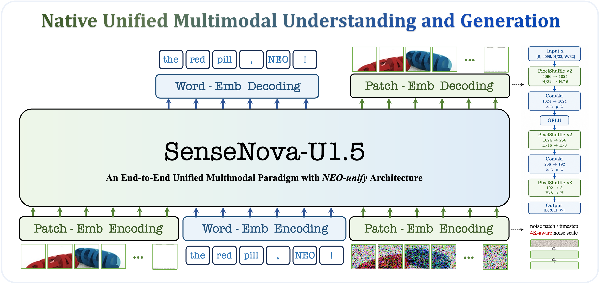
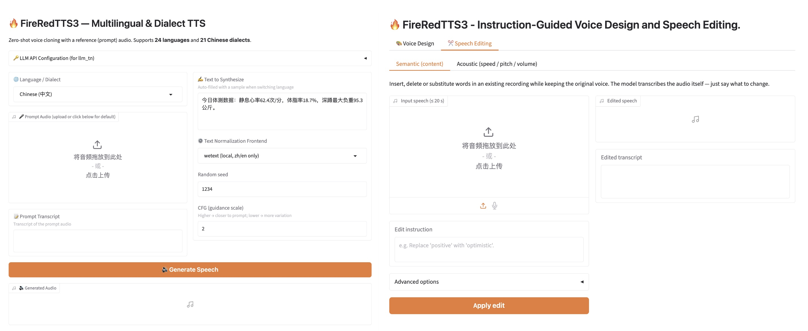
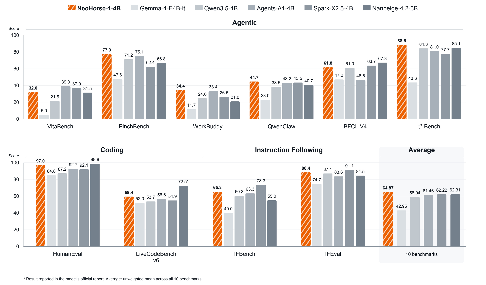
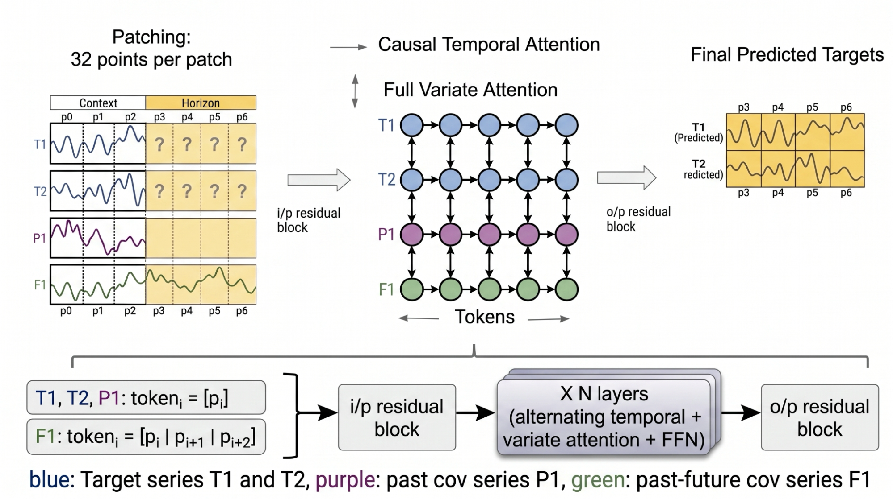

# 开源模型｜六项权重与开放范围核验

本栏同时列出开放权重与受限开放模型：能下载不等于可商用，更不等于训练数据全部开放。六项均核对模型卡、文件目录与可访问的许可；本站没有下载大体积权重或运行推理。容量估算仅指权重下限，不能作为显存承诺。

| 模型 | 适合先研究什么 | 本次核验的主要边界 |
| --- | --- | --- |
| Agnes 3.0 Flash Preview | 混合注意力与多模态推理 | 开放 Preview 与生产 API 不是同一配置 |
| SenseNova U1.5 | 理解、生成共用序列 | 两路参数均需计入部署成本 |
| FireRedTTS3 | 参考声音合成与指令编辑 | Base / Instruct 输入方式不同 |
| NeoHorse 1 4B | 小模型的任务课程后训练 | 此权重为纯文本版本 |
| Indic Translate | 印度语言的文档翻译 | gated，定制许可，长上下文验证有限 |
| TimesFM 3.0 | 多变量时间序列预测 | 非商业、非生产用途许可 |

## 01 · Agnes 3.0 Flash Preview：先分清开放版与生产版

**9 月 11 日创建权重仓库，9 月 12 日修订。** Agnes 的开放 Preview 是约 33B 的多模态模型，可输入文字、图像和视频。模型卡还讨论了生产服务，但开放配置的上下文上限是 262,144 token，不能把 API 的百万上下文宣传直接搬过来。

它在 72 层中交替使用 54 层递归式 Delta 结构和 18 层全局注意力。直觉上，前者把历史压入固定状态，后者仍能直接查阅历史 token；只有后者的 KV 缓存随序列增长。因此“减少长上下文缓存”有结构依据，“完全不需要 KV”则不成立。

本次看到 20 个 safetensors 分片和 Apache-2.0 许可。按 BF16 每参数两字节粗算，33B 权重就约 66 GB，尚未包括图像输入、中间激活及缓存。模型卡给出了 H100 / H200 路径，依赖 Transformers 5.12 系列；需要 `trust_remote_code` 的示例应先阅读对应仓库代码，再在隔离环境试用。

模型卡提供 IFBench、GPQA 等成绩，可用来挑选验证任务，但其中比较项来自不同公开报告或评测快照，并非一组统一环境下的独立复测。适合先拿自己的文档、图表和短视频建立少量固定问题，再逐项检查答案与引用；本站尚未验证实际吞吐或多模态可靠性。[权重许可](https://huggingface.co/Agnes-AI/Agnes-3.0-Flash/blob/main/LICENSE)。

来源：[模型卡与文件目录](https://huggingface.co/Agnes-AI/Agnes-3.0-Flash)。

## 02 · SenseNova U1.5：理解和生成怎样共用一个序列

**权重于 8 月 20 日发布；9 月 11 日技术报告补充，首次收录。** SenseNova-U1.5 将图像理解与图像生成放入统一序列。图片分成块，文本转成词 token，生成时再加入带噪的图像块；不同类型的信息通过注意力交互。

“8B-MoT”尤其容易读错。技术报告列出理解与生成两路各约 8.2B 参数，不是总共只有 8B。两路保留各自的投影、归一化和前馈参数，再共同计算注意力。它不依赖外置视觉编码器或 VAE，但仍有可学习的像素前端，不能理解为直接把所有原始像素无处理地送进 Transformer。

先看底部三路输入，再看顶部文字与图像两种输出。右侧解码器把特征逐级上采样，并加入卷积来缓解图像块接缝；这比只看生成样张更能解释 U1.5 的结构变化。图内 4K 表示分辨率相关设计，不能推出任意显卡都能运行。（[来源原图](https://arxiv.org/abs/2609.11929)；[查看大图](images/model-sensenova-architecture.png)。）

官方仓库与模型卡标为 Apache-2.0，开放权重和推理路径；U1.5 的完整后训练流程仍有计划中的部分，不能将旧 U1 训练代码等同于 U1.5 全流程已经发布。实际显存取决于双路参数、精度、分辨率及卸载策略，本次没有可靠的统一最低值。研究时可先对照普通分辨率下的理解、生成与编辑任务，检查它们是否真的受益于共享表示。[官方实现与许可说明](https://github.com/OpenSenseNova/SenseNova-U1)。

来源：[模型卡与文件目录](https://huggingface.co/sensenova/SenseNova-U1.5-8B-MoT)。

## 03 · FireRedTTS3：参考声音合成与指令编辑的两种入口

**Base 于 8 月 5 日、Instruct 于 8 月 13 日发布；8 月 18 日技术报告、8 月 21 日修订作为近期补充。** FireRedTTS3 把语音合成和语音编辑放在同一体系。Base 侧重参考声音驱动的多语种合成，官方列出 24 种语言与 21 种中文方言；Instruct 增加文字描述设计声音、改说话内容以及调整语速、音高等能力。

两个入口的差异比“更自然”的笼统描述有用。给 Base 一段参考音频、对应文本和要说的新句子，是沿用一个声音进行合成；给 Instruct 现有音频和修改要求，则可以对内容或声学属性进行编辑。部分声音设计模式只需要文字，不必提供参考音频。

左侧重点看参考音频及其转写，右侧看编辑类别、音频和指令。这里展示的是官方输入界面，不是本站合成的结果，也不能凭空白输出区域判断音质。（[来源原图](https://github.com/FireRedTeam/FireRedTTS3)；[查看大图](images/model-firered.jpg)。）

模型卡和官方实现标注 Apache-2.0。本次核对了权重文件，未进行语音试听或设备压测；官方基准结果也不能保证每种方言与录音条件表现相同。中文、英文的文本规范化可走本地路径，其他语言有可选的 LLM 规范化步骤，若启用外部接口便不能声称全程离线。最低显存未得到明确核实，建议先读安装依赖和所选分支，再用自己有权使用的短音频检查漏词、发音与编辑边界。[技术报告](https://arxiv.org/abs/2608.17492v2)。

来源：[模型卡与文件目录](https://huggingface.co/FireRedTeam/FireRedTTS3)。

## 04 · NeoHorse 1 4B：把任务分配记录转成训练课程

**9 月 5 日创建，9 月 10 日修订，首次收录。** NeoHorse-1-4B 基于 Qwen3.5-4B 后训练，当前发布的是纯文本权重，没有附带视觉组件。它试图把任务分配过程中记录的成败，反过来变成训练课程：路由器把请求分给不同模型，整理能力缺口，再通过监督训练和蒸馏更新模型。

这提供了一条“部署日志如何反哺训练”的研究路径，但一次后训练报告尚不能证明系统可以稳定、反复地自我改进。要复现，关键是任务来源、路由策略、训练集去重和留出的评测集，而不只是运行最终 checkpoint。

橙色为 NeoHorse，右端是十项的无权宏平均：64.87，对照基座为 58.94。先看单项再看平均，它并未在每项领先；带星号等比较结果含外部报告口径，不能当作本站统一复测。（[来源原图](https://huggingface.co/TokenRhythm/NeoHorse-1-4B)；[查看大图](images/model-neohorse.jpg)。）

模型提供两个 safetensors 分片及 Apache-2.0 许可，约 4B 的 BF16 权重下限是 8 GB，推理显存还需要额外空间。模型卡给出 262,144 token 原生上下文及进一步扩展说明，扩展参数并不等于每项长文任务都已验证。更适合作为小规模后训练与 Agent 任务分配的对照基线；本站没有运行其评测。[许可文件](https://huggingface.co/TokenRhythm/NeoHorse-1-4B/blob/main/LICENSE)。

来源：[模型卡与文件目录](https://huggingface.co/TokenRhythm/NeoHorse-1-4B)。

## 05 · Indic Translate：文档翻译能力与许可门槛要一起看

**仓库原始创建于 8 月 5 日，9 月 7 日有修订，本栏首次收录该修订状态。** Bodhan 的 Indic Translate 面向英语与 22 种印度语言之间的 44 个方向，除了句子翻译，还强调保留 Markdown 结构、处理罗马字转写及混合语言。适合研究网页、讲义或政策文档翻译，而不只看单句流畅度。

它基于 Gemma 4 E4B，卡片列出约 7.94B 参数。配置能表示较长上下文，但模型卡明确验证到 32,768 token；不能把架构上限当成长文质量保证。按 BF16 粗算权重约 15.9 GB，尚未计算缓存；本次只检查了五个权重分片的目录，没有下载 gated 文件或接受访问条款。

这里有一个会直接影响采用决定的限制：模型卡列出定制的 Indic Open Model License v1.0，并对托管翻译 API、特定规模商业使用等设有条件。完整许可文件本次访问受限，因此只确认模型卡的说明与许可入口，不将其表述为已核实的自由商用许可。使用前须在原站读取完整条款，尤其确认自己的部署方式是否需要另行授权。[许可入口](https://huggingface.co/bodhan-ai/indic-translate/blob/main/Bodhan_AI_Open_Model_License.md)。

对于科研对照，可以先准备同一文档的标题、列表、专名和数字检查表，分别评估结构保留与内容准确率。模型卡中的综合翻译分数无法代替逐语言验证。本文没有把 9 月 7 日修订日冒充首次发布日期，也没有声称该日新增能力已逐项确认。

来源：[模型卡与文件目录](https://huggingface.co/bodhan-ai/indic-translate)。

## 06 · TimesFM 3.0：未来已知变量如何参与预测

**8 月 31 日官方介绍，9 月 2 日权重仓库修订，近期补充。** TimesFM 3.0 是约 330M 参数的时间序列预测模型。相比只看一条历史曲线，它能同时利用多个变量，以及未来已知的协变量。例如要预测冰淇淋销量，过去销量属于预测目标，已经排好的促销日期则是未来也能知道的输入。

模型先把连续时间点分成长度为 32 的块，再分别沿时间方向和变量方向交换信息。时间方向防止随意读取未来目标，变量方向允许同一时刻的不同信息相互参考；目标未来位置保持遮盖，模型一次预测整个区间。

横向看时间，纵向看变量。绿色变量可以延伸到预测区间，因为它代表事先已知的计划等输入；蓝色目标未来仍是问号。不要把这种设计误读为允许喂入事后真实销量。（[来源原图](https://research.google/blog/timesfm-3-a-zero-shot-foundation-model-for-multivariate-forecasting/)；[查看大图](images/model-timesfm-architecture.png)。）

官方的促销示例展示了协变量如何改变预测形状：不告诉模型促销安排，曲线更接近常规波动；告诉它安排后，促销日出现额外峰值。这解释的是输入信息的作用，不是经过独立检验的实际商业收益。

虚线右侧才是预测。底部橙色条是促销计划，蓝线在对应位置抬高；灰色是历史观测。阴影表示预测不确定范围。原文约 20% 的促销效应属于该示例设定，不能当成模型带来的销售增长。（[来源原图](https://research.google/blog/timesfm-3-a-zero-shot-foundation-model-for-multivariate-forecasting/)；[查看大图](images/model-timesfm-promotion.png)。）

权重采用 TimesFM Non-Commercial License v1.0，明确限制为非商业、非生产用途，并限制权重及其衍生物再分发；不能因相关代码使用宽松许可就将权重也写成 Apache-2.0。本次仅核验小型配置、许可与目录，没有下载权重或做真实预测。BigQuery 的现有接口也不能直接假设已切换为 3.0。[权重许可全文](https://huggingface.co/google/timesfm-3.0-pytorch/blob/main/LICENSE)。

来源：[模型卡与文件目录](https://huggingface.co/google/timesfm-3.0-pytorch)。
