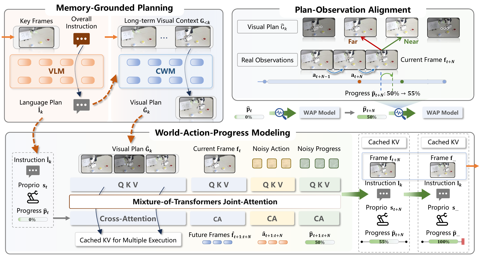
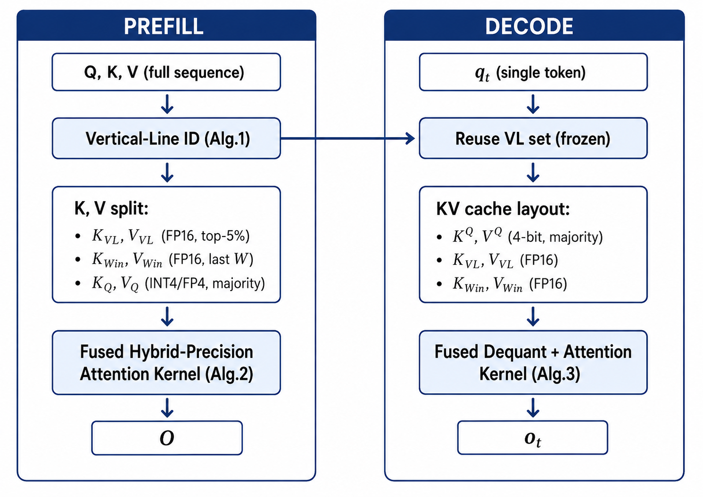
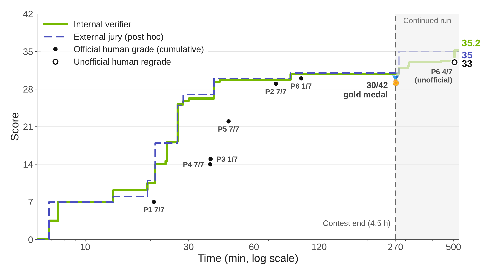
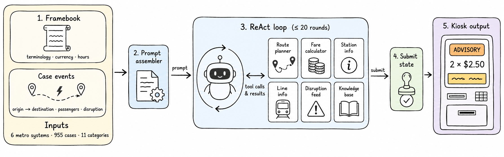
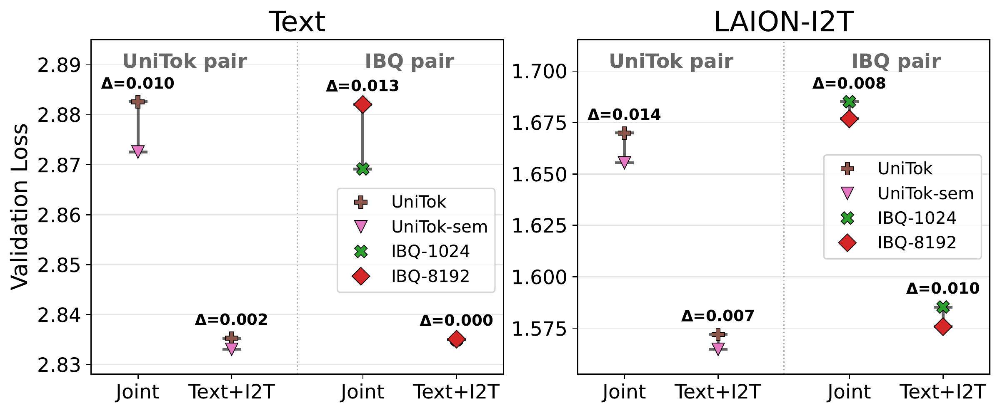
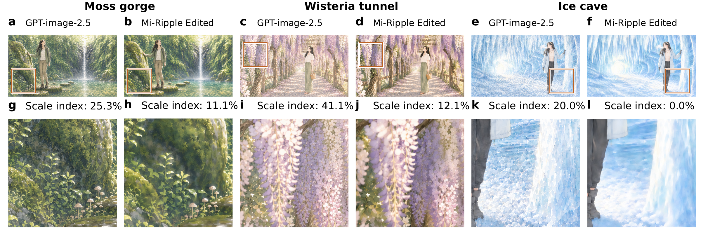

# 论文精选｜六篇原文，六个关键解释点

本期先读方法和实验，再选图。以下数字来自作者报告，本站没有运行重型训练或机器人实验。PDF 的存档与开放实现分开核验：五篇按 CC BY 4.0 保存原文，一篇仅存阅读卡；六篇都保留版本和原始入口。

## 01 · MaP-WAM：把长期记忆留给规划，把短时闭环交给执行

**2026-09-10 · arXiv 2609.11561v1 · 预印本，本站未复现。** 长任务机器人如何使用历史，又避免每一步动作都背着越来越长的上下文。

如果机器人先看到指令牌、稍后才到操作台，单张当前画面不足以决定该拿什么。MaP-WAM 把历史整理成带语言说明和稀疏真实帧的片段。语言规划器先生成下一步目标，因果世界模型再提供视觉计划；执行器依据当前观察、机器人状态、计划与进度输出动作。

最值得看的部分是计划与实际观察之间的对齐。执行器预测“做到了多少”，系统再比较真实画面在视觉计划中更接近哪一步，校正进度。子任务结束后，写回记忆的是实际观察帧，而不是把生成的理想画面当成已经发生的事实。短时执行因此不必每一步重新吞入完整历史，但规划侧的历史开销仍会增长。

作者在 RMBench 的 9 项任务中每项使用 50 条专家轨迹训练、100 次试验评估，平均成功率为 83.3%；其中困难的 ObservePickUp 仍只有 19%。真实 Franka 的两个任务各测 50 次，分别为 88% 和 68%。不同任务用专门训练的执行器，不能由此推出一个模型已经能处理任意真实家务。

复现时应优先检查记忆写入规则、进度校准阈值，以及去掉历史后失败的是哪类任务。只看总平均，会漏掉真正需要长期记忆的困难场景。

Sizhe Zhao等的框架原图。先看左上“历史 → 两类计划”，再看右上进度从 50% 校正到 55%。这不是凭时间自动推进，而是将当前观察与计划画面对齐；下方才是动作执行的短时循环。图中比例仅用于机制示意。（[论文原图](https://arxiv.org/abs/2609.11561v1)；[查看大图](images/paper-map.png)。）

来源：[论文原文](https://arxiv.org/abs/2609.11561v1) · [站内阅读卡](../../../../papers/frontiers/map-wam/00-阅读卡.md)。已归档 CC BY 4.0 原文 PDF。

## 02 · HyQuant：把少数关键 KV 留在高精度

**2026-08-28 · arXiv 2608.27875v1 · 预印本，本站未复现。** 为什么四比特缓存需要挑位置保留精度，以及内核加速为何不等于整机加速。

长上下文解码反复读取 KV 缓存，既占容量，也占内存带宽。HyQuant 观察到有些历史位置经常获得较高注意力，形成“竖线”。它将这类关键位置中约前 5% 及一个最近窗口保留为全精度，其余大部分缓存压到四比特。

只压缩存储还不够。如果每步先把全部缓存展开为高精度再计算，便会抵消节省。作者把反量化与注意力合进同一内核，在读取局部数据时即时解包；预填充和逐 token 解码采用不同的计算安排。这样同时处理表示误差和数据搬运，而不是仅换一个文件格式。

单张 H100 80GB、Qwen3-8B、32K 前缀条件下，注意力解码内核耗时从 6.354 ms 降到 1.775 ms，约 3.58 倍；对应端到端解码加速约 1.17 倍。两种口径都应保留。批量为 4 的吞吐表中，FA2 反而更快，说明收益依赖负载。

原文还有一处需复核：正文称能运行 batch 32，但表格中 32 全部 OOM，只有 HyQuant 在 16 时成功运行。本文按表格记录，不采用“32 可运行”的说法。复现价值在于同时比较精度、缓存容量、端到端吞吐和批量设置；仅重复最大的内核倍数不能验证实际服务收益。

Jiatong Ding等的机制原图。左列先确定重要位置，右列在解码时复用该集合。中间三类 KV 要一起看：大多数是四比特，关键位置和最近窗口仍为 FP16；最下面的融合内核避免先生成一份完整高精度缓存。（[论文原图](https://arxiv.org/abs/2608.27875v1)；[查看大图](images/paper-hyquant.png)。）

来源：[论文原文](https://arxiv.org/abs/2608.27875v1) · [站内阅读卡](../../../../papers/frontiers/hyquant/00-阅读卡.md)。已归档 CC BY 4.0 原文 PDF。

## 03 · Nemotron IMO：金牌成绩背后的搜索与验证成本

**2026-09-09 · arXiv 2609.10712v1 · 预印本，本站未复现。** 把最终人工评分、模型自评和赛后续跑分开，才能理解数学 Agent 的真实能力。

作者使用基础、监督微调和强化学习后的多个模型提出证明，再由专门验证器评判、生成批评和推动修订。候选需通过多次验证才进入后续筛选，最终还有额外判断来排序。这更像一个高预算的证明搜索系统，不能当成单次提问的答题准确率。

论文报告在每个比赛日 4.5 小时限制下获得 30/42，达到当届 29 分金牌线；第 1、2、4、5 题各 7 分，第 3、6 题各 1 分。模型验证器和赛后外部评审会给出另外的曲线，正式结果仍以人工评分为准，继续运行后的第 6 题非正式加分不能并入正式成绩。

预算也要分口径。论文列出的达到已提交证明阶段约生成 7.07 亿 token、消耗 1,464 GB200 GPU 小时；完整运行约 23.1 亿 token、4,784.6 GPU 小时。GPU 小时是并行设备用量，不等于人等待了同样小时数。它说明搜索、反复验证和并行策略都对结果有贡献。

论文给出两个后训练 checkpoint、训练数据、基准和推理代码入口，适合研究验证器筛选与成本分配。先从 [作者发布集合](https://huggingface.co/collections/nvidia/nemotron-labs-imo-2026) 和小规模证明审阅开始；模型、数据、代码分别有许可。未完成题上验证器仍可能过度自信，增加投票次数不能自动获得独立正确性保证。

Ivan Moshkov 等的运行进度原图。绿色是内部验证器，蓝色虚线是赛后外部评审，黑色实心点是正式人工累计分。横轴是对数刻度；270 分钟竖线右侧的空心点属于非正式重评。因此正式结果读 30/42，不能读最右端 33 或模型估计 35。（[论文原图](https://arxiv.org/abs/2609.10712v1)；[查看大图](images/paper-imo.png)。）

来源：[论文原文](https://arxiv.org/abs/2609.10712v1) · [站内阅读卡](../../../../papers/frontiers/nemotron-imo-gold/00-阅读卡.md)。已归档 CC BY 4.0 原文 PDF。

## 04 · MetroLLM-Bench：小模型能否可靠控制售票流程

**2026-09-09 · arXiv 2609.10016v1 · 预印本，本站未复现。** 一个有工具、有业务规则、有结构化输出的窄任务，如何检验 Agent 的工作质量。

基准模拟六套地铁系统的售票机，包含 955 个案例、11 类需求。模型要理解目的地、乘客和运营变化，调用路线、票价、站点等六类工具，最后提交包含票务决策的结构化状态。最多 20 轮交互，格式校验失败会返回错误反馈，不能只输出一段听起来合理的旅游建议。

评测分两层：第一层有 14 项确定性检查，第二层有 8 项语义检查，其中 6 项使用模型裁判。717 个案例用于训练，238 个留出测试。论文比较了多个模型和推理设置；部分无法正常终止的模型未进入最终排名，因此排行榜不能代替对完整失败样本的解释。

一个 4B 模型经参数高效微调、以约 2.6 GB 的 Q4_K_M 权重运行，在第一层得到 91.32，对照 GPT-5.4 高推理配置为 91.37；这点差距处于置信区间之内。它支持“小模型可以学会明确的业务流程”，不支持“小模型整体能力已等同大模型”。

留出集仍与训练结构共享模板，部分路径组合存在交叠；实验也不是在线真实客流测试。复现最有价值的部分是工具 schema、可确定检查项及错误分类：先把任务能否完成定义清楚，再讨论换模型是否有效。语义裁判分数与确定性通过率应单独报告。

Remco Hendriks 的流程原图。最关键的是右侧 Submit state：模型交付的是可验证的业务状态，而不只是聊天。中间六个工具提供路线、票价、站点、线路、运营中断与知识信息；图中的示例票价不代表任何真实线路价格。（[论文原图](https://arxiv.org/abs/2609.10016v1)；[查看大图](images/paper-metro.png)。）

来源：[论文原文](https://arxiv.org/abs/2609.10016v1) · [站内阅读卡](../../../../papers/frontiers/metrollm-bench/00-阅读卡.md)。已归档 CC BY 4.0 原文 PDF。

## 05 · 图像 Tokenizer：视觉词表怎样影响统一模型训练

**2026-09-08 · arXiv 2609.09143v1 · 预印本，本站未复现。** 把图像也当作一种语言后，不能只用一个总损失判断它是否容易学习。

研究在固定的自回归多模态训练设置下比较七种离散图像 tokenizer，覆盖不同规模的 Qwen3 基座，并保持图像分辨率、训练配方等条件可比。模型既学文本，也学看图写字和从文字生成图像；作者把这些目标的损失拆开，观察 tokenizer 改动究竟影响哪部分。

直觉上，更容易重建原图的编码未必更适合语言模型学习。词表大小、图像 token 的统计结构和语义联系会同时改变训练难度。跨 tokenizer 的原始损失还受词表定义影响，不能把数值直接排成一张能力排行榜。

一个关键消融去掉图像预测任务，只保留文本与图像描述。此时不同 tokenizer 之间的纯文本损失差距大幅缩小，但图像描述上的差距没有全部消失。这说明“图像预测给语言训练带来的干扰”和“图像表示有没有保留语义”是两个相关但不同的问题。

词表实验也不是越大或越小越好：较低的归一化图像损失与最好的下游成绩未必落在同一设置。结论限于论文的固定长度、单码本、纯自回归训练范围，不能直接外推到扩散模型或视频。复现时应保留四类损失、训练预算和下游任务，而不是只看重建样图是否漂亮。

Siting Li等的消融原图。左图看纯文本：Joint 换成 Text+I2T 后，两组差值从 0.010 / 0.013 缩到 0.002 / 0.000；右图的图像描述差距仍存在。两图纵轴刻度不同，不能凭点间像素距离跨图比较收益。（[论文原图](https://arxiv.org/abs/2609.09143v1)；[查看大图](images/paper-tokenizers.png)。）

来源：[论文原文](https://arxiv.org/abs/2609.09143v1) · [站内阅读卡](../../../../papers/frontiers/image-tokenizers-visual-languages/00-阅读卡.md)。已归档 CC BY 4.0 原文 PDF。

## 06 · Mi-Ripple：反复 AI 修图后的纹理，怎样区分清理与重造

**2026-09-10 · arXiv 2609.11317v1 · 预印本，本站未复现。** 修掉网纹并不等于恢复真实细节，需要同时检查伪影与内容改变。

重复编辑图像后，有时会出现规则网格，有时则是与草叶、花瓣等内容混在一起的颗粒。Mi-Ripple 把二者分开处理：对频谱中可分离的周期成分做局部抑制；对缠在内容里的伪影，先保护重要边缘，再选择局部清理，必要时用较干净的参考进行再生成。

真正的难点不在“让图更平滑”，而在不把应保留的纹理也删掉。论文因此结合局部频域检测、尺度指标和独立的失真检查，再人工观察结果。频谱上的规律不能直接用于判断某个品牌模型，也不能当成可靠水印识别器。

作者展示的三个场景中，尺度指标分别从 25.3% 到 11.1%、41.1% 到 12.1%、20.0% 到 0.0%。这些是该组样例在特定局部统计下的结果，不是整体图像质量提高的百分比。原图仍可看到局部纹理、颜色和形状发生变化；再生成尤其可能创造新细节。

实验基于有限样本及若干编辑渠道，模型身份包含桌面集成或网关标注，未由本站独立确认；分辨率等条件也可能影响伪影。不应把它包装为某厂商的官方性能报告。可借鉴的是保存每一轮原图、局部频谱和处理参数，同时检查内容保真；“检测分数更低”只是一个诊断信号。

Jiayin Chen等的论文样例原图。每一对左边为作者记录的编辑结果，右边为 Mi-Ripple 处理；下排对应上排框选区域。花叶和冰面纹理也随处理改变，因此伪影指标下降不能读成真实细节已恢复。图中的产品名是论文对其实验渠道的标注，非本站认证。（[论文原图](https://arxiv.org/abs/2609.11317v1)；[查看大图](images/paper-ripple.png)。）

来源：[论文原文](https://arxiv.org/abs/2609.11317v1) · [站内阅读卡](../../../../papers/frontiers/mi-ripple/00-阅读卡.md)。未确认全文再分发许可，仅归档阅读卡。
