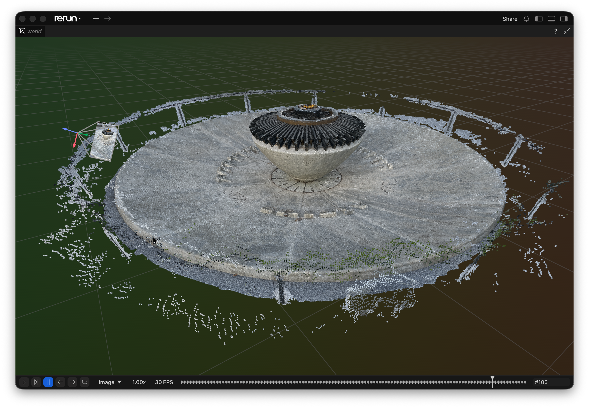
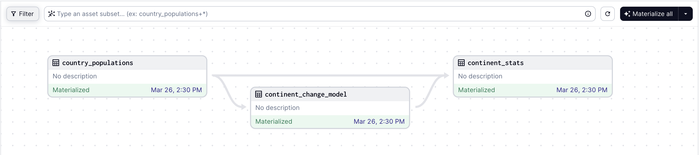

# 开源项目｜十种任务，十个入口

以下推荐依据用途、文档、许可和维护记录，不是今日 Star 排名。仓库、README、LICENSE 与版本记录已读取；本站没有安装这些项目或调用付费模型。版本日期用于说明状态，不把成熟工具包装成今天的新发布。

| 你要做的事 | 可以先看 | 最小验证目标 |
| --- | --- | --- |
| 建立个人资料问答空间 | AnythingLLM | 引用能否回到原段落 |
| 交互分析与记录实验 | JupyterLab | 重启内核后能否顺序运行 |
| 查明 Agent 哪一步出错 | MLflow | 记录一次检索与生成链路 |
| 对齐相机与三维观测 | Rerun | 同一时刻的坐标和图像是否吻合 |
| 检查视觉数据集失败样本 | FiftyOne | 按错误标签筛出具体图片 |
| 让扫描 PDF 能被搜索 | OCRmyPDF | 抽查文字层与原图是否一致 |
| 清理脏表与重复名称 | OpenRefine | 人工确认一次聚类合并 |
| 本地运行开放权重 | Ollama | 明确所选模型在本地还是云端 |
| 管理数据产物之间的依赖 | Dagster | 上游变动后定位需更新的产物 |
| 比较编码 Agent 的运行框架 | Open Interpreter | 固定任务与模型，观察工具调用 |

## 01 · AnythingLLM：把资料组织成可问答的工作空间

**近期版本：v1.16.1，8 月 27 日。** 它将文档导入、切分、检索和模型对话放在一个工作空间中，适合想做个人知识问答、又不想先组装整套后端的人。例如把同一课题的讲义与实验记录放在一起，要求每次回答附来源，再抽查引用是否真的支持结论。

个人使用可从桌面版开始；Docker 路径提供多用户能力，不能把两者功能直接混写。模型、嵌入和向量数据库可选本地或外部服务，初次配置时应把整条数据路径列清楚。只把软件部署在本机，不代表调用云模型时资料仍完全留在本地。

最小试用是导入两份小文档，分别问一个能回答和一个没有答案的问题，检查它能否给出有效引用并承认缺口。README 中仍在开发的 OpenComputer 不作为已经可用功能；检索质量也取决于文档解析和切分方式。

来源：[源码与上手说明](https://github.com/Mintplex-Labs/anything-llm) · [MIT](https://github.com/Mintplex-Labs/anything-llm/blob/master/LICENSE) · [版本记录](https://github.com/Mintplex-Labs/anything-llm/releases/tag/v1.16.1)。

## 02 · JupyterLab：让代码、数据和实验记录留在同一个地方

**成熟工具推荐；核验到 v4.6.3，8 月 10 日。** JupyterLab 可并排打开 notebook、文件、图表和终端。对正在学习 Python 的研究者，价值是把数据检查、短程序和解释放在一起，而不是每次只留一张结果截图。

最小路径是在独立 Python 环境安装 `jupyterlab`，再运行 `jupyter lab`。先用小表格完成读取、画图、写观察三步，然后保存 notebook 和依赖版本。运行内核与浏览器界面是不同部分，切换环境后要确认 notebook 使用的内核也跟着改变。

它并不会自动保证实验可复现：跳着执行单元格可能依赖隐藏变量。提交结果前重启内核并从头运行，比只看到最后一格成功更有意义。团队协作、远程访问和额外扩展各有自己的部署要求，不是安装核心包就全部具备。

来源：[源码与上手说明](https://github.com/jupyterlab/jupyterlab) · [BSD-3-Clause](https://github.com/jupyterlab/jupyterlab/blob/main/LICENSE) · [版本记录](https://github.com/jupyterlab/jupyterlab/releases/tag/v4.6.3)。

## 03 · MLflow：沿调用轨迹找出 Agent 的错误来源

**近期版本：v3.16.0，9 月 4 日。** MLflow 除了记录传统模型实验，也能记录 LLM 应用的调用轨迹、评估结果和提示版本。RAG 回答错误时，先看检索找到了什么，再看模型拿到什么，比仅保存最终回答更容易定位问题。

可在独立环境用 `uvx mlflow server` 启动本地界面，再按文档给一个最小应用加追踪。先记录一次“取资料 → 调模型”的链路，比较输入、输出、耗时及评估说明。自动追踪集成只负责记录；实际模型调用仍可能需要外部账户和费用。

官方界面示例中，左侧是父子调用关系，右侧是选中调用的消息。顺着这两处能区分“取错客户资料”和“模型生成错内容”。截图来自作者示例，未发生本站发送邮件或调用。（[来源原图](https://github.com/mlflow/mlflow)；[查看大图](images/project-mlflow.png)。）

追踪数据可能包含原始文档和提示，应按实际需要设置记录范围。开源服务与商业托管平台也要分开判断；本次只核验公开核心和文档。

来源：[源码与上手说明](https://github.com/mlflow/mlflow) · [Apache-2.0](https://github.com/mlflow/mlflow/blob/master/LICENSE.txt) · [版本记录](https://github.com/mlflow/mlflow/releases/tag/v3.16.0)。

## 04 · Rerun：把视觉和三维日志对齐到同一时间

**近期版本：0.37.2，9 月 11 日。** Rerun 面向机器人、空间感知和视觉系统，将图像、三维点、姿态与时间序列记录到可交互的查看器。相机画面看似正常，但点云位置不对时，同一时间轴上的数据比几份分散日志更容易暴露坐标问题。

Python 路径可从 `pip install rerun-sdk` 和官方最小日志示例开始，给每种数据设置实体路径与时间，再在查看器中回放。图像与点云不会仅因显示在一个窗口里就自动完成标定，仍需提供正确的坐标变换和时间戳。

官方点云示例：左侧相机框和坐标轴说明观察位置，中心点云说明空间结构，底部时间轴用于定位某一帧。这里的用途是对齐多种观测，不是展示模型生成的三维结果。（[来源原图](https://github.com/rerun-io/rerun)；[查看大图](images/project-rerun.png)。）

核心采用 MIT / Apache-2.0 双许可，商业平台另有范围。大规模点集、实体数量及远程数据读取会影响交互性能，建议从短片段排查，本站未进行性能测量。[MIT 许可](https://github.com/rerun-io/rerun/blob/main/LICENSE-MIT)。

来源：[源码与上手说明](https://github.com/rerun-io/rerun) · [Apache-2.0](https://github.com/rerun-io/rerun/blob/main/LICENSE-APACHE) · [版本记录](https://github.com/rerun-io/rerun/releases/tag/0.37.2)。

## 05 · FiftyOne：把视觉模型的错误变成可筛选样本

**近期版本：v1.22.0，9 月 12 日。** FiftyOne 用 Python 管理视觉数据集，并在浏览器中筛选图片、视频及标注。适合模型总体分数不错、却不清楚具体错在哪里的情况：按预测标签、置信度或自定义错误字段筛出一组样本，再检查是否集中在遮挡、低光或某类标注中。

官方当前安装范围为 Python 3.10–3.13，不能直接假设本机的 3.14 也受支持。在匹配的独立环境安装 `fiftyone`，导入少量图片与标签，启动 App，先确认字段和路径正确，再接入大数据集。视频工作还可能需要 FFmpeg 等组件。

可视化帮助发现问题，但不能自动证明某个特征造成了错误。嵌入图上的邻近关系也需要回到原图验证。开源核心与企业协作产品分别提供，团队权限等功能以具体版本为准。

来源：[源码与上手说明](https://github.com/voxel51/fiftyone) · [Apache-2.0](https://github.com/voxel51/fiftyone/blob/main/LICENSE) · [版本记录](https://github.com/voxel51/fiftyone/releases/tag/v1.22.0)。

## 06 · OCRmyPDF：给扫描 PDF 增加可搜索的文字层

**近期版本：v17.11.0，8 月 28 日。** OCRmyPDF 主要解决“PDF 看得到字，却搜不到字”的问题：识别扫描页，在页面图像之上增加文字层。对于准备进入知识库的扫描论文或讲义，这往往是文档解析之前的一步。

按系统安装说明准备程序、Tesseract 及所需语言包后，可从 `ocrmypdf -l chi_sim+eng input.pdf output.pdf` 处理一份副本。先确认中文与英文字体的识别结果，再批量运行；倾斜页、公式、表格和低清图像都需要额外抽查。

它不是翻译器，也不是自动理解论文结构的 RAG 解析器。增加文字层不会让原文变正确，错误 OCR 还可能让检索更隐蔽地出错。代码采用 MPL-2.0，文档等内容可能另有许可。本次没有修改用户的任何 PDF。

来源：[源码与上手说明](https://github.com/ocrmypdf/OCRmyPDF) · [MPL-2.0](https://github.com/ocrmypdf/OCRmyPDF/blob/main/LICENSE) · [版本记录](https://github.com/ocrmypdf/OCRmyPDF/releases/tag/v17.11.0)。

## 07 · OpenRefine：先整理脏表，再交给模型分析

**成熟工具推荐；核验到 3.10.1，3 月 4 日。** OpenRefine 用分面、聚类和转换操作清理表格。比如同一机构出现全称、缩写和错别字，先把候选聚到一起供人确认，比直接让 LLM 自由改写整列更容易追溯变化。

优先下载官方发行包，在本地浏览器界面导入一份 CSV 副本，先按空值和重复值查看分面，再尝试名称聚类。每次合并都应检查代表值及受影响行；字符串相似不代表现实中是同一对象。源码构建另需 JDK、Maven 和 Node，初学者没有必要先走构建路径。

本地清洗不必使用 AI，但连接外部 reconciliation 服务可能把待匹配文本发到服务端。核心 BSD-3-Clause 与外部数据源使用条件分别核对。它适合形成可审阅的清洗步骤，不能代替领域人员确认实体关系。

来源：[源码与上手说明](https://github.com/OpenRefine/OpenRefine) · [BSD-3-Clause](https://github.com/OpenRefine/OpenRefine/blob/master/LICENSE.txt) · [版本记录](https://github.com/OpenRefine/OpenRefine/releases/tag/3.10.1)。

## 08 · Ollama：把本地权重变成一个可调用的服务

**近期版本：v0.34.0，9 月 5 日。** Ollama 提供模型下载、运行和本地 API，适合先做简单命令行问答，再将同一个模型接到自己的 Python 应用。它减少了每个模型分别搭一套服务的工作，但模型体积与质量仍需要自行选择。

安装后从官方模型库选一个机器能容纳的小模型，用 `ollama run` 加模型名启动，再检查列表和运行状态。接应用前先用短问题确认模型已就绪，记录具体标签与量化版本；相同家族名称可能对应不同权重。

软件采用 MIT，模型本身有独立许可。官方也提供云模型路径，因此不能把所有通过 Ollama 发出的请求都叫作本地推理。长上下文会增加缓存开销，权重下载大小不能直接等同峰值内存。本站未下载模型或测量生成速度。

来源：[源码与上手说明](https://github.com/ollama/ollama) · [MIT](https://github.com/ollama/ollama/blob/main/LICENSE) · [版本记录](https://github.com/ollama/ollama/releases/tag/v0.34.0)。

## 09 · Dagster：根据产物依赖决定重跑哪些步骤

**近期版本：1.13.22，9 月 11 日。** Dagster 用“数据产物”组织流程：原始表、清洗结果、模型输出、最终报告都可以是资产。某个上游文件变了，依赖图能帮助判断哪些产物需要重新生成，而不只是到了时间便执行一串脚本。

官方 Python 路径可从 `dagster`、`dagster-webserver` 和 `dagster-dg-cli` 开始。先建立两个函数产物和一条依赖，运行一次 materialize，检查输入输出与日志，再扩展调度。已有任务不能仅因改成资产定义就获得幂等性，写外部系统的步骤仍应独立设计。

官方依赖图中，continent_stats 同时依赖原始人口表和中间变化模型。箭头说明产物依赖，绿色只表示示例中已物化，不能当成今天数据新鲜度已通过核验。（[来源原图](https://github.com/dagster-io/dagster)；[查看大图](images/project-dagster.png)。）

适合日报、数据管道和评测集构建等有明确产物的工作。Apache-2.0 核心与 Dagster+ 托管服务分开提供；本站没有迁移现有定时器。

来源：[源码与上手说明](https://github.com/dagster-io/dagster) · [Apache-2.0](https://github.com/dagster-io/dagster/blob/master/LICENSE) · [版本记录](https://github.com/dagster-io/dagster/releases/tag/1.13.22)。

## 10 · Open Interpreter：核对当前 Rust 版本，再比较编码框架

**近期版本：rust-v0.0.42，9 月 8 日。** 原仓库入口现跳转到 `openinterpreter/openinterpreter`。当前 README 介绍的是基于 Codex 分支发展的 Rust 编码 Agent，不能继续套用早期 Python 版“自然语言执行代码”的旧教程。

它提供多个模型提供方与运行框架选择，当前版本还增加了面向 Ollama 与 Qwen 工具调用的诊断路径。对研究者，一个具体用法是在独立测试仓库固定同一个小任务，观察不同框架的工具调用、重试和失败恢复，而不是仅比较最终回答。按发布页选择平台二进制，再核对该版本的配置文档即可起步。

主分支说明可能领先稳定发行版，列出的模型名称也不代表你的提供方账户已经开放。框架模仿或适配其他 Agent 的行为，不等于得到原产品认证，也不能据此宣称质量相同。代码采用 Apache-2.0；外部模型服务及执行权限另行配置，本站未安装或运行该程序。

来源：[源码与上手说明](https://github.com/openinterpreter/openinterpreter) · [Apache-2.0](https://github.com/openinterpreter/openinterpreter/blob/main/LICENSE) · [版本记录](https://github.com/openinterpreter/openinterpreter/releases/tag/rust-v0.0.42)。
