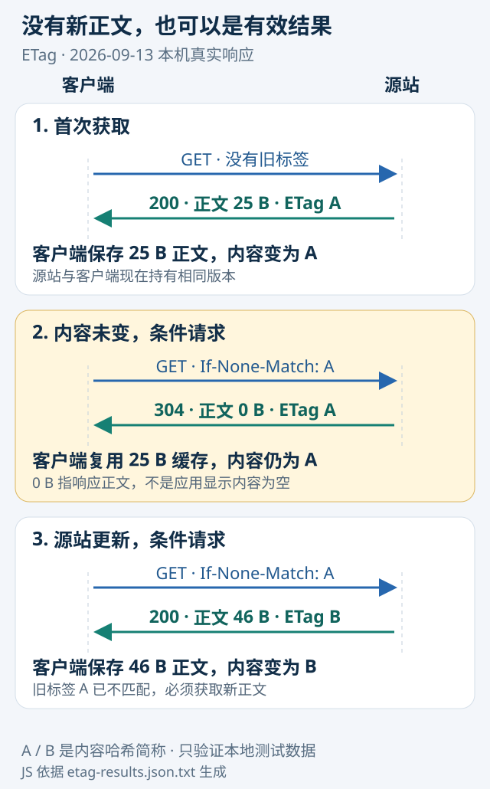

# 技术实践｜用 ETag 分清“没有更新”与“没拿到新内容”

**已运行验证。** 本节使用 Python 标准库在 `127.0.0.1` 建立一个可控 HTTP 服务，完成三次请求。它帮助理解网页采集和日报更新中的缓存判断；不是对真实新闻站点的网速测试，也没有改动本站线上缓存设置。

## 先理解两个角色

客户端保存一份正文和它的 ETag；服务器收到条件请求后，判断对应表示是否变化。ETag 是服务器给出的验证标记，客户端通常应把它当作不透明字符串。本实验为了方便核对，选择正文的 SHA-256 作为 ETag；协议本身不要求采用哈希。

首次请求没有旧标记，服务器返回 `200` 和正文。第二次请求附 `If-None-Match`，若内容未变，返回 `304`，响应不携带正文，客户端继续使用已经保存的那一份。服务器内容改变后，再用旧标记请求便会得到 `200` 和新正文。



图｜根据本次实际运行的 JSON 结果，由 JS 生成 SVG 并嵌入 HTML。中间的 0 B 是本次响应正文大小，右边的 25 B 是应用最终使用的缓存正文，两者不矛盾。A、B 是完整 SHA-256 的简称，图的箭头只表示该本地实验的请求顺序。[大图](images/practice-etag.svg) · [HTML](code/etag-flow.html) · [生成源码](code/render-etag.mjs)。

## 本次运行结果

运行时间：2026-09-13 08:16:59 北京时间。环境：macOS 26.5.1、ARM64、Python 3.14.3，无第三方 Python 依赖。

| 步骤 | 请求条件 | HTTP 状态 | 响应正文 | 应用最终使用 | 内容标记 |
| --- | --- | --- | --- | --- | --- |
| 首次获取 | 无旧 ETag | 200 | 25 B | 25 B | A |
| 内容未变 | If-None-Match: A | 304 | 0 B | 25 B | A |
| 源站更新 | If-None-Match: A | 200 | 46 B | 46 B | B |

第一版是“标题：第一版日报”加换行，第二版是“标题：第二版日报，新增核验结果”加换行。字节按 UTF-8 编码计算，不能按汉字个数计算。

```text
A = 8f6ed769a7f71cf0b79cf9340f74cb7bae49da696ff5079a7d01c042e5b3f685
B = 939a197fb22e2a214221085f47d782602e33649661f2e0201406c567ba7c283c
```

脚本断言了状态顺序、304 响应为空、缓存复用后的哈希，以及更新后正文与源站一致，结果全部通过。没有测量真实带宽节省或延迟收益。[原始结果](code/etag-results.json.txt)。

## 核心实现与复现

下载 [完整脚本](code/etag_demo.py)，在本地目录运行：

```bash
python3 etag_demo.py
```

脚本绑定临时端口，使用短文本测试数据，请求结束后停止服务。客户端的关键逻辑可概括为：

```python
headers = {"If-None-Match": cached_etag} if cached_etag else {}
# 200：保存新正文与新 ETag
# 304：必须已有缓存，继续使用缓存正文
# 其他响应或缓存缺失：报告失败，不能假装得到有效新内容
```

Python 的 `urllib` 会通过 `HTTPError` 路径交付 304，完整实现对此单独处理。程序禁用的是这些本地请求的代理，避免本机测试受网络代理影响，不会改变用户的系统代理设置。

如需重建配图，把 [结果文件](code/etag-results.json.txt) 与 [render-etag.mjs](code/render-etag.mjs) 放在同一 `code` 目录，运行 `node render-etag.mjs`。它读取结果生成 `etag-flow.html` 与相邻 `images/practice-etag.svg`，图中数字没有手工另写一份。

## 用在采集流程时，哪些判断还不能省

`Cache-Control: no-cache` 的含义是重用前需验证，并不等于不允许存储；后者对应 `no-store`。304 表示对本次条件请求无需再发送表示内容，前提是你已经持有可用缓存。它不是“网页没内容”，也不应该被直接写成采集失败。

另一方面，ETag 验证的是对应资源表示，不验证文章里的事实，更不保证代理后面所有来源都已刷新。对于新闻采集，仍要保留来源日期、获取时间、访问失败和缓存提示。服务给出旧内容却错误地保留 ETag，本实验也无法替它发现事实更新。

教学服务器只实现单一 URL 的精确标签匹配，没有覆盖弱 ETag、标签列表、Vary、压缩与鉴权等完整语义，也不应用于公开服务。正式实现应使用成熟 HTTP 客户端与缓存库，并按标准处理条件请求。

来源：[RFC 9111：HTTP Caching](https://www.rfc-editor.org/rfc/rfc9111.html) · [Python http.server 文档](https://docs.python.org/3/library/http.server.html)。
