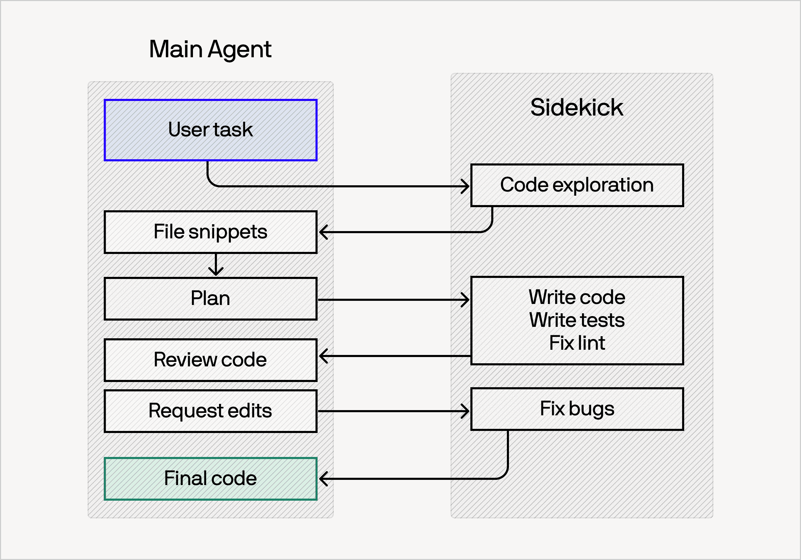
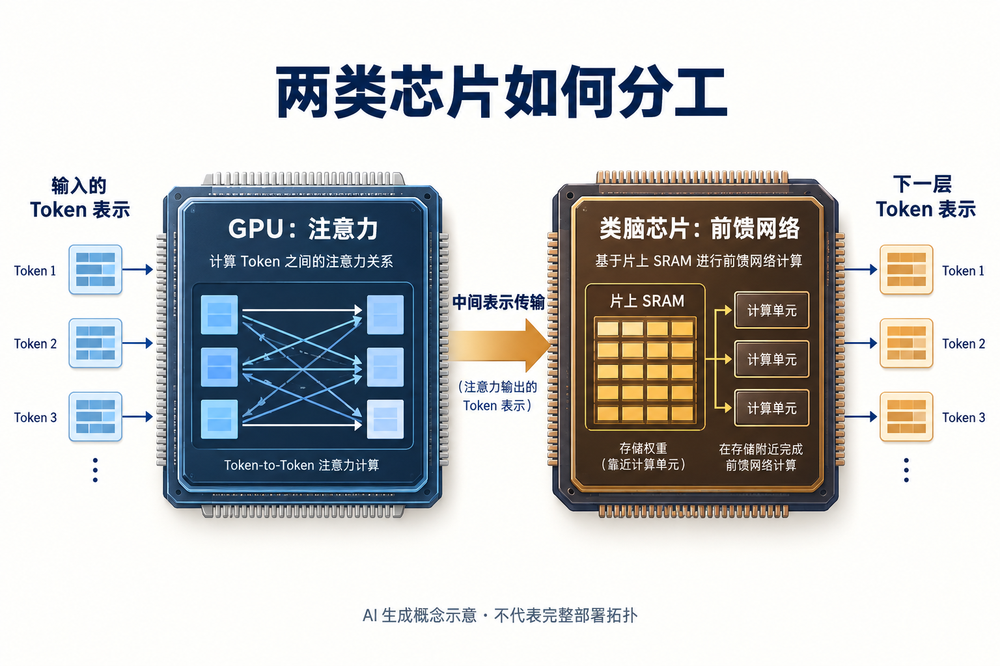
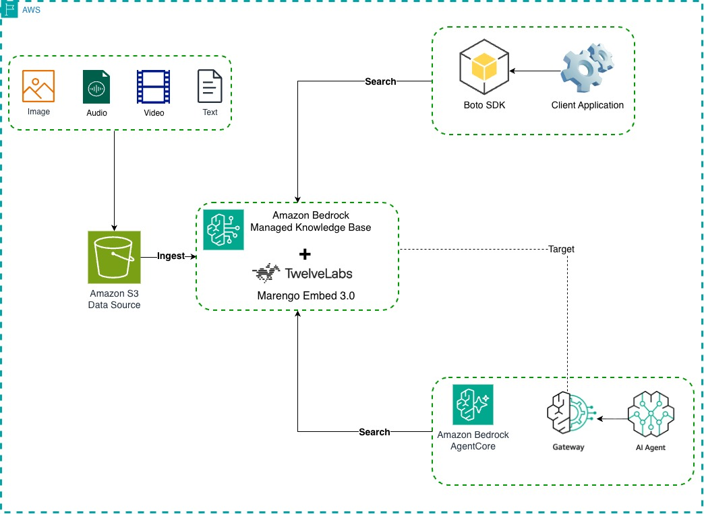
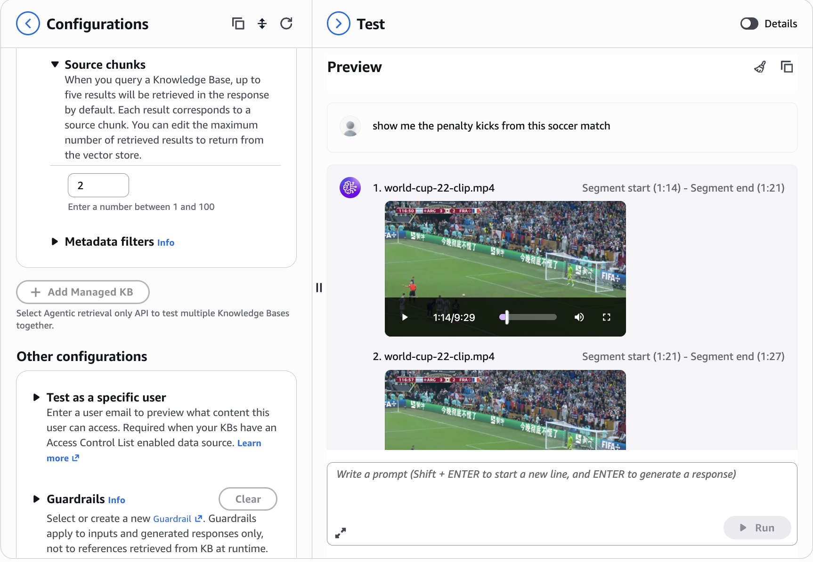
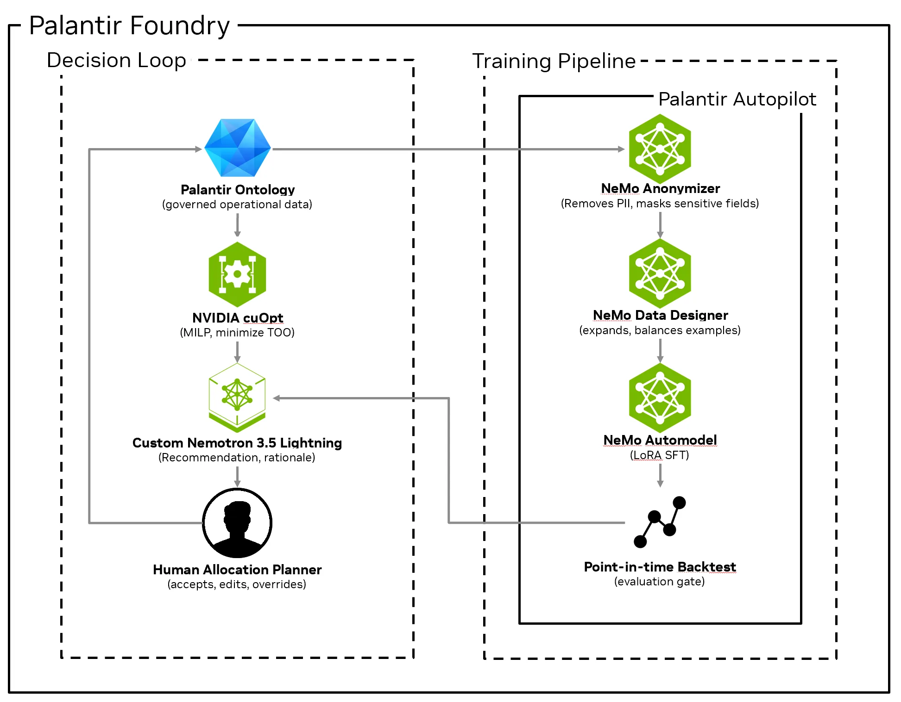
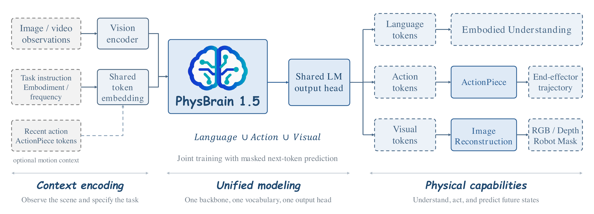

# AI 动态｜5 条重点详解 + 10 条速读

本期以 9 月 14 日晚间复查后的可核验信息定稿，事件日期覆盖 9 月 9–14 日。新收录不等于今天首发：例如 PhysBrain 1.5 的发布日是 9 月 9 日，CMI 公告是 9 月 11 日，均按原日期标注。重点五条约需 15 分钟；十五条全部阅读约 25 分钟。

## 01 · Devin Fusion 进入桌面端与 CLI：两套上下文如何分工

**2026-09-11 · 近期补充 · 重点详解。**

Cognition 将 Fusion 开放到 Devin Desktop 与 CLI。它把较强的主模型与较省成本的搭档模型组合在同一个编程流程中：主模型调查任务、制定计划和审查改动，搭档负责探索代码、实现、测试及修复。此次新增的是本地桌面端与命令行入口，不是重新发布 SWE-2 权重；SWE-2 已在 [9 月 11 日](../2026-09-11/01-AI动态.md)介绍。

普通的“任务看起来简单就换小模型”面临两个问题：读完代码前很难判断难度，模型中途切换也会破坏已有提示词缓存。Fusion 让两位 Agent 各自保留上下文，只交换任务简报、结果和反馈，避免把每一次工具输出来回搬运。主模型仍掌握最终审查，不是把整项任务一次性交给搭档。

Cognition 原图。顺着左右往返箭头看：交接的是代码片段、计划和修改意见；两块背景表示不同上下文。图解释协作方式，不能由箭头数量推算节省比例。（[来源原图](https://cognition.ai/blog/local-fusion)；[查看大图](images/news-fusion.png)。）

对科研读者，最值得复查的是成本与成功率是否同时可接受。官方 DeepSWE 1.1 的 Fable 对照从 64.3 分、每任务 14.63 美元变成 63.1 分、7.88 美元；Astra 的 Terminal-Bench 4 对照则从 55.6 分降为 50.0 分，同时成本降低。省钱的同时，个别设置确实损失了成功率，不能只摘取“最高效率提升”的标题。

例如批量处理仓库测试失败时，可以先让搭档执行确定性的修改，再由主模型判断是否满足需求；但架构设计或错误定位困难的任务，复核成本可能更高。实际采用需同时记录完成率、重试次数、token 与每项总费用。

目前可通过 Devin Desktop／CLI 选择主模型与搭档组合，具体账号可用性和收费仍按产品配置。以上是厂商基准及工作方式说明，本站未安装试跑，也未验证其节省幅度。

来源：[原始公告或署名报道](https://cognition.ai/blog/local-fusion)。

## 02 · 中国移动展示 GPU 与类脑芯片混合推理系统

**2026-09-13 · 重点详解。**

央广网刊载的移动云供稿介绍了国产 GPU 与类脑芯片协同的大模型混合推理系统。参与方包括移动云、南湖研究院、灵汐、天数智芯及清华、北大。新闻中的“异构”是让不同类型芯片承担不同计算，而不是把多张同类 GPU 连起来。

核心分工是把 Attention 与 FFN 两类运算分开：前者负责当前 token 与上下文的信息交互，后者对特征进一步变换。报道介绍，GPU 承担注意力计算，类脑芯片侧利用片上 SRAM 靠近计算的特点承担前馈计算，再由统一引擎协调。它试图解决的瓶颈包括频繁搬运权重和数据带来的能耗，不只是峰值算力不足。

AI 生成的概念示意：只表达报道确认的 GPU／类脑芯片分工及数据交接，不代表真实芯片外观、互连拓扑或精确 Attention 掩码。来源未提供可用机制原图，因此使用内置 imagegen；[最终提示词](code/mobile-imagegen-prompt.txt)随刊保留。（[事实依据](https://www.cnr.cn/gd/guangdongyaowen/20260913/t20260913_527812317.shtml)；[查看大图](images/news-mobile-concept.png)。）

需要分清两组拆分：预填充与解码是推理的不同阶段，Attention 与 FFN 是网络内不同计算模块，不能把两组词当成一一对应的同义词。真正的端到端收益还取决于编译、跨芯片通信、负载均衡，以及哪一段运算成为新的等待点。

供稿称已完成 DeepSeek-V4-Flash 适配验证，并报告效率与成本改善；但没有提供足够完整的批量大小、序列长度、芯片配置及对照条件，本站不将宣传数字改写为独立实测。它目前更适合作为异构推理路线的案例，尚不足以给读者一个通用采购或部署结论。

对外开放也有明确边界：报道说后续将逐步开放相关框架与能力，不能写成已经公开全部代码或所有模型均可直接运行。值得继续跟踪的是可获取的实现、支持模型列表和可复现基准，而非只看硬件类别的新组合。

来源：[原始公告或署名报道](https://www.cnr.cn/gd/guangdongyaowen/20260913/t20260913_527812317.shtml)。

## 03 · Bedrock 用 Marengo 3.0 把视频搜索落到具体片段

**2026-09-10 · 近期补充 · 重点详解。**

Amazon Bedrock Knowledge Bases 宣布正式支持 TwelveLabs Marengo Embed 3.0。此次变化是把多模态嵌入接入托管知识库工作流，用户不必自行串起视频切段、抽帧、转写、向量化和索引的全部步骤。它不是一个只返回整段视频概述的聊天功能，也不是 Marengo 模型首次出现。

用户把原始素材放入 S3，知识库摄取后为不同模态建立可检索表示。文字查询可以定位图像或视频中的语义内容，结果带有对应资源及视频片段起止时间。对需要搜索课堂录像、产品演示或历史媒体素材的人，真正有用的是找到具体时刻，再回原片核对上下文。

AWS 工作流原图。左侧是资料摄取，右侧是两种查询入口；模型负责表示与检索，S3 保存原始资源。AgentCore 是图中一种连接方式，不表示使用检索必须先搭完整 Agent。（[来源原图](https://aws.amazon.com/blogs/machine-learning/video-and-image-search-in-amazon-bedrock-knowledge-base-using-marengo-3-0/)；[查看大图](images/news-marengo-flow.jpg)。）

官方用一段世界杯录像演示搜索点球片段。先看结果顶部的时间范围，再看预览播放器：这比仅返回文件名多了一层可核查定位，但画面命中与语义正确仍需要人工确认。如下图属于 AWS 的演示，不是本站上传视频所得。

AWS 控制台原图。右侧 1:14–1:21 等起止时间是定位依据，左侧可调返回片段数。片段和上下文应一起阅读，检索结果不等于模型对整场比赛的事实判断。（[来源原图](https://aws.amazon.com/blogs/machine-learning/video-and-image-search-in-amazon-bedrock-knowledge-base-using-marengo-3-0/)；[查看大图](images/news-marengo-search.png)。）

这一流程适合先做“小资料库＋固定问题”的验证：比较有没有找对片段、不同问法是否稳定、文字转写遗漏是否影响召回，然后再考虑自动生成回答。向量相似度本身不是答案正确率。

公告列出美国东部弗吉尼亚北部和欧洲爱尔兰区域，使用仍需相应 AWS 账号权限、模型访问及存储／嵌入／检索资源。区域和文件限制要按所选入口确认，不能把托管流程理解为完全免费或任意格式都可用。[Marengo 模型说明](https://www.twelvelabs.io/blog/marengo-3-0)。

来源：[原始公告或署名报道](https://aws.amazon.com/blogs/machine-learning/video-and-image-search-in-amazon-bedrock-knowledge-base-using-marengo-3-0/)。

## 04 · NVIDIA 与 Palantir：把约束求解和业务推理接在一起

**2026-09-10 · 近期补充 · 重点详解。**

NVIDIA 与 Palantir 宣布将主权 AI 能力用于关键供应链，先从 NVIDIA 自身运营展开。配套技术文章比合作口号更值得读：供应链决策需要同时处理库存、产能等硬约束，以及邮件、客户承诺、历史经验这类非结构化信息，两者由不同组件承担。

Palantir Ontology 把业务对象、关系和权限组织起来，cuOpt 在数量与约束条件下求分配方案，定制 Nemotron 3.5 Lightning 再结合业务语境提出建议并解释理由。最终仍由计划人员接受、编辑或覆盖建议。语言模型参与决策说明，不等于它独立算出了满足全部约束的最优方案。

NVIDIA 技术原图。先看左侧 cuOpt 和 Nemotron 的不同职责，再看右侧模型必须通过历史时点回测才返回业务流程。底部人工节点表示仍有人审核和修改。（[来源原图](https://developer.nvidia.com/blog/from-wafer-out-to-first-token-codifying-supply-chain-expertise-with-nemotron-and-palantir-foundry/)；[查看大图](images/news-palantir.webp)。）

模型定制使用历史决策与反馈，经过脱敏、补充样本、LoRA 微调和回测。回测尤其强调只给模型当时已经知道的信息，把后来的真实结果留作评价；否则模型读到事后答案，历史成绩就会失去意义。这个数据切分原则也适用于普通时间序列和业务预测实验。

可以把实际场景想成多个客户争用一批紧缺部件：优化器比较满足约束的分配，语言模型补充合同语境、承诺与取舍说明，业务人员做最后决定。它的研究价值在于如何让约束求解与语言推理各做适合的工作，而非笼统地把整个流程称为自动采购。

当前公告描述的是合作与部署路线，不能据历史回测推出未来供货改善保证。开放 Nemotron 权重也不代表 Foundry 或 AIP 一并开源；企业仍需自己的业务数据、治理配置与部署条件。本站没有进入其生产系统，未核验真实经营收益。

来源：[原始公告或署名报道](https://nvidianews.nvidia.com/news/nvidia-and-palantir-bring-sovereign-intelligence-to-critical-supply-chains)。

## 05 · PhysBrain 1.5：理解、动作与未来状态共用一个模型

**2026-09-09 · 近期补充 · 重点详解。**

深度机智的 PhysBrain 1.5 把具身理解、动作生成与未来状态预测放在一个自回归模型内。今天的媒体报道再次介绍该项目，但明确给出的正式发布日是 9 月 9 日，本期按这个日期首次补收。团队提供 2B、8B 模型与评测工具入口，不能把今天的报道日期当作新的权重版本。

结构基于 Qwen3-VL，文字、动作和未来视觉状态都表示为离散 token，共用下一 token 预测目标。理解模块回答环境和任务问题，动作 token 描述末端执行器轨迹，未来状态则包括图像、深度与机器人区域。这个设计试图减少多个专用模型之间的信息接口，而不是只在通用 VLM 外面接一个聊天提示词。

DeepCybo 的架构原图。看不同类型输出怎样共用主干，再区分“预测未来画面”和“机器人已经完成动作”。生成未来状态提供推断信号，不能代替真实环境的反馈。（[来源原图](https://deepcybo-physai.github.io/PhysBrain-1.5/)；[查看大图](images/news-physbrain.png)。）

官方项目页在 28 项具身理解与规划基准上报告 8B 总分 72.5；闭源对照仅作为参考，2B 也不参与页面所列开源排名。这个总分不能直接解释为机器人真实操作成功率，更不能由与某个闭源模型均分接近推出两者所有能力相当。不同分项仍存在明显强弱差异。

训练介绍强调人类交互视频的预训练监督，再结合人类演示、真实机器人轨迹与仿真经验做监督微调。研究时值得比较的是这三类监督分别改善了哪一项能力，以及理解题收益能否传递到动作闭环。只看综合均分难以回答这些问题。

本期核对了官方架构、结果表和开放入口，未运行机械臂，也未下载大体积权重。后续复现应固定控制配置、摄像头与任务条件，记录真实反馈和失败方式；不能将项目页的架构愿景表述为已经能在开放环境里无限自学。[发布日来源](https://www.qbitai.com/2026/09/488725.html)。

来源：[原始公告或署名报道](https://deepcybo-physai.github.io/PhysBrain-1.5/)。

## 06 · 阿里云国际地域新增 Vidu 图像与视频接口

**2026-09-14 · 速读。**

Model Studio 的新模型表新增 Vidu Q3 的通用、广告与剧情参考生视频接口，以及 Q2 Pro Fast 图生视频和 Vidu 参考图像生成。几个接口针对的输入和用途不同：商品图、角色参考与首帧图不能直接混为一种调用方式。此次确认的是阿里云国际地域的模型接入，不能写成 Vidu 所有模型今日首次发布，也不能将国际地域可用性套到所有区域。开发者可按具体模型 ID 核对输入、权限与计费后接入。

来源：[原始公告或署名报道](https://www.alibabacloud.com/help/en/model-studio/newly-released-models)。

## 07 · 智谱融资公告披露下一代 GLM 的完全自训练方向

**2026-09-13 · 速读。**

智谱的公司公告披露配售与债券安排，并计划将所得款项净额约 60% 用于下一代 GLM、完全自训练体系及训练／推理基础设施。这里有价值的技术信息是长期任务、训练环境与自我改进进入明确的研发投入方向；文件将完全自训练作为技术愿景描述。它不是新模型已经上线的产品公告，没有可据此填写的版本号、参数或独立能力成绩。配售协议订于 9 月 12 日，文件于 13 日公开，本期保留这一区别。

来源：[原始公告或署名报道](https://ea-cdn.eurolandir.com/press-releases-attachments/4179721/HKEX-EPS_20260913_12330384_0.PDF)。

## 08 · CMI 回应 Navier–Stokes 进展：评估仍按奖项规则推进

**2026-09-11 · 近期补充 · 速读。**

Clay 数学研究所在正式声明中对 Navier–Stokes 问题可能得到解决表达期待，并说明后续会依规则评价成果和归属，过程不急于完成。相比 [9 月 8 日](../2026-09-08/01-AI动态.md)对研究进展的报道，新增事实是奖项机构自己的回应。声明没有宣布奖金已颁发，也没有给出本站可独立复核的完整数学证明。其日期为 9 月 11 日，不能因今天出现媒体转述便改成今日定案。

来源：[原始公告或署名报道](https://www.claymath.org/news/navier-stokes-announcement/)。

## 09 · Anthropic 发布经济情景探索器

**2026-09-09 · 近期补充 · 速读。**

Anthropic 把自动化、生产率、采用速度及新增任务等假设放进经济情景工具，让读者比较到 2030 年美国增长、工资与就业的不同路径。它的价值在于观察假设如何改变结果，而非给出一个已经确定的未来。较快增长并不意味着每类知识工作者同时获益；全经济与某一职业群体的失业口径也不能混用。工具和配套研究可供探索，页面中的未来数字属于条件情景，不是已经观测到的就业事实。

来源：[原始公告或署名报道](https://www.anthropic.com/institute/econ-scenarios)。

## 10 · 多位 AI 领导者回应独立监督倡议

**2026-09-13 · 速读。**

据 The Decoder 对公开回应的整理，Sam Altman、Elon Musk 与 Demis Hassabis 支持了 Amodei 倡议中的部分独立监督方向。这是 [9 月 13 日](../2026-09-13/01-AI动态.md)所述倡议之后的回应，不应被写成各公司已签署统一停训协议。本站读取了媒体正文，但对应 X 原帖直连未成功，故保留报道属性；具体制度、执行权限与承诺范围仍需正式文件确认。

来源：[原始公告或署名报道](https://the-decoder.com/altman-musk-and-hassabis-back-amodeis-call-to-add-independent-oversight/)。

## 11 · SageMaker 增加前缀感知路由

**2026-09-10 · 近期补充 · 速读。**

前缀缓存只有落到存着相同前缀的推理实例上，才更可能复用。SageMaker 的新路由策略据此选择实例，并处理拥塞和扩缩容后的分配。它适合大量请求共享系统提示词或文档前缀的部署，但需要至少两个实例且推理容器启用相应缓存。前缀长度参数的单位还随入口不同而有区别，不能都按 token 填；厂商的特定延迟收益也不能直接套到随机前缀流量。

来源：[原始公告或署名报道](https://aws.amazon.com/blogs/machine-learning/reduce-llm-latency-with-prefix-aware-routing-on-amazon-sagemaker-inference/)。

## 12 · NVIDIA 与澳大利亚伙伴规划最高 2GW AI 基础设施

**2026-09-09 · 近期补充 · 速读。**

NVIDIA 宣布与澳大利亚数据中心伙伴扩展 AI 基础设施，规划到 2027 年形成最高约 2GW 的容量。这里涉及的是合作方建设和供电、设施等安排，不能直接翻译成现在已有 2GW GPU 正在运行，也不是全部由 NVIDIA 自建持有。对模型服务而言，这类计划影响未来算力供给和部署区域，但实际可用时间仍取决于建设、能源与设备交付。

来源：[原始公告或署名报道](https://nvidianews.nvidia.com/news/nvidia-expands-ai-infrastructure-capacity-in-partnership-with-australias-data-center-ecosystem)。

## 13 · Kimi Work 3.2.9 增加系统分享入口与 PDF 导航

**2026-09-14 · 速读。**

Kimi Work 发布日志新增 3.2.9：部分格式可通过微信等应用的分享菜单发给 Kimi，也可从文件右键菜单选择用 Kimi 打开；PDF 预览增加目录与页码跳转。新版还增加熄屏保持唤醒开关，服务于远控和后台任务连续运行，并允许点击已引用文件在右侧工作台预览。相比前版，这些变化连接了系统文件入口、资料阅读和后台工作流程；支持范围仍以具体格式和客户端版本为准，不应扩写成所有应用内容都能自动导入。

来源：[原始公告或署名报道](https://www.kimi.com/help/kimi-work/release-notes)。

## 14 · Dioxus 团队加入 Cognition，继续投入原有开源项目

**2026-09-10 · 近期补充 · 速读。**

Cognition 宣布 Dioxus 团队加入，计划继续投入 Dioxus、Blitz、Taffy 与 Subsecond，并把相关桌面和渲染技术用于 Devin 的计算机操作与测试能力。对使用这些 Rust UI 工具的开发者，当前最关键的信息是项目仍将继续投入，公告并非宣布停止维护。未来与 Devin 的结合属于研发计划，不能提前写成已经证明浏览器测试成功率提升。

来源：[原始公告或署名报道](https://cognition.ai/blog/welcoming-dioxus)。

## 15 · Liberty Global 投资 Positron，关注推理的内存成本

**2026-09-11 · 近期补充 · 速读。**

Liberty Global Tech Ventures 公告投资 Positron，后者以面向推理的内存系统与软硬件设计为重点。本轮总融资约 8.75 亿美元不能误写成 Liberty 一家投入的金额。公告区分已有 Atlas 与后续 Asimov 路线：后者计划于 2026 年末流片、2027 年下半年生产，尚不是现货。LPDDR 等路线提供不同于 HBM 的成本选择，但需要在具体模型和服务负载下比较端到端表现。

来源：[原始公告或署名报道](https://rss.globenewswire.com/news-release/2026/09/11/3360204/34554/en/liberty-global-tech-ventures-invests-in-ai-inference-hardware-and-software-company-positron-ai.html)。
