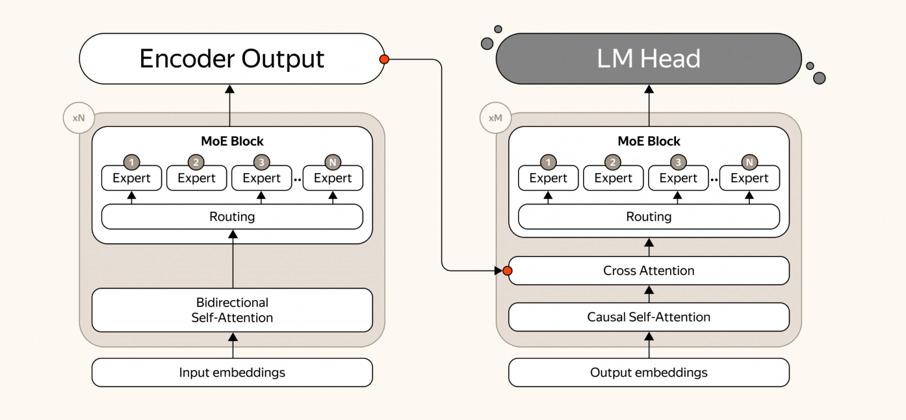
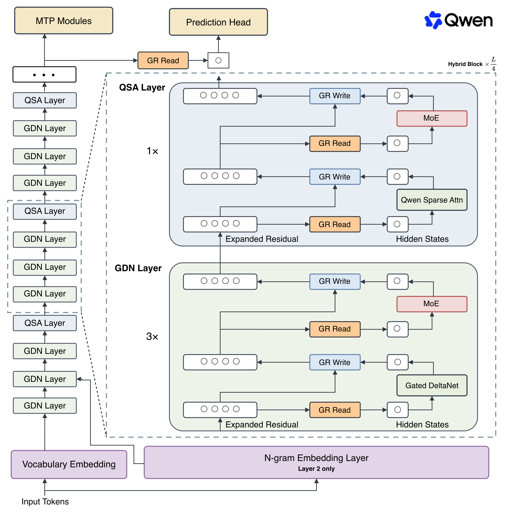
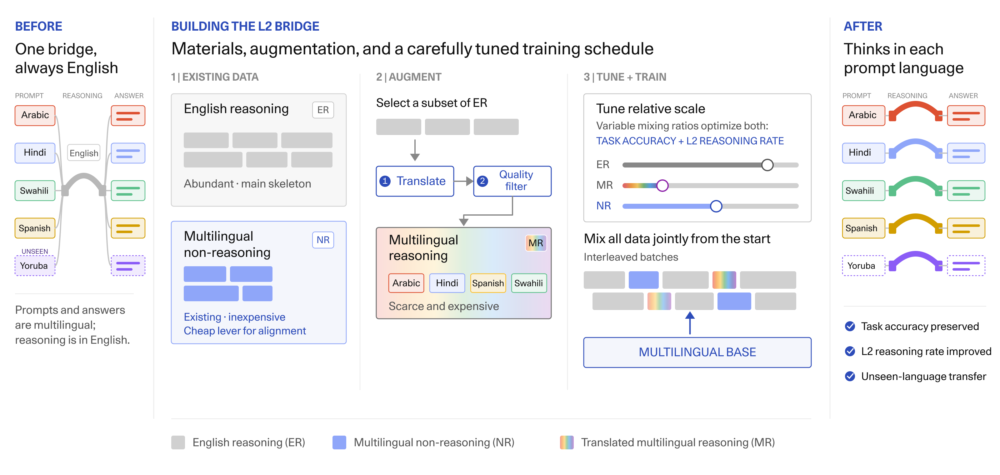

# 开源模型｜先理解结构，再估算能否部署

六项涵盖检索 Agent、稀疏编码解码器、图像几何、多语言推理与语音。栏目包括开放权重和受限开放模型，不把“文件可见”统一称为无限制开源。本站核对了模型卡、配置、文件目录和可访问的许可，未下载大体积权重、未运行这些模型。

| 模型 | 主要研究点 | 使用前先看 |
| --- | --- | --- |
| Iris mini / pro | 搜索任务里的上下文管理 | 工具、重试与上下文清理也消耗成本 |
| AliceAI T5 35B-A0.6B | 稀疏编码器—解码器 | Base 不是即用聊天模型 |
| Marigold V2 | 从单图提取几何与材质信息 | 相对深度不能直接当米制测量 |
| Qwen3.8-Flash-Next | 稀疏注意力与额外词组记忆 | 约 180B 总权重及定制许可 |
| TinyAya L2 Thinker | 推理语言与题目语言一致 | gated 权重，非商业许可标签 |
| Irodori TTS v4.1 Anime | 日语风格化语音微调 | 条件控制与基座可能不同 |

## 01 · Iris mini：搜索成绩也取决于上下文怎样清理

**仓库创建于 2026-09-01 UTC（北京时间 9 月 2 日），9 月 2 日 UTC 修订；近 30 天首次补充。** Iris-mini 基于 Qwen3.6-35B-A3B，面向需要多轮搜索的研究任务。mini 与更大的 pro 属于同一系列，本栏合计一项；模型、搜索工具与运行框架共同决定最终效果。

模型卡提供了特别有用的同模型对照：当搜索历史越堆越长，到阈值后清空历史，只保留最初的问题，再继续检索。这种 `discard-all` 策略看似丢失信息，却可能减少已经走偏的历史对后续答案的影响。加上 retry 又改变了尝试次数，因此不能将所有分数只归功于权重。

| Iris-mini 的上下文设置 | BrowseComp，作者报告 |
| --- | --- |
| 不进行上下文管理 | 64.7 |
| discard-all | 82.2 |
| discard-all 加 retry | 85.9 |

这些是模型卡所列设置，跨模型比较项还含各自报告口径，并非本站统一复测。最有价值的复现是固定搜索额度与重试次数，再看清理策略是否仍带来收益。

模型采用 Apache-2.0。卡片称 35B 总参数、3B 激活；文件元数据约 35.95B，BF16 权重约 71.9 GB，激活少不等于只需装下 3B。官方 SGLang 示例使用四张 GPU，只能视为示例配置，不能推成最低硬件要求。完整 Agent 仍需检索服务、上下文预算与计费记录。[许可](https://huggingface.co/AllSpark-Research/Iris-mini/blob/main/LICENSE)。

来源：[模型卡与文件目录](https://huggingface.co/AllSpark-Research/Iris-mini)。

## 02 · AliceAI T5：少量激活专家，仍保留编码器与解码器

**2026-09-10 创建权重仓库，9 月 11 日发布公司技术介绍。** AliceAI-T5-35B-A0.6B 是稀疏的编码器—解码器模型。编码器先把整段输入转成表示，解码器再根据这些表示生成输出；适合研究检索表示、理解任务与条件生成，不应直接当成已经完成聊天对齐的助手。

模型使用大量可路由专家，单次只选部分专家参与计算。名称中的 A0.6B 描述激活规模，全部权重仍约 35B。它还提供独立编码器输出，用于下游表示学习；这与只能按顺序生成文字的普通聊天入口不同。

Yandex 的结构原图。先沿左侧读输入如何被编码，再看右侧交叉注意力怎样读取输入表示。专家路由节省的是每次计算，未消失的专家权重仍需要存放。（[来源原图](https://habr.com/ru/companies/yandex/articles/1080654/)；[查看大图](images/model-alice.png)。）

该 Base 权重使用 UL2 风格去噪训练，模型卡列出 128K 上下文及自定义代码加载路径，采用 Apache-2.0。原始 BF16 权重下限接近 69 GB，还需中间激活与缓存。使用 `trust_remote_code` 前应先读所加载的实现；编码器向量也要针对自己的任务评测，不能将预训练基准成绩当成现成检索质量保证。本站未运行推理。[许可](https://huggingface.co/yandex/AliceAI-T5-35B-A0.6B/blob/main/LICENSE)。

来源：[模型卡与文件目录](https://huggingface.co/yandex/AliceAI-T5-35B-A0.6B)。

## 03 · Marigold V2：从图像中分离几何与材质

**官方仓库记录 2026-09-08 发布，9 月 13 日有权重仓库更新。** Marigold V2 从一张图预测深度、表面法线和反照率等信息。反照率可粗略理解为物体材质本身的颜色，尽量剥离照明影响；这些输出可用于场景分析与后续编辑，不是额外生成一张风格图。

它建立在 Qwen-Image-Edit-2509 上，发布物包含 LoRA 与相关组件。只下载一个适配器文件并不等于拿到独立可运行的完整模型，仍要按官方流程准备基座、VAE 和推理依赖。

Huawei Bayer Lab 的定性示例。优先看毛发与轮廓边缘能否保留，而不是把这一张好看的例子当作所有图片上的平均领先。深度结果表达相对结构，不能从图中直接量出真实距离。（[来源原图](https://github.com/huawei-bayerlab/marigold-v2)；[查看大图](images/model-marigold.webp)。）

权重卡与实现标为 Apache-2.0。官方给出的推理内存参考为 1024×1024 约 17 GB、2048×2048 约 29 GB，具体会随运行配置变化。其深度具有仿射不变性：相对远近有意义，尺度与偏移还需要外部校准。科研复现适合固定输入分辨率，对深度、法线与材质分别测，不把图像编辑基座的能力全部算到几何预测上。[模型入口](https://huggingface.co/huawei-bayerlab/marigold-v2-0)。

来源：[模型卡与文件目录](https://huggingface.co/huawei-bayerlab/marigold-v2-0)。

## 04 · Qwen3.8-Flash-Next：计算稀疏，不代表总权重很小

**2026-08-24 创建、8 月 27 日修订；近 30 天首次补充。** Qwen3.8-Flash-Next 的价值在结构探索：混合 Gated DeltaNet 与稀疏注意力，加入 n-gram embedding 和额外残差连接机制。开放权重与生产 API Qwen3.8-Flash 分开发布，不能把 API 的默认百万上下文和内置工具直接移植为本地版承诺。

注意力负责读取上下文位置，Delta 类状态负责更紧凑地累积信息，n-gram embedding 则给短词组增加可查表的表示。额外查表参数计算较轻，却依然占存储；是否能卸载、卸载后有多快，要看推理实现和设备带宽。

Qwen 团队的架构原图。先看左侧层之间怎样交替，再看 n-gram 分支接入的位置；不同模块分别影响计算、访存与信息传递。不要只盯着“6B activated”忽略旁路参数。（[来源原图](https://huggingface.co/Qwen/Qwen3.8-Flash-Next)；[查看大图](images/model-qwen.png)。）

模型卡列出主干 125B、其中 6B 激活，另有约 51B 词组嵌入和 4B MTP，总权重约 180B。按 BF16 粗算仅权重就约 360 GB，未计运行开销。

本版本是 Qwen Community License 1.0。条款对从事模型服务或独立 AI 编程／办公助手业务的主体规定了商业使用需另行授权的条件，并有大规模服务的展示要求；不是 Apache-2.0。内部使用例外与具体业务定义须按全文判断，模型可下载不代表各种托管业务都获许可。[许可全文](https://huggingface.co/Qwen/Qwen3.8-Flash-Next/blob/main/LICENSE)。

来源：[模型卡与文件目录](https://huggingface.co/Qwen/Qwen3.8-Flash-Next)。

## 05 · TinyAya L2 Thinker：推理语言也应纳入评测

**仓库于 2026-09-02 创建，技术报告于 9 月 9 日提交，9 月 11 日仓库修订。** TinyAya L2 Thinker 关注一个容易漏测的问题：用户用某种语言提问，模型的推理能否也稳定保持该语言，而不是自动转回英文。

技术报告把英文推理、多语言非推理任务和翻译得到的多语言推理样本混合训练。它试图让“会推理”和“会用目标语言”从训练开始就相互连接，避免先强化英语推理，再靠少量补丁迁移语言。

Mehrnaz Mofakhami 等技术报告的原图。看不同数据种类怎样为同一能力提供桥接信号；这张图解释数据配比的作用，不表示各种语言的最终准确率相同。（[来源原图](https://arxiv.org/abs/2609.10445)；[查看大图](images/model-tinyaya.png)。）

报告在 60 种语言、六项基准上研究约 3.35B 模型，并报告超过 93% 的目标语言保持率；这个比例衡量语言一致性，不能写成答题正确率。不同任务准确率和推理循环等失败模式仍需单独检查。

HF API 公开列出三个权重分片、自动 gated 和 CC-BY-NC-4.0 许可标签，但本次 README／许可文件的直接访问返回 401，未接受访问条款，也未下载权重。因此这里只确认公开元数据及可读技术报告，不能声称完整权重许可已读。BF16 权重理论约 6.7 GB，实际运行还需更多内存。

来源：[模型卡与文件目录](https://huggingface.co/CohereLabs/tiny-aya-l2-thinker)。

## 06 · Irodori TTS v4.1 Anime：微调版本的风格控制要重新验证

**2026-09-04 发布；近 30 天首次补充。** 这是基于 Irodori-TTS-v4.1-Small 的日语动漫风格语音微调。微调者明确说明，基座的标注流水线没有完整公开，因此自行标注训练数据；文字描述和 emoji 条件的行为可能与基座不同。

仓库提供完整精度 checkpoint，以及 int8、int4、float8 的多种量化变体。这些文件属于同一模型，不拆成六项推荐。约 766M 参数的完整精度权重仍需搭配文本编码器、音频编解码组件和原仓库的推理环境，不能只按一个权重文件大小估算全部资源。

卡片标为 MIT，同时沿用基座额外的 ethical restrictions，故这里不表述为“没有附加条件的自由商用”。涉及声音与素材的使用仍需匹配这些条款。本站没有合成或试听，未发现足以支持该微调版音质优于基座的独立对照，不把基座的 CER 或音质分数搬到此版本。

上手时可用一组固定日文短句，分别改变描述和 emoji，听漏字、发音与风格稳定性。静态海报无法说明音质，本条保留文字与[官方推理入口](https://github.com/Aratako/Irodori-TTS)，不配装饰图。[基座模型卡及附加限制](https://huggingface.co/Aratako/Irodori-TTS-v4.1-Small)。

来源：[模型卡与文件目录](https://huggingface.co/phasefield-audio/Irodori-TTS-v4.1-Anime)。
