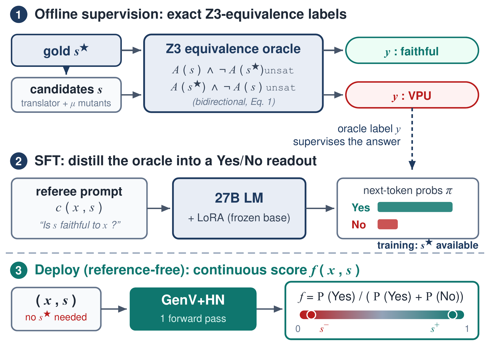
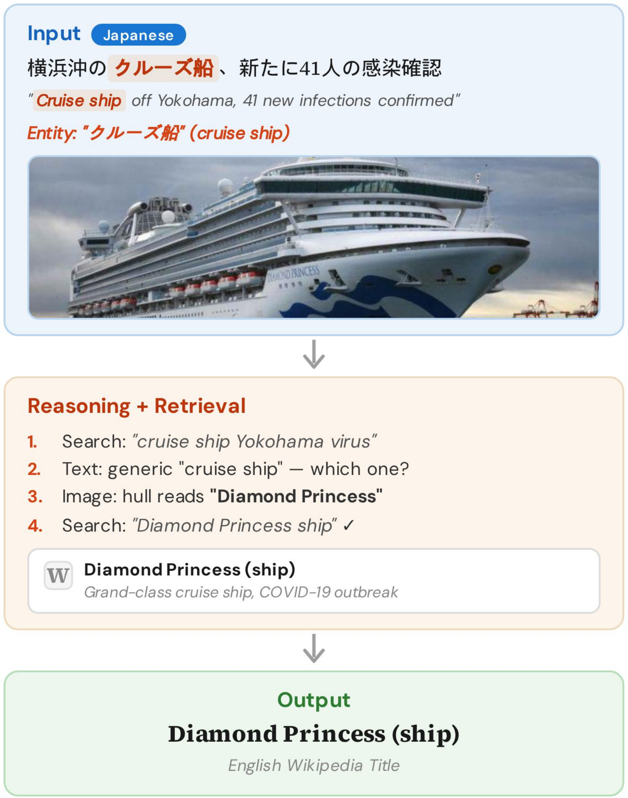
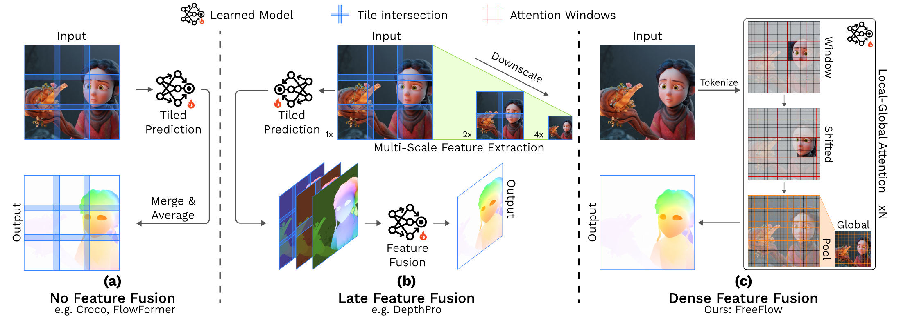

# 论文精选｜方法图旁边，把实验条件一起读

六篇分别讨论空间训练、形式化验证、代码世界模型、审稿建议、多语言实体链接和光流。以下结果均为作者报告。四篇按 CC BY 4.0 保存未修改 PDF，另外两篇只存阅读卡；论文源码中的会议模板或文件名不作为录用证据。

## 01 · SpatialBlock：用积木训练空间关系，而不只识别物体

**2026-09-07 · arXiv 2609.07064v1 · 预印本，本站未复现。** 合成问题能否补足视觉语言模型的空间理解。

看出图片里有积木，与判断旋转后哪块仍被遮挡，是两种能力。SpatialBlock 构造投影、视角旋转和结构组合三类问题，生成约 1.5 万条训练样本。颜色在这里用来标记部件身份，帮助模型建立跨视角对应，不能简单当作装饰删除。

作者比较直接答案监督训练与带推理的强化学习，并在多种 2B–7B 视觉语言模型上测试。核心对照是：合成积木题的进步能否迁移到不同来源的空间任务，而非只记住积木题模板。自建测试集有 600 题，另测 MindCube、MMSI、SPBench 和 MMMU 的相关选择题。

Qwen2.5-VL-3B 的自建题成绩从 29.9 提高到直接训练后的 94.8，但四项外部分布任务的整体成绩只从 37.7 到 41.0；推理训练对应约 41.2。两个变化幅度放在一起，才看得见方法的边界：学会了合成任务，并不等于通用三维理解已经解决。

值得复现的是去掉颜色标记、改变相机视角、换未见过的组合方式后，迁移收益还剩多少。论文评测主要是图像选择题，不能直接推出机器人抓取或真实场景导航成功率。

Soohyun Ryu 等的任务原图。先看每行左侧输入，再追踪相同颜色在右侧候选中的位置；绿色答案标记用于展示题型。它解释训练信号来自哪里，不是本站新做的测验。（[论文原图](https://arxiv.org/abs/2609.07064v1)；[查看大图](images/paper-spatialblock.png)。）

来源：[原文](https://arxiv.org/abs/2609.07064v1) · [站内阅读卡](../../../../papers/frontiers/spatialblock/00-阅读卡.md)。已归档 CC BY 4.0 原文 PDF。

## 02 · GenV：求解器给出相同答案，也可能翻译错了题

**2026-09-10 · arXiv 2609.11085v1 · 预印本，本站未复现。** 用语义等价标签训练自动形式化的反馈模型。

把自然语言条件转成程序时，只检查求解器能否运行并不够。一个不等号翻反，两个版本仍可能都被判为“可满足”。GenV 因此关注形式化程序有没有保留原题语义，而不是把求解器的最终结论相同当作翻译正确。

训练阶段有参考形式化程序，可以用 Z3 检查候选与参考的双向等价，并据此得到标签。作者再训练一个 27B 生成式奖励模型，用 LoRA 学习判断候选是否正确；推理时不需要再提供金标准参考。这里的保证发生在生成训练标签的那一步，学习模型输出的分数本身并非形式化证明。

完整测试包含 950 个候选、197 个问题，报告 AUROC 0.961。作者进一步发现，按问题标识划分后仍存在规范化文本重合，于是剔除 298 个重合候选，在剩余 652 个上得到 0.955。这个更保守的对照比只报最高分有用；AUROC 表示排序区分能力，不能读成 96.1% 的程序都正确。

复现需要首先审查参考程序是否可信、训练测试怎样去重，以及等价检查超时如何处理。模型适合提供筛选和修正信号，关键形式化结论仍应回到求解器与人工检查，不能让奖励模型替代证明。

Vikash Singh 等的方法原图。重点看训练与推理之间的边界：参考程序参与监督信号构建，部署时不再作为输入。不要把右侧预测分数误读为 Z3 对当前程序出具的证明。（[论文原图](https://arxiv.org/abs/2609.11085v1)；[查看大图](images/paper-genv.png)。）

来源：[原文](https://arxiv.org/abs/2609.11085v1) · [站内阅读卡](../../../../papers/frontiers/genv-autoformalization/00-阅读卡.md)。已归档 CC BY 4.0 原文 PDF。

## 03 · RCWM：把复杂三维场景递归写成程序

**2026-09-10 · arXiv 2609.11499v1 · 预印本，本站未复现。** 同一个视觉语言求解器，怎样在整体与局部之间往返。

一次让模型写出整个复杂场景的 Three.js 程序，容易出现建筑大致对、局部比例错的问题。RCWM 把场景写成嵌套程序：先搭整体，再为局部建立子问题，最后回到父层检查组合是否仍一致。同一个冻结的视觉语言求解器在不同层级重复使用，并不需要给每个物体单独训练模型。

关键步骤是把局部参考与渲染结果放到可比较的相机条件下。系统在指定区域内继续细化程序，然后把修改后的子场景放回整体。递归带来更细的修改单位，但同时增加模型调用与渲染次数，因此不能只比较最终截图而忽略计算预算。

论文用五个完整场景及五个局部裁图形成十个参考案例，主实验使用 GPT-6 Astra high，各案例只运行一次。作者报告十项中 PSNR 和 LPIPS 均领先，SSIM 在九项领先；Valley Village 的 SSIM 仍低于 VIGA。部分对照按论文规定继续执行，比较结果受具体预算和停止规则影响。

它证明的是小规模条件下，用递归程序改善图像对齐的可行性。单张图片看不到的背面、真实尺寸与物理属性仍不确定，像素相似也不能证明三维世界正确。复现时可先固定相机、调用预算与随机种子，再检查局部改好后是否破坏整体。

Zhiqi Li 等的方法原图。沿上到下看问题如何细分，再沿返回路径看子程序如何组合；每一层复用求解流程。图中的场景是作者案例，不是本站生成结果。（[论文原图](https://arxiv.org/abs/2609.11499v1)；[查看大图](images/paper-rcwm.png)。）

来源：[原文](https://arxiv.org/abs/2609.11499v1) · [站内阅读卡](../../../../papers/frontiers/recursive-code-world-models/00-阅读卡.md)。仅归档阅读卡，原文从 arXiv 阅读。

## 04 · ActReview：把审稿意见写成能执行的修改建议

**2026-09-08 · arXiv 2609.09076v1 · 预印本，本站未复现。** 训练信号怎样让“实验不足”变成具体的补实验方案。

“缺少实验”不能告诉作者下一步做什么。ActReview 从审稿意见与作者 rebuttal 构建训练数据，将建议组织为做什么、在哪里改、如何执行。论文正文和指定的弱点类型参与输入；rebuttal 用来构造训练信号，不能在评测时偷偷把作者答案喂给模型。

模型以 Qwen3-8B 为基础，先做监督微调，再用 GRPO 根据固定的弱点专属评分规则优化建议。规则在训练前构造并冻结，目的是减少奖励随着模型输出漂移。检索论文局部内容用于部分训练数据构造，但正式评测给所有比较模型完整论文上下文，这一点需要与方法图一起看。

自动评价由模型评分，作者还抽取 200 个实例，让两名研究生在打乱顺序且不显示模型名的条件下标注。报告的 93% 是标注者一致率，不是审稿意见的技术正确率。训练规则和自动评测都使用 GPT-5.4，也意味着评价偏好可能相关，人工抽样规模不足以消除全部偏差。

这项工作的复现价值在于检查建议能否定位到真实段落、补出的实验是否回答原弱点，而不是让审稿措辞更长。实际使用时仍需核对论文是否已经做过所建议的实验，以及新增成本是否合理；可执行性和科学判断正确是两个维度。

Yiling Ma 等的流程原图。训练数据构造与最终推断分开读：rebuttal 属于监督材料。评测阶段所有模型看到完整论文，不能从训练图推出对照组只得到检索片段。（[论文原图](https://arxiv.org/abs/2609.09076v1)；[查看大图](images/paper-actreview.png)。）

来源：[原文](https://arxiv.org/abs/2609.09076v1) · [站内阅读卡](../../../../papers/frontiers/actreview/00-阅读卡.md)。已归档 CC BY 4.0 原文 PDF。

## 05 · Think Before You Link：先判断实体线索，再决定怎么搜

**2026-09-09 · arXiv 2609.10745v1 · 预印本，本站未复现。** 多语言文字与图像如何共同指向准确的百科实体。

一段日文新闻只说“这艘邮轮”，图像却可能暴露船名。实体链接需要把这种不完整提及映射到准确的知识库条目。论文让视觉语言模型先分析线索，再迭代调用关键词或向量检索，最后输出英文 Wikipedia 标题，最多使用二十次搜索。

作者把模型大小、是否推理、检索方式组合比较，在 MERLIN 的五种语言上测试；目标知识库始终是英文 Wikipedia。论文还按 Wikidata 关系与限定信息的覆盖描述实体稀有性，不能把“稀有”直接等同于网页浏览量低。

8B Thinking 配合向量检索得到 87.9% 宏平均成绩，对照基线约 81.1%。一个更实际的对照是：4B Thinking 加检索为 83.7%，略高于不检索的 8B Instruct 的 83.5%，但前者消耗约 2.8 倍 token。权重小并不自动意味着整个推断流程便宜。

错误分析将约 72% 的失败归到检索环节，提示改写查询和检查候选来源可能比继续加长思考更值得做。评测只涉及五种语言及一个目标知识库，无法说明英文百科没有收录的地方实体会怎样表现。复现应同时记录准确率、搜索次数和 token 开销。

Parinthapat Pengpun 等的任务示例。文字先限定语境，图像补充身份线索，搜索再验证候选；输出是准确条目标题。邮轮内容仅是论文案例，不是本期疫情新闻。（[论文原图](https://arxiv.org/abs/2609.10745v1)；[查看大图](images/paper-linking.png)。）

来源：[原文](https://arxiv.org/abs/2609.10745v1) · [站内阅读卡](../../../../papers/frontiers/think-before-you-link/00-阅读卡.md)。已归档 CC BY 4.0 原文 PDF。

## 06 · FreeFlow：高分辨率光流需要跨区域交换信息

**2026-09-10 · arXiv 2609.11486v1 · 预印本，本站未复现。** 两帧之间每个像素移动到哪里，能否用较通用的 Transformer 估计。

光流预测给每个像素一个二维位移。把高分辨率图像切块独立处理虽然省内存，却可能让跨块运动不连续。FreeFlow 在网络内部反复交换局部、跨窗口和全局信息，而不是等各块预测完才平均拼接。

两帧共用编码器，解码器让两幅图的特征互相查询，最后直接输出稠密位移。所谓 bias-free 是去掉显式相关体、特征扭曲和迭代修正等专门的光流模块；它仍使用窗口、移位窗口与降采样全局注意力，并非完全没有结构偏好。

作者报告大模型在 Sintel Clean / Final 上的端点误差为 0.68 / 1.48，KITTI-2015 的 Fl-all 为 3.23。这些量的定义不同，不能放在同一“准确率”轴上比较。Sintel 与 KITTI 提交还包含放大两倍输入、再缩小预测的设置，速度和显存评估必须保留这个条件。

消融发现，全局模块的收益与预训练遮盖率相互影响，不能单独抽出一个模块就承诺普遍提升。最大模型训练使用 32 张 GPU，预训练约四至五天、微调约三天；本站未运行。更适合先复查相同训练配方下的跨块连续性，而不是拿不同训练数据的排行榜名次当作纯架构结论。

Vladislav Bargatin 等的高分辨率方案对照图。看连接出现在哪一层：右侧在处理中持续交换信息，解释了为何跨越块边界的运动更可能保持一致。图本身不是误差大小的实测对比。（[论文原图](https://arxiv.org/abs/2609.11486v1)；[查看大图](images/paper-freeflow.png)。）

来源：[原文](https://arxiv.org/abs/2609.11486v1) · [站内阅读卡](../../../../papers/frontiers/freeflow/00-阅读卡.md)。仅归档阅读卡，原文从 arXiv 阅读。
