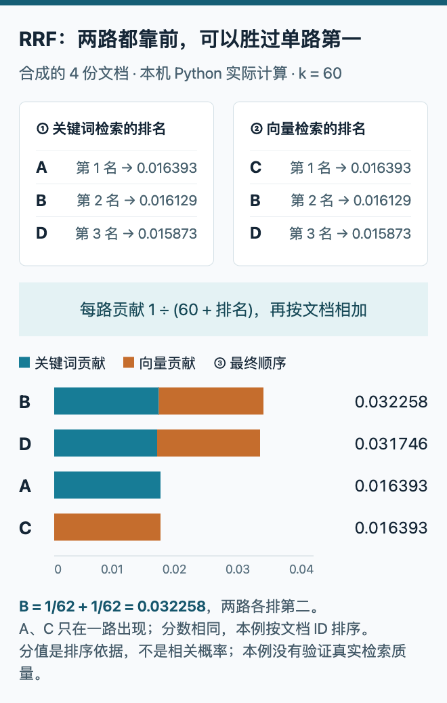

# 技术实践｜用 RRF 合并两路检索排名

**已在本机运行验证。** 运行时间：2026-09-14T23:11:12.649787+08:00，Python 3.14.3，仅标准库；没有联网、调用模型或下载数据。本例的四份文档与原始分数均为合成数据，用于解释算法，不能证明真实资料库的检索质量提升。

## 为什么不直接相加原始分数

关键词检索返回 A、B、D，分数是 14、11、8；向量检索返回 C、B、D，分数是 0.91、0.86、0.82。两个分数的量纲不同，直接相加会让较大的数值尺度占主导。RRF（Reciprocal Rank Fusion，倒数排名融合）只使用每路的顺序，为第 r 名记下 `1 / (k + r)`，同一文档在不同路的贡献相加。

这里 r 从 1 开始，k 固定为 60。k 越大，相邻名次的贡献越接近；它不是向量检索“返回几个近邻”的那个 k，也不是置信度阈值。微软的[混合搜索排名文档](https://learn.microsoft.com/en-us/azure/search/hybrid-search-ranking)说明了这一机制；本站用独立的小数据例子展示它。

## 排名进入融合前，先保证文档身份一致

| 文档 ID | 关键词排名 | 向量排名 | RRF 总分 |
| --- | --- | --- | --- |
| B | 2 | 2 | 0.032258 |
| D | 3 | 3 | 0.031746 |
| A | 1 | 未返回 | 0.016393 |
| C | 未返回 | 1 | 0.016393 |

B 两路都排第二，得到 `1/62 + 1/62`，因此超过仅在一路出现的第一名 A 和 C。未返回的文档在该路贡献为零；这不表示已经证明它不相关，只表示它没有进入这一路的候选列表。A 和 C 同分，本实现用文档 ID 作稳定排序，不能把该先后当成相关性差异。




HTML/JS 根据本机 Python 输出制作。蓝色是关键词贡献，橙色是向量贡献，横轴为 RRF 分数、从零起算。B 有两段贡献，A 和 C 各只有一段；这些数字是合成示例的真实计算结果，不是模型评测分数。（[可复现图表](code/rrf-figure.html)；[查看大图](images/practice-rrf.png)。）

## 核心实现

```python
from collections import defaultdict

def fuse(rankings, k=60):
    scores = defaultdict(float)
    for docs in rankings:
        unique = list(dict.fromkeys(docs))
        for rank, doc in enumerate(unique, start=1):
            scores[doc] += 1 / (k + rank)
    return sorted(scores.items(), key=lambda x: (-x[1], x[0]))
```

每路先按首次出现的位置去重，再重新编号，避免同一文档重复投票。实际系统还要统一不同检索器的文档 ID，例如不能把同一篇 PDF 的 URL 和内部编号当成两篇不同文档。这里省略的贡献记录与输入验证已在完整脚本中保留。

## 复现与已检查的边界

下载 [完整 Python 脚本](code/rrf_demo.py)，然后执行 `python3 rrf_demo.py`。脚本会在同目录写出 `rrf-results.json.txt`；这是便于网站下载的 JSON 文本，后缀不影响用 `json.load` 读取。附本次[原始运行结果](code/rrf-results.json.txt)与[自包含 HTML/JS 图表](code/rrf-figure.html)。图表内嵌的是这次结果，后续修改实验数据时须同步更新图表里的数据块，不能把旧图当作新运行。

实际检查通过四类情形：手算的 B 得分及最终顺序；单路重复 ID 不增加票数或改变其他文档名次；空列表和全部为空；原始分数做保序变换后融合不变。这些检查验证实现的行为，没有验证任何真实语料上的召回率。

RRF 的代价是舍弃原始分数的距离信息，并会受候选截断深度与检索路数影响。两路高度相似的检索器也不等于两份独立证据。若接到真实 RAG 系统，应另外准备有相关性标签的问题集，固定候选数量，比较召回、排序与最终引用质量；本期没有执行这一步。
