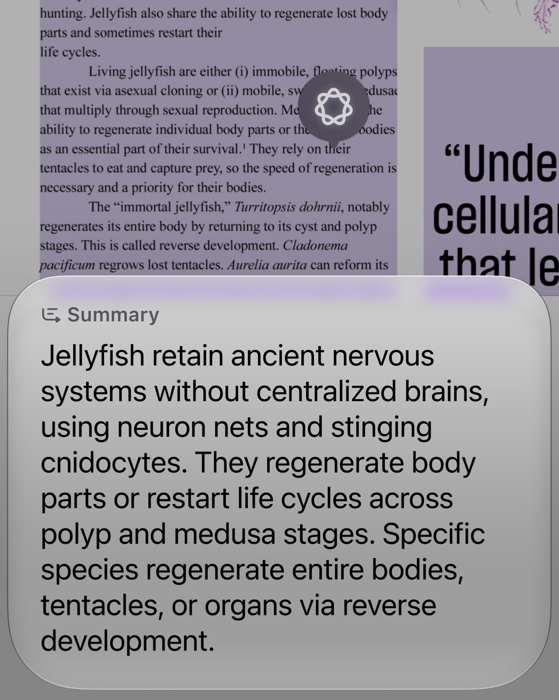
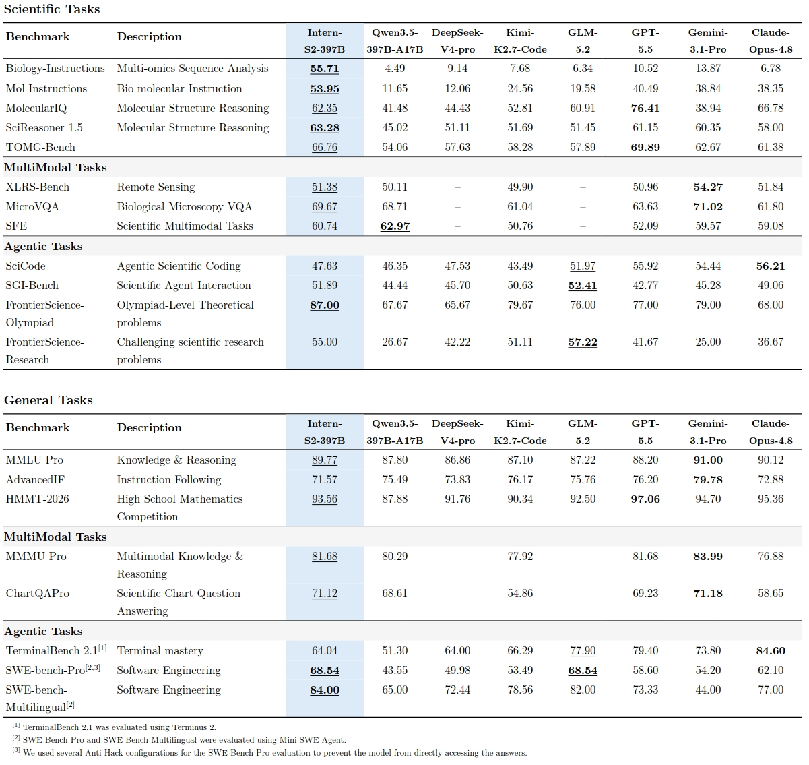
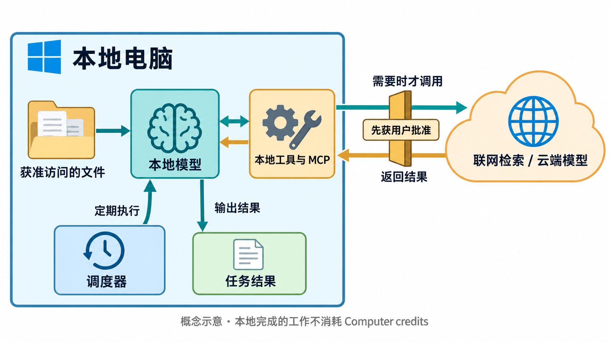

# AI 动态｜5 条重点详解 + 10 条速读

今天重点看助手怎样获得屏幕与本地上下文，以及执行任务的权限边界。前五条约需 18–22 分钟；后十条约需 8 分钟。以下产品演示与基准均来自对应机构，本站没有试用这些新功能。

## 01 · Siri AI 正式到来：理解当前屏幕，再接着办事

事件日期：2026-09-14。

苹果发布 Siri AI，并随新一代系统开放测试版。变化集中在三个相互连接的环节：读取用户允许使用的个人上下文，理解屏幕上正在看的内容，再调用应用完成动作。过去需要先说清“我指的是哪封邮件”，现在官方演示把这一步交给上下文检索，用户可以围绕眼前内容继续提问。

这对日常任务的意义，可以用苹果举的食谱场景说明：助手从邮件找到家人的食谱，再把食材送进提醒事项。看文档时也可以直接要求解释或总结。这里真正新增的是信息与动作之间的衔接；回答正确，还需要找对对象、调用合适的应用入口，并保留用户对后续操作的控制。上述流程是官方展示，不能当作本站已经复现。

专门的 Siri 应用提供连续对话入口，并通过 iCloud 同步会话。跨应用能力也依赖具体应用的接入进度；公告中部分第三方应用支持仍标注为即将推出。对开发者来说，应先核实自己应用当前支持的动作，再设计完整流程，不能把未来清单当作今天已经覆盖的功能。

当前可用性有几层限制：Siri AI 测试版首先支持英语，法语、日语、韩语、葡萄牙语和西班牙语计划下个月加入；中国地区尚不可用，欧盟的部分移动系统也有开放限制。Apple Intelligence 已支持某种语言，不等于 Siri AI 已经支持它。设备还需满足相应 Apple Intelligence 硬件要求。

云端功能有每日用量限制，苹果另提及未来扩展访问的付费安排。读者若想试用，第一步应核对地区、语言、设备和系统版本，再检查需要的应用动作。研究上值得观察的是：跨应用任务失败时，究竟是上下文找错、动作入口缺失，还是执行环节出错，这比只比较聊天答案更能揭示助手能力。

看背景文档与前景回答的对应关系：无需先复制全文，也能围绕正在看的页面发问。苹果官方交互示例，仅说明识屏流程。（[来源原图](https://www.apple.com/newsroom/2026/09/siri-ai-a-profoundly-more-capable-and-personal-assistant-is-here/)；[查看大图](images/news-siri.jpg)。）

[原始来源](https://www.apple.com/newsroom/2026/09/siri-ai-a-profoundly-more-capable-and-personal-assistant-is-here/)

## 02 · 豆包手机助手推出消费者版：识屏、记忆与执行连起来

事件日期：2026-09-14。

豆包手机助手发布消费者版本，首款合作机型为努比亚 NaviX Ultra，9 月 14 日开启预约、9 月 16 日发售。相较技术预览阶段，这次把系统交互、识屏处理、个人信息检索与多任务执行放进同一产品流程，目标是让用户在手机上直接提出需求，减少来回切换应用和重复输入。[发布日期及销售安排](https://www.beijing.gov.cn/fuwu/lqfw/gggs/202609/t20260914_4863425.html)

官方网站把识屏能力分成两类：问答负责解释、翻译眼前内容；办事则把屏幕信息作为任务输入。两者的区别在于后一步是否需要执行动作。例如，看到一段活动信息，提取它与建立后续任务属于不同环节，前者正确并不保证后者完成。这是理解手机助手可靠性的一个实用拆分。

交互层加入兼顾鉴权的 AI 键，并优化远场、噪声和快语速下的唤醒。连续对话仍是需要用户手动开启的 Beta 功能。个人上下文方面，发布报道介绍了相册、短信、便签等本地检索，以及录音和飞书妙记的衔接；这些是产品宣称的使用路径，本文没有验证识别准确率或隐私处理的内部实现。

“操作手机”也仍标注 Beta。官网明确保留模拟点击与调用工具两条路径，同时增加任务排队和插队。因此不能将本次更新概括成已经放弃图形界面操作。不同应用是否开放相应能力，直接影响一条跨应用指令能走到哪一步，演示成功也不能外推到所有应用和账号。

据发布采访，同步提出的 SAEP 屏幕自动化操作声明协议进入 30 天规则公示，第三方应用可声明允许或拒绝自动化操作；团队表示尊重明确拒绝的应用。当前尚无完整首批接入名单。对普通用户，关注可用任务和确认步骤；对研究者，值得记录界面变化、应用许可与模型决策各自造成的失败。[协议及开放边界报道](https://m.21jingji.com/article/20260914/herald/9a9cd343b0ba8ce2bfde2b5705ee6f18.html)

看屏幕内容如何进入后续办事流程；这张官网原图解释“识屏办事”，并不证明任意应用均可自动操作。（[来源原图](https://o.doubao.com/)；[查看大图](images/news-doubao.webp)。）

[原始来源](https://o.doubao.com/)

## 03 · Intern-S2 开放 397B 权重：科学文献同时看文字和版面

事件日期：2026-09-13 · 近期补充。

Intern-S2-397B 的 Hugging Face 权重仓库于 9 月 13 日创建，团队模型卡公开了结构方向、评测与推理路径。这里采用可核实的仓库日期，不把 9 月 14 日的集中报道当作首次发布。它将科学问题、多模态理解和长流程 Agent 放在同一系列中，面向需要阅读专业材料并持续调用工具的任务。

一个值得注意的变化是科学文献的处理方式。模型卡介绍，预训练直接利用文献页面上的文字与视觉信息，避免先把页面统一解析成纯文本再交给模型。直觉上，公式位置、图与图注的关系、跨栏结构都可能提供信息；但保留版面不代表每张复杂图都能读对，仍应逐项测试公式、图表和正文引用是否对应。

训练后阶段覆盖二十多个科学领域，并使用带沙箱环境的长流程 Agent 框架。它让模型在解题过程中执行工具、接收反馈，而非只输出最后答案。评估也涉及代码、终端和科学任务。不同测评采用不同工具框架和设置，不能把表中最高分理解成在任何工作流都领先。

部署需要认真区分模型规模与调用便利度。397B 级权重属于大型服务部署对象；下载到文件不意味着普通显卡就能运行。模型卡同时列出服务和推理方式，时序任务示例还有特定后端限制。上下文设置亦有差别：文中评测的文本最长设置与多模态设置不同，不能把文本的 256K 直接套给全部输入模式。

官方 API 文档区分稳定名称、会变化的 latest 别名和预览名称，并给出旧预览接口的退出安排。做可复现实验时应固定实际模型与服务版本，记录工具权限和评测框架；只保存一个浮动别名，后续很难判断结果变化来自模型还是接口更新。[API 型号与生命周期](https://internlm.intern-ai.org.cn/docEn/docs/Models/)

按同一行比较任务分数，并结合模型卡的评测框架阅读；它在部分项目占优，不能合并成一个通用能力排名。（[来源原图](https://huggingface.co/internlm/Intern-S2-397B)；[查看大图](images/news-intern-s2.jpg)。）

[原始来源](https://huggingface.co/internlm/Intern-S2-397B)

## 04 · Perplexity Portable Computer 登陆 Windows：本地执行有明确硬件门槛

事件日期：2026-09-14。

Perplexity 将 Portable Computer 带到 Windows RTX 电脑。它把模型、Agent 执行框架、任务编排和定时调度放在本机，适合反复处理本地目录与文件的工作。这个版本与通过云端代理运行的 Personal Computer 需要分开理解；名称相近，计算位置和数据流并不相同。

官方介绍的流程是：用户指定文件或工作目录，模型在电脑上规划步骤，通过本地工具执行，再输出结果。定时器可以重复运行同类任务。例如，持续整理新进入目录的材料，是这种结构自然适合的场景；但这只是根据功能说明给出的用法，不是本站的实测案例。可用工具与目录权限仍决定任务实际能做什么。

“本地”也不等于永远断网运行。产品可通过 MCP 连接桌面工具，也可在需要时使用网络与十五种以上云端模型；官方要求数据离开设备前获得明确批准。连接 Gmail、Slack 等在线服务本身依赖网络，不能因为推理模型在本地，就认为整个业务流程没有远端服务或数据传输。

门槛主要在账号和显存：Windows 版本面向 Pro、Max 个人及企业订阅者，要求兼容的 GeForce RTX 或 RTX PRO 显卡，并至少有 24GB 显存。默认提供 NVIDIA 优化的 Qwen3.8 27B 方案；DGX Station 支持仍是后续安排。普通轻薄本用户不宜只看“Windows 已发布”就开始下载。

本地完成的任务不消耗 Computer credits，但订阅要求与云端调用条件仍存在。评估是否值得采用，先看自己的资料规模、显存、工具链和离线需求，再看实际任务效果。对研究者，这提供了观察本地模型与云端升级路径如何协作的案例；它并未公布能覆盖所有硬件与任务的统一性能保证。[NVIDIA 配套说明](https://blogs.nvidia.com/blog/local-ai-perplexity-windows-pcs/)

蓝色区域表示本机模型、文件、工具和调度；只有需要外部能力时经过批准路径。imagegen 概念示意，非产品截图；在线连接器仍需网络。（[功能依据](https://www.perplexity.ai/hub/blog/portable-computer-for-windows-is-here)；[查看大图](images/news-perplexity-concept.png)。）

[原始来源](https://www.perplexity.ai/hub/blog/portable-computer-for-windows-is-here)

## 05 · Copilot Auto 增加三档取向：选择成本与质量偏好

事件日期：2026-09-14。

GitHub 为 Copilot Auto 增加 Efficiency、Balance、Intelligence 三种取向，逐步向 VS Code、Copilot CLI 和 Copilot App 推出。用户可以表达更重视成本，还是更重视回答质量，而不必为每个问题手动挑选模型。这里改变的是路由偏好：系统根据任务与可用服务决定实际调用对象。

三个档位并不是三个固定模型，也不是三份彼此隔离的模型名单。官方文档说明，它们在相同的可用模型池中工作，结合任务复杂度、模型健康度和可用性进行选择。即使选 Intelligence，简单的文档字符串任务仍可能使用较轻的模型；切到 Efficiency，也不意味着所有请求都能由最便宜模型完成。

缓存是另一个容易忽略的条件。为减少切换造成的缓存成本，路由通常选择自然的缓存边界调整模型，而非机械地每轮换一次。对长会话而言，某一次选型结果还与会话状态有关，因此评测三种模式时应记录任务长度、上下文与实际模型，避免只跑一个问题便下结论。

使用费用按实际调用的模型计算。付费计划在 Auto 下的相关折扣仍适用，但档位本身不提供固定价格或无限调用承诺。企业策略与订阅也会限制可用模型池。对于预算有限的代码任务，可以从 Balance 开始，用真实账单和完成情况决定是否调整，而不是把档位名称直接当作质量标签。

实际采用前需确认客户端已获得这轮更新。Auto 原本支持的全部 IDE，并不等于都同步拥有三档选择。界面或 CLI 能查看实际使用的模型，适合与测试结果一起留存。研究上更有价值的比较是：相同任务集合下，完成率、修改质量和总费用如何变化；本文只核实产品机制，没有测量这些结果。[Auto 官方文档](https://docs.github.com/copilot/concepts/models/auto-model-selection)

[原始来源](https://github.blog/changelog/2026-09-14-configure-cost-and-quality-in-copilot-auto-model-selection/)

## 06 · Microsoft 发布 AI 行为规范草案，开启公众讨论

事件日期：2026-09-14。

Microsoft AI 公布以人类控制为中心的行为规范草案，征求约六周意见，涉及指令优先级、用户控制以及 Agent 暂停和关闭等问题。值得区分的是，草案目前尚未用于训练模型；团队计划修订后指导 2027 年及以后的工作。它提供了观察模型行为目标的文本依据，还不能据此宣称现有产品已经逐条达到要求。对开发者，最实用的是比较自身的权限与终止机制，是否能落实这些原则。

[原始来源](https://microsoft.ai/code-of-conduct/)

## 07 · Superhuman 收购 Fathom，将会议上下文接入工作流

事件日期：2026-09-14。

Superhuman 宣布收购会议记录工具 Fathom，计划将会议内容与其邮件、文档及 Go 助手工作流结合。重要变化在于把会议中形成的决定变成后续任务的上下文，而不只是保存一段转写。官方描述的深度整合仍包含未来安排，现有 Fathom 产品继续提供服务。读者应把已宣布的收购与尚待上线的跨产品能力分开；生成行动项、更新系统之前，仍需要核对会议含义和参与者的实际决定。

[原始来源](https://blog.superhuman.com/superhuman-acquires-fathom/)

## 08 · Claude Managed Agents 加入自动权限策略与会话连接

事件日期：2026-09-10 · 近期补充。

近期发布说明为 Managed Agents 增加 auto 权限策略，对 Agent 与 MCP 工具调用做允许、拒绝或暂停等待批准的判断，并提供对应权限评估事件；CLI 也增加连接现有会话与本地网页查看的入口。它让运行中的任务更便于检查和接管，但“自动”不等于取消所有审批。接入方应按工具风险配置策略，并记录暂停与拒绝的原因。这里介绍 API 与命令行能力，不能直接套到所有 Claude 聊天套餐。

[原始来源](https://platform.claude.com/docs/en/release-notes/overview)

## 09 · Claude 企业版开放 Smart Reports 测试

事件日期：2026-09-10 · 近期补充。

Smart Reports 面向企业组织提供使用分析，帮助查看工作方式、成本与采用障碍，并发现可共享的技能。目前是测试功能，每个组织每月可生成十份免费报告，按月重置；部分特殊合规和数据配置不在开放范围。它适合管理员理解团队整体采用情况，但使用统计不能直接证明生产率或业务收益。组织若要据此调整流程，最好结合完成任务的质量和成员反馈，避免把调用次数当作工作价值。

[原始来源](https://support.claude.com/en/articles/16893491-get-started-with-smart-reports)

## 10 · 百度文档矫正与去手写 V2 开放公测

事件日期：2026-09-11 · 近期补充。

百度 AI 开放平台将文档矫正增强 V2 与文档去手写 V2 开放公测。前者识别主体四角、做透视矫正并可选增强；后者清除手写笔迹，尽量保留印刷文字与版面。对搭建资料库的人，这属于 OCR 前处理能力变化，适合倾斜拍照、试卷与带批注页面。官方效果图不能代替实际文档测试，尤其要检查印刷文字是否误删，并保留原图；它也不是开放模型权重的公告。

[原始来源](https://ai.baidu.com/support/news?action=detail&id=3284)

## 11 · Step-Audio 3 Gen 公开报告，统一多种语音生成任务

事件日期：2026-09-11 · 近期补充。

Step-Audio 3 Gen 技术报告将文字转语音、声音设计、语气控制及混合语音生成放在统一框架下。其音频表示采用多层残差量化：第一层沿时间生成，其余层由较轻的深度方向预测器补齐，目标是在音质与生成成本之间找到更合适的分工。当前可核实的是预印本及方法说明；本文未确认完整训练数据和模型权重的开放状态，也没有试听评测，不能把报告公布写成全部可下载部署。

[原始来源](https://arxiv.org/abs/2609.12945v1)

## 12 · LingBot 发起具身操作挑战，线上仿真衔接真机

事件日期：2026-09-14。

蚂蚁 LingBot 团队联合魔搭、天池发起具身操作挑战，线上阶段以 RoboTwin 2.0 仿真为基础，并衔接后续真机环节；报道给出的线上安排延续至 10 月 26 日。对研究者，公开任务提供了比较策略与复现流程的入口，但仿真成绩不能直接代表现实操作可靠性。这里的新事件是赛事启动，所依托的 LingBot-VLA 2.0 并非今天首次发布。来源为团队供稿、获授权刊登的赛事介绍，报名和规则应以赛事页面为准。

[原始来源](https://www.qbitai.com/2026/09/489105.html)

## 13 · OpenSearch Serverless 接入 v0 的应用生成流程

事件日期：2026-09-10 · 近期补充。

AWS 宣布 OpenSearch Serverless 可通过 v0 的应用构建流程接入。用户提出应用需求后，可配置检索集合、索引及所需连接信息，减少从前端原型到搜索后端之间的手动接线。它适合尝试带搜索功能的小型应用，但仍需要关联 AWS 账号，服务也受支持区域及正常计费约束。生成了可运行界面，并不代表索引设计、访问控制和真实检索质量已经合格；上线前仍应单独检查这些环节。

[原始来源](https://aws.amazon.com/about-aws/whats-new/2026/09/amazon-opensearch-serverless-available-V0-vercel/)

## 14 · AWS Transform 扩展 CLI 的 .NET 现代化流程

事件日期：2026-09-09 · 近期补充。

AWS Transform 将 .NET 现代化能力带入 CLI 的托管转换流程，支持交互使用，也便于接入自动化管线。它把原来需要在多个界面组织的转换任务收进命令行入口，对批量处理旧代码库的团队更方便。实际使用仍取决于账号、区域和项目支持情况；工具完成转换不等于应用行为已保持一致。应保留转换前基线，结合编译、测试和关键业务路径检查结果，本文没有运行真实代码迁移。

[原始来源](https://aws.amazon.com/about-aws/whats-new/2026/09/aws-transform-dotnet-cli)

## 15 · Kiro 学生计划扩展学校范围，提供一年额度

事件日期：2026-09-08 · 近期补充。

Kiro 将学生计划扩展至更多国家和学校，公告列出新增 121 所大学、覆盖 16 个国家。通过学校邮箱及 SheerID 验证后，可获得一年计划与每月一千 credits，并使用相应付费功能。额度按月提供，不结转，也不开放超额消费；一年结束后回到免费计划。这是申请范围的实际扩大，适合符合资格的学生试用代码 Agent，但学校与验证条件仍有限制，不能理解成所有在校生自动获得。

[原始来源](https://kiro.dev/blog/students-2026/)
