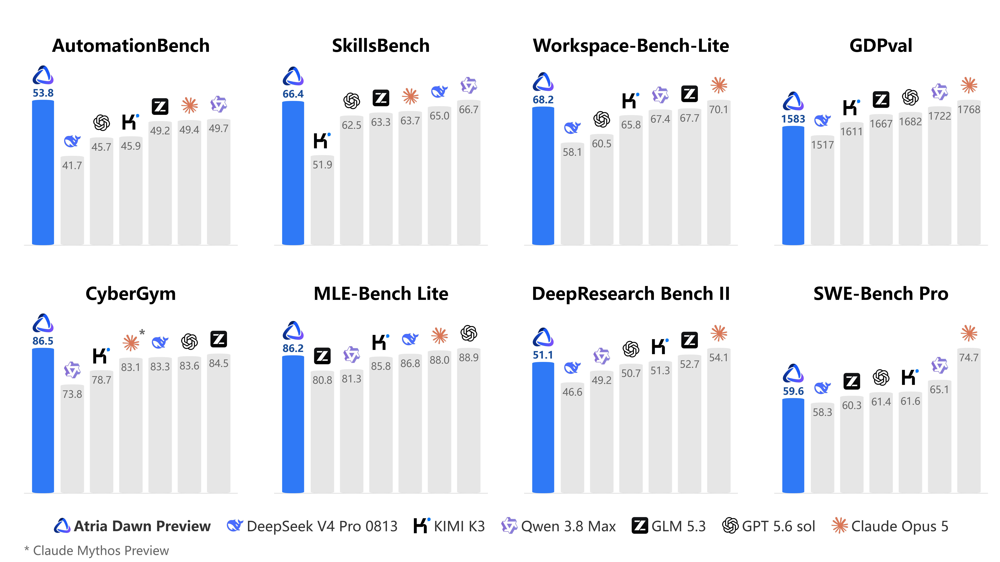
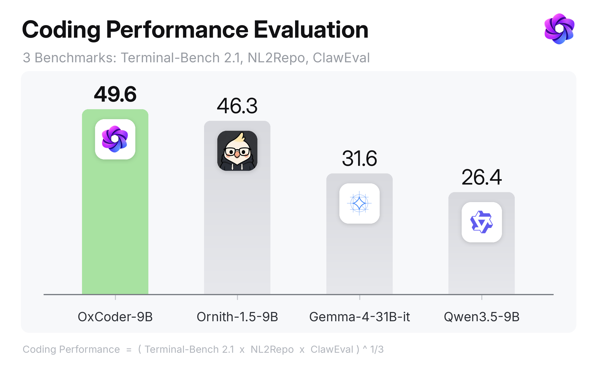
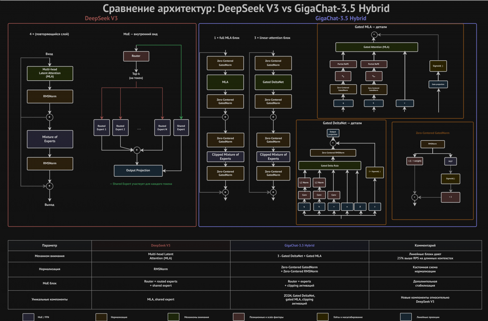
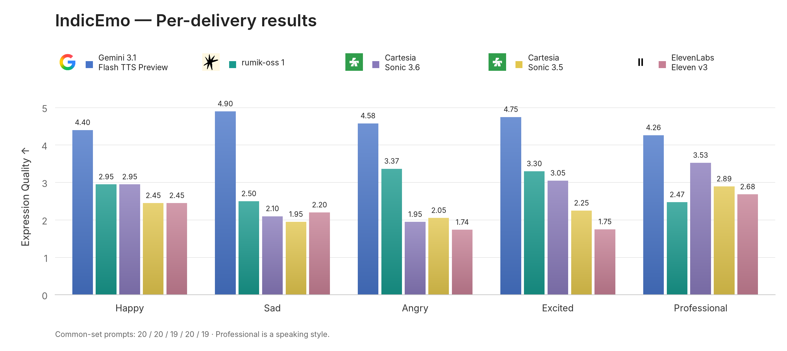

# 六个模型｜先看任务，再看运行条件

本栏首次补收近三十天的权重，未下载或运行大型模型。下列分数为团队报告；仓库最近修改可能只是文档修订，不能据此把旧模型写成今天首发。新闻已展开的 Intern-S2 不重复入选。

| 想研究什么 | 模型 | 最先确认的条件 |
| --- | --- | --- |
| 长流程文本 Agent | Atria Dawn Preview | 744B 级集群部署与推理后端 |
| 小型代码 Agent | OxCoder 9B | 基座、执行框架和上下文占用 |
| 大型稀疏推理 | GigaChat 3.5 Reasoning | 特定后端补丁与多卡资源 |
| 理解与生成统一 | InternLumina-U2 | 主模型和 AToken 组件齐备 |
| 语音识别结构压缩 | Orukeet | 测试集使用方式与权重许可 |
| 印度语言表达式 TTS | Rumik-OSS-1 | 非商业许可与音频解码器 |

## 01 · Atria Dawn Preview：大型文本 Agent 的分项取舍

权重仓库创建：2026-09-11；最近修改：2026-09-14（UTC 日期，不等于首发或重大升级日期）。

Atria Dawn Preview 是基于 GLM-5.2 的 744B 级混合专家文本模型，模型卡给出 256K 上下文与 Agent、编程等评测。混合专家让每次计算只经过部分参数，但完整模型仍需保存全部专家权重。因此它更适合有集群条件的实验室，不能用每步激活量推断单卡就能装下。

下图的价值是同时看强项和短板：作者图表中 AutomationBench 为 53.8，而 SWE-Pro 为 59.6，低于同图部分对照模型；不同任务的胜负并不一致。该图是团队评测，不能跨测试集直接相加，也不能用代理框架不同的榜单替换对照条件。

运行入口提供 BF16、FP8 及相应推理配置；文档列出较新的 SGLang、vLLM 支持条件，部署前需逐项核对版本。它是文本模型，输入扫描论文或界面截图仍需另行提取信息。若只想验证 Agent 工作流，先用服务接口做小规模任务集，再决定是否承受本地部署成本。

每组柱状图对应一个测试任务；看领先项也看落后项，避免把局部高分写成全面最强。（[来源原图](https://huggingface.co/internlm/Atria-Dawn-Preview)；[查看大图](images/model-atria.png)。）

开放范围：代码与权重开放，训练数据未确认完整开放。 许可：MIT。[模型卡与文件](https://huggingface.co/internlm/Atria-Dawn-Preview)

## 02 · OxCoder 9B：代码能力要和执行框架一起评估

权重仓库创建：2026-09-07；最近修改：2026-09-14（UTC 日期，不等于首发或重大升级日期）。

OxCoder 9B 以 Qwen3.5-9B 为基座，使用来自较强模型及多个代码执行框架的轨迹进行训练，面向终端操作、仓库修改等 Agent 任务。9B 规模更便于本地尝试，但长上下文仍占用额外 KV 缓存；原始权重大小不是完整显存需求。

模型卡在 TerminalBench 2.1 的 Terminus2 框架下报告 49.6，在 Claude Code 框架下为 50.8。同一个模型换执行框架也会改变结果，说明工具定义、运行环境与提示组织是评测的一部分。SWE-bench Verified 的成绩同样应与对应配置一起引用。

下图另用三个任务的几何平均构成综合指标，OxCoder 的数值也恰好是 49.6，不能与上面的单项得分混为一谈。开始实验时可固定一个小仓库、统一超时和工具权限，对比基座与微调模型；记录任务是否真的通过测试，而不是只看补丁看起来是否合理。模型卡写明长上下文配置，但本站未验证该长度下的质量与速度。

这是 TerminalBench 2.1、NL2Repo 与 ClawEval 的综合指标；图中 49.6 不是单项通过率，阅读时不要混用。（[来源原图](https://huggingface.co/OrionLLM/OxCoder-9B)；[查看大图](images/model-oxcoder.png)。）

开放范围：完整权重、配置及推理说明公开；未核实训练轨迹全部开放。 许可：Apache-2.0（模型卡元数据）。[模型卡与文件](https://huggingface.co/OrionLLM/OxCoder-9B)

## 03 · GigaChat 3.5 Reasoning：把不同注意力结构组合起来

权重仓库创建：2026-09-03；最近修改：2026-09-10（UTC 日期，不等于首发或重大升级日期）。

GigaChat3.5-432B-A28B-Reasoning 总参数约 432B、每步激活约 28B。结构结合 MLA、GatedDeltaNet 与 GatedNorm，并使用多 token 预测组件。MLA 用压缩表示处理注意力信息，GatedDeltaNet 则以不同的状态更新方式处理序列，组合目的是改变长序列计算的成本结构。

模型卡介绍了多领域专家、在线强化学习和蒸馏等训练环节，但“Reasoning”不代表每个任务都比 Instruct 版更好。例如同表 TAU3 banking 中 Reasoning 为 47.8，Instruct 为 50.03。部署选择应围绕目标任务，而不是只按版本名决定。

团队提供的部署示例涉及八张 H100，并指向特定 SGLang、vLLM 支持提交。直接安装任意旧版推理包可能无法加载其混合结构。FP8 权重能够减小存储与带宽压力，仍不能把 28B 激活量当作总模型内存。适合研究稀疏大模型和推理系统的团队；普通学习者可以先读结构图，理解不同层怎样分工。

重点看中间层序列中 MLA 与 GatedDeltaNet 的组合；这张结构图解释计算路径，不是 Reasoning 与 Instruct 的性能对比。（[来源原图](https://huggingface.co/ai-sage/GigaChat3.5-432B-A28B-Reasoning)；[查看大图](images/model-gigachat.png)。）

开放范围：Reasoning 权重和配置公开；推理依赖团队指定的后端支持。 许可：MIT（模型卡元数据）。[模型卡与文件](https://huggingface.co/ai-sage/GigaChat3.5-432B-A28B-Reasoning)

## 04 · InternLumina-U2：一个主干连接理解与图像生成

权重仓库创建：2026-09-01；最近修改：2026-09-10（UTC 日期，不等于首发或重大升级日期）。

InternLumina-U2 采用约 16B 总参数、约 1B 激活参数的混合专家扩散语言模型，连接文本、图像、视频和三维信息的理解，并支持图像生成与编辑。它使用 LLaDA2.0 路线的主干和 AToken 表示，让输入与输出共享更多组件。

AToken 的一个关键细节是八层码本。输入端把同一位置的多份码本嵌入拼接后投影，交给主干一个 token，而不是把序列无条件拉长八倍；输出端则在空间位置上并行、在码本深度上逐层生成。下图从底部输入看向顶部输出，能看清两个方向为何采用不同处理方式。

目前 Ascend 训练的权重已提供，另一个 NVIDIA 训练目录仍标为后续发布；这不等于现有权重只能在 Ascend 上推理，仓库也给出 CUDA 路径和独立 NPU 分支。复现时需要主权重、AToken 组件以及匹配的 Torch、CUDA 或 CANN 环境。它适合统一多模态结构研究，模型卡的初步评测不足以证明所有生成和理解任务都优于专用模型。

顺着底部输入进入主干，再看顶部文本头和图像码本输出头；空间并行与码本逐层生成是两个不同维度。（[来源原图](https://huggingface.co/internlm/InternLumina-U2)；[查看大图](images/model-intern-u2.png)。）

开放范围：主模型权重、AToken 相关入口与推理实现公开；训练代码和技术报告仍有后续安排。 许可：Apache-2.0。[模型卡与文件](https://huggingface.co/internlm/InternLumina-U2)

## 05 · Orukeet：用 Gabor 形状拟合部分语音卷积核

权重仓库创建：2026-09-09；最近修改：2026-09-14（UTC 日期，不等于首发或重大升级日期）。

Orukeet 以 NVIDIA Parakeet TDT 0.6B v3 为基础，将一半深度卷积滤波器用冻结的 Gabor 形式拟合。Gabor 可以理解为带局部包络的波形，用较少的形状参数近似原来的一串卷积权重。被替换的是特定滤波器，不能因此写成整个模型缩小一半。

作者图中的四个滤波器展示了拟合程度的差别：有些曲线接近，有些残差明显。参数化近似是否损失识别信息，需要结合独立数据评测。这里有一项重要限制：训练与检查点选择使用了 LibriSpeech test-other，因此该集合上 2.86% 对 3.14% 的 WER 不能当成未见测试集的泛化结果。模型卡另报告 FLEURS 等集合，但本站未运行复核。

模型卡提供 NeMo、原生运行及量化格式入口，Mac Metal、CUDA 和 CPU 路径的环境要求不同；GGUF 文件也需要匹配对应运行器，不能仅看后缀相同就混用。适合研究卷积结构压缩和本地语音识别，使用权重时需保留 CC-BY-SA 条件，代码 MIT 并不自动覆盖全部模型资产。

灰色与蓝色曲线展示不同滤波器的拟合残差；图解释压缩机制，不能直接证明识别准确率提高。（[来源原图](https://huggingface.co/oruk/orukeet)；[查看大图](images/model-orukeet.png)。）

开放范围：原始及量化权重、原生推理代码和拟合材料公开；各组件许可分别适用。 许可：代码 MIT；权重 CC-BY-SA-4.0。[模型卡与文件](https://huggingface.co/oruk/orukeet)

## 06 · Rumik-OSS-1：表达式语音生成的许可与评测边界

权重仓库创建：2026-09-06；最近修改：2026-09-10（UTC 日期，不等于首发或重大升级日期）。

Rumik-OSS-1 从 TinyAya Fire 路线扩展表达式语音生成，面向多种印度语言与混合语言场景。模型先生成音频 token，再由 Mimi 解码成 24kHz 波形；因此不能只加载语言模型后就直接当作普通 Transformers 文本转语音管线使用。

评测覆盖的语言数量与模型宣称支持的语言数量需要区分。IndicEmo 使用 98 个共同提示、自动评审模型打分，图中不同表达风格差异明显：专业语气并不领先。另一个英语评测中的渲染分数也不是人工音质评分。选择 TTS 时应另外试听发音、停顿、情绪强度与是否产生未要求的声音，本文没有试听。

训练样本长度主要不超过三十秒，模型卡不建议直接外推到很长的连续生成；长段落分块还需验证音色与韵律衔接。它更适合研究性尝试，权重采用非商业许可并附上游条件，不应因代码或解码组件较宽松，就把整个产品链认作可直接商用。

逐组看 happy、sad、angry、excited 与 professional；这些来自有限提示和自动评审，不能替代真人听感。（[来源原图](https://huggingface.co/rumik-ai/rumik-oss-1)；[查看大图](images/model-rumik.png)。）

开放范围：约 3.38B 语音模型权重开放；训练配方尚有后续发布计划，Mimi 解码器许可独立。 许可：CC-BY-NC-4.0，并附上游 Cohere 使用条件。[模型卡与文件](https://huggingface.co/rumik-ai/rumik-oss-1)
