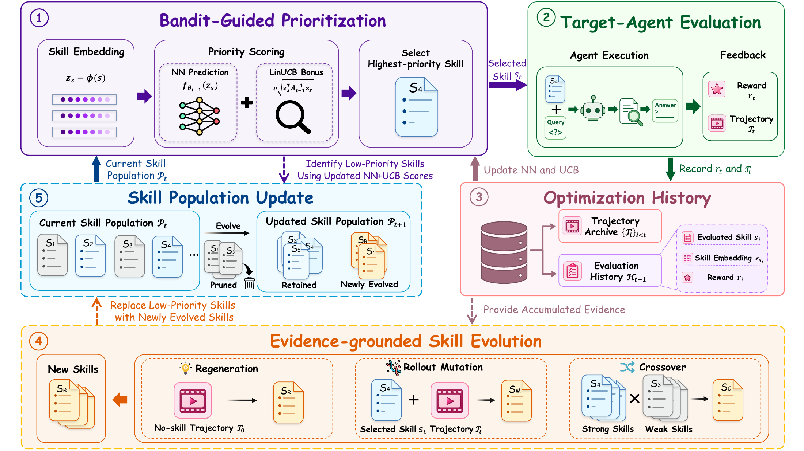

# 六篇论文｜让方法与对照条件一起被看见

今天从训练数据策略、稀疏注意力、技能优化、任务前准备、视觉缓存与机器人训练六个问题切入。均已读取原文及关键实验表格；下文报告作者结果，没有复现实验。DataFlex-RL 为近三十天首次补充，其余为最近一周论文。

三篇 CC BY 4.0 论文保存原始 PDF，另外三篇保存带来源的阅读卡。原图紧邻机制解释，放大后可沿箭头阅读。

## 01 · DataFlex-RL：训练数据筛选的收益，怎样与随机波动分开

2026-09-05 · arXiv:2609.06107 v1 · 预印本。

可验证奖励强化学习中，挑选更难样本、提高某类题目的比重，是否一定优于均匀训练？DataFlex-RL 把策略放进统一评估框架，固定基础训练流程，再分别改变数据混合、生成后的样本筛选、以及损失中的权重。直觉上，它让“题目怎么来”“哪些轨迹留下”“每条轨迹算多重”不再混成一个变量。

主实验在 Qwen2.5-7B 基座上比较十三种配置，每种使用十二个匹配随机种子，共一百五十六次训练；更广的扫描总计五百九十一次运行。统一的 GRPO 基线本身提升约 7.76 个百分点，而八种筛选或加权方案相对均匀策略的差值，其 95% 置信区间均未排除零。这里的意思是证据不足以稳定分出胜负，不是证明这些方法在所有规模都无效。

评测集合也会改变排序：论文另用九次指令模型运行比较数学偏重与领域均衡测试，排序相关系数为 −0.33。只盯数学分数可能把其他能力变化漏掉。复现价值在于同预算、多种子、跨领域对照；若资源有限，可以先复核数据策略插入的位置与统计口径，而不是只重复作者最优一次运行。

从左到右看：绿色调配输入分布，蓝色筛选生成轨迹，黄色改变损失权重；它们操作的对象不同。（[作者原图](https://arxiv.org/abs/2609.06107v1)；[查看大图](images/paper-dataflex.png)。）

[论文原文](https://arxiv.org/abs/2609.06107v1) · [站内阅读卡](../../../../papers/frontiers/dataflex-rl/00-阅读卡.md) · [归档 PDF](../../../../papers/frontiers/dataflex-rl/2609.06107v1.pdf)

## 02 · SAS：让稀疏注意力的选择器也收到训练信号

2026-09-11 · arXiv:2609.13141 v1 · 预印本。

稀疏注意力要先选少数 token 块，再做注意力计算。问题是硬 Top-K 的索引选择会截断梯度，选择器很难仅凭语言模型损失学会挑选。SAS 在被选块的注意力分数中加入归一化门控的对数，让损失能够沿门控分支更新选择器；离散索引本身仍然存在，不能称为整个选择过程都完全可微。

实验冻结 Qwen3 4B、8B、14B 主模型，训练额外选择器，并控制长上下文与块大小等配置。以 Qwen3-8B、1024 注意力预算的 GPQA 结果为例，分数由对照的 39.43 提升到 53.17，但完整注意力仍为 60.54。它说明紧预算时选择更有用的内容能减少损失，不等于稀疏版在所有场景已经追平完整模型。

系统实现还区分预填充与解码：论文后端在预填充使用完整注意力，在解码阶段做块稀疏处理，因此不能把注意力预算减少直接换算成同等比例的全部推理提速或 KV 内存下降。适合复核的第一步是门控位置与梯度路径，再比较相同预算的任务分数、端到端时间和内存。[作者实现](https://github.com/Tencent-Hunyuan/Simple-Attention-Sparsification)

左图的硬选择阻断梯度；右图把门控分支接入 Softmax 前的分数。沿红色／绿色路径读，理解多出的训练信号。（[作者原图](https://arxiv.org/abs/2609.13141v1)；[查看大图](images/paper-sas.png)。）

[论文原文](https://arxiv.org/abs/2609.13141v1) · [站内阅读卡](../../../../papers/frontiers/simple-attention-sparsification/00-阅读卡.md)（原版本仅授权 arXiv 分发，本站不保存全文 PDF）

## 03 · COBRA：先挑值得测试的技能，再花钱执行

2026-09-10 · arXiv:2609.11682 v1 · 预印本。

Agent 技能优化通常要让模型尝试多个候选，再用任务成绩改写技能；成本常被大量候选执行吃掉。COBRA 把候选选择当作带上下文的赌博机问题：根据历史轨迹预测候选回报，同时给不确定的候选探索机会，选出值得测试的技能，再根据真实反馈更新排序与技能池。

论文在六类任务、三个基础模型上比较。每个基准使用五十个独立优化样本，并重复三次。Qwen 设置中，未优化平均分为 60.4，SkillOpt 为 69.6，COBRA 为 73.5；对应优化成本从 SkillOpt 的 121.02 美元降至 54.10 美元。金额依赖当时模型价格与实验配置，不是读者接入后必然能节省的账单。

更细的表格显示，节省主要来自昂贵的教师调用，目标模型 token 消耗并非所有条件都下降。因此不能把结果写成在线推理成本减半。它的复现价值在于把“选哪个候选执行”作为独立优化对象；应保留教师、目标模型和总成本三份记录，检查小优化集是否导致过拟合。[作者实现](https://github.com/Jerry-LuP/COBRA-Skills)

从候选池进入回报预测和探索选择，再执行、记入历史、生成新候选；性能来自这个反馈循环，而非换一个基础模型。（[作者原图](https://arxiv.org/abs/2609.11682v1)；[查看大图](images/paper-cobra.png)。）

[论文原文](https://arxiv.org/abs/2609.11682v1) · [站内阅读卡](../../../../papers/frontiers/cobra-skills/00-阅读卡.md)（原版本仅授权 arXiv 分发，本站不保存全文 PDF）

## 04 · Studying without a Syllabus：任务到来前，先整理环境

2026-09-09 · arXiv:2609.10824 v1 · 预印本。

人可以先熟悉工作环境，再处理未来的问题。论文把类似过程交给 Agent：在具体测试任务尚未知时探索代码、文件和工具，生成索引、指南等资料；真正的任务到来后，求解器读取这些资料。基础模型权重与执行框架保持固定，提升来自准备阶段留下的内容，不是再次微调模型。

实验覆盖六个基准、三十六个环境，并比较无准备、已有准备方法和不同归档策略。带归档的方案相对无准备在六项均有改善，但并非每项都最好：BCP-G 中 CORPUS2SKILL 为 0.471，论文带归档方案为 0.286，无准备为 0.197。保留这个反例，才能看到方法仍依赖任务与环境结构。

结果还区分 Avg@3 与从三次结果中挑最好的 Best@3，后者不能当成一次运行的可靠成功率。准备预算增加也不保证持续改善。适合重复使用同一环境的场景：把准备成本分摊到多个未来任务；若每次只做一道新题，前置探索未必划算。复核时尤其要检查准备阶段是否真的看不到未来任务、标签或奖励。

左半部分只能看环境与历史资料，并写入绿色归档；右半部分才出现具体任务。这个信息隔离是实验成立的关键。（[作者原图](https://arxiv.org/abs/2609.10824v1)；[查看大图](images/paper-study.png)。）

[论文原文](https://arxiv.org/abs/2609.10824v1) · [站内阅读卡](../../../../papers/frontiers/studying-without-syllabus/00-阅读卡.md) · [归档 PDF](../../../../papers/frontiers/studying-without-syllabus/2609.10824v1.pdf)

## 05 · TRACE：截图只编码一次，怎样为后续动作保留线索

2026-09-09 · arXiv:2609.10297 v1 · 预印本。

GUI Agent 连续看截图时，视觉 token 很快挤满上下文。普通剪枝只关心当前问题，可能把下一步需要的按钮或布局信息丢掉。TRACE 把问题改写为缓存准入：综合界面结构、当前指令、信息新颖性与空间覆盖，为 token 生成嵌套顺序；不同预算取顺序的前缀，历史预算收紧时无需重新编码整张图。

这是一种不增加训练的推理方法，论文在六个 GUI 基准及两个模型系列上评估。关键效率表使用 GUI-Owl-1.5-8B、OmniGUI 和 mild 预算：KV 从 697MB 降至 292MB，首 token 时间从 1102.6ms 降至 453.9ms；同时步骤成功率由完整基线 52.45 降至 48.91。所谓保留 93.3% 指相对原成功率的比例，不是绝对成功率达到 93.3%。

端到端耗时从 2958.2ms 降至 2295.8ms，改善幅度小于首 token 时间，因为选择与执行还有其他开销。方法适合研究多轮视觉缓存，不能把单表延迟直接套给所有设备或网页任务。论文称代码将发布，本次未把它记成已可完整运行的开源项目。

上方比较只顾当前截图与面向多轮缓存的保留策略；下方的节省数字需结合正文中模型、基准、预算及成功率下降一起看。（[作者原图](https://arxiv.org/abs/2609.10297v1)；[查看大图](images/paper-trace.png)。）

[论文原文](https://arxiv.org/abs/2609.10297v1) · [站内阅读卡](../../../../papers/frontiers/trace-gui-cache/00-阅读卡.md) · [归档 PDF](../../../../papers/frontiers/trace-gui-cache/2609.10297v1.pdf)

## 06 · LIT：先学动作结构，再让视觉补进来

2026-09-11 · arXiv:2609.12641 v1 · 预印本。

视觉语言动作模型容易同时面对“理解画面”和“学会动作”两类困难。LIT 首先用语言、状态与末端执行器的 SE(3) 位姿监督训练动作部分；SE(3) 可以直观理解为三维位置加朝向。第二阶段再通过具有位姿监督的视觉聚合模块把图像接入，让视觉信息在受约束的中间表示中帮助动作预测。

论文比较四类架构，并固定预训练骨干、从随机初始化动作专家开始，控制优化步数。因此主要回答的是这套训练次序是否有益，不能把它与直接微调一套现成 VLA 权重的结果无条件比较。LIBERO 使用四十个任务、每任务五十次；扰动测试与真实机器人实验另有各自设置。

作者报告分布外测试提升约 3.87–10.70 个百分点，三项真机任务提升约 13.30–16.70 个百分点。范围对应不同设置，并不意味着任意机器人都能获得类似收益。适合关注训练稳定性与动作表示的读者；复现时需检查两个阶段的数据、位姿表示和参数冻结方式，避免额外监督量不同造成不公平对比。

第一阶段暂不接入图像，训练位姿与动作关系；第二阶段把视觉经聚合模块接入。图中的冻结标记解释了哪些组件在何时更新。（[作者原图](https://arxiv.org/abs/2609.12641v1)；[查看大图](images/paper-lit.png)。）

[论文原文](https://arxiv.org/abs/2609.12641v1) · [站内阅读卡](../../../../papers/frontiers/latent-interface-training/00-阅读卡.md)（原版本仅授权 arXiv 分发，本站不保存全文 PDF）
