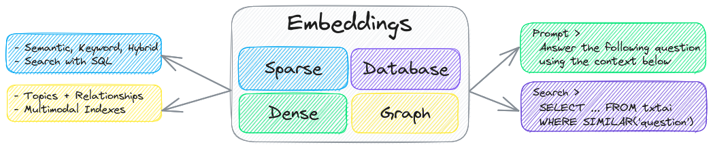
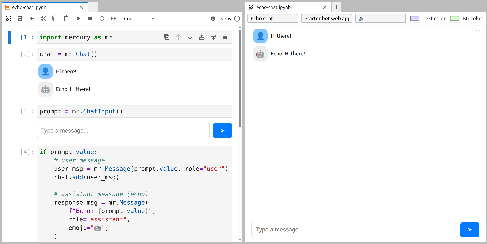
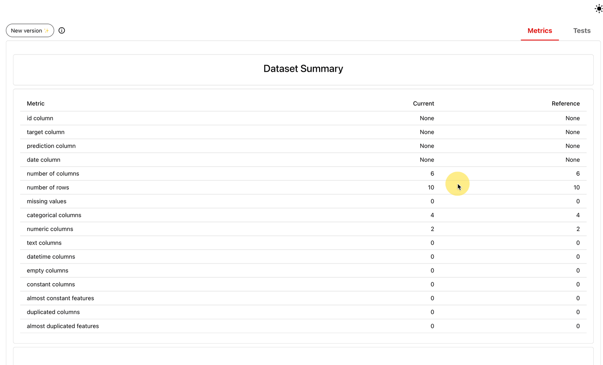
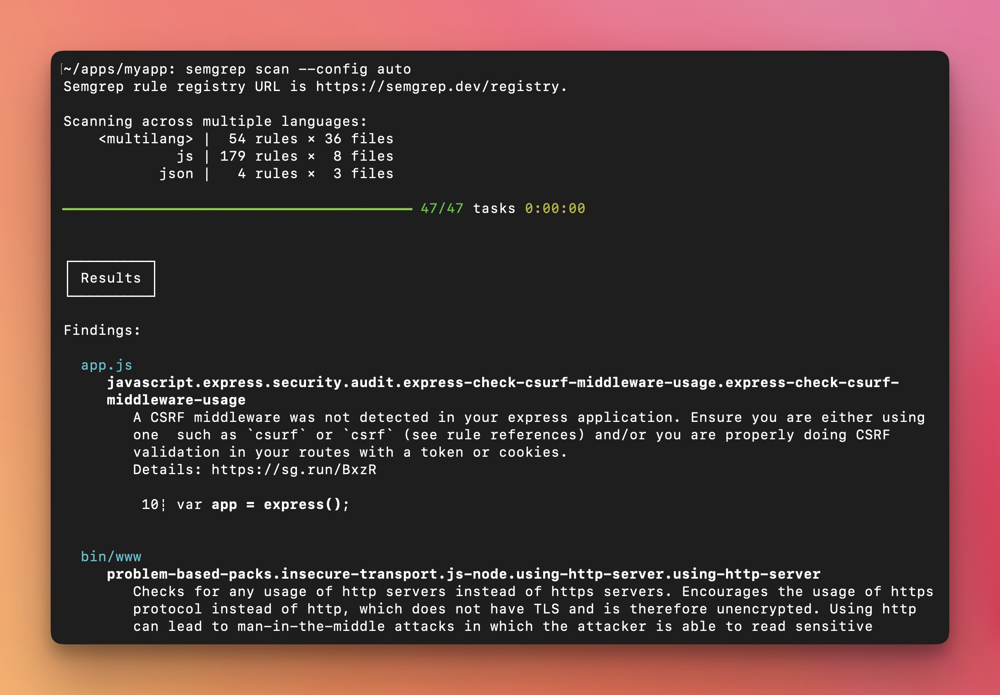

# 十个开源项目｜围绕一个具体任务开始

本次比较了十六个仓库，并查看官方 README、许可、Releases，以及社区和软件包目录线索。下面均为文档核验，未在本机逐项安装；界面图片是项目官方演示。成熟工具按用途首次推荐，日期保留 GitHub Releases 的 UTC 日期，不把采集日当首发。

| 你的任务 | 工具 | 最小起步 |
| --- | --- | --- |
| 给一批资料加检索 | txtai | 十条文本建一个本地索引 |
| 把向量检索做成服务 | Qdrant | 一个集合、一个过滤条件 |
| 把 Python 实验交给同事 | Streamlit | 单页输入、结果与图表 |
| 将 Notebook 变成应用 | Mercury | 一个带输入控件的笔记本 |
| 检查数据与模型输出变化 | Evidently | 比较两份小数据集 |
| 汇集人工反馈 | Argilla | 一个数据集、一种评分问题 |
| 编排有状态 Agent | Microsoft Agent Framework | 一个工具与一次人工接管 |
| 跟踪实验管线 | ZenML | 两步数据处理与产物记录 |
| 连接文档、检索与模型 | LlamaIndex | 小目录与可追溯引用 |
| 检查 AI 生成代码 | Semgrep | 一条本地规则扫描小仓库 |

## 01 · txtai：给资料加上检索、图关系和处理流水线

近期版本 9.13.0，2026-08-27；成熟工具推荐。

txtai 把嵌入检索、数据库、图关系与处理流水线组合在 Python 工具箱中。适合已经有一批文本，想先做可检索目录，再逐步加入摘要或关系探索的读者。与一开始搭建完整在线知识库相比，十条资料就足以检查它的索引与查询接口。

最小路径是安装 `txtai`，选择一个嵌入模型，写入带 ID 的文本，再按查询取回结果。额外的 LLM、转写或多模态能力会引入各自依赖、模型下载及许可，安装主包并不代表这些功能全部就绪。下图中检索位于多个流程的中间，提示我们先把文档来源和 ID 保存好，后续才容易追溯答案依据。

看中间的稀疏、稠密、数据库和图组件；外围流水线与工作流使用它们，而不是一次查询自动完成所有环节。（[来源原图](https://github.com/neuml/txtai)；[查看大图](images/project-txtai.png)。）

[源码与上手文档](https://github.com/neuml/txtai) · [Apache-2.0](https://github.com/neuml/txtai/blob/master/LICENSE) · [版本记录](https://github.com/neuml/txtai/releases)

## 02 · Qdrant：给向量检索加上可管理的服务边界

近期版本 1.19.1，2026-09-04；成熟工具推荐。

Qdrant 是向量搜索服务，适合需要按文档类型、日期或权限等字段过滤的知识应用。一个具体场景是先限制到某个研究主题，再从该主题的论文段落中检索相似内容。向量相似度负责语义匹配，附加字段负责业务范围，两者要一起设计。

可从官方容器和 Python 客户端开始，建立小集合、写入少量向量并验证过滤结果；嵌入模型仍需自己选择。公开服务前还要设置鉴权、持久存储和备份，不能把本地快速示例直接暴露到网络。核心服务采用 Apache-2.0，托管云的账号、费用和运营条件另算。这里推荐的是稳定的检索底座，当前补丁版本不包装成新的 AI 产品。

[源码与上手文档](https://github.com/qdrant/qdrant) · [Apache-2.0](https://github.com/qdrant/qdrant/blob/master/LICENSE) · [版本记录](https://github.com/qdrant/qdrant/releases)

## 03 · Streamlit：用少量 Python 把实验做成可交互页面

近期版本 1.63.0，2026-09-01；成熟工具推荐。

Streamlit 适合把 Python 数据分析、模型对比或小型问答实验做成同事能打开的页面。通过输入框、按钮和图表把参数与结果连接起来，可以比分享一串 Notebook 执行说明更容易使用。先做单页原型，通常比一开始拆复杂前后端更容易发现真正需要的交互。

安装后可用 `streamlit run app.py` 启动。脚本重运行与会话状态是关键概念：按钮触发后哪些计算重做，模型是否重复加载，用户状态是否隔离，都要自己处理。开源包采用 Apache-2.0，外部模型服务和托管平台条件独立。维护说明目前暂停接收维护团队之外的 PR，但仍接受问题报告；不要据此误称项目停止维护。

[源码与上手文档](https://github.com/streamlit/streamlit) · [Apache-2.0](https://github.com/streamlit/streamlit/blob/develop/LICENSE) · [版本记录](https://github.com/streamlit/streamlit/releases)

## 04 · Mercury：保留 Notebook 工作方式，交付简洁应用

近期版本 3.2.11，2026-09-10。

Mercury 面向已有 Notebook 的用户，把代码输出与输入控件组织成网页应用。适合交付参数化报告、内部数据工具或小型聊天界面，而不想把全部笔记本逻辑重写成独立网站。下图左边保留 Notebook，右边则是读者看到的应用，能直观看出开发界面与交付界面的区别。

可安装 `mercury`，在笔记本加入相应控件后运行服务，先确认修改参数会重算哪些单元格。示例中的 Echo chat 只是回显输入，没有接入真实语言模型；要做 AI 应用还需自行配置后端和密钥。项目采用 Apache-2.0，托管、分享权限和运行机器的资源限制另行考虑。交付前尤其要检查代码、内部路径或敏感输出是否意外展示。

左侧是开发用的单元格，右侧是面向读者的 Echo chat；它是回显示例，不能当作已接入模型的聊天机器人。（[来源原图](https://github.com/mljar/mercury)；[查看大图](images/project-mercury.png)。）

[源码与上手文档](https://github.com/mljar/mercury) · [Apache-2.0](https://github.com/mljar/mercury/blob/main/LICENSE) · [版本记录](https://github.com/mljar/mercury/releases)

## 05 · Evidently：先看数据变化，再解释模型分数变化

近期版本 0.7.23，2026-09-11。

Evidently 用报告和测试组织数据质量、分布变化与模型输出的检查。适合每周更新评测集，或上线后发现效果波动却不知道是数据还是模型出了问题的团队。先比较当前数据与参考数据的缺失值、类型和分布，再决定是否进一步调查，通常比只盯一个平均分更有效。

安装 `evidently` 后可从两份小表生成报告，再按实际任务配置指标或条件；涉及 LLM 评审的功能还可能依赖外部模型与费用。下图的 Current 与 Reference 表展示的是数据概况，不是漂移因果证明。核心代码为 Apache-2.0，云服务独立。自动告警需要结合样本量和业务阈值，统计变化并不自动意味着模型已经不可用。

先检查 Current 与 Reference 的行数、字段类型与缺失值；这是一幅官方演示静帧，表中十行不是本期数据。（[来源原图](https://github.com/evidentlyai/evidently)；[查看大图](images/project-evidently.png)。）

[源码与上手文档](https://github.com/evidentlyai/evidently) · [Apache-2.0](https://github.com/evidentlyai/evidently/blob/main/LICENSE) · [版本记录](https://github.com/evidentlyai/evidently/releases)

## 06 · Argilla：把人工反馈整理成可以复用的数据

成熟工具推荐；最近正式版本 2.8.0，2025-03-11。

Argilla 提供数据集、标注问题与人工反馈界面，适合收集回答偏好、错误类型或检索结果是否相关。与把评审意见散落在聊天记录相比，它能把反馈绑到具体样本，方便筛选、导出和后续训练使用。先选几十条真实问题，只设计一两种有明确判断标准的反馈项。

使用时需要部署服务并通过 Python SDK 写入数据，账号和团队权限也应随数据一起规划。代码采用 Apache-2.0；模型生成的预标注不能替代人工核对。维护状态需要特别说明：原作者已转向其他项目，仓库承诺按需修复和发布补丁，不再增加新功能。因此更适合已有稳定反馈流程或能自行维护的团队，新长期系统应评估接手成本。

[源码与上手文档](https://github.com/argilla-io/argilla) · [Apache-2.0](https://github.com/argilla-io/argilla/blob/develop/LICENSE) · [版本记录](https://github.com/argilla-io/argilla/releases)

## 07 · Microsoft Agent Framework：把 Agent 运行过程变成可管理的工作流

近期 .NET 版本 1.21.0，2026-09-11；Python 版本另行管理。

Microsoft Agent Framework 提供 Agent、工具调用与工作流组件，适合需要保存状态、恢复执行和让人参与决策的应用。一个小型例子是先读取资料、生成草稿，再停在人工审核节点，通过后才进入后续处理；工作流显式表达步骤，便于观察任务卡在何处。

可从对应语言的官方入门示例开始，只接一个模型和一个工具，再加入一次检查点或人工介入。Python 与 .NET 的包、版本和功能节奏并不完全相同，本文列出的 .NET 发布号不能当作 Python 安装版本。核心采用 MIT，模型提供商的计费与数据条件独立。框架给出组织方式，仍需开发者决定工具权限、失败重试以及恢复时如何避免重复执行。

[源码与上手文档](https://github.com/microsoft/agent-framework) · [MIT](https://github.com/microsoft/agent-framework/blob/main/LICENSE) · [版本记录](https://github.com/microsoft/agent-framework/releases)

## 08 · ZenML：为实验步骤、产物和运行记录建立关联

近期版本 0.96.4，2026-09-04；成熟工具推荐。

ZenML 用管线把数据准备、训练或评估步骤连接起来，并记录运行与产物。适合经常修改数据和参数，却在几天后分不清哪个模型来自哪次实验的人。最小场景只需两步：清洗数据、生成评测结果，先确认输入版本、参数与输出文件能够追溯，再扩展复杂流程。

官方本地路径可从带 server 组件的 Python 安装开始，再初始化项目并连接本地服务。远程执行、云存储和特定集成需要额外配置，不能把本地成功等同于已经部署生产管线。代码采用 Apache-2.0，托管 Pro 服务另有条件。它记录实验过程，但不会自动判断数据泄漏或比较是否公平；这些仍需实验设计保证。

[源码与上手文档](https://github.com/zenml-io/zenml) · [Apache-2.0](https://github.com/zenml-io/zenml/blob/main/LICENSE) · [版本记录](https://github.com/zenml-io/zenml/releases)

## 09 · LlamaIndex：连接文档、检索和回答的应用组件

成熟工具推荐；近期版本 0.14.24，2026-08-19。

LlamaIndex 的开源框架提供文档接入、索引、检索与模型调用组件，适合把一个资料目录做成带引用的问答原型。起步时应使用很小的文档集，查看每次回答实际检索到哪些片段，确认引用与结论对应；只有界面能回答问题，还不足以证明知识库可靠。

可以按需安装核心包与模型、嵌入等集成，避免把所有组件一次装齐。框架采用 MIT，外部解析服务、模型权重和云端费用另算。团队当前说明已把主要精力转向 LlamaParse、LiteParse 与解析评测，开源框架仍可用；LlamaParse 本身是独立平台，不能因为框架 MIT 就把它认作相同许可的本地开源组件。

[源码与上手文档](https://github.com/run-llama/llama_index) · [MIT](https://github.com/run-llama/llama_index/blob/main/LICENSE) · [版本记录](https://github.com/run-llama/llama_index/releases)

## 10 · Semgrep：把代码审查中的重复规则交给扫描器

近期版本 1.177.0，2026-09-10。

Semgrep 通过结构化规则检查代码，适合在 AI 生成补丁后寻找反复出现的问题，例如不符合项目约定的 API 用法或已知风险模式。它比纯文本搜索更理解语法结构，但规则命中仍需要结合上下文判断，不能把扫描通过视为代码已被全面验证。

可安装 CLI，先用一条本地规则扫描小仓库：`semgrep scan --config your-local-rule.yml`。社区引擎以单文件、函数内等能力为主，商业跨文件分析不能自动套到开源版。核心许可为 LGPL-2.1，规则集许可需要单独查看；使用远程规则或平台服务也有独立条件。图中显示命中文件、规则与代码位置，适合作为人工审查入口，而不是自动接受或拒绝整个补丁。

从 Findings 读到规则含义，再定位文件与行号；官方截图使用远程自动规则配置，正文最小例子使用本地规则。（[来源原图](https://github.com/semgrep/semgrep)；[查看大图](images/project-semgrep.jpg)。）

[源码与上手文档](https://github.com/semgrep/semgrep) · [LGPL-2.1](https://github.com/semgrep/semgrep/blob/develop/LICENSE) · [版本记录](https://github.com/semgrep/semgrep/releases)
