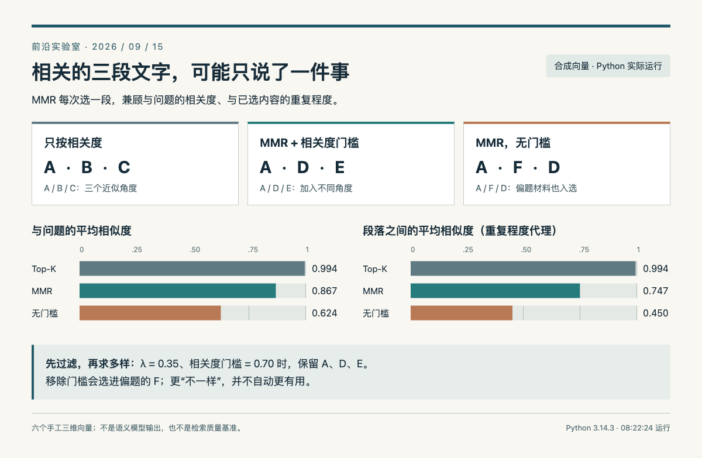

# 用 MMR 给检索结果留出不同角度

**本机已运行验证。** Python 3.14.3，运行时间 2026-09-15T08:22:24.208350+08:00；只用标准库，不下载模型、不访问外部 API。数据是六个手工构造的三维向量，文字标签只是解释用途，并不是文本经过嵌入模型后得到的结果。

## 问题：前三条都很相关，却很重复

假设要回答一个检索问题。A 是概览，B、C 是几乎重复的概览段落；D 侧重评测，E 侧重部署，F 则偏离问题。只按与问题的余弦相似度排序，前三条是 A、B、C。这样做没有计算错误，但有限上下文被近似内容占满了。

MMR（最大边际相关性）逐条选择内容。已经选中一条后，新候选既要和问题相关，也要尽量补充已选内容之外的信息：

```text
得分 = λ × 与问题的相似度
       − (1 − λ) × 与已选内容的最大相似度
```

λ 越接近 1，越重视相关度；越小，越愿意换取差异。这里沿用原方法中 λ 作为相关度权重的约定，某些产品的 diversity 参数方向恰好相反，接 API 时不能直接照抄数值。第一条约定取最相关内容，之后才计算冗余惩罚。[Goldstein 与 Carbonell 的原始方法说明](https://www.cs.cmu.edu/~jgc/publication/MMR%20Diversity.pdf)

## 实现：过滤、选种子、逐步加入

先计算六个候选与查询的余弦相似度，低于 0.70 的候选暂时排除。然后取最相关的 A；对剩余候选计算 MMR，选得分最高的一项，再更新“与已选内容的最大相似度”。本例 λ = 0.35、最终取三条。同分时按 ID 排序，结果可重复。

核心计算是下面几行；完整文件另外处理空输入、零向量、重复 ID 和数量边界。

```python
redundancy = max(
    (cosine(candidate["vector"], s["vector"]) for s in selected),
    default=0,
)
score = relevance_weight * candidate["relevance"] - (
    1 - relevance_weight
) * redundancy
```

下载[完整 Python 脚本](code/mmr_demo.py)，在同一目录运行：

```bash
python3 mmr_demo.py
```

脚本打印比较结果，并在旁边保存 `mmr-results.json.txt`。不需要 NumPy 或向量数据库。这里是小候选集的清晰实现，逐步重算相似度的成本随候选数和选择条数增加，不是生产环境速度优化版本。

## 实际结果与一个反例

| 方法 | 选中的 ID | 平均查询相似度 | 平均两两相似度 |
| --- | --- | --- | --- |
| 只按相关度 | A、B、C | 0.994 | 0.994 |
| MMR + 0.70 门槛 | A、D、E | 0.867 | 0.747 |
| MMR，无门槛 | A、F、D | 0.624 | 0.450 |

保留门槛后，D、E 替换了近似的 B、C，代价是平均相关度有所下降。删掉门槛虽然让段落之间更不相似，却把偏题的 F 选了进来。这个反例说明多样性只描述差异，不能单独保证有用；它也解释了为何通常先召回一批相关候选，再做多样性重排。




两组柱图均从 0 开始，直接读取本次 Python 输出：减少重复伴随相关度下降，移除门槛则引入偏题项。HTML/JS 制图，合成数据。（[方法来源](https://www.cs.cmu.edu/~jgc/publication/MMR%20Diversity.pdf)；[查看大图](images/practice-mmr.png)。）


九项断言检查了已知选择结果、偏题反例、空输入、k 的边界、余弦基本性质和零向量拒绝。它们验证本例实现行为，不是对真实 RAG 准确率的评测。

若换成真实资料，可固定查询和候选集，逐步调整 λ，人工检查答案需要的证据是否被保留。遇到必须同时保留多段互相印证证据的问题，过强的去重反而可能损失信息。先用带标签的小评测集选择参数，再观察最终回答质量，不宜只优化平均两两相似度。

[本次完整结果](code/mmr-results.json.txt) · [可复现 HTML/JS 图源](code/mmr-figure.html)。图源与结果文件放在同一目录，用静态 HTTP 服务打开即可渲染；直接从文件系统打开时，浏览器可能阻止读取相邻数据文件。
