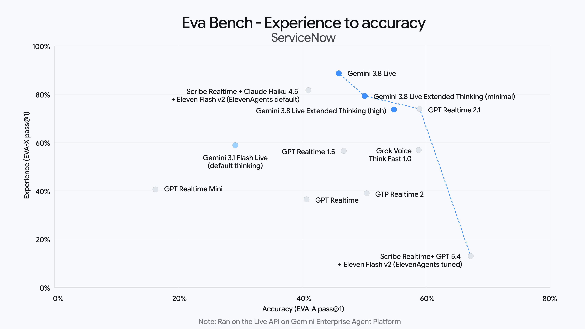
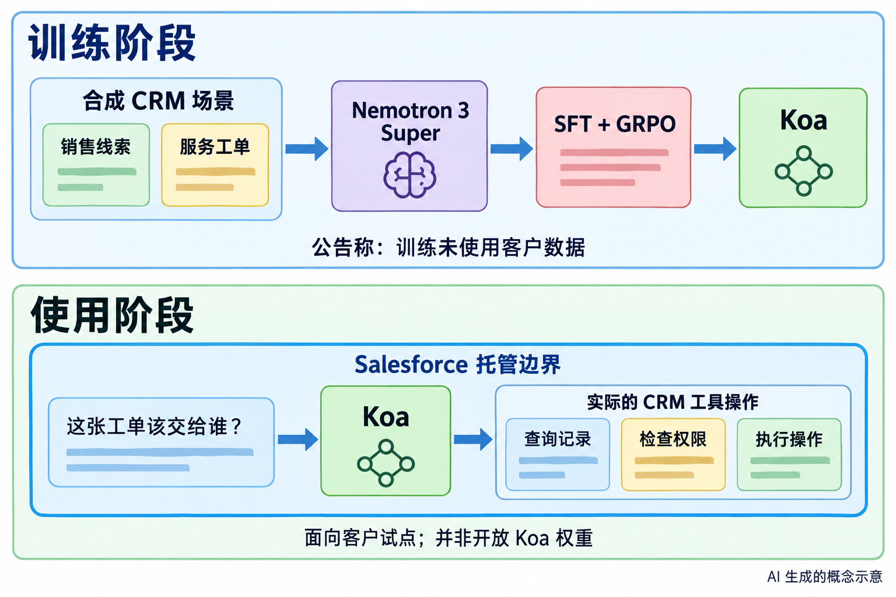
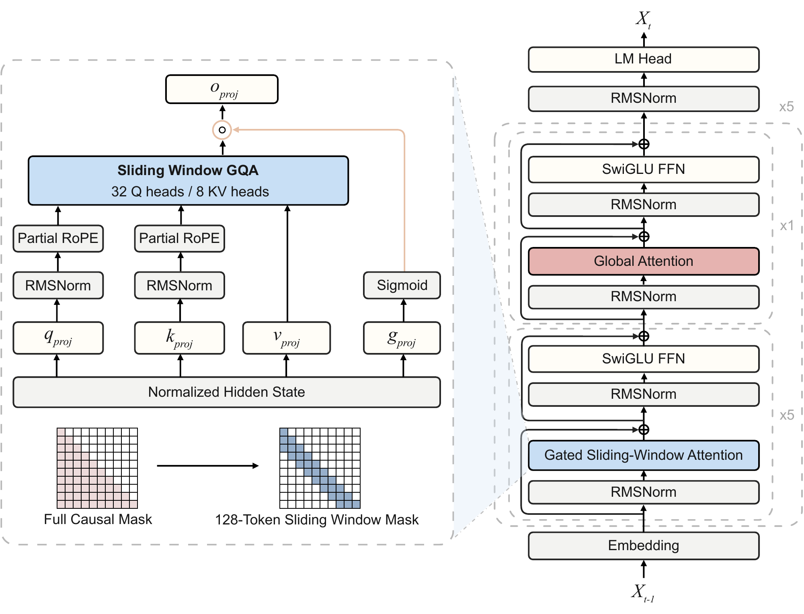

# AI 动态｜5 条重点详解，10 条速读

本期重点看实时语音、结构化决策、企业模型和长任务上下文。热门与有用分开判断：官方发布证明发生了什么，社区关注只能提供热度线索；尚缺两类独立近期信号的条目，不直接标成“热门”。以下日期按来源原日期列出，有明确时区的跨日情况另作说明。

## 01 · Gemini 3.8 Live：边说话、边推理、边调用工具

事件日期：2026-09-15。入选：新近实用 / 重要变化；官方公告与文档核验；本站未试用。

Google 发布 Gemini 3.8 Live 及 Extended Thinking 版本。公告时间换算为北京时间是 9 月 16 日凌晨。两者都面向实时音视频交互：普通版更强调响应效率，Extended Thinking 给复杂问题更多推理空间，并尝试让推理、说话和工具调用同时推进。它解决的具体问题是：语音助手处理较难任务时，用户往往只能对着一段沉默等待。

可以把新交互理解成一次持续进行的服务对话。用户描述问题时，助手先给出必要回应，再在后台查询记录或调用业务接口；工具返回后继续解释结果。接入摄像头时，视觉信息也参与对话。这里的例子用于解释工作方式，本站没有运行该 API，也没有测量网络延迟。

开发者可通过 Gemini API 和 AI Studio 使用两种版本；企业入口目前是私有预览，CX 等渠道另有开放计划。消费端则按产品与订阅逐步提供不同能力，不能把 API 可用理解成所有账户已得到相同功能。[Live API 文档](https://ai.google.dev/gemini-api/docs/live-api)应作为具体接入入口。

Google 给出了语音交互、工具使用等评测。读这些成绩时，既要看任务正确性，也要看交互体验。下图把 EVA-A 任务正确率与 EVA-X 体验指标分别放在两个坐标轴上；体验指标不等于单次响应延迟。这是官方在指定评测与接入环境中的对照，不是本站测试，也不能直接代表国内网络或你的业务场景。

横轴是任务正确率，纵轴是体验指标，两轴均以百分比表示；比较普通版与 Extended Thinking 所处位置。结果属于官方给定的评测设置，不能仅凭图中名次推断所有任务表现。（[来源原图](https://blog.google/innovation-and-ai/models-and-research/gemini-models/gemini-3-8-live-gemini-3-8-live-extended-thinking/)；[查看大图](images/gemini-live-benchmark.png)。）

对研究者更值得跟进的是并行交互带来的评测变化：回答是否正确、是否及时，以及工具结果是否真正影响后续回答，需要分别测量。官方称支持 97 种语言并提供音频水印；语言覆盖不等于每种口音、噪声条件下都已验证。HN 已有近期讨论，但本期没有连续热度基线，按新能力发布收录。

[原始来源](https://blog.google/innovation-and-ai/models-and-research/gemini-models/gemini-3-8-live-gemini-3-8-live-extended-thinking/)。

## 02 · Jev：把 AI 变成带概率的结构化决策函数

事件日期：2026-09-15。入选：新近创新；官方演示与评测协议核验；未独立复现。

TypeSafe 开放 Jev 的早期访问。它把输入状态映射为预先定义的结构化选择，并为结果给出概率；主要目标是分类、路由、评分和条件分支。若你的任务是“把这张工单分到三个队列中的一个”，这种接口可能比先让模型写一段解释、再从文字中解析标签更贴近业务需要。

它的关键取舍是放弃自由文本输出。开发者先定义允许的选项与结构，模型再给出对应决策，多个输出可在一次查询中并行产生。团队把训练方式称为 RLCD，目标是让置信度与实际正确程度更一致。概率校准的直觉是：许多被打上 80% 置信度的决定，长期看应有大约八成正确；单个答案的 80% 并不意味着已经有了事实保证。

下图展示作者提供的工作流。值得看的是多个判断怎样共同影响最终分支：模型承担不确定的判断，普通代码承担明确的计算与控制。较小的决策可以组合，但上游误判也可能传递到后续步骤。

这是作者评测工作流的原图。关注判断间的依赖，而不是把一次格式正确的输出等同于业务结论正确。（[来源原图](https://typesafe.ai/blog/introducing-system-one-models-and-jev)；[查看大图](images/jev-workflow.png)。）

公告中的“不会幻觉”需要收窄理解。它能约束输出属于允许的类型和选项，却仍可能把工单分错；类型保证与语义正确是两件事。作者还说明，相关“零错误”图针对 schema 匹配，并非从大量事实问答中测得零错误。本站因此不采用这个宣传语作为能力结论。

速度与成本对照也有条件：四个工作流由团队构造，参考答案取其他大模型的平均预测，LLM 对照使用输出概率的适配器。它们支持“特定决策接口值得测试”，不足以证明全面替代通用模型。目前是早期访问，尚无本期独立复现；上手可从[接口文档](https://docs.typesafe.ai/)核对可表达的 schema。

[原始来源](https://typesafe.ai/blog/introducing-system-one-models-and-jev)。

## 03 · Koa：为 CRM 动作后训练的企业推理模型

事件日期：2026-09-15。入选：新近实用 / 重要变化；官方公告与文档核验；本站未试用。

Salesforce 与 NVIDIA 公布 Koa，用于 Agentforce 的 CRM 多步任务。它在 Nemotron 3 Super 基础上后训练，目标是根据业务状态选工具、检查条件并执行动作。例如处理服务工单时，需要先查客户与历史记录，再决定路由，而不只是生成一段听起来合理的回复。

训练先用监督微调学习任务与工具格式，再通过 GRPO 强化学习改善完成目标的过程。官方使用的是合成企业场景，覆盖销售、服务等流程，并明确表示训练未使用客户数据。模型在实际使用时仍要读取获授权的业务信息；“训练不用客户数据”与“推理无需客户数据”不能混为一谈。

上半部分解释后训练，下半部分解释部署后的业务操作。它是依据公告绘制的 AI 生成概念示意，不是实际系统拓扑或安全认证。（[事实依据](https://www.salesforce.com/au/news/stories/koa-reasoning-model/)；[查看大图](images/koa-concept.png)。）

Salesforce 控制 Koa 的权重，并在自己的托管边界内进行后训练和推理。这一点与“基座采用开放模型”应分别看：本次并没有向公众开放 Koa 权重。对已有 Salesforce 数据、权限和流程的组织，价值在于把模型能力接进这些现成约束；独立开发者不能据此假定已经能下载同款模型。

官方 CRM 基准报告了较少的操作错误，但比较结果取决于任务分布、动作定义与基线。研究者应继续看[CRM Benchmark](https://www.salesforceairesearch.com/crm-benchmark)及[技术论文](https://arxiv.org/abs/2609.15066)，尤其关注模型是否真正完成动作、是否用对权限，以及失败后如何恢复。本站没有运行这组基准。

当前 Koa 已用于 Salesforce 内部，并进入部分客户试点；美国区域的普遍可用计划在 2026 年冬季。试点客户的存在可说明部署阶段，却还不能证明各行业都获得相同效果。今天值得看的新变化，是领域训练、业务工具与托管条件被作为一个完整产品一起交付。

[原始来源](https://www.salesforce.com/au/news/stories/koa-reasoning-model/)。

## 04 · ZGCM-1：把小模型数学能力与工具搜索放进同一训练配方

事件日期：2026-09-11｜近期补充。入选：新近创新；已读报告架构、评测与局限；未复现训练。

ZGCM-1 是从头训练的 7.39B 稠密模型，技术报告于 9 月 11 日提交，近期公开的仓库提供数据处理、预训练、中期训练和微调流程。本期按报告原日期补收，不把 9 月 15 日媒体介绍的时间当作模型首发。它把数学推理和主动调用搜索工具作为两个重点，适合研究“小模型如何借助外部信息完成任务”。

结构上，它在多数层使用 128 token 的滑动窗口，只在少数层做全局注意力。局部层处理附近信息，全局层让远处信息仍能传递。32 层中有 27 层局部注意力、5 层全局注意力；这延续了已有混合注意力思路，贡献需要结合训练与实验看，不能仅因结构组合就宣称全新范式。

右侧看局部层与全局层怎样交替，左侧看局部注意力输出的门控。来源为 ZGCM-1 技术报告架构图，按 CC BY 4.0 引用。（[来源原图](https://arxiv.org/abs/2609.13356v1)；[查看大图](images/zgcm-architecture.png)。）

作者在给定架构实验中报告，256K 上下文训练吞吐相对全注意力提高 3.94 倍；KV 缓存分析则是在 batch=1、BF16 等条件下比较。两者的分母与测试方式不同，都不应直接换算成实际应用整体快几倍。长上下文能力也需要针对目标任务另做验证。

报告中的数学成绩采用指定采样设置，通常汇总 32 次运行的平均 pass@1；网页研究允许最多 64 次搜索和阅读步骤。工具额度本身也是能力成本的一部分。代码仓库提供分阶段复现入口，权重和数据另有对应卡片与许可，不能把代码的 MIT 许可自动套给全部资源。

它的研究价值是配方与评估条件较可追溯：能够检查长上下文、数据筛选、搜索行为分别贡献了什么。局限同样明确：无检索的知识记忆、严格指令遵循，以及长程软件工程和终端任务仍有弱项。本期核验了报告与公开实现，没有复现大规模训练。[技术报告](https://arxiv.org/abs/2609.13356v1)。

[原始来源](https://github.com/zgcagi/ZGCM-1)。

## 05 · Claude API 新增按需压缩：应用决定何时整理长对话

事件日期：2026-09-14｜近期补充。入选：新近实用 / 重要变化；官方公告与文档核验；本站未试用。

Anthropic 在 Messages API 的 beta 功能中加入按需压缩。过去的阈值式压缩由 API 在上下文达到一定长度时触发；新方式允许应用主动提交待总结的消息，得到一个签名的 compaction 块，再把它放回后续请求。对于会查资料、写代码、调用工具的长任务，压缩时间由应用选择，可以更贴近真正的阶段边界。

这次变化还包括后台执行：应用可在保留完整历史继续对话的同时，请求对较早的历史生成摘要；摘要到达后再替换相应前缀。最近几轮可以原样保留，而不必全部挤进摘要。因此，长期目标、已完成步骤适合进入摘要，刚刚出现的错误与用户修正则可以留在原始消息里。

接口语义有一处需要特别注意。按需压缩返回的是替代原消息的签名块，后续请求必须把它放在消息开头；把已总结的旧消息继续放在它前面会报错。这与原先阈值式压缩的消息摆放方式不同。请求摘要时及之后携带该块的请求，都需要相应 beta header。

目前该功能面向 Claude API 支持的模型，文档列出具体范围；不能据此假定各云渠道已经同步开放。同一个请求也不能同时使用顶层 compaction 和 context_management。对于保留 thinking 的模型，摘要后接回旧轮次还有签名与历史一致性条件，应按[压缩文档](https://platform.claude.com/docs/en/build-with-claude/compaction)实现。

这一变化很实用，但摘要仍可能漏掉关键信息，也会消耗额外推理与计费资源。长任务应用应把目标、用户约束、产物路径和待办状态作为可检查的数据保存。本站本期只核验接口说明，没有调用付费 API；可复用的启发是把“整理上下文”和“继续执行任务”设计成明确的两个步骤。

[原始来源](https://platform.claude.com/docs/en/release-notes/overview)。

以下为十条速读。

## 06 · Meta One 把跨应用 AI 用量与订阅权益打包

事件日期：2026-09-15。入选：新近实用 / 重要变化；官方公告与文档核验；本站未试用。

Meta 推出覆盖 Instagram、Facebook、WhatsApp 和 Meta AI 的订阅组合，提高图像、视频及部分业务 Agent 的使用额度。个人、创作者和企业计划的权益不同，不能把同一套餐价格套给所有地区与账户。Edits Plus 等仍属于后续计划。本次值得看的变化是跨应用分发与额度整合，而不是新模型权重发布；已有免费核心功能继续提供。

[原始来源](https://about.fb.com/news/2026/09/introducing-meta-one-subscription-service-more-features-ai/)。

## 07 · HiDream 发布 HD-V1，把叙事规划与音视频生成结合

事件日期：2026-09-15。入选：新近实用 / 重要变化；公司供稿与演示核验；独立效果和接入范围待验证。

智象未来的公司供稿宣布 HiDream-O1-Video-1.0（HD-V1），支持多种条件输入和 5–20 秒、1080p 音视频生成，强调先规划镜头、角色和动作，再联合生成。供稿包含对比演示，但没有在本期获得独立复现；所称榜单名次与“理解物理”不作为本站结论。尚未核实开放权重及全面接入条件，适合作为新产品线索跟进。

[原始来源](https://www.qbitai.com/2026/09/489389.html)。

## 08 · Vidu S2 把视频编辑推进到流式交互

事件日期：2026-09-10｜近期补充。入选：新近创新；官方公告与文档核验；本站未试用。

Vidu S2 技术报告与演示把重点放在持续接收视频、持续输出编辑结果的流程，展示 720p 流式处理及动态指令场景。它的价值是让编辑不必总等完整片段上传、生成完毕才反馈。即时交互对延迟、历史一致性和计算资源都有要求，官方演示不能直接说明任意设备都能达到同样体验。本期读了方法与演示，未运行模型；论文日期按 9 月 10 日标注。[报告](https://arxiv.org/abs/2609.11638v1)。

[原始来源](https://vidu.com/vidu-stream)。

## 09 · AIforce：把业务权限和动作带到外部 AI 界面

事件日期：2026-09-15。入选：新近实用 / 重要变化；官方公告与文档核验；本站未试用。

Salesforce 发布 AIforce，将已有数据、业务规则和权限带到 Claude、Slack 等界面。首批包括 Claudeforce、Slackforce 与 Agentforce Coworker；Salesforce in Claude 以预置 MCP 和销售技能提供 beta。它与 Koa 的区别是解决“外部界面如何操作业务系统”，模型则负责推理。管理员仍需按具体产品配置，公告中的整体愿景不意味着所有组件同时普遍可用。

[原始来源](https://www.salesforce.com/au/news/stories/aiforce-announcement/)。

## 10 · NVIDIA 与伙伴公布 AI 机房功率调度的新结果

事件日期：2026-09-15。入选：新近实用 / 重要变化；官方公告与文档核验；本站未试用。

AI Infra Summit 的更新关注整座机房在固定功率预算内能完成多少工作。Lambda 报告用 DSX MaxLPS 在原本供 16 个满功率节点的预算内运行 19 个节点，集群 token 吞吐增加约 24%、每瓦性能改善约 23%。这属于指定部署条件的伙伴结果，并非每台 GPU 的普遍提速。公告还包含电网需求响应与互连合作，适合关注推理基础设施的人继续查原始案例。

[原始来源](https://blogs.nvidia.com/blog/ai-infra-summit-vera-rubin-dsx-energy-efficiencies-tokens-per-watt-ai-factories/)。

## 11 · 字节级蒸馏：让小模型摆脱固定 token 词表的约束

事件日期：2026-09-11｜近期补充。入选：新近创新；已查阅论文方法与实验；未独立复现。

这项研究的“字节”指 byte，不是字节跳动。作者把 token 教师的概率映射成 byte 概率，比较层参数匹配、总参数不同的约 1B 级模型、不同数据量与训练目标。低计算量时 token 模型更强；投入更多训练后，部分 byte 方案在所测任务上反超。文中部分“未来可超过多少”的数字来自拟合外推，不能当作已经测到的结果。新意在于跨分词方式蒸馏及可比实验设计，本站未复现。

[原始来源](https://arxiv.org/abs/2609.12303v1)。

## 12 · AIUC 融资后计划把审计覆盖扩至前沿模型

事件日期：2026-09-15。入选：新近实用 / 重要变化；官方融资与产品机制说明；扩展仍为计划。

AIUC 宣布 4,000 万美元 A 轮融资，加上此前种子轮累计 5,500 万美元，计划把标准、审计与保险服务从 Agent 扩至前沿模型。其现有路线按业务类型测试越狱、数据泄露等风险，再结合审计证据。这一扩展值得安全评测研究者关注，但融资额与客户认证不能证明模型在所有情境安全；测试覆盖、版本和通过条件仍须分别检查。

[原始来源](https://aiuc.com/updates/series-a-announcement)。

## 13 · Profound 获新融资，继续从可见度分析走向营销 Agent

事件日期：2026-09-16。入选：新近实用 / 重要变化；公司公告核验；未验证客户效果。

Profound 官方宣布 1.8 亿美元 D 轮、估值 18 亿美元，并继续推进 AI Marketer（Aim）。产品关注品牌在 AI 回答中的呈现，以及结合企业资料组织营销工作。这里的新事件是融资及产品路线披露，Aim 并非今天才首次出现。对应用研究的启发是把企业资料与持续工作结合；融资和官方客户数量不等同于已验证的投入产出。

[原始来源](https://www.tryprofound.com/blog/series-d)。

## 14 · Copilot 为仓库自定义属性建议取值

事件日期：2026-09-15。入选：新近实用 / 重要变化；官方公告与文档核验；本站未试用。

GitHub 为 Copilot Business / Enterprise 开放公共预览：组织或企业管理员新建仓库自定义属性时，可获得允许取值的建议，再用于规则集的仓库筛选。它帮助统一治理元数据，不会替你证明仓库符合某个合规等级。公告当地时间为 9 月 15 日，北京时间已是 9 月 16 日。适合有大量仓库、需要一致分类规则的团队，个人单仓库使用价值较小。

[原始来源](https://github.blog/changelog/2026-09-15-github-copilot-suggests-custom-properties-definitions)。

## 15 · 微软更新 AI 信息核验教育计划

事件日期：2026-09-15。入选：新近实用 / 重要变化；官方新增教育材料与实施范围核验。

微软启动新一阶段 Check. Recheck. Vote，针对用户在搜索与 AI 回答中获取选举信息的习惯，提供来源核查、日期核查和回访官方信息的教育材料，并与选举机构合作传播。新增材料还包括课堂活动。对 AI 产品研究而言，它提出了具体的来源、时效和地域一致性问题；这是信息素养与公共教育项目，不是一个已解决事实错误的新模型。

[原始来源](https://blogs.microsoft.com/on-the-issues/2026/09/15/2026-midterm-elections-helping-voters-navigate-election-information-in-the-age-of-ai/)。
