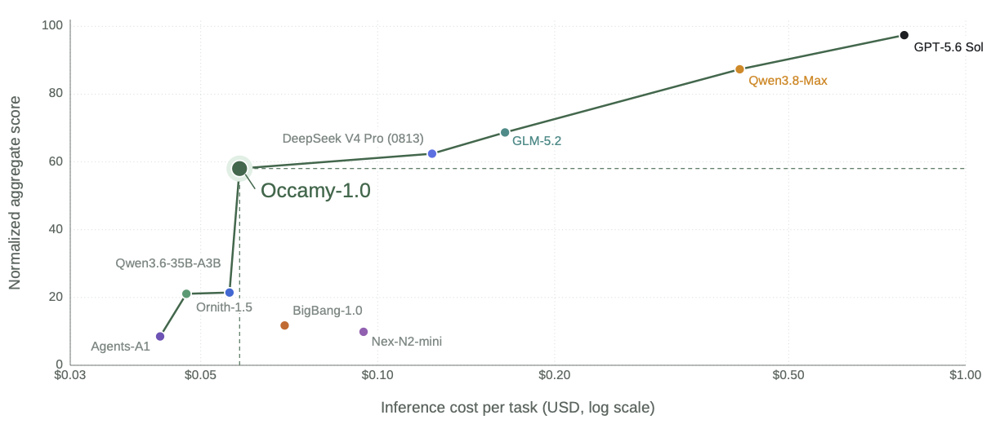
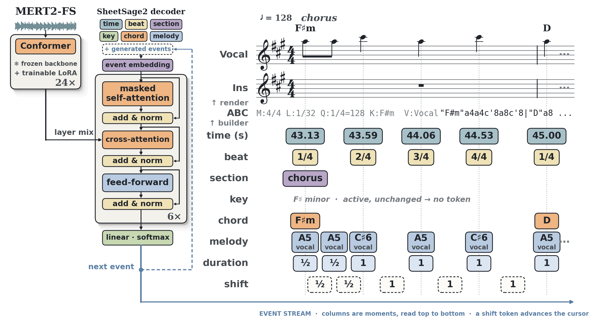
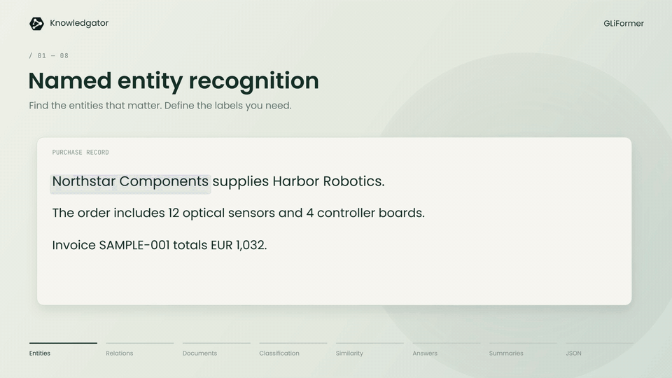

# 六个模型｜任务、权重与运行门槛一起看

本栏沿用“开源模型”的导航名称，但逐项区分宽松许可、非商业权重与自定义商业限制。六项均核对了模型卡和实际权重文件，未在本站下载运行；作者评测不等于本站实测，模型仓库的访问日期也不等于权重首发。

| 具体任务 | 本期对象 | 先检查的条件 |
| --- | --- | --- |
| 多步文件与工具协作 | Occamy-1.0 | 35B 总参数，3B 激活量不等于显存占用 |
| 图像、视频与空间问答 | 紫东太初 5.0-9B | 视觉骨干许可及专用运行分支 |
| 音频转乐谱 | SheetSage2 | 非商业许可，另需 MERT 编码器 |
| 按标签抽取文本 | GLiFormer | 英文评测为主，抽取质量需自己验证 |
| 减少长推理开销 | Swift-Qwen3.8-27b | 商业收入限制，速度与质量有取舍 |
| 土耳其语语音合成 | Kahya-TTS | CUDA 环境及参考音频，逐句输入 |

## 01 · Occamy-1.0：为长流程协作训练的 35B 模型

2026-09-03 · 近期补充。入选：新近实用；本月开放权重，9 月 15 日仓库新增量化版本入口；不是当天才发布的新模型。

它在 Qwen3.6-35B-A3B 上继续训练，重点是搜集信息、调用工具、修改文件之后，仍能保持任务状态并从错误中恢复。训练把长程执行与短程效率分开培养，再合并能力；作者公开了权重和部分训练数据，完整训练数据并未全部开放。

下图把四个协作基准归一化汇总，横轴是按作者协议估算的每任务美元成本。它可帮助比较这组系统的成本与成绩取舍，不能直接解释成绝对任务成功率，也不能把当时 API 报价当作自部署成本。具体工具环境和任务分布会改变排序。

权重为 Apache-2.0。总参数约 35.1B，BF16 原始权重约 70.2GB，尚未计入缓存和服务开销；“每 token 激活 3B”并不意味着只存 3B 参数。模型卡提供 SGLang / vLLM 路径，量化文件另列，应分别确认格式和硬件支持。适合已有 GPU 服务、需要多步协作的研究者，本站没有验证量化后的成绩。

先看横轴的对数美元成本，再看纵轴归一化后的四基准均分；曲线反映作者所测配置的取舍，不是统一硬件的吞吐测试。（[来源原图](https://huggingface.co/Accio-Lab/occamy-1.0)；[查看大图](images/occamy-cost.png)。）

[模型卡与权重](https://huggingface.co/Accio-Lab/occamy-1.0)

## 02 · 紫东太初 5.0-9B：文本、视觉与空间任务的组合

2026-09-04 · 近期补充。入选：新近实用；近期开放的多模态权重，适合检验视觉表征如何参与空间与工具任务。

模型组合 Qwen3.5-9B 语言骨干和 C-RADIOv4-H 视觉编码器，接收文字、图像及视频。模型卡强调空间理解、视觉规划和工具任务，并提供推理示例；这些能力描述不等于已经开放完整机器人控制系统。所谓自适应循环推理的收益，仍需更多独立消融核验。

下载目录有五片权重，总参数约 9.79B，BF16 权重本身约 19.6GB；128K 上下文还会增加运行需求。现有接入说明包含专用 vLLM 分支，不能只根据模型名称假定通用框架开箱即用。先用一张图及一个具体问题检查输出，再扩展到视频。

仓库的 [LICENSE](https://huggingface.co/TaichuAI/ZDTaichu5.0-9B/blob/main/LICENSE) 采用 NVIDIA Open Model License Agreement，并列出 Qwen 等第三方声明。它允许条款内的商业使用及衍生模型，但保留再分发和使用条件；不能简写成全部组件都是 Apache-2.0。本期按模型卡和文件核验，未运行空间基准。

[模型卡与权重](https://huggingface.co/TaichuAI/ZDTaichu5.0-9B)

## 03 · SheetSage2：把音频变成可编辑的乐谱事件

2026-09-09。入选：新近实用；9 月 15 日补齐和弦基线的同协议对照；更新的是评测说明，原模型成绩未改变。

输入一段音乐，模型先用 MERT-v2-FullSong 编码，再生成音符、声部、和弦与时间等事件，最后输出 ABC 或 MIDI。它面向转谱和音乐分析，长音频通过重叠窗口处理；多乐器输出仍需要逐段检查，不应当作保证正确的自动扒谱。

模型卡明确修正了和弦比较：ChordFormer 在 Chords1217 上用留出折模型，SheetSage2 使用统一检查点；双方尽量匹配评分方式，但训练和模型选择条件仍不完全相同。9 月 15 日的改动没有重新训练 SheetSage2，也没有提高其原分数。

许可为 CC-BY-NC-4.0，非商业条件适用于这些权重。目录里约 5717 万参数的文件不是完整音频系统，运行还要加载 MERT 基础编码器。官方环境使用 Python 3.10/3.11、FFmpeg 6.1，并记录了 CUDA / H800 测试设置；不能用这一个小文件的大小估算完整部署资源。

从左到右看音频编码、事件序列与乐谱输出；MERT 是独立必需组件，不能只下载右侧解码部分就认为系统齐全。（[来源原图](https://huggingface.co/m-a-p/SheetSage2)；[查看大图](images/sheetsage-architecture.png)。）

[模型卡与权重](https://huggingface.co/m-a-p/SheetSage2)

## 04 · GLiFormer：用同一编码器完成多种文本抽取

2026-09-11。入选：新近实用；新权重把实体、关系、分类与结构化抽取放进一个标签驱动的接口。

调用方提供文本及想找的类别，模型在共享编码表示上执行不同任务。比如从采购记录中找公司、金额，再抽取供货关系；它适合固定业务标签下的数据整理，避免每一步都启动大型生成模型。官方演示展示了这种输入到输出的对应关系，不能据此保证自己的文档也有相同效果。

large-v1 基于约 5.76 亿参数的编码器，权重和代码按 Apache-2.0 提供。Python 3.10 以上可安装 gliformer，CPU 路径可用，CUDA 为可选加速；本站没有测量实际速度或中文质量。

作者在 26 个实体识别数据集报告严格 F1 50.91；结构化任务的 91.10 则来自 500 个样例、对边界更宽容的评分，不能混成同一个“准确率”。Pydantic 约束可帮助组织输出格式，无法保证抽到的内容真实；业务上线仍应检查遗漏和误抽。

官方动画中的实体识别静帧：采购记录里的公司名被定位为抽取对象。输入标签与任务决定抽取目标；这是一段官方示例，非本站测评。（[来源原图](https://huggingface.co/knowledgator/gliformer-large-v1)；[查看大图](images/gliformer-tasks.png)。）

[模型卡与权重](https://huggingface.co/knowledgator/gliformer-large-v1)

## 05 · Swift-Qwen3.8-27b：压缩思考长度，也保留质量代价

2026-09-08 · 近期补充。入选：新近实用；近期权重尝试减少冗余推理，适合研究成本与准确率之间的具体取舍。

训练针对冗余的推理标记与重复思考施加约束。作者的 BF16、五随机种子评测中，GPQA 分数从基线 88.38 变为 88.28，思考 token 从 6642 降至 2771；但 AIME 2026 从 98.67 降至 94。它说明部分任务能省开销，也说明“推理更短而质量完全不变”并不成立。

27.8B 参数的 BF16 权重约 55.6GB，另需运行缓存；模型卡给出 vLLM 条件，不能把全精度评测直接套给社区量化版。评估时应一起记录总输出 token、正确率和延迟，不能只挑节省最多的一项。

模型卡所列 Swift Open License 1.0 对商业组织设年经常性收入门槛：含关联实体不超过 100 万美元可按卡片条款使用，超过需企业许可。本次目录未找到独立许可文件，模型卡说明不能代替缺失的正式条款核验。因此将其列作带条件的开放权重，不能称为无限制商业开源。

[模型卡与权重](https://huggingface.co/ukisai/Swift-Qwen3.8-27b)

## 06 · Kahya-TTS：可复核的土耳其语逐句合成入口

2026-09-07 · 近期补充。入选：新近实用；本月公开合并权重、推理脚本和烟雾测试记录，价值在可检查的任务流程。

Kahya 在 VoxCPM2 上做土耳其语适配，发布的 v1 权重已经合并 LoRA。输入参考 WAV 和按行分好的句子，脚本依次输出句子音频、合并音频和 metrics.json；给一段新参考声音并不意味着再训练一次模型，也不会自动处理长段落的断句。

9 月 7 日官方烟雾测试只验证了两个短句成功生成 3.36 秒、48kHz 音频。另有开发阶段的高端 GPU 测量，不能据此推导普通显卡延迟或大规模听感质量。训练数据和原始听评记录没有全部公开，本站未独立复现训练或语音质量。

约 2.29B 参数，BF16 原始权重约 4.58GB，实际运行还要留出中间状态。模型按 Apache-2.0 提供；官方脚本面向 Linux、NVIDIA CUDA 与 Python 3.12，并固定 VoxCPM 修订。适合土耳其语语音实验；先复现两个短句、检查发音与截断，再考虑长内容。

[模型卡与权重](https://huggingface.co/AlicanKiraz0/Kahya-TTS-v1.0)
