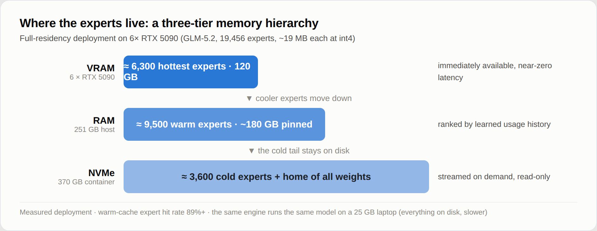
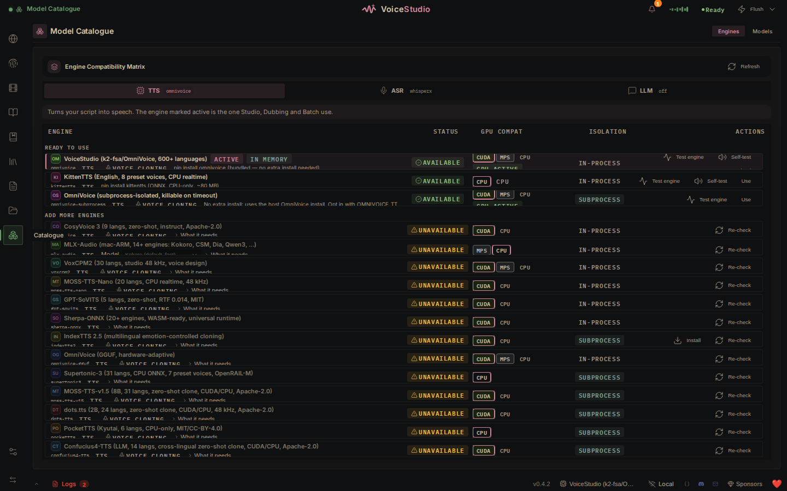
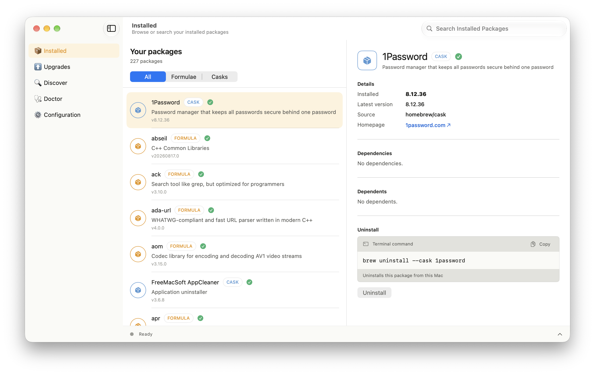

# 十个开源项目｜先找实际任务，再看热度证据

本期比较十七个项目，保留十个不同任务的工具。两类入口并行：近期榜单与使用反馈，以及新公开实现和重要功能进展。榜单只提供发现线索；本期没有连续 7 / 30 天增长数据，因此“近期升温观察”不等于已经证明长期热门。旧项目会写明建立时间和这次值得关注的原因，不把小修复包装成新产品。

下面均核对源码、README、许可及版本记录，未在本站安装运行。社区 Issue 只支撑具体使用线索，也可能暴露门槛，不能代表用户数量或稳定性。

| 你现在要做什么 | 可先看的项目 | 主要门槛 |
| --- | --- | --- |
| 给 PR 找到可定位的问题 | OpenCodeReview | Git、模型接口及 API 费用 |
| 用分层存储运行大型 MoE | Colibri | 权重磁盘、内存和带宽 |
| 做本地语音转录与配音 | VoiceStudio | 引擎与模型下载、平台适配 |
| 用界面管理 Homebrew | BrewUI | macOS 26+、Homebrew |
| 管理 Agent 科研实验 | OpenResearch | 本地 Git、自己的 Agent / 模型 |
| 自建多模型协作入口 | LibreChat | 服务端配置、模型服务，候选版本 |
| 部署机器人 VLA 推理 | APXinf-robo | NVIDIA Jetson / CUDA 与模型权重 |
| 把运行经验接入改进流程 | Reef | 评估器、版本管理，训练可需 GPU |
| 按需查看自己的 APK 代码 | ASC | Python 与有权分析的 APK |
| 找回 Agent 改动的来龙去脉 | Atlas | macOS、本地 Git 与外部 Agent |

## 01 · OpenCodeReview：让代码审查定位到具体改动

入选：近期升温观察。仓库建立于 5 月 18 日；本次关注来自单日明显增长及现有审查实现，9 月 15 日 v1.12.2 不是产品首发。

它先用确定性的代码处理流程和语言规则缩小检查范围，再让 LLM 对相关改动给出行级意见。适合已有 PR 流程、希望减少泛泛评论的团队；输入是仓库差异，产出是能回到文件和行号的审查意见，而不只是聊天总结。

上手可从官方 npm 包 @alibaba-group/open-code-review 和 `ocr review` 开始，仍需 Git、可用的模型服务及 API 凭据。已有聊天订阅不应自动当成这里的 API 授权。作者提供多语言、真实 PR 的评估说明，成绩受规则与模型配置影响，本站没有复测。

9 月 15 日一位外部用户记录了 33 个文件、约三千行新增的 MR 用时约三十分钟，并注明模型和版本。这种具体使用记录比宣传数字更有帮助，也不能推广为统一性能。接入 CI 前应先拿小仓库检查质量、耗时和费用。

当日榜单观察：新增 2,751 Star，总量 28,473。另有近期[具体使用反馈](https://github.com/alibaba/open-code-review/issues/1268)，能看到实际遇到的问题；这两类信号仍不足以证明持续热门。 [榜单快照来源](https://github.com/trending?since=daily)。

[源码与上手文档](https://github.com/alibaba/open-code-review) · [Apache-2.0](https://github.com/alibaba/open-code-review/blob/main/LICENSE) · 版本：v1.12.2。

## 02 · Colibri：把 MoE 专家分层放在磁盘、内存与 GPU

入选：新近实用 / 新近创新。7 月建立的项目于 9 月 13 日 v1.11.0 新增 DeepSeek-V4.1-Flash 支持，属于可核验的模型支持进展。

MoE 每一步只调用部分专家，但仍要存下整套权重。Colibri 按实际需要把专家从磁盘送到内存与 GPU，适合用存储容量换取较低的常驻显存需求。它是 C 推理引擎，提供聊天、服务和网页入口；前端与视觉等功能仍可能引入 Python 组件，不能把引擎“零依赖”推广到所有使用路径。

本次新增的大模型示例涉及约 510GB 磁盘权重，其中还包含大型 Engram 表。能加载不等于交互流畅，性能取决于 SSD、内存、带宽及缓存命中。先按支持列表选择自己能容纳的权重，再试 `coli chat` 或 `coli serve`。

下图的全驻留配置示例使用六张 RTX 5090 和大量系统内存，不能当作普通笔记本要求或效果。维护者还在处理预填充与续算的一致性问题，真实应用应检查自己模型的支持状态。

当日榜单观察：新增 2,035 Star，总量 33,788。 [榜单快照来源](https://github.com/trending?since=daily)。

三个存储层解决的是容量与搬运的取舍。图中 6×RTX 5090、251GB 系统内存是具体全驻留示例；不是全部模型通用的最低配置。（[来源原图](https://github.com/JustVugg/colibri)；[查看大图](images/colibri-tiers.png)。）

[源码与上手文档](https://github.com/JustVugg/colibri) · [Apache-2.0](https://github.com/JustVugg/colibri/blob/main/LICENSE) · 版本：v1.11.0。

## 03 · VoiceStudio：先选合适的引擎，再做本地语音任务

入选：近期升温观察。项目建立于 4 月 9 日，当前 v0.5.2 于 9 月 10 日发布；本期结合近期关注与不同用户的运行反馈评估。

它把转录、语音合成、声音参考和视频配音放到一个本地桌面工作流中。真正执行任务的是所选引擎和模型：比如把访谈转文字，需要选 ASR；给文字配音，则要选 TTS。引擎目录覆盖多种语言，不意味着每个模型都支持全部语言。

从官方桌面发行包开始，先确认操作系统和计算后端，再下载一个所需模型。Apple Silicon、Windows 与 Linux 的支持条件不同，Intel Mac 也不能照搬 Apple Silicon 路径；模型权重另有自己的许可，AGPL-3.0 只说明应用代码的条件。

近期外部用户报告了桌面来源校验、导出参数及 Windows 后端退出问题，说明应用确有人在尝试，也说明重构中的体验仍需验证。先用短音频检查转录或配音是否完整，再导入长素材。

当日榜单观察：新增 2,081 Star，总量 30,899。另有近期[具体使用反馈](https://github.com/debpalash/VoiceStudio/issues/2136)，能看到实际遇到的问题；这两类信号仍不足以证明持续热门。 [榜单快照来源](https://github.com/trending?since=daily)。

先按任务选择 ASR 或 TTS，再检查对应引擎的下载与运行条件。目录里的模型是不同组件，不能把应用安装完成等同于全部能力已就绪。（[来源原图](https://github.com/debpalash/VoiceStudio)；[查看大图](images/voice-catalogue.png)。）

[源码与上手文档](https://github.com/debpalash/VoiceStudio) · [AGPL-3.0](https://github.com/debpalash/VoiceStudio/blob/main/LICENSE) · 版本：v0.5.2。

## 04 · BrewUI：看得见底层命令的 Homebrew 界面

入选：近期升温观察。项目建立于 3 月 2 日；9 月 16 日北京时间发布 v0.4.2，本期因近期关注和具体安装升级反馈收录。

BrewUI 为 Homebrew 提供原生 SwiftUI 界面，适合会装软件、但不想记住每条终端命令的 Mac 用户。可以查看包、选择升级，并在界面中看到底层操作与输出；截图右侧的命令区比一张软件 Logo 更能说明它如何帮助排查问题。

当前要求 macOS Tahoe 26 以上及 Homebrew，文档安装入口为 `brew install --cask homebrew-app`。应用会以隔离的 zsh 环境调用 brew；终端里的 alias、导出变量和自定义 PATH 不会全部沿用。Homebrew 配置需按文档写进 brew.env，再重新启动检查。

这次选择不把常规版本修复当成重大 AI 新闻。其价值在本地开发环境管理，近期用户仍报告“全部升级”可能等待交互而停住；应查看操作日志，不把图形界面理解成免维护。

当日榜单观察：新增 356 Star，总量 1,325。另有近期[具体使用反馈](https://github.com/Homebrew/BrewUI/issues/209)，能看到实际遇到的问题；这两类信号仍不足以证明持续热门。 [榜单快照来源](https://github.com/trending?since=daily)。

左侧选择软件包，右侧展示将调用的 Homebrew 操作与输出。这个界面把操作和底层命令连起来，便于理解安装或升级停在哪一步。（[来源原图](https://github.com/Homebrew/BrewUI)；[查看大图](images/brewui-interface.png)。）

[源码与上手文档](https://github.com/Homebrew/BrewUI) · [AGPL-3.0](https://github.com/Homebrew/BrewUI/blob/main/LICENSE) · 版本：v0.4.2。

## 05 · OpenResearch：把科研 Agent 的实验过程保存下来

入选：近期升温观察。6 月建立的研究工作区近期升温，9 月 15 日北京时间发布 v0.2.2；关注其现有实验隔离与记录机制。

它把编码 Agent 接到本地科研工作区，让任务分支、实验文件、日志和产物能追溯。适合已经让 Agent 跑脚本、但常常分不清哪个版本生成了哪份结果的研究者。它可为任务创建 Git 工作区并归档执行记录，仍需要人定义评价标准，不会自动保证研究结论成立。

安装官方发行版本后，用 `orx up` 打开本地服务，再连接自己的 Claude、Codex 等 Agent 或模型端点。远程算力是可选接入；账户和付费条件取决于所用托管服务，不能把工作区开源等同于模型免费。

外部用户近期报告 Claude Code 的部分斜杠命令和 Agent 切换入口存在问题。最小验证应从一个可重复的小实验开始，检查分支、日志、输出文件是否能对应，再交给它更长的任务。

当日榜单观察：新增 593 Star，总量 3,312。另有近期[具体使用反馈](https://github.com/alphaXiv/OpenResearch/issues/337)，能看到实际遇到的问题；这两类信号仍不足以证明持续热门。 [榜单快照来源](https://github.com/trending?since=daily)。

[源码与上手文档](https://github.com/alphaXiv/OpenResearch) · [MIT](https://github.com/alphaXiv/OpenResearch/blob/main/LICENSE) · 版本：v0.2.2。

## 06 · LibreChat：在自建入口里观察 Agent 的执行过程

入选：新近实用 / 新近创新。成熟项目本次有 9 月 15 日 v0.8.8-rc3 的功能进展；它是预发布版本，不能按稳定版部署说明理解。

LibreChat 为多模型、工具和 Agent 提供统一的自托管界面。本次候选版本包含实验性的编码 Agent 自带模型接入、执行轨迹查看，以及子 Agent 文件共享等能力。对团队而言，价值在能检查一次任务调用了什么、文件从哪里来，而不是仅增加模型下拉选项。

最小路径是按官方服务端配置启动实例，接入一个可用模型，再测试带文件的小任务。Docker 和模型 API 等依赖、服务费用仍需自己承担；MIT 许可覆盖项目代码，不覆盖外部模型服务。

近期社区报告指出多副本部署时 OAuth 刷新锁只在单进程内生效，也有人报告租户资源所有权问题。它们是具体使用线索，尚不能在没有复测时当作本站确认的漏洞结论；先在测试环境核验这些部署条件，再决定是否升级候选版。

当日榜单观察：新增 261 Star，总量 43,805。另有近期[具体使用反馈](https://github.com/danny-avila/LibreChat/issues/15977)，能看到实际遇到的问题；这两类信号仍不足以证明持续热门。 [榜单快照来源](https://github.com/trending?since=daily)。

[源码与上手文档](https://github.com/danny-avila/LibreChat) · [MIT](https://github.com/danny-avila/LibreChat/blob/main/LICENSE) · 版本：v0.8.8-rc3（预发布）。

## 07 · APXinf-robo：把机器人策略推理带到 Jetson

入选：新近实用 / 新近创新。仓库 9 月 7 日建立，9 月 15 日进入公开介绍；尚无正式 Release，以当前源码和作者实验核验。

它用 Rust 与 CUDA 为视觉—语言—动作模型提供推理实现，重点面向 Jetson Thor / Orin 上的机器人策略。输入摄像头图像和任务，输出动作序列；支持 OpenPI 通信接口，适合已经有机器人或模拟评测管线的开发者。

作者在 Thor、两路 224 图像、batch=1、十步 flow 和动作长度十的设置下报告：Pi0.5 从 BF16 的 72.45ms 降到 FP8 的 41.16ms，指标为指定环境的 P50。LIBERO 五百回合成功率则为 92.8% 与 92.2%。延迟和任务成绩需要一起看，不能只留下加速倍数。

安装需 Linux、NVIDIA 驱动 / CUDA、Rust 工具链和递归子模块，模型权重另行准备。随机权重的快速性能测试不能证明动作有效。本期仅核对实现与作者实验，社区比较提问也不等于已有独立复现。

[源码与上手文档](https://github.com/RLinf/APXinf-robo) · [Apache-2.0](https://github.com/RLinf/APXinf-robo/blob/main/LICENSE) · 版本：当前主分支；未见正式Release。

## 08 · Reef：让经验、改进与发布形成可检查的闭环

入选：新近实用 / 新近创新。仓库建立于 8 月 31 日、v0.0.2 为 9 月 2 日，属于近期补充；9 月 15 日作者公开解释当前架构，不称为当天首次开源。

Reef 把推理时留下的轨迹和反馈接到后续改进流程：服务生成记录，观察阶段把结果与原请求关联，改进阶段更新模型或 Agent 的提示与技能，评估通过后再提交新版本。它解决的是经验如何进入改进、改动如何验收的问题，并不保证系统会自动越用越好。

可从 Python 3.10 以上、`reef-infra` 包与官方示例开始。只优化提示或任务框架，可以接外部模型；真正训练权重时则需要对应 GPU、训练后端和数据条件。先用一个有明确反馈的任务检查记录 ID、评估结果和版本回滚，再尝试闭环。

[作者 9 月 15 日说明](https://huggingface.co/blog/quao627/your-inference-server-is-secretly-a-learner-reef)与源码支撑机制，不构成独立采用证据。本期按新近公开的实用实现收录，热度待验证。

沿 Serve → Observe → Grow → Commit 看一次改进：反馈先对应到经验，候选改动经过评估，才成为新发布；拒绝的候选不会自动替换当前版本。（[来源原图](https://github.com/Human-Agent-Society/reef)；[查看大图](images/reef-architecture.svg)。）

[源码与上手文档](https://github.com/Human-Agent-Society/reef) · [Apache-2.0](https://github.com/Human-Agent-Society/reef/blob/main/LICENSE) · 版本：v0.0.2。

## 09 · ASC：按问题取出 APK 中需要的代码

入选：近期升温观察。项目建立于 6 月 9 日；本次观察到近期关注及 9 月 14 日的字符串检索反馈，未把主分支更新称为新版本。

ASC 面向有权检查的 Android APK，提供按需查看清单、类、引用和代码结构的命令。与先完整展开巨大 APK 再让 Agent 在文本里搜索相比，它尝试只准备当前问题涉及的内容。适合检查自己的应用权限、定位类与调用关系，输出可继续供人或 Agent 分析。

可先安装 `droidasc`，对自己的样例运行 `droidasc getmanifest`，再按文档检查类与引用。性能取决于 APK 规模、压缩与具体操作，README 的单次耗时不应当作所有项目的保证。它也不自动判断业务逻辑正确与否。

近期 Issue 提供了字符串搜索报错的使用线索，尚未在本站复现。采用前先用一个结构已知的小 APK 核对返回清单和代码位置；当前没有正式 Release，应记录实际使用修订。

当日榜单观察：新增 122 Star，总量 1,149。另有近期[具体使用反馈](https://github.com/MG1937/ASC/issues/20)，能看到实际遇到的问题；这两类信号仍不足以证明持续热门。 [榜单快照来源](https://github.com/trending?since=daily)。

[源码与上手文档](https://github.com/MG1937/ASC) · [Apache-2.0](https://github.com/MG1937/ASC/blob/main/LICENSE) · 版本：当前主分支；未见正式Release。

## 10 · Atlas：给 Agent 的会话与代码改动建立时间线

入选：近期升温观察。5 月建立，最近 alpha-0.3.1 为 9 月 6 日，属于较早版本；本次按近期升温线索观察，而非新产品发布。

Atlas 把多个编码 Agent 的会话和 Git 改动放进一个本地工作区，帮助回答“这段修改是谁、在什么任务里做的”。它用本地记录和检查点串起提示、会话与提交，适合已经同时用几个 Agent、需要回看改动原因的人。

当前主要支持 macOS，Windows / Linux 路径尚未充分测试。安装官方 alpha 发行包，打开 Git 仓库，再配置自己的外部 Agent；模型接入和凭据仍由用户提供。本地 SQLite 与仓库内记录也需要纳入自己的备份习惯。

近期用户提出字体过小、缺少调节选项，表明真实使用中仍有界面障碍。这个项目的关注规模小于本栏前几项，缺少持续增长数据；先检查时间线和一次回退能否符合自己的流程，再判断是否值得采用。

当日榜单观察：新增 102 Star，总量 4,599。另有近期[具体使用反馈](https://github.com/pacifio/atlas/issues/261)，能看到实际遇到的问题；这两类信号仍不足以证明持续热门。 [榜单快照来源](https://github.com/trending?since=daily)。

[源码与上手文档](https://github.com/pacifio/atlas) · [MIT](https://github.com/pacifio/atlas/blob/main/LICENSE) · 版本：alpha-0.3.1。
