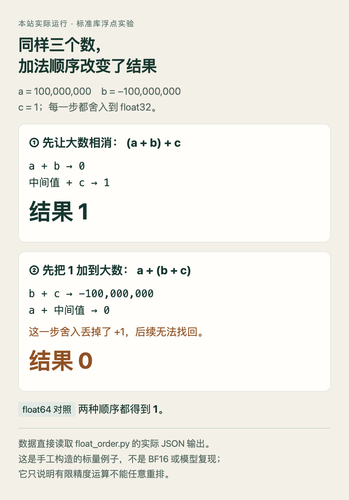

# 三个数的加法，为什么会因为顺序不同而变结果

**已运行验证。** 这是配合[Orthrus 数值精度论文](03-论文精选.md)阅读的标准库小实验，只演示有限精度的舍入，不运行模型、不模拟 BF16，也不测量推理加速。

数学里，(a+b)+c 和 a+(b+c) 相同。计算机需要把每一步结果存进有限位数，舍入会发生在不同位置。选 a=100000000、b=−100000000、c=1：先让两个大数相消，很容易保留最后的 1；先把 1 加到负的大数上，这一点增量可能在存储时消失。

Python 的普通 float 在本机是 binary64。为明确控制本例精度，我们用标准库 struct 把每一步结果写成 IEEE 754 binary32，再读回来。返回值仍是 Python float，但它已精确对应刚才那个 binary32 数值；这里没有偷偷依赖 NumPy 或 GPU。

```python
import struct

def f32(value):
    return struct.unpack('!f', struct.pack('!f', value))[0]

a, b, c = map(f32, (100_000_000.0, -100_000_000.0, 1.0))
left = f32(f32(a + b) + c)
right = f32(a + f32(b + c))
print(left, right)  # 本次实际输出：1.0 0.0
```

注意每次加法之后都有 f32。若只对输入或最终输出转换一次，中间计算会继续使用 Python 的较高精度，就不是这里比较的两条路径了。格式字符 `!f` 指定大端、标准 32 位浮点存储，与本机字节序无关。

| 路径 | 第一步舍入后的中间值 | 最后结果 |
| --- | ---: | ---: |
| float32，先算 a+b | 0 | 1 |
| float32，先算 b+c | −1e8 | 0 |
| 本机 float64，两种顺序 | 精度足以保留这次 +1 | 都是 1 |

第二行丢失发生在 −100000000+1 存回 float32 的时候。附近相邻可表示数的间距大于 1，所以舍入后仍是 −100000000；之后再加 a，无法恢复已经丢掉的那一位。




HTML/JS 读取实际运行的 JSON 输出绘图。沿每条路径查看中间值，差异在第二条路径第一次舍入时出现；这是手工构造的标量例子。（[原理参考](https://docs.python.org/3/tutorial/floatingpoint.html)；[查看大图](images/practice-float.png)。）


完整[源码](code/float_order.py)、[实际输出](code/float-results.json.txt)和[绘图源码](code/float-figure.html)随本期保存。下载脚本后，在其所在目录执行 `python3 float_order.py`，会生成相邻的结果文件；脚本还断言两条 float32 路径分别为 1、0，并检查本机 float64 对照。

本次运行：Python 3.14.3，macOS / Apple Silicon，仅标准库，无第三方依赖；运行时间 2026-09-16T00:54:58.475704+00:00（UTC）。重跑会更新环境与时间记录，数值断言应保持一致。

这能解释为什么“代数等价”还不够：重排运算可能改变有限精度结果。它不能证明 Orthrus 的全部分岔机制，也不能由此推出 BF16 普遍不可用。检查模型优化时，应分别记录数值精度、逐 token 一致率、任务得分与速度；某一项相同，不代表其余三项自动相同。

[Python 官方浮点说明](https://docs.python.org/3/tutorial/floatingpoint.html) · [struct 浮点格式](https://docs.python.org/3/library/struct.html) · [对应论文](https://arxiv.org/abs/2609.15504v1)
