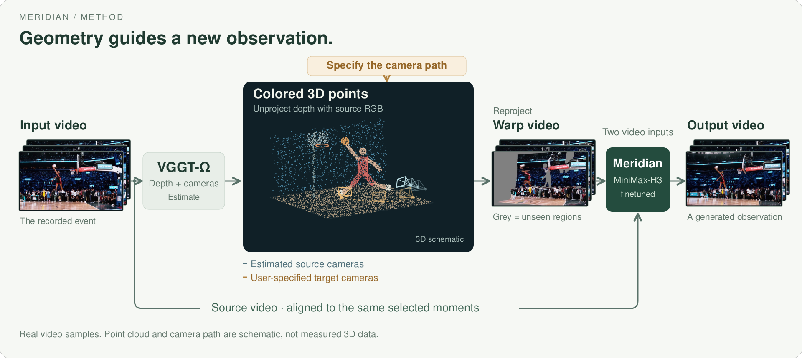
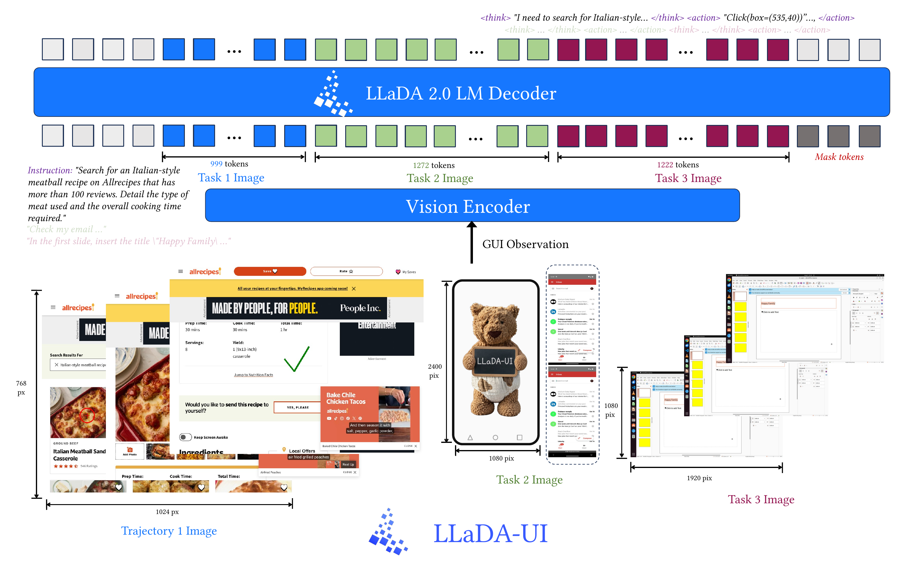
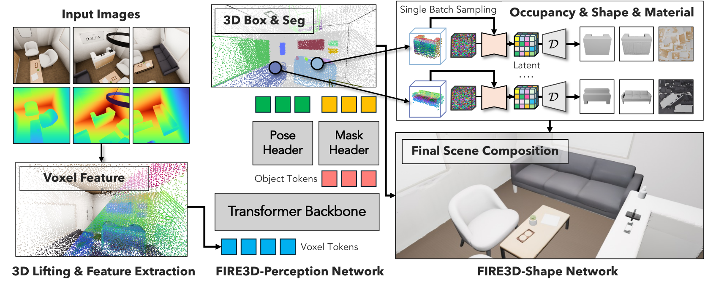

# 六个模型｜看任务，也看开放范围

本栏的六项都有实际权重文件，但许可并不相同：包括宽松许可、非商业权重、自定义条款和许可尚缺明确说明的模型。均为文档与作者实验核验，本站没有部署；日期区分公告、仓库建立和权重更新，不用关注量替代能力验证。

| 要解决的任务 | 模型 | 关键门槛 |
| --- | --- | --- |
| 分类、回归、缺失值补全 | LimiX-2 | 非商业权重，代码也有附加条款 |
| 检查训练步骤是否可重放 | Gensyn open-1b-sft | 推理路径与训练审计路径不同 |
| 改变视频观察视角 | Meridian | 高显存，权重及几何组件各有许可 |
| 从截图生成坐标或动作 | LLaDA-UI | 专用推理补丁，权重许可待澄清 |
| 图像或视频转场景资产 | Fire3D | 几何输入与第三方组件许可 |
| 音乐翻唱与重编曲 | MuLaCover | 非商业限制，多个辅助模型 |

## 01 · LimiX-2：一个表格模型承担三类预测任务

2026-09-16。新近实用 / 创新：近期开放约 400M 模型及推理代码，把分类、回归和缺失值重建统一起来。

输入带上下文样本的结构化表格，模型直接输出类别、数值或缺失特征，不对每个数据集单独做梯度更新。方法从只预测标签，转向学习上下文中的特征与标签联合结构，并用结构因果模型合成的数据预训练。模型卡的“因果感知”来自特定实验，注意力关系不等于现实数据中的因果关系已被可靠识别。

原始架构图从下往上读：表格单元与目标分别编码，样本方向和特征方向的注意力交替处理，顶部使用不同输出头。它帮助理解为何同一模型能处理多类任务；作者在 TabArena、TALENT 等基准的成绩仍受数据划分、预处理和基线配置影响。

权重文件约 1.63GB，运行内存还取决于表格规模和中间表示。当前示例要求 Python 3.12 以上、相应 PyTorch 与 CUDA/FlashAttention 环境，不能只凭 400M 参数推定任意电脑都流畅。权重为非商业许可；代码是基于 Apache-2.0、另含署名与模型命名要求的自定义许可，应分别阅读。

Stable AI 原始架构图：底部输入表格，中部沿样本与特征两轴建模，顶部拆成重建、分类和回归三个输出头。图中机制不构成对现实因果关系的保证。（[来源原图](https://huggingface.co/stable-ai/LimiX-2)；[查看大图](images/limix-architecture.png)。）

[模型卡与权重](https://huggingface.co/stable-ai/LimiX-2)

## 02 · Gensyn open-1b-sft：开放可重放的训练线索

2026-09-16。新近实用 / 创新：本周公开的模型把预训练数据、检查点和步骤指纹连在一起，研究价值在审计。

这是约 1.61B 总参数模型的监督微调版本，基座先经过 400B token 预训练，再进行中期训练与 SFT。团队发布预训练数据、训练与评估代码、每 100 步检查点及逐步状态指纹，让使用者可以重放某个训练步骤并比较结果。提供核验机制不等于全部训练历史已获独立审计。

其训练采用带学习缩放的低精度方案，但本次模型目录标识的是 F32 参数，单算权重约 6.43GB，不能把“int8 训练”直接写成下载和运行只占四分之一内存。上下文为 4096；标准 Hugging Face 推理可能需要自定义代码，运行前应查看对应实现。

模型卡特别区分普通推理与精确审计：Hugging Face 的推理结果不负责复现训练时逐位一致的数值，核验要走专门工具。卡片标注 Apache-2.0，本次未取得同目录独立 LICENSE 文件，实际再分发应继续核对上游条款。适合研究训练可复现性，未提供本期独立通用能力优势证据。

[模型卡与权重](https://huggingface.co/Gensyn/open-1b-sft)

## 03 · Meridian：用几何重投影约束视频新视角

2026-09-15。新近实用 / 创新：本周权重将相机路径、几何估计与生成式补全组合成可检查的流程。

先由 VGGT-Omega 估计深度和相机，将原视频提升为彩色点云，再按用户指定的新相机路径重投影；Meridian 用原视频与重投影视频共同生成新观察。灰色缺口对应原来没见过的区域，它们由模型补全，不能当成恢复出来的真实画面。

模型基于 MiniMax-H3，变换器 BF16 文件约 61.7GiB，另有约 2.5GiB 适配器及几何模型、VAE。官方在 B200 上，已准备几何输入后，73 帧生成约 36 秒、峰值约 88GiB；长片段需求更高。这不是普通消费显卡的实测，也不包含完整前处理时间。

代码采用 Apache-2.0，权重采用 H3 自定义许可，适用地域排除欧盟、英国、韩国和美国，年收入超过 2000 万美元需另获授权；VGGT-Omega 另有非商业研究限制。完整流程不能只按代码许可判断商业可用。当前适合高显存研究环境，不把未来量化、卸载或多卡计划写成已支持。

Viggle 原图：估计几何后按目标镜头重投影，生成器同时接收原视频与重投影结果。灰色是不可见区域；点云和镜头轨迹在此图中为示意，输出的新观察是生成内容。（[来源原图](https://huggingface.co/Viggle/Meridian)；[查看大图](images/meridian-method.png)。）

[模型卡与权重](https://huggingface.co/Viggle/Meridian)

## 04 · LLaDA-UI：扩散式生成界面操作

2026-09-06 · 近期补充。新近实用 / 创新：9 月中旬完善公开推理与服务说明，提供截图到归一化坐标的具体路径；非当天新权重。

模型接收截图、任务与交互历史，用视觉编码器保留界面细节，再分块去噪生成推理文字和操作。相比逐 token 自回归输出，它尝试让一块输出共同修正；创新是否带来端到端优势，仍应比较同任务正确率、步数和耗时。

卡片称约 16.7B MoE，实际目录有七片 BF16 权重，约 33.85GB 十进制大小，尚需视觉 token 与执行缓存。示例环境固定 Python 3.10、PyTorch 2.5.1、Transformers 4.51 等；SGLang 服务依赖专用补丁，普通安装不能直接启动同款模型。

最小入口是单张截图定位一个按钮，输出 `[0,999]` 范围的坐标；找不到目标可返回 `[-1,-1]`。输出坐标不等于已成功点击，执行器必须回看页面结果。权重公开可下载，但本次模型卡与文件目录没有明确 LICENSE，不能将其写成商业使用无条件开放；本站没有执行界面控制。

inclusionAI 原图：从下往上看：不同平台截图经视觉编码后，与任务历史共同进入扩散解码器形成动作。坐标和动作只是模型输出，实际界面变化还需要执行与验证。（[来源原图](https://huggingface.co/inclusionAI/LLaDA-UI)；[查看大图](images/lladaui-method.png)。）

[模型卡与权重](https://huggingface.co/inclusionAI/LLaDA-UI)

## 05 · Fire3D：从图像或视频生成分对象的三维场景

2026-09-09 · 近期补充。新近实用 / 创新：本月权重将感知、分对象几何及材质重建连成前馈流程，近期补充。

输入单张 RGB 图或一段随手拍摄的视频，流程获取深度与空间信息，预测对象的姿态和包围盒，再生成结构、形状和材质。输出可用于场景编辑和仿真资产准备，比只有一个整体网格更便于按对象操作；遮挡和未观察表面仍存在估计误差。

HC-VAE 压缩中间表示，卡片中的 32 倍对应这一组件的表示压缩，不是整个系统快 32 倍。文件包包含感知与多个 flow/自编码器检查点，还依赖 DINOv3 和 TRELLIS.2 等组件。训练语料没有全部随权重重新分发，需要按原数据源准备。

官方入口提供 CUDA 环境及数据、重建脚本，部分流程涉及 Blender；本期未测得普通显卡的实际峰值显存，因此不标“低配可跑”。原始代码 MIT，第三方模型保留各自条件，应查 `licenses/` 和相应声明。标题中的“一分钟”必须结合设备与输入规模理解，不能当作本站性能结论。

Fire3D 原始方法图：从感知到场景结构，再到对象几何与材质。关注共享空间信息如何约束多个生成分支；这不意味着被遮挡区域的细节已被真实观测。（[来源原图](https://huggingface.co/hongchi/Fire3D)；[查看大图](images/fire3d-method.png)。）

[模型卡与权重](https://huggingface.co/hongchi/Fire3D)

## 06 · MuLaCover：用歌词、风格与旋律约束音乐重编曲

2026-09-15。新近实用 / 创新：本周开放可控翻唱与 remix 权重，具有明确输入输出和推理入口。

可输入参考音乐、分段歌词和结构化风格提示，或以旋律与和弦 MIDI 为条件生成音频。相比只给一句自由描述，歌词结构和符号音乐信息为输出提供更多约束；模型卡有调用示例，但本期没有独立听评或生成结果。

主模型约 4.37B 参数，五片 BF16 权重约 8.75GB 的参数存储量之外，还要加载 HeartCodec、Qwen3 Embedding；参考音频路径又涉及转谱与和弦组件。官方示例使用 CUDA，并有按需加载选项，不能只用主模型文件估计整套显存或延迟。

源码采用 Apache-2.0，权重为 CC-BY-NC-4.0，并通过 MODEL_LICENSE 对权重、衍生物和生成结果声明非商业限制。源码开放不等于能直接用于商业配乐。适合研究符号条件怎样约束生成，实际使用还需核对参考音乐授权和成品内容。

[模型卡与权重](https://huggingface.co/HeartMuLa/MuLaCover)
