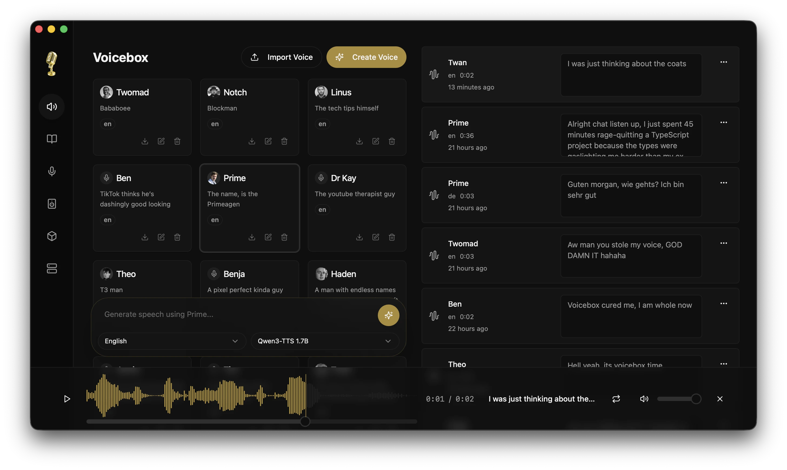
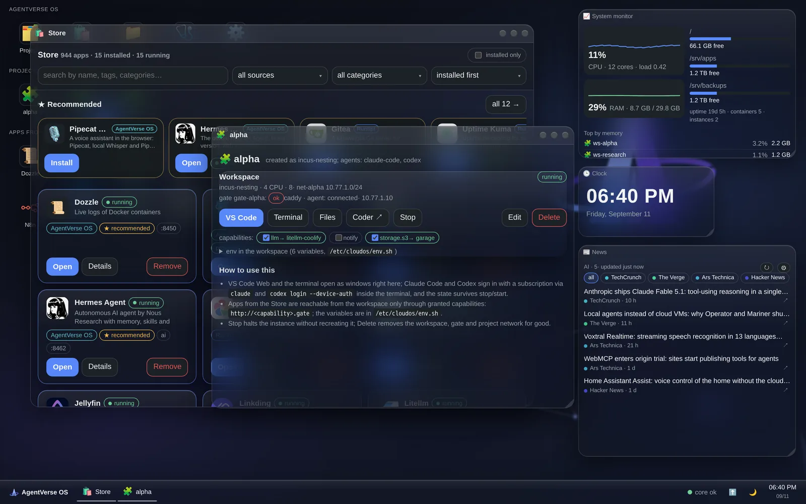

# 十个开源项目｜让关注证据与使用价值一起出现

本期比较十九个候选，选十个不同任务的工具。新公开项目按具体实现与演示收录，老项目必须有近期重新受关注的证据。下文区分“近期热门候选”和“新近实用候选”，不以历史总 Star 推荐成熟工具。

Star 日增、周增属于同一类信号；外部用户的具体使用记录或独立社区讨论才提供不同维度。多数项目缺连续 30 天趋势，不能写成持续热门。均未在本站安装运行，作者演示和用户报告按各自来源标注。

| 具体任务 | 项目 | 上手前要看 |
| --- | --- | --- |
| 给自有仓库做结构化安全审查 | security-audit-skill | 编码 Agent、调用成本、报告验证 |
| 从快捷入口找应用与文件 | Tinycast | macOS 26+、扩展兼容性 |
| 把文档做成可查询知识库 | WeKnora | 模型、数据库、解析组件 |
| 本地语音合成与口述 | Voicebox | 引擎许可、算力和音频完整性 |
| 跟踪 Hermes 长任务实际状态 | oh-my-hermes | 已有 Hermes 与具体版本 |
| 管理需求到实现的变化 | OpenSpec | Node 环境与项目约定 |
| 让 VLM 检测结果正确进入评测 | Supervision | 坐标约定、版本与跟踪器兼容性 |
| 在单台服务器持续运行工作区 | AgentVerse OS | 专用 Ubuntu、alpha 限制 |
| 用语音对话练习外语 | Mural | 移动端构建与 API 计费 |
| 理解自己程序的编译产物 | Ghidra | 对应发行版 JDK 与格式支持 |

## 01 · security-audit-skill：让审查结论有可回查的记录

近期热门候选（短期关注与外部反馈）。仓库 6 月建立，本次是近期重新受关注；不是 9 月首次发布。

它把仓库审查分成理解边界、查找问题、独立验证和报告生成，并把确认、待验证和已否定候选分开保存。输入是有权检查的代码，输出包含结构化发现与覆盖记录，适合希望审查意见能定位到证据的开发者。

最小路径是在支持技能的编码 Agent 中载入官方文件，对小型自有仓库运行，再检查 findings 与覆盖账本；仍需模型与工具费用，不能因有验证脚本就认为安全结论自动成立。

9 月 16 日外部作者提交一次单目标、每组三轮的盲评分比较，报告仍存在漏查类型，同时披露对比工具是自己开发的。它是有方法细节的外部信号，但有利益关系和小样本限制，本站未复测。

榜单单日新增 927 Star；[近期具体使用反馈](https://github.com/cloudflare/security-audit-skill/issues/20)。 [增长快照来源](https://github.com/trending?since=daily)。

[源码与上手文档](https://github.com/cloudflare/security-audit-skill) · [MIT](https://github.com/cloudflare/security-audit-skill/blob/main/LICENSE) · 版本：当前主分支；未见正式 Release（2026-06-18）。

## 02 · Tinycast：原生 Mac 启动器与扩展入口

近期热门候选（短期关注与外部反馈）。仓库 6 月 29 日建立，当前仍快速迭代 beta；入选依据是近期增长与实际扩展使用。

一个快捷键打开应用、文件、剪贴板和常用命令，部分 Raycast 扩展由原生界面呈现。适合日常反复找文件和切应用的人；输入短查询，得到可直接执行的结果，比再开一个聊天窗口更短。

从官方 beta 发行包开始，要求 macOS 26 以上；代码采用 AGPL-3.0。作者的低内存描述不是本站测量，扩展的 JavaScript 兼容层也不保证每个扩展都能工作。

近期用户报告 Safari 书签扩展出现 Buffer 方法错误，另有人搜索 out 却触发退出登录。它们证明有具体使用场景，也说明结果排序和高影响命令需要留意；可先验证几个常用、可逆操作。

榜单单日新增 1,179 Star；[近期具体使用反馈](https://github.com/abue-ammar/tinycast/issues/818)。 [增长快照来源](https://github.com/trending?since=daily)。

Tinycast 仓库原始界面：同一命令面板提供检索与动作。真实使用仍取决于扩展兼容性和排序，截图不是本站运行结果。（[来源原图](https://github.com/abue-ammar/tinycast)；[查看大图](images/tinycast.png)。）

[源码与上手文档](https://github.com/abue-ammar/tinycast) · [AGPL-3.0](https://github.com/abue-ammar/tinycast/blob/main/LICENSE) · 版本：v0.11.2-beta.97（预发布）（2026-09-16）。

## 03 · WeKnora：文档检索、Agent 与 Wiki 放在同一知识流程

近期热门候选（短期关注与外部反馈）。2025 年建立，v0.8.0 原发布在 9 月 3 日；本次依据日周增长及近期部署反馈收录。

输入文档后，WeKnora 组织解析、检索与回答，并提供 Agent 和 Auto-Wiki 等知识使用方式。适合希望资料能够持续查询、同时回到原来源的团队。检索到内容与回答得到证据支持仍是两步，需用自己的问题检查引用。

可按仓库部署指南先启动单用户样例，配置模型、嵌入与数据库，再放少量公开文档测试。项目主体是 MIT，第三方解析等组件有其他条款，包括 AGPL，不能概括成整套组件均为 MIT。

9 月 16 日有用户记录企业微信通道调用火山上的 GLM 时，两个 token 上限参数同时发送而报错；Web 聊天同模型却可用。这个差异说明整合价值与适配成本共存，本站未复现该报告。

榜单单日新增 1,197 Star；榜单本周新增 3,034 Star；[近期具体使用反馈](https://github.com/Tencent/WeKnora/issues/3327)。 [增长快照来源](https://github.com/trending?since=daily)。

[源码与上手文档](https://github.com/Tencent/WeKnora) · [MIT（含第三方不同许可）](https://github.com/Tencent/WeKnora/blob/main/LICENSE) · 版本：v0.8.0（2026-09-03）。

## 04 · Voicebox：将多个本地语音引擎接到创作界面

近期热门候选（短期关注与外部反馈）。1 月建立的项目近期再次受到关注，不把 4 月的发行版本写成今日新发布。

它为语音生成、声音参考、口述等任务提供本地工作区。输入文字与可使用的声音素材，选择引擎后输出音频；适合短配音和本地语音实验。各引擎能力不同，应用界面的功能不能直接等同于所有模型都支持。

从官方发行包或开发文档入手，先下载一个适合设备的引擎。应用代码 MIT，模型有独立许可与硬件条件；安装桌面程序不代表全部模型已下载，也不代表普通 CPU 都能实时合成。

外部用户近期给出六个随机种子的复现记录，称后处理可能把超过一秒的内部停顿之后的有效语音剪掉。它尚未在本站确认，但足以提醒采用者检查输出是否完整，不能只看任务显示 completed。

榜单单日新增 417 Star；[近期具体使用反馈](https://github.com/jamiepine/voicebox/issues/1108)。 [增长快照来源](https://github.com/trending?since=daily)。

Voicebox 作者提供的创作界面原图。看声音配置、文本与生成记录如何组织；本期没有实际生成这些音频。（[来源原图](https://github.com/jamiepine/voicebox)；[查看大图](images/voicebox.webp)。）

[源码与上手文档](https://github.com/jamiepine/voicebox) · [MIT](https://github.com/jamiepine/voicebox/blob/main/LICENSE) · 版本：v0.5.0（2026-04-25）。

## 05 · oh-my-hermes：区分进程活着、任务推进和真正完成

新近实用 / 创新候选。9 月 12 日 v2.0.3 对长任务状态与失败传播作实质修正，原项目 6 月建立。

它在 Hermes Agent 之上组织计划、工具与执行证据。此次更新处理一类实际故障：全部子任务失败却返回成功退出码，或进程反复重试但状态仍显示运行正常。新版将停滞、等待输入、账户限制、失败和有结果的完成分开。

已有 Hermes 用户可先按固定版本的安装协议与 doctor 检查，再用一个会成功和一个预期失败的小任务核对返回状态。它依赖具体模型、执行器与工作区，不能只凭版本命令成功断言环境准备完毕。

这些状态语义比增加技能数量更值得关注，但目前依据是维护者的发行说明与公开实现，本站未运行验证。原有配置和升级兼容性仍应按对应版本核对，不能从状态分类齐全推定所有停滞都能自动恢复。

榜单单日新增 80 Star。 [增长快照来源](https://github.com/trending?since=daily)。

[源码与上手文档](https://github.com/rlaope/oh-my-hermes) · [MIT](https://github.com/rlaope/oh-my-hermes/blob/main/LICENSE) · 版本：v2.0.3（2026-09-12）。

## 06 · OpenSpec：把需求变化留成可检查的项目文件

近期热门候选（短期关注与外部反馈）。2025 年建立；9 月 9 日 v1.13.0 为近期补充，当前另有 HN 讨论与实际工作流反馈。

OpenSpec 把提案、规格和任务写进项目目录，让 Agent 与人可以对照验收条件处理改动。它适合需求会变化、希望保留变化原因的代码项目；产物是可审阅文件与变更记录，而不是自动证明实现正确。

可从官方 npm 包安装后在测试仓库执行 `openspec init`，再创建一项小变更，检查规格、任务和归档是否一致。需要 Node 环境和实际编码工具，模型服务另行配置；MIT 许可不影响这些运行依赖。

近期用户提出多项并行变更缺少优先级与作者显示，也有人记录 Windows worktree 归档重命名失败导致规格写入回滚。前者说明真实协作需求，后者说明应检查归档结果；本站没有把用户报告当成已复现结论。

[近期具体使用反馈](https://github.com/Fission-AI/OpenSpec/issues/1899)；[HN 近期讨论](https://news.ycombinator.com/item?id=49734264)观察到 48 点。

[源码与上手文档](https://github.com/Fission-AI/OpenSpec) · [MIT](https://github.com/Fission-AI/OpenSpec/blob/main/LICENSE) · 版本：v1.13.0（2026-09-09）。

## 07 · Supervision：先修正坐标，再判断视觉模型好不好

新近实用 / 创新候选。2022 年建立；9 月 14 日 0.30.3 修正会污染评测与导出结果的问题，按新近实用进展收录。

它将不同检测、分割与视觉语言模型的输出统一为可处理结构，再完成画框、去重、跟踪和导出。此次值得看的是结果正确性：VLM 把框的两个角顺序写反时，旧路径可能得到零交并比，让重复框逃过去重，也把实际命中计成漏检。新版在解析后先整理角点顺序。

最小路径是在 Python 3.10 以上的独立环境安装 `supervision==0.30.3`，从官方 `Detections.from_vlm` 示例开始，用一组已知框核对坐标、IoU 与去重输出。源码为 MIT；这套工具本身不提供大模型，推理引擎、权重和 API 另有成本与条件。本站检查了固定版本的解析代码和反向角点测试，没有执行视觉模型。

同一版本还修正空检测帧使 CSV 后续列丢失等问题。9 月 15 日用户另报告未确认目标共用 tracker_id=-1 会让过线计数膨胀，这不在本次已确认修复范围内。因此升级并不等于整条评测流程可靠，应保留小样例和对应输出。[0.30.3 发行说明](https://github.com/roboflow/supervision/releases/tag/0.30.3)。

榜单单日新增 260 Star；[近期具体使用反馈](https://github.com/roboflow/supervision/issues/2578)。 [增长快照来源](https://github.com/trending?since=daily)。

[源码与上手文档](https://github.com/roboflow/supervision) · [MIT](https://github.com/roboflow/supervision/blob/develop/LICENSE.md) · 版本：0.30.3（2026-09-14）。

## 08 · AgentVerse OS：一个服务器上的持续工作区

新近实用 / 创新候选。9 月 12 日首个公开版本 v0.2.0，提供可查看的桌面与工作区演示。

它把浏览器桌面、VS Code、Agent、容器应用和备份入口集中到一台自管服务器。电脑或手机连接同一个工作区，任务与文件留在服务器上，适合个人实验环境持续运行。

最小部署要求专用 Ubuntu 22.04 以上、至少 8GB 内存、Tailscale 等；安装涉及系统与存储配置，适合干净的测试主机。源码 Apache-2.0，接入的 Agent 订阅、应用和模型仍各有条件，商店数量也不代表所有应用逐项验证过。

作者明确当前为 alpha，仅在单台测试机运行，没有多用户账号与权限系统。备份默认关闭，需要另外配置。因此它是可探索的个人工作区实现，尚不适合把“隔离容器”理解成经过验证的团队托管平台。

热度待验证：没有两类独立的近期热度证据。

AgentVerse OS 的作者原始界面：项目、应用商店和运行小组件同屏呈现。它展示个人工作区的组织方式，不是多租户权限隔离的证据。（[来源原图](https://github.com/agentverse-os/AgentVerse-OS)；[查看大图](images/agentverse.webp)。）

[源码与上手文档](https://github.com/agentverse-os/AgentVerse-OS) · [Apache-2.0](https://github.com/agentverse-os/AgentVerse-OS/blob/main/LICENSE) · 版本：v0.2.0（预发布）（2026-09-12）。

## 09 · Mural：用真实对话记录安排语言练习

新近实用 / 创新候选。9 月 12 日公开，本周已提供原生 iPhone 与 Android 预览；9 月 16 日继续改进对话和记录。

Mural 让用户用语音或文字练习外语，结合可选释义、词汇回顾和已保存的学习记录调整后续对话。输入一次交流，得到回答与复习线索，适合研究对话练习如何连接长期进度。

iPhone 路径需要 Mac、Xcode 26、iOS 26.1 以上与签名设置；Android 可按指南构建或使用预览包。当前直接连接自己的 OpenAI API 项目，MIT 开源应用并不包含 API 额度，聊天订阅也不等于接口余额。

学习记录在设备上，但语音和相关上下文仍发往模型服务。词汇熟悉度条是产品启发式指标，不是经过校准的遗忘概率，也不是语言水平认证。作者提供界面与验证记录，本站没有独立评估口音或学习效果。

热度待验证：没有两类独立的近期热度证据。

Mural 仓库的西班牙语对话界面原图：目标语与释义配合语音操作，帮助跟上交流。它展示交互方式，不能证明长期学习收益。（[来源原图](https://github.com/Chuloo/mural)；[查看大图](images/mural.png)。）

[源码与上手文档](https://github.com/Chuloo/mural) · [MIT](https://github.com/Chuloo/mural/blob/main/LICENSE) · 版本：v0.1.0-android-preview.8（预发布）（2026-09-16）。

## 10 · Ghidra：把编译产物还原成可分析的结构

近期热门候选（短期关注与外部反馈）。2019 年公开的成熟工具，本次因近期增长与具体二进制分析反馈进入候选；最近稳定版为 8 月 18 日。

Ghidra 读取可执行文件，提供反汇编、反编译、图结构和脚本接口。对会 Python 的研究者，可以从自己编译的小程序开始，对照源代码检查函数、调用和数据流，再考虑与分析 Agent 衔接。

从官方发行包解压，安装对应版本要求的 JDK，运行 `ghidraRun` 后导入样例；开发主分支 README 当前列 JDK 25，具体发行版仍应看包内指南。项目为 Apache-2.0，反编译结果并非源代码的完整恢复。

9 月 16 日用户报告特殊 ELF 节表下可执行权限识别存在问题，另有指令集支持请求。这些是近期实际分析需求，不能被总 Star 掩盖。本站未安装或验证问题；此项适合编译产物与程序分析任务，普通文档工作流可跳过。

榜单单日新增 1,059 Star；[近期具体使用反馈](https://github.com/NationalSecurityAgency/ghidra/issues/9644)。 [增长快照来源](https://github.com/trending?since=daily)。

[源码与上手文档](https://github.com/NationalSecurityAgency/ghidra) · [Apache-2.0](https://github.com/NationalSecurityAgency/ghidra/blob/master/LICENSE) · 版本：Ghidra_12.1.3_build（2026-08-18）。
